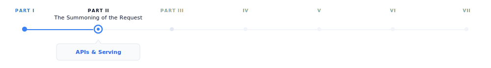
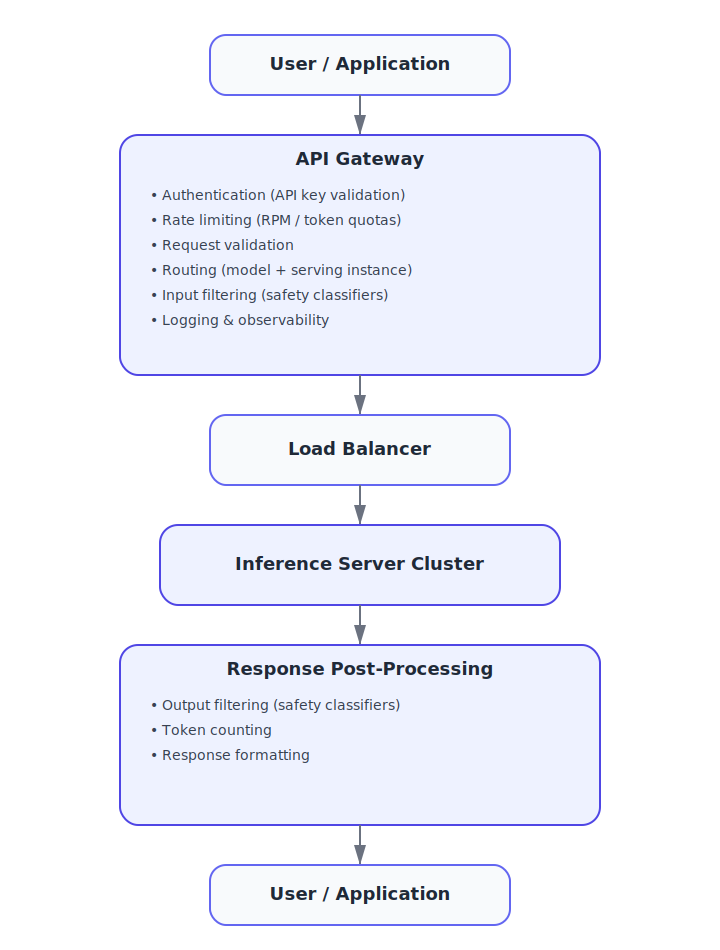
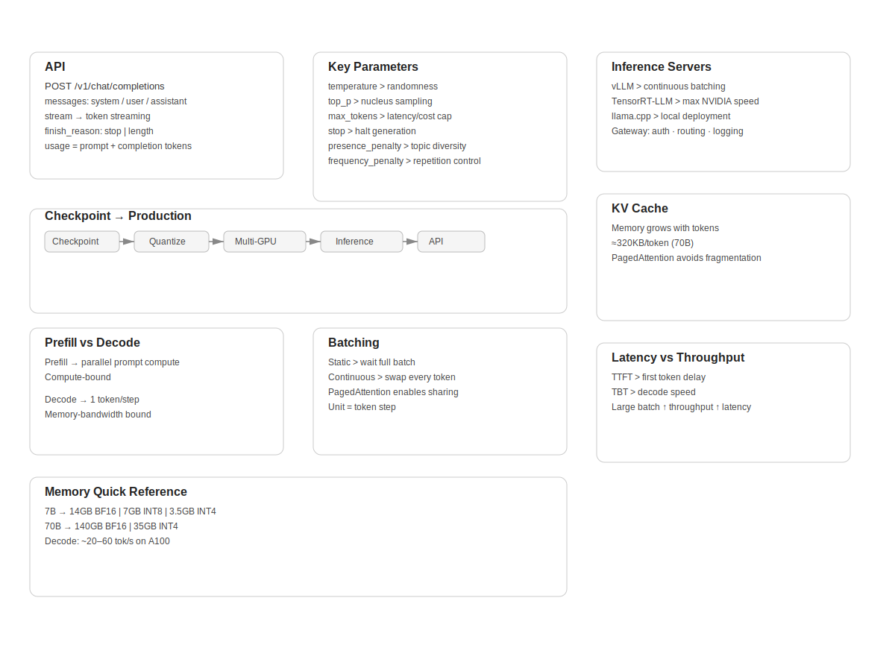

# APIs and Model Serving

> **The canonical question for this chapter:**
> *A trained model is a file on a disk. How does it become something millions of people can query
> simultaneously, with low latency, high reliability, and predictable cost?*

{#fig-progress width="100%"}

The prompt has been written and structured. Now it needs to travel somewhere.
This chapter covers everything between the user pressing Enter and the model
receiving the request: the wire format, the serving infrastructure, and the
engineering decisions that make large-scale LLM deployment economical.


---

## The gap between training and deployment

Training produces a checkpoint: a collection of weight tensors saved to disk. At
this point, the model can do nothing on its own. It has no interface. It cannot
receive requests. It does not know what a user is.

Turning that checkpoint into a production service requires solving a completely
different set of engineering problems from those that were involved in training.
During training, we try to optimize for producing as many tokens as possible per second.
On the other hand, during serving, the optimization focuses on latency, concurrency, reliability, 
and cost, which means we want to respond to requests quickly, serve many users simultaneously, remain 
available under failure, and do all of this economically.


These requirements require a different approach. The same GPU cluster that runs 
training efficiently is not automatically an efficient serving infrastructure.
Serving is its own engineering discipline, with its own abstractions, its own
failure modes, and its own optimization techniques.

This chapter covers the full stack from trained checkpoint to the API endpoint a
user or application calls.

---

## The anatomy of an LLM API

The standard interface for production LLM services is an HTTP API, almost
universally following the conventions established by OpenAI's API. 

### The chat completions endpoint

The primary endpoint for most production use:

```
POST /v1/chat/completions
```

Request body:

```json
{
  "model": "gpt-4o",
  "messages": [
    {"role": "system", "content": "You are a helpful assistant."},
    {"role": "user", "content": "What is the capital of France?"}
  ],
  "max_tokens": 100,
  "temperature": 0.7,
  "stream": false
}
```

Response:

```json
{
  "id": "chatcmpl-abc123",
  "object": "chat.completion",
  "created": 1699000000,
  "model": "gpt-4o",
  "choices": [
    {
      "index": 0,
      "message": {
        "role": "assistant",
        "content": "The capital of France is Paris."
      },
      "finish_reason": "stop"
    }
  ],
  "usage": {
    "prompt_tokens": 26,
    "completion_tokens": 9,
    "total_tokens": 35
  }
}
```

Several design decisions in this interface iluminates the realities of LLM serving:

**Messages array instead of a single string.** Conversations have a clear structure 
consisting of a system prompt, user turns, and assistant turns. The API explicitly 
defines the structure, instead of relying on concatenated strings and expecting the model 
to interpret the formatting correctly.

**Token counts in the response.** Because LLM cost and latency are proportional
to token count, the API reports exactly how many tokens were consumed allowing 
costs to be monitored and controlled programmatically.

**`finish_reason`.** Why did the model stop generating? `stop` means it produced
an end-of-sequence token. `length` means it reached the `max_tokens`. `content_filter`
means the response was filtered. These signals help to determine whether the response is complete 

**`stream` parameter.** Whether to stream tokens as they are generated or return
the complete response when done. Streaming is architecturally significant and
covered in detail in chapter "REFF".

### The completions endpoint (legacy)

An older interface that takes the raw string prompt rather than the structured
messages array:

```json
{
  "model": "gpt-3.5-turbo-instruct",
  "prompt": "The capital of France is",
  "max_tokens": 10
}
```

This endpoint represents an earlier era of LLM deployment, when models were not
chat tuned and the interface was closer to a text continuation service. It is
still useful for non-chat use cases but has been superseded by chat completions
for most applications.

### Key parameters

**`temperature`** controls the randomness of sampling. At temperature 0, the
model always selects the most likely next token (greedy decoding). At temperature
1, it samples from a full distribution. Above 1, the distribution flattens,
producing more random and unstable outputs. Temperature interacts with the decoding strategy
covered in chapter "REFF".

**`top_p` (nucleus sampling)** this is an alternative to temperature for controlling
randomness. The model samples from the smallest set of tokens in which the cumulative
probability exceeds `top_p`. Setting `top_p = 0.9` restricts sampling to tokens
that together account for 90% of the probability mass that means the long tail of unlikely
tokens is ignored.

**`max_tokens`** sets the maximum number of tokens to generate. It functions as
a cost and latency cap. If the model reaches this limit before producing a stop
token, `finish_reason` is `length` and the response may be end mid-sentence.

**Stop sequences** are one or more strings that cause halt in generation
immediately if the model produces them. They are useful for structured generation where you
know the output should end at a specific delimiter.

**`frequency_penalty` and `presence_penalty`** discourage repetition.
`frequency_penalty` applies a penalty proportional to how many time a token has
already appeared. `presence_penalty` applies a flat penalty to any token that has
appeared at all. Both help the model to prevent from getting stuck in repetitive
loops.

**`n`** specifies how many independent completions to generate for a single
prompt. Useful for best-of-n sampling where you generate multiple responses and
select the best one.

**`logprobs`** returns the log probabilities of the selected tokens and
also the top-k most likely tokens at each position. It is used for calibration,
analysis, and classification tasks where you care more about the model's confidence,
not just its output.

---

## From checkpoint to serving: the loading pipeline

Before a model can serve requests, it must be loaded. For a model with hundreds
of billions of parameters, this is a nontrivial task.

### Checkpoint format and sharding

Training checkpoints are often sharded due to the fact that
the full model does not fit in the memory of a single storage node or loading
process. A 70B parameter model in BF16 requires approximately 140 GB of storage and
Loading it into a GPU memory requires careful orchestration.

Common checkpoint formats:

- **PyTorch `.pt` / `.bin`**: the standard PyTorch format which can be slow to load
  due to pickle deserialization
- **SafeTensors**: a faster and safer alternative which can be loaded significantly faster via memory-mapped files
- **GGUF**: a format used by llama.cpp, optimized for inference on consumer
  hardware and it is able to quantize weights natively

### Quantization for serving

Training typically utilizes BF16 weights (2 bytes per parameter). For serving,
quantization reduces this further:

**INT8 quantization** stores weights as 8-bit integers (1 byte per parameter).
This achieves a 2× memory reduction which causes a small quality loss that is mostly negligible
for generation tasks.

**INT4 quantization** uses 4-bit integers (0.5 bytes per parameter) for a 4×
memory reduction. Causes more quality loss and needs careful calibration. Enables running
70B models on consumer GPUs that could not otherwise fit them.

**GPTQ** is a post-training quantization technique that calibrates 4-bit
quantization using a small dataset, minimizing quality loss from reduced
precision.

**AWQ (Activation-aware Weight Quantization)** quantizes weights while accounting
for the distribution of activations, producing better results than naive
quantization at the same bit width.

The tradeoff is consistent: the quantization reduces memory requirements while
increase throughput, at the cost of some output quality. For production serving 
where cost matters, INT8 is nearly universal. INT4 is used when memory is severely 
constrained or when we want to serve on consumer hardware.

### Tensor parallelism for large models

A 405B parameter model in BF16 requires approximately 810 GB of GPU memory that is far
beyond a single GPU's capacity. In these scenarios, loading requires distributing the model across
multiple GPUs using tensor parallelism (splitting individual weight matrices
across GPUs) or pipeline parallelism (assigning different layers to different
GPUs).

The same parallelism strategies used in training apply to serving, but with
different constraints: training prioritizes throughput (large batches, high
utilization), while serving prioritizes latency (fast first-token generation,
smaller batches).

---

## The serving architecture

### The inference server

The core component: a process that holds the model weights in GPU memory and
handles requests. The major implementations:

**vLLM** is the dominant open-source inference server. It introduces
PagedAttention (covered in detail in chapter "REFF") for efficient KV cache
management, and supports tensor parallelism, continuous batching, and most major
model architectures.

**TensorRT-LLM (NVIDIA)** is NVIDIA's inference optimization library. It applies
kernel fusion, INT8/FP8 quantization, and hardware-specific optimizations.
Typically the fastest option on NVIDIA hardware but requires compilation for
specific model shapes which is a  trade between flexibility and performance.

**llama.cpp** is a pure C++ implementation of LLaMA-family models, optimized for
CPU and consumer GPU inference. Not competitive with vLLM for high-throughput
serving, but it is unmatched for accessibility and local deployment.

### The API gateway

In front of the inference server sits the API layer:

{#fig-progress width="50%"}

The API gateway is not a performance bottleneck what it does is to process the metadata. 
It is critical for security (authentication prevents unauthorized access), 
cost control (rate limiting prevents abuse), reliability
(routing distributes traffic and handles failures), and observability (logging
every request enables debugging and billing).

---

## Batching: the key to serving efficiently

A single inference server instance can handle many requests simultaneously. How
it batches those requests together affects throughput and GPU
utilization.

### Naive static batching

The simplest approach is to wait until you have `batch_size` requests, process them
together, return all results.

The problem is that LLM generation is variable length. On request might generate 10
tokens while the other might generate 500. In a static batch, all requests must
wait for the longest one to finish. GPU utilization drops as shorter requests
complete and their slots sit idle, waiting.

### Continuous batching

The key innovation for efficient LLM serving, introduced by [@yu2022orca] and
popularized by vLLM.

Instead of batching at the request level, continuous batching operates at the
iteration level meaning it happens at every token generation step. After each token is generated:

1. Check which sequences in the current batch have finished
2. Remove finished sequences from the batch
3. Add new incoming requests to fill the freed slots
4. Run the next generation step on the updated batch

```
Step 1: [A₁, B₁, C₁]         ← three requests, first token
Step 2: [A₂, B₂, C₂]
Step 3: [A₃, B₃, C_stop]     ← C finishes after 3 tokens
Step 3: [A₃, B₃, D₁]         ← D immediately fills C's slot
Step 4: [A₄, B₄, D₂]
Step 5: [A_stop, B₅, D₃]     ← A finishes
Step 5: [E₁, B₅, D₃]         ← E fills A's slot
```

The GPU is always processing a full batch. None of the slots sit idle waiting for the
longest sequence to finish. On real workloads, this approach can improve throughput by
2 to 3 times compared to a naive static batching. Continuous batching requires careful KV
cache management which explains why PagedAttention exists.

### Prefill and decode phases

LLM generation has two distinct phases with different compute profiles:

**Prefill**: processing the input prompt. All prompt tokens are processed in
parallel. This phase is compute bound and the bottleneck is GPU arithmetic
throughput.

**Decode**: generating output tokens one at a time. Each step processes one single
new token, attending to all previous tokens via the KV cache. This phase is
memory-bandwidth-bound and the bottleneck is reading the model weights and KV cache
from GPU memory.

Because prefill and decode have different bottlenecks, mixing them in the same
batch is not optimal. **Chunked prefill** and **disaggregated serving** are
emerging techniques that separate prefill and decode across different hardware or
batch slots to maximize utilization of each phase independently.

---

## KV cache management

The KV cache stores the key and value tensors computed for each previous token,
avoiding recomputation on every generation step. It is the central memory
management challenge in serving, and will be explained in chapter "REFF".

A brief introduction here, because it directly constrains serving architecture:

For a model with `L` layers, `h` KV heads, `d_k` key/value dimension, and a
sequence of length `n`:

```
KV cache size = 2 × L × h × d_k × n × bytes_per_element
```

For LLaMA 2 70B (L=80, h=8 GQA heads, d_k=128) in BF16:

```
Per token: 2 × 80 × 8 × 128 × 2 = 327,680 bytes ≈ 320 KB
4,096 tokens: 320 KB × 4,096 ≈ 1.3 GB
32,768 tokens: 320 KB × 32,768 ≈ 10.5 GB
```

At high concurrency with long contexts, KV cache competes directly with model
weights for GPU memory.

### PagedAttention

The key innovation in vLLM, inspired by virtual memory paging in operating
systems.

Traditional KV cache reserves a contiguous memory block for each sequence, 
sized to accommodate the maximum possible length. This causes internal fragmentation
(reserved memory that goes unused when sequences are shorter than expected) and
external fragmentation (free memory that cannot be used because it is not
contiguous).

PagedAttention allocates KV cache in fixed-size pages of tokens, with a page
table mapping logical sequence positions to physical memory locations. Memory is
allocated and freed one page at a time as sequences grow and complete:

```
Sequence A: [Page 3, Page 7, Page 12]     ← pages need not be contiguous
Sequence B: [Page 1, Page 9]
Sequence C: [Page 2, Page 4, Page 5, Page 11]
Free pages: [Page 6, Page 8, Page 10, ...]
```

This will eliminates fragmentation and enables an almost perfect memory utilization. It
also enables prefix sharing which means if two requests share a common system prompt, the
KV cache for that prefix can be shared across both sequences without duplication.

---

## Latency and throughput tradeoffs

Serving performance is characterized by two metrics that pull against each other:

**Time to first token (TTFT)** is how long the user waits before seeing any
output. This is determined primarily by prefill time and since longer prompts take longer to prefill it is 
the metric users perceive most directly.

**Time between tokens (TBT)** is how fast tokens arrive after the first one.
This is determined by decode speed. For a 70B model on a single A100, 20 to 60 tokens per second is typically expected.

**Throughput** is total tokens processed per second across all concurrent
requests. Maximized by large batch sizes, which directly conflict with low TTFT.


Production systems manage this tradeoff through maximum batch size limits (cap
batch size to maintain acceptable latency), priority queuing (prioritize
interactive requests over batch workloads), and SLA-based scheduling (different
latency targets for different user tiers).

---

## Key takeaways

- A trained model checkpoint becomes a production service through a pipeline involving quantization, multi-GPU loading, an inference server, and an API gateway, since training and serving are distinct engineering disciplines
- The chat completions API format, including the messages array, key parameters, and token usage reporting, reflects the practical realities of LLM serving rather than arbitrary design choices
- Continuous batching operates at the token level rather than the request level, keeping GPUs fully utilized despite variable-length generation and serving as the main efficiency improvement for high-throughput systems
- KV cache memory is the central serving constraint because it grows with sequence length and batch size and competes directly with model weights for GPU memory, while PagedAttention manages it using virtual memory paging
- Prefill is compute bound and decode is memory bandwidth bound, so they have fundamentally different performance profiles and can be optimized independently
- TTFT and throughput trade off against each other, and the appropriate balance depends on whether the system serves interactive applications or batch workloads

{#fig-progress width="100%"}

---

## Further reading

- Yu et al. (2022). *Orca: A Distributed Serving System for Transformer-Based
  Generative Models.*: Introduces continuous batching.
- Kwon et al. (2023). *Efficient Memory Management for Large Language Model
  Serving with PagedAttention.*: The vLLM paper; foundational for modern serving.

---

*← Previous: [02 — Prompt engineering and structure](02-prompt-engineering-and-structure.md)*  
*Next: [04 — Tokenization →](04-tokenization.md)*