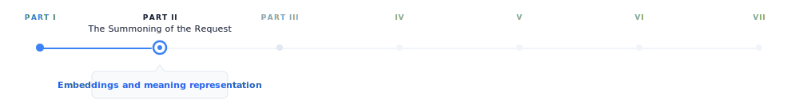
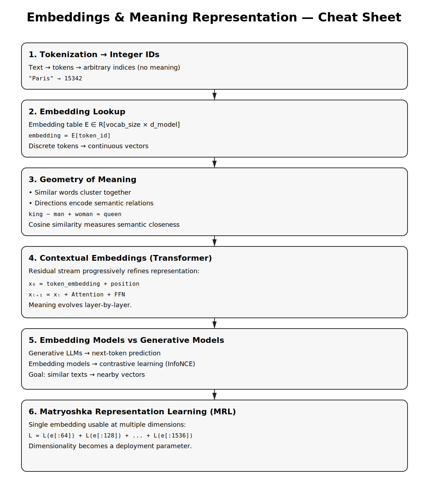

# Embeddings and Meaning Representation

> **The canonical question for this chapter:**
> *How does a model convert a token ID into something
> that has meaning, and how does that representation evolve as it passes
> through the network?*

---

{#fig-progress width="100%"}

Tokenization converts the prompt text into a sequence of integer IDs. These
integers has no meaning a neural network on their own. This chapter covers the
step that makes them meaningful and it introduces the geometric structure of
meaning that the rest of the model operates on.


---

## The problem with integers

A token ID is an arbitrary index. The token ID for `"Paris"` might be 15342 while the
token ID for `"London"` is 9562. These numbers  do not carry any information about the
relationship between the two cities. They are just indices in a lookup table,
nothing more.

An embedding is the thing that you get after that lookup: a dense vector of floating point
numbers with hundreds or thousands of dimensions. The embedding for `"Paris"`
might be something like `[0.23, -0.87, 0.12, ...]` with 4096 values and the embedding for
`"London"` is a completely different vector nevertheless in a well-trained model, it will be close
to Paris's vector in this high-dimensional space, because the two tokens appear
in similar contexts throughout the training corpus.

This is the core insight: geometric proximity in embedding space convey the semantic
relatedness. Tokens that appear in similar contexts have similar embeddings. The
model does not learn this rule explicitly it caused by gradient descent on
the next-token prediction objective. Training discovers that representing
semantically related tokens as nearby vectors produces better predictions, and
adjusts accordingly over trillions of examples.

Embeddings are the bridge between the discrete world of tokens and the continuous
world of neural network computation. Everything the transformer does which includes every
attention operation, and every feed-forward pass operates on these continuous
vectors and the model never touches the original token IDs again after the embedding
lookup.

---

## The embedding table

The embedding table is a matrix of shape `[vocab_size, d_model]`. Each row is
the learned embedding for one token.

```
Embedding table (simplified, d_model = 4):

Token ID  Token     Embedding vector
0         <pad>     [ 0.00,  0.00,  0.00,  0.00]
1         <eos>     [ 0.12, -0.34,  0.87,  0.23]
2         "the"     [-0.45,  0.67, -0.12,  0.89]
3         "Paris"   [ 0.91,  0.23, -0.67,  0.45]
4         "London"  [ 0.88,  0.19, -0.71,  0.43]
5         "cat"     [-0.23,  0.89,  0.34, -0.67]
```

The lookup is a simple indexed memory access: `embedding = table[token_id]`.
Implemented as a matrix multiplication with a one-hot vector in theory; in
practice it is O(1) and takes microseconds.

For GPT-3 with `vocab_size = 50,257` and `d_model = 12,288`:

```
Embedding table size = 50,257 × 12,288 × 2 bytes (BF16)
                     ≈ 1.24 billion parameters
                     ≈ 2.47 GB
```

This is a significant fraction of total model size and it is also
the most memory efficient part of the model relative to its influence: every
token the model processes uses exactly one row of this table.

### Weight tying

The same embedding table is used twice: once at the input (token IDs →
embeddings) and once at the output (final hidden state → logits over vocabulary).
This is called weight tying and is standard in most transformer language models.

At the output, the hidden state `h` of shape `[d_model]` is multiplied by the
transposed embedding table `E^T` of shape `[d_model, vocab_size]` to produce
logits of shape `[vocab_size]`:

```
logits = h @ E^T
```

Weight tying reduces the parameter count by `vocab_size × d_model` and, more
importantly it enforces a geometric consistency: the direction that represents
a token at the input is the same direction the model uses to predict that token
at the output. This constraint improves training efficiency and generalization and
it is one of those architectural decisions that looks obvious in hindsight yet it
was not obvious at all beforehand.

---

## How embeddings are learned

At the start of training, the embedding table is initialized from a small random
distribution and it does not carry any semantic information they are just noise.

Through training, gradient descent updates each embedding row whenever its token
appears in the training data. The update moves the embedding in the direction that
reduces prediction loss. Over millions of update steps on millions of tokens,
the embeddings converge to representations that capture the statistical structure
of language.

The mechanism works by giving tokens that appear in similar contexts, similar gradient
updates. If `"Paris"` and `"London"` both appear after `"capital of"` and before
`"is beautiful"`, their embeddings are repeatedly pushed in similar directions.
Over enough training, they converge to nearby vectors.

This is the distributional hypothesis, operationalized by gradient descent:
*you shall know a word by the company it keeps.*

### The rare token problem

Embedding parameters receive less frequent updates than other model parameters.
A token that appears once in a billion token batch updates once while a common token
might get updates in every batch. This creates an implicit learning rate inequality:
frequent tokens have well trained embeddings but rare tokens may be poorly trained
even in large models.

This is one reason why multilingual models struggle with low-resource languages,
and why domain specific jargon may get handled poorly even in a large general
model due to this simple fact that the embeddings for rare tokens have not seen enough gradient signal
to settle into a useful position.

---

## The geometry of embedding space

Trained embeddings organize into a rich geometric structure. Understanding this
structure is practically useful for interpreting the model behavior and for building
a retrieval system.

### Semantic neighborhoods

Semantically related tokens cluster together. In embedding space, countries
cluster near each other, verbs in the same semantic field cluster together,
synonyms are close, and antonyms are often directionally opposite. This is not
an artifact of any particular architecture it emerges from the distributional
statistics of the language and it is similar across all model families.

### Linear structure

The most famous property of word embeddings is the fact that analogical relationships correspond
to linear operations.

```
embedding("king") - embedding("man") + embedding("woman") ≈ embedding("queen")
embedding("Paris") - embedding("France") + embedding("Germany") ≈ embedding("Berlin")
embedding("walked") - embedding("walk") + embedding("run") ≈ embedding("ran")
```

Directions in embedding space encode semantic dimensions. The vector from `"man"`
to `"woman"` is a gender direction. The vector from `"France"` to `"Paris"` is
a capital of direction. Addition and subtraction of embedding vectors correspond
to semantic composition and transformation.

This property approximately exist in static embeddings (Word2Vec, GloVe) and it
continues to presist in the token embeddings of large
transformers, though it might not be as clean as static embedding. 
The transformer layers above the embedding table further transform
these representations in ways that create richer structure yet it makes it harder
to extract clean linear relationships.

### Isotropy and representation collapse

Embeddings occupy only a narrow cone of the available space, with most directions unused
which makes it one of the failure modes in embedding training which is called anisotropy.
When embeddings are anisotropic, cosine similarity between random embeddings is
high even for semantically unrelated tokens and causes the embedding based retrieval
unreliable.

Modern large models are less prone to this compared older smaller models, yet it
remains a concern in fine-tuning models where the embedding distribution can
shift significantly during training.

---

## Contextual vs. static embeddings

The embedding table produces a single fixed vector for each token, regardless
of context. The token `"bank"` gets the same embedding whether the surrounding
context is about finance or about rivers.

This is the limitation of static embeddings an the transformer layers above the
embedding table are able to solve it. After the initial embedding lookup, each transformer
block modifies the token representations through attention and feed-forward
operations and when it gets to the final layer, the representation of `"bank"` in a financial
context is completley different from `"bank"` in a geological context. This happens not because
the embedding table has changed, but because the transformer layers incorporated
contextual information from surrounding tokens.

These contextual representations are called
"contextual embeddings" to distinguish them from static lookup embeddings at
the first layer. They are what BERT family models were designed to expose, and
what RAG retrieval systems use when they need semantically rich representations.

### The residual stream

This is a useful model for understanding how representations evolve through the network:

```
x_0 = token_embedding + positional_encoding

x_1 = x_0 + Attention_1(LayerNorm(x_0))
x_1 = x_1 + FFN_1(LayerNorm(x_1))

x_2 = x_1 + Attention_2(LayerNorm(x_1))
x_2 = x_2 + FFN_2(LayerNorm(x_2))

...

x_L = final hidden state → logits
```

Each layer adds a refinement to the running representation while the early layers tend
to encode syntactic features, middle layers encode semantic relationships and the final
layers encode task specific features that is used for prediction.

The residual structure means the original token embedding is always present in
the stream and it gets added to every layer and never replaced. This is why the
embedding table remains relevant even in very deep models: its contribution
persists all the way through computation, like a base note that harmonics are
built on top of.

### Which layer to extract from

For tasks that use hidden states as embeddings, such as classification, retrieval, 
or similarity, a practical question that could arise is which layer should be used?


The last layer contains the most task specific information but it may over optimize
for next token prediction at the expense of general semantic content. The
second to last layer is a common heuristic that often outperforms the last layer
for semantic similarity tasks. An average across all layers captures information
at all levels of abstraction can be considered robust yet expensive. Middle layers often encode
the richest structural information for syntactic tasks.

For dedicated embedding models (text-embedding-3-large, E5, BGE), this question
is moot, these models are specifically trained to produce useful representations
at the last layer using contrastive objectives rather than next token prediction.
For retrieval tasks these models should be used instead of the generative models.

---

## Embedding models vs. generation models

Generative models are trained to predict the next token although their internal 
hidden states can be extracted and used for retrieval, this is not what they are 
optimized for. On the other hand dedicated embedding models form a separate class. They are 
trained with different objectives and are designed specifically to produce useful 
vector representations of text.


### Contrastive training

Contrastive training is the dominant training approach for embedding models. 
The model is trained in a way that
semantically similar texts have nearby embeddings and semantically different texts
have distant embeddings.

The InfoNCE loss, used by models like E5, GTE, and many others:

$$
\mathcal{L} = -\log \left(
\frac{\exp\left(\mathrm{sim}(q, k^+) / \tau\right)}
{\sum_i \exp\left(\mathrm{sim}(q, k_i) / \tau\right)}
\right)
$$

Where $q$ is the query embedding, $k^+$ is the positive (semantically similar)
embedding, $k_i$ are all keys including negatives, $sim$ is cosine similarity,
and $\tau$ is a temperature parameter.

The model learns to pull positive pairs together and push negative pairs apart.
Training data consists of (query, positive document) pairs which is derived from
naturally occurring sources: question-answer pairs, search query logs, natural
language inference datasets.

### Hard negatives

The quality of negative examples is critical. Random negatives, which mostly means 
arbitrary documents from the corpus, are too easy. The model learns to distinguish clearly
unrelated texts without developing fine-grained discrimination.

Hard negatives are documents that are topically related but semantically different
from the positive:

```
Query:         "What is the capital of France?"
Positive:      "Paris is the capital and most populous city of France."
Easy negative: "The mitochondria is the powerhouse of the cell."
Hard negative: "France is a country in Western Europe with Paris as a major city."
               (related topic, but does not directly answer the question)
```

Mining hard negatives is itself a retrieval problem. Modern embedding model
training pipelines use a previous model version or a BM25 index to find hard
negatives and train a better model on those negatives, and iterate.

### Asymmetric encoding

Many retrieval tasks are asymmetric which means that the query and the document are
different in length, style, and information density. A question is short and
underspecified yet the document is long and detailed.

Some embedding models handle this by encoding queries and documents with different
instruction prefixes:

```
Query encoding:    embed("Represent this query for retrieval: " + query)
Document encoding: embed("Represent this document for retrieval: " + document)
```

The prefix signals to the model what role the text plays, allowing it to produce
better representations for each. Models like E5 and Instructor were designed
around this approach.

### Embedding model families

| Model | Dimensions | Context | Notes |
|---|---|---|---|
| text-embedding-3-small | 1536 | 8,191 tokens | OpenAI; fast and cheap |
| text-embedding-3-large | 3072 | 8,191 tokens | OpenAI; best quality in family |
| text-embedding-ada-002 | 1536 | 8,191 tokens | OpenAI legacy; widely deployed |
| E5-large-v2 | 1024 | 512 tokens | Open-source; strong performance |
| BGE-large-en-v1.5 | 1024 | 512 tokens | BAAI; strong on MTEB |
| Nomic-embed-text-v1 | 768 | 8,192 tokens | Open-source; long context |
| voyage-large-2 | 1536 | 16,000 tokens | Voyage AI; strong retrieval |

The MTEB (Massive Text Embedding Benchmark) leaderboard is the standard reference
for comparing embedding models across retrieval, classification, clustering, and
semantic similarity tasks.

---

## Similarity metrics

Embeddings are only useful if you can compare them so the choice of metric matters.

### Cosine similarity

The standard metric for text embedding comparison:

```
cosine_sim(a, b) = (a · b) / (||a|| × ||b||)
```

Cosine similarity measures the angle between two vectors, ignoring magnitude.
Values range from -1 (opposite directions) to 1 (identical direction). The
appeal for this metric is the invariance to magnitude. A document and its summary should be similar
even if the document produces a larger magnitude vector due to greater information
density.

For normalized embeddings (unit vectors), cosine similarity equals the dot
product: `cosine_sim(a, b) = a · b` when `||a|| = ||b|| = 1`. Most embedding
APIs return normalized vectors, making the dot product the efficient choice
at scale.

### Dot product

Without normalization, the dot product combines angle and magnitude. For some
retrieval tasks, magnitude carries useful signal which means a more specific or central
document might have higher magnitude and it makes the raw dot product a better metric
than cosine similarity.

Modern embedding models and vector databases support both; check the model
documentation for which metric the model was trained to optimize.

### Euclidean distance (L2)

This is a less common metric for text embeddings andor normalized vectors, L2 distance and
cosine similarity are monotonically related:

$$
\|a - b\|_2^2 = 2 - 2\,\cos(a, b)
$$

L2 is mostly specific for applications (k-means clustering, certain index structures) where
the metric properties are desirable.

---

## Embedding dimensions and matryoshka representations

The dimensionality of an embedding determines its representational capacity and
its cost. While a 3072-dimension embedding can represent finer grained semantic distinctions,
it requires 12 KB per vector in float32 and more compute for similarity search. On the other hand
a 768-dimension embedding has less capacity but 4× lower storage and faster search.
For retrieval over millions to billions of vectors, the difference is significant.

### Matryoshka Representation Learning (MRL)

This is a training technique that allows a single model to produce useful embeddings at
multiple dimensions from the same forward pass. Instead of training separate models for 
different embedding sizes, MRL organizes the embedding space in a way that 
**useful representations exist at progressively larger prefixes of the same vector**.

MRL trains the model so that the first `d` dimensions of the full embedding are
as useful as a `d`-dimensional embedding trained from scratch and simultaneously,
for multiple values of `d`:

#### Core Idea

Let the model output a full embedding:

$$
\mathrm{embed} \in \mathbb{R}^{1536}
$$

MRL trains the network such that **every prefix of the embedding** is independently meaningful:

```
- `embed[:64]` behaves like a strong 64-dim embedding  
- `embed[:128]` behaves like a strong 128-dim embedding  
- `embed[:256]` behaves like a strong 256-dim embedding  
- ...
- `embed[:1536]` remains the highest-quality representation
```
This is analogous to **Russian matryoshka dolls**, where smaller representations are nested inside larger ones.

#### Training Objective

During training, the same embedding is evaluated at multiple truncation levels:

```
L = L(embed[:64]) + L(embed[:128]) + L(embed[:256]) + L(embed[:512]) + L(embed[:1536])
```

Each term computes the task loss (e.g., contrastive similarity loss) using only the first `d` dimensions.


The result is that you can use the full 1536-dimension embedding for high-accuracy
search, or truncate to 256 dimensions for a 6× speedup at a small quality cost,
using the same model. Dimensionality becomes a deployment parameter rather than
a model choice.

OpenAI's text-embedding-3 series uses MRL, allowing callers to specify output
dimensions at request time.

---

## Embeddings in the generative inference pipeline

Within a generative LLM's inference pipeline, embeddings participate at two
specific points.

### Input: the embedding lookup

After tokenization, token IDs are converted to embeddings via the table lookup.
Positional encodings are added (either as additive vectors or via RoPE
modifications to attention), and result enters the first transformer block.
This step is computationally trivial and takes microseconds even for long sequences.

### Output: projection back to vocabulary

The final hidden states are projected to logit space via the transposed embedding
table. This is a matrix multiplication of shape `[seq_len, d_model] @ [d_model,
vocab_size]` which is the largest matrix multiply in a single forward pass for models
with large vocabularies.

For a model with `d_model = 4096` and `vocab_size = 128,000`:

```
Output projection: [seq_len, 4,096] @ [4,096, 128,000]
                 = seq_len × 524,288,000 multiplications
```

For a sequence of 1,000 tokens, this is over 500 billion operations it is significant
enough that some models apply the output projection only to the final token
position during generation rather than to all positions.

---

## Practical embedding operations

### Embedding a batch of texts

```python
from openai import OpenAI

client = OpenAI()

texts = [
    "The capital of France is Paris.",
    "Paris is a city in Europe.",
    "The mitochondria is the powerhouse of the cell."
]

response = client.embeddings.create(
    input=texts,
    model="text-embedding-3-large",
    dimensions=1024  # MRL truncation
)

embeddings = [item.embedding for item in response.data]
# embeddings[0] and embeddings[1] will be much closer than embeddings[0] and [2]
```

### Computing similarity

```python
import numpy as np

def cosine_similarity(a: list[float], b: list[float]) -> float:
    a, b = np.array(a), np.array(b)
    return float(np.dot(a, b) / (np.linalg.norm(a) * np.linalg.norm(b)))

sim_01 = cosine_similarity(embeddings[0], embeddings[1])
sim_02 = cosine_similarity(embeddings[0], embeddings[2])

print(f"Paris sentences:       {sim_01:.3f}")  
print(f"Paris vs mitochondria: {sim_02:.3f}")  
```

### Semantic search over a corpus

```python
import numpy as np

corpus = ["doc 1 text...", "doc 2 text...", ...]
corpus_embeddings = np.array([
    client.embeddings.create(
        input=doc, model="text-embedding-3-large"
    ).data[0].embedding
    for doc in corpus
])  # shape: [n_docs, 1024]

query = "What is the capital of France?"
query_embedding = np.array(
    client.embeddings.create(
        input=query, model="text-embedding-3-large"
    ).data[0].embedding
)  # shape: [1024]

# Cosine similarity (assuming normalized embeddings from the API)
similarities = corpus_embeddings @ query_embedding  # shape: [n_docs]
top_k_indices = np.argsort(similarities)[::-1][:5]

for idx in top_k_indices:
    print(f"Score: {similarities[idx]:.3f} | {corpus[idx][:80]}")
```

For production retrieval over large corpora, replace the numpy dot product with
a vector database (Pinecone, Weaviate, Qdrant, pgvector) that handles indexing
and approximate nearest neighbor search at scale. The vector database is the
subject of chapter "REFF".

---

## Key takeaways

- An embedding converts a discrete token ID into a continuous vector; geometric
  proximity in embedding space encodes semantic relatedness, emerging from the
  distributional statistics of training rather than any explicit rule
- The embedding table is a `[vocab_size, d_model]` matrix shared between input
  lookup and output projection (weight tying), enforcing geometric consistency
  between how tokens are represented and how they are predicted
- Static embeddings give every token a fixed vector regardless of context;
  contextual embeddings (hidden states at later layers) incorporate surrounding
  context through attention, the residual stream shows how representations
  accumulate refinements from syntactic to semantic to task-specific
- Dedicated embedding models are trained with contrastive objectives (InfoNCE
  loss on positive/negative pairs) rather than next-token prediction, producing
  representations optimized for similarity search
- Hard negatives, topically related but semantically wrong examples, are
  essential for training models that make fine-grained distinctions; mining them
  is itself a retrieval problem
- Cosine similarity is the standard metric for comparing embeddings; always use
  the metric the model was trained to optimize, using the wrong one degrades
  retrieval results in ways that are hard to diagnose
- Matryoshka Representation Learning allows a single model to produce useful
  embeddings at multiple dimensions, making dimensionality a deployment parameter
- The output projection (final hidden state to logits) is the most compute-
  intensive embedding operation in the generative forward pass; the input lookup
  is negligible by comparison

{#fig-progress width="90%"}


---

## Further reading


- Elhage et al. (2021). *A Mathematical Framework for Transformer Circuits.*:
  The residual stream model and how information flows through transformer layers.
- Wang et al. (2022). *Text Embeddings by Weakly-Supervised Contrastive
  Pre-training.*: The E5 paper; representative of modern embedding model
  training with hard negatives.
- Kusupati et al. (2022). *Matryoshka Representation Learning.*: MRL for
  flexible-dimension embeddings from a single model.
- Muennighoff et al. (2023). *MTEB: Massive Text Embedding Benchmark.*: The
  standard benchmark for comparing embedding models across tasks and domains.

---

*← Previous: [05 — Context windows](05-context-windows.md)*  
*Next: [07 — Transformer architecture →](../part2-model-mind/07-transformer-architecture.md)*