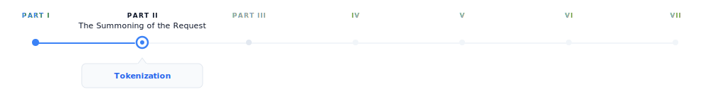
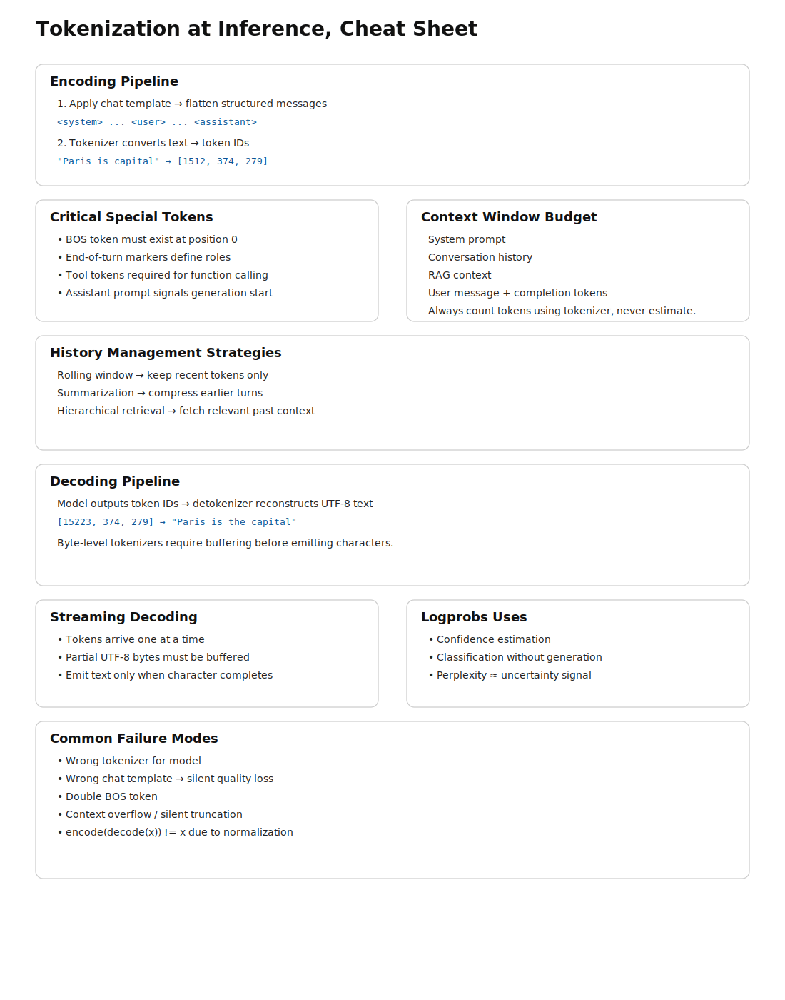

# Tokenization

> **The canonical question for this chapter:**
> *A user sends a message while a model receive and returns numbers. How does text become numbers 
> on the way in, and how do numbers become text on the way out?*

---

{#fig-progress width="100%"}

The request has arrived at the inference server. Before the model sees a single
character, the text must be converted to numbers. This chapter covers that
conversion in both directions and describes everything that can go wrong in between.


---

## Two tokenization chapters, two different problems

If you read the training section first, you have already seen tokenization as in
a batch preprocessing environment which means a corpus is tokenized once, offline, before training
begins. The vocabulary is fixed. The inputs are known and errors are caught early.

Tokenization at inference is a different story. It runs on arbitrary user input,
in real time, and on every request. It supposed to handle every string a user might type which could be
multilingual text, source code, emoji, adversarial inputs, or a combination of
all four. The encoded output feeds directly into a running model. The decoded
output appears on a user's screen, sometimes token by token while they watch.

The concerns here are mostly operational, not theoretical. Understanding them is the
difference between shipping reliable LLM applications or debugging
corruption failures at 2am.

---

## The encoding pipeline

When a request arrives, the first operation is encoding: converting the messages
array into a flat sequence of token IDs ready for the model. This happens in two
steps that are easy to confuse but are conceptually different.

### Step 1: chat template application

The messages array has structure which includes roles, turns, and system prompts. The model has
no concept of a dictionary. Before tokenization, the structured input must be
flattened into a single string using a chat template.

Each model family has its own template. For LLaMA 3:

```
<|begin_of_text|>
<|start_header_id|>system<|end_header_id|>

You are a helpful assistant.<|eot_id|>
<|start_header_id|>user<|end_header_id|>

What is the capital of France?<|eot_id|>
<|start_header_id|>assistant<|end_header_id|>
```

For Mistral:

```
<s>[INST] What is the capital of France? [/INST]
```

For ChatML (OpenAI and many others):

```
<|im_start|>system
You are a helpful assistant.<|im_end|>
<|im_start|>user
What is the capital of France?<|im_end|>
<|im_start|>assistant
```

The special tokens (`<|begin_of_text|>`, `<|eot_id|>`, `<|im_start|>`) are part
of the model's vocabulary and were added during fine-tuning. The model learns
to associate these markers with role transitions. Feeding the wrong template to
the model causes it to sees an unexpected token sequence which in turn may cause the model to ignore the system prompt,
and fail to complete the turn correctly, or produces outputs that look almost right
but are systematically wrong in ways that can be hard to diagnose.
This is one of the most common sources of bugs: no error is thrown yet the model just quietly
misbehaves.

### Step 2: token encoding

Once the flat string is constructed, the tokenizer converts it to integer IDs.
This is a deterministic step in which the same string always produces the same IDs given the
same tokenizer.

```python
messages = [
    {"role": "system", "content": "You are a helpful assistant."},
    {"role": "user",   "content": "What is the capital of France?"}
]

# Step 1: flatten with chat template
flat_string = apply_chat_template(messages, tokenizer)
# → "<|im_start|>system\nYou are a helpful assistant.<|im_end|>\n..."

# Step 2: convert to integers
token_ids = tokenizer.encode(flat_string)
# → [151644, 8948, 198, 2610, 525, 264, 10950, 17847, 13, ...]

# Step 3: pass to model
logits = model.forward(token_ids)
```

The tokenizer runs on CPU and for typical prompt lengths it is fast enough to be
negligible relative to model inference time. On the other hand, for very long prompts (100k+ tokens)
it can become measurable and there are some inference frameworks that cache tokenized system
prompts to avoid repeating this work on every request.

### Special tokens that require explicit handling

Several special tokens need attention beyond the template:

**Beginning of sequence (BOS).** Many models expect a BOS token at position 0 and
the tokenizer typically adds it automatically while some serving configurations
require manual insertion. A missing BOS token causes silent quality degradation which means
the model's input distribution does not match training, and early tokens may be
erratic.

**End of turn markers.** The template includes tokens marking the end of each
turn and it must appear in the correct positions or the model misidentifies role
boundaries.

**Tool call tokens.** Models fine-tuned for function calling have additional
special tokens called tool call syntax. These must be in the tokenizer vocabulary
and correctly placed in the template.

**The generation prompt.** The template typically ends with the opening of the
assistant turn (e.g., `<|im_start|>assistant\n`) without closing it. This will signal
the model that it should continue from here and omitting it causes the model
to generate an incorrect turn structure.

---

## Token continuation and context window management

The context window is the maximum sequence length the model can process in a
single forward pass which is typically a range between 8k to 128k tokens for current models. Managing
what fits in this window is a critical operational concern.

### Count with the tokenizer, not your intuition

Token counts are not characters divided by four, or words divided by 0.75.
They are the actual output of the tokenizer on the specific input string.
Heuristics are inaccurate enough to cause real failures:

- Code tokenizes very differently from prose which means identifiers, operators, and
  whitespace have their own patterns
- Non-English text is often less efficient than English for most tokenizers
- Special tokens (role markers, tool tokens) add counts that character estimates
  miss entirely

Every production system that needs to stay within a context window must count
tokens using the actual tokenizer, not an approximation:

```python
import tiktoken

enc = tiktoken.encoding_for_model("gpt-4o")

def count_tokens(messages: list[dict]) -> int:
    num_tokens = 0
    for message in messages:
        num_tokens += 4  # role, content, separators overhead
        for value in message.values():
            num_tokens += len(enc.encode(value))
    num_tokens += 2  # reply priming tokens
    return num_tokens
```

The exact overhead is varied by model and template. Always validate against the
API's reported token counts on a representative sample.

### The context window budget

In a typical production request, the context window is shared between several
competing claims:

```
Total context window (e.g., 128k tokens)
├── System prompt              (fixed, e.g., 500–2,000 tokens)
├── Conversation history       (grows with each turn)
├── Retrieved context (RAG)    (variable, e.g., 2,000–10,000 tokens)
├── Current user message       (variable)
└── Reserved for completion    (max_tokens parameter)
```

The sum must not exceed the window and if it does, the request will fail or the serving
layer silently truncates something which is usually the earliest conversation history,
that could be the exact context the user needs the most. Applications must actively
manage this budget rather than hoping it fits.

**Rolling window** keeps only the most recent N tokens of history. While it is simple, it
loses early context which can be fine for short tasks and problematic for long conversations.

**Summarization** uses the model to compress earlier turns into a compact
representation when history approaches the limit. With this approach it preserves semantic content
at the cost of an additional model call.

**Hierarchical retrieval** stores full history externally and only retrieve
the most relevant portions for the current turn. This approach requires a retrieval component
but it can scale to arbitrarily long conversations.

### Prompt caching and its token implications

Some APIs (Anthropic's Claude, Google's Gemini) offer explicit prompt caching:
mark a portion of the prompt as cacheable, and subsequent requests that share
the same prefix reuse the KV cache from the first request, charged at a reduced
rate.

For cost management, structure prompts with the stable content (system prompt,
long documents) first and variable content (user messages, dynamic context) in
the end. Token counting for cached prompts will distinguishs between newly processed 
tokens and cache-read tokens, as the API reports these separately and they have 
completely different cost implications.


---

## The decoding pipeline: from numbers back to text

After the model selects the next token ID (the selection process is covered in
chapter "REFF"), the serving layer converts that ID back to text. This is less
straightforward than it appears.

### Detokenization

The inverse operation: token IDs to string.

```python
token_ids = [15223, 374, 279, 6864, 315, 9822, 13]
text = tokenizer.decode(token_ids)
# → "Paris is the capital of France."
```

While it seems that detokenization simply involves looking up each token's string and concatenating them together,
several complications exist:

**Byte-level BPE and UTF-8 reconstruction.** In byte-level tokenizers, tokens 
represent raw bytes rather than complete characters. Because UTF-8 characters 
are able to span multiple bytes, a single character (many Chinese 
characters or emojis) may be splited across several tokens. Decoding each token 
independently can therefore produce invalid text or replacement symbols. 
The correct procedure is to concatenate all token bytes first and then perform 
a single UTF-8 decode, ensuring the original characters are correctly reconstructed.


**Special tokens in output.** If the model produces a special token (end of text,
role marker, tool call token), detokenization must strip it, convert it
to a meaningful representation, or treat it as a halt signal. Which action is
correct totally depends on context and must be handled explicitly.

### Streaming detokenization

In streaming mode, tokens arrive one at a time and must be decoded incrementally which
creates a specific problem: a byte sequence that spans multiple tokens cannot
be decoded until all of its bytes have arrived.

Consider a Chinese character requiring 3 UTF-8 bytes, split across three tokens
of 1 byte each:

- After token 1: 1 byte received and it is not a valid UTF-8 codepoint yet and cannot emit
- After token 2: 2 bytes received and it is still incomplete
- After token 3: 3 bytes received finally it is completed, decode and emit the character

A streaming decoder must buffer incomplete byte sequences and emit characters only
once a complete Unicode codepoint is available. A naive implementations that pass
`errors="ignore"` or `errors="replace"` will silently corrupt non-ASCII output while
the HuggingFace `TextStreamer` and similar utilities handle this correctly.

---


## Logprobs and their uses at inference time

Most APIs can optionally return the log probabilities of generated tokens which
is more useful than it might initially appear.

### What logprobs tell you

For each generated token, logprobs report the log probability the model assigned
to the chosen token, and optionally the top-k alternatives with their
probabilities:

```json
{
  "token": "Paris",
  "logprob": -0.0023,
  "top_logprobs": [
    {"token": "Paris", "logprob": -0.0023},
    {"token": "Lyon",  "logprob": -6.12},
    {"token": "Nice",  "logprob": -7.88}
  ]
}
```

A logprob of -0.0023 means the model assigned probability `exp(-0.0023) ≈ 0.998`
to this token which means the model is essentially certain. A logprob of -6.12 means `exp(-6.12) ≈ 0.002`
and represent a distant second choice.

### Classification without generation

For binary or multiple-choice tasks, logprobs let you skip generating a full
response and instead read the probabilities of specific tokens directly which is faster and cheaper:

```python
response = client.completions.create(
    model="gpt-4o",
    prompt=f"{text}\n\nIs this sentiment positive? Answer with yes or no.",
    max_tokens=1,
    logprobs=True,
    top_logprobs=5
)

top = response.choices[0].logprobs.top_logprobs[0]
yes_logprob = next(t.logprob for t in top if t.token.strip().lower() == "yes")
no_logprob  = next(t.logprob for t in top if t.token.strip().lower() == "no")

is_positive = yes_logprob > no_logprob
```


### Calibration and uncertainty estimation

The perplexity of a generated response which is represented by the average negative log probability
per token is a rough proxy for the model's confidence:

```python
import numpy as np

logprobs = [token.logprob for token in response.choices[0].logprobs.content]
perplexity = np.exp(-np.mean(logprobs))
# High perplexity → model was uncertain about this response
```

This is not a hallucination detector which means the model can be confidently wrong, and
often is. But it is a useful routing signal: responses with high perplexity can
be flagged for human review or follow-up verification without running a separate
evaluation model.

---


## Common failure modes

Tokenization at inference produces specific, reproducible failure patterns.
Knowing them saves significant debugging time.

**Wrong tokenizer for the model.** Using the GPT-2 tokenizer with a LLaMA model
produces completely wrong token ID sequences. The model interprets unrelated IDs
as completely different tokens which in turn leads to a garbage output. 

**Wrong chat template.** Applying the wrong template produces subtly wrong token
sequences. The model may ignore the system prompt, continue the user turn instead of starting an assistant
turn, or generate role labels as content. This also fails silently and is
especially confusing because outputs look almost right but are systematically off.

**BOS token doubling.** Some serving frameworks add BOS automatically while some
expect the caller to add it. If BOS appears
twice, the model sees an unexpected sequence at position 0 and may behave
erratically.

**Context overflow without truncation.** If the total token count exceeds the
context window and the serving layer does not truncate explicitly, some APIs
return an error while some silently truncate from the beginning. 

**Encoding/decoding asymmetry.** `decode(encode(s))` may not equal `s` for
strings containing Unicode normalization differences, special tokens with
non-standard decoding, or whitespace that the tokenizer normalizes. 

---

## Key takeaways

- Chat template application: flattening the messages array into a string with
  model-specific role delimiters it happens before tokenization and is
  model-specific; the wrong template produces silent quality degradation
- Token counting must use the actual tokenizer, not character or word heuristics;
  accurate counting is essential for context window management and cost control
- The context window budget must be actively managed across system prompt,
  conversation history, retrieved context, and completion reservation 
- Streaming detokenization must buffer incomplete UTF-8 byte sequences and emit
  characters only once a complete codepoint is available; naive implementations
  corrupt non-ASCII output
- Stop sequence detection operates on decoded strings, not token IDs, and must
  handle sequences that span token boundaries and appear at buffer edges
- Token healing solves the boundary problem for prompts ending at arbitrary
  character positions, improving completion quality for structured generation
- Logprobs enable efficient classification, uncertainty estimation, and confidence-
  based routing without generating full responses


{#fig-progress width="90%"}

---

## Further reading

- HuggingFace Tokenizers documentation: Fast tokenizers and chat templates. 
- OpenAI Cookbook: How to count tokens with tiktoken.
- HuggingFace (2023): Chat Templating Guide. 

---

*← Previous: [03 — APIs and model serving](03-apis-and-serving.md)*  
*Next: [05 — Context windows →](05-context-windows.md)*