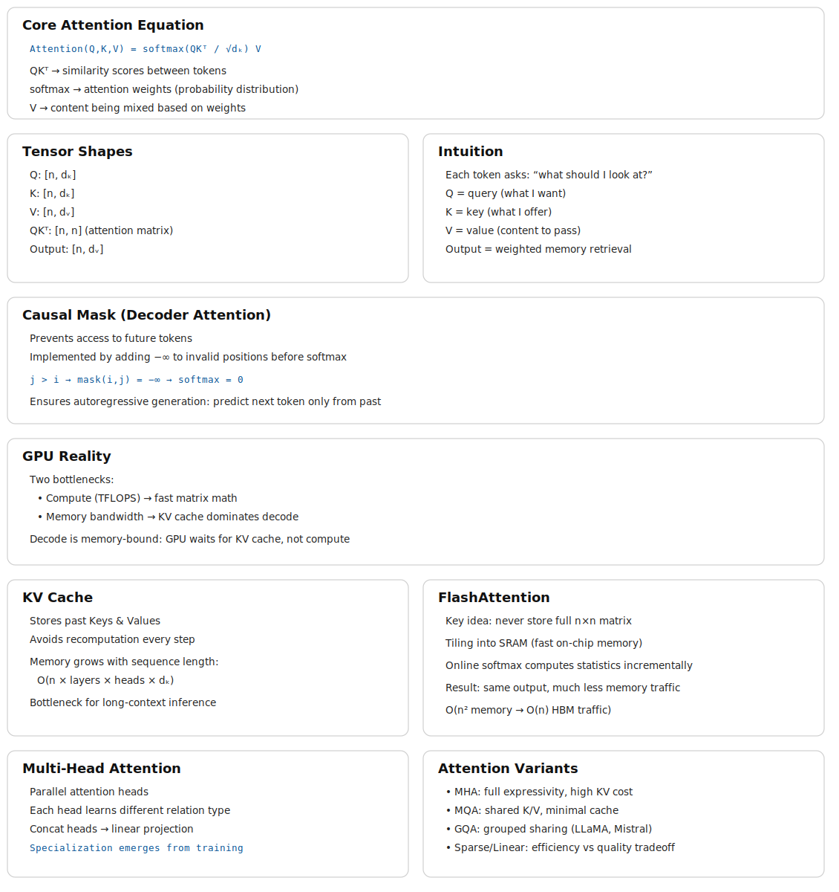

# Attention Computation

> **The canonical question for this chapter:**
> *When the model processes your prompt, how does each token decide what to look
> at and what does the hardware actually do to compute that?*

---

::: {.callout-note appearance="minimal"}
**Where are we?**

```
[Prompt] → [Prompt structure] → [API & serving] → [Tokenization] → [Context] → [Embeddings]

                                                   → [Transformer] → ▶ [Attention] → [KV cache]
                                                         → [GPU] → [Decoding] → [Streaming]
```

In the previous chapter we introduced attention conceptually: queries, keys, values, dot
products, softmax, weighted sum. This chapter covers what attention computation
actually looks like on real hardware, under the constraints
of latency, memory bandwidth, and concurrent requests.
:::

---

## The quadratic problem

Standard self-attention has a fundamental scaling property where both computation and memory grow quadratically with sequence length. For a sequence of `n` tokens:

$$
\begin{array}{l l}
\text{Attention score matrix:} & n \times n \\
\text{Memory for scores:}     & n^2 \times 2\ \text{bytes (BF16)} \\
\text{Compute for scores:}    & n^2 \times d_k\ \text{multiplications (}QK^\top\text{)} \\
\text{Compute for output:}    & n^2 \times d_v\ \text{multiplications (scores} \times V\text{)}
\end{array}
$$

At small sequence lengths this is manageable:

| Sequence length | Score matrix | Memory |
|---|---|---|
| 512 tokens | 512 × 512 | 0.5 MB |
| 2,048 tokens | 2,048 × 2,048 | 8 MB |
| 8,192 tokens | 8,192 × 8,192 | 128 MB |
| 32,768 tokens | 32,768 × 32,768 | 2 GB |
| 131,072 tokens | 131,072 × 131,072 | 32 GB |

At 128k tokens on the other hand which is currently supported by several models the attention
score matrix alone would require 32 GB of GPU memory per layer per head which means a model with 96-layer and 96 heads would need 96 × 96 × 32 GB = 295 TB and that is clearly impossible.

In reality the score matrix is never actually materializes in practice with the help of FlashAttention but the compute still scales quadratically.
Doubling the sequence length quadruples the attention computation and it is
central cost driver for long-context inference.

---

## What the GPU actually does during attention

Understanding attention at the hardware level requires understanding two main bottlenecks in GPU computation, arithmetic throughput and memory bandwidth. **Arithmetic throughput** refers to how many floating-point operations per second the GPU can perform (an H100 delivers approximately 1,000 TFLOPS for BF16 matrix multiplications). **Memory bandwidth** refers to how fast data can be read/write from/to GPU high bandwidth memory (an H100 provides approximately 3.35 TB/s). The ratio between these, known as arithmetic intensity, determines whether a computation is compute-bound or memory-bandwidth-bound.


For matrix multiplication, the main operation in attention and FFNs, large matrices have high arithmetic intensity and are compute-bound, while small matrices or element-wise operations have low arithmetic intensity and are memory-bandwidth-bound.


During the decoding phase (processing one new token against the KV cache),
attention is severely memory-bandwidth-bound. In this phase GPU must read the entire KV
cache (potentially gigabytes of data) to compute attention scores for a single
new token. The arithmetic work is tiny relative to the memory access while the GPU's
massive arithmetic throughput sits idle, waiting for data.
This is the reason why decoding throughput scales with memory bandwidth, not arithmetic
throughput and why increasing sequence length primarily increases memory
pressure and not the compute pressure, during generation.

---

## Standard attention: the naive computation

Before FlashAttention, attention was computed in the obvious way:

```python
# Standard attention (naive)
# Q: [seq_len, d_k]
# K: [seq_len, d_k]
# V: [seq_len, d_v]

scores = Q @ K.T                          # [seq_len, seq_len] — written to HBM
scores = scores / math.sqrt(d_k)          # scaling — read/write from/to HBM
scores = scores + causal_mask             # masking — read/write from/to HBM
scores = softmax(scores, dim=-1)          # softmax — read/write from/to HBM
output = scores @ V                       # [seq_len, d_v] — read/write from/to HBM
```

Each step read/write from/to HBM. The score matrix of shape
`[seq_len, seq_len]` is materialized in HBM multiple times during scaling,
masking, and softmax.

For a sequence of 8,192 tokens in BF16:

- Score matrix: 8,192 × 8,192 × 2 bytes = 128 MB
- Each read/write of the score matrix: 128 MB / 3.35 TB/s ≈ 38 microseconds
- Across multiple reads and writes: hundreds of microseconds in memory traffic
  alone

The actual arithmetic is fast, while the movement of data between compute units and HBM is the bottleneck, which making this a classic I/O-bound computation.


---

## FlashAttention

FlashAttention (Dao et al., 2022) computes exact attention which is basically same numerical
result as standard attention, while using dramatically less memory and running
significantly faster. The trick is reorganizing the computation to minimize
HBM traffic.

### The key insight: tiling

FlashAttention divides the Q, K, and V matrices into tiles that fit in SRAM,
the fast on-chip memory sitting directly next to the compute units, with much
higher bandwidth than HBM but much smaller capacity:

```
SRAM bandwidth:  ~20 TB/s   (fast, ~50 MB on H100)
HBM bandwidth:   ~3.35 TB/s (slower, 80 GB on H100)
```

By loading tiles into SRAM and performing the full attention computation on those
tiles before writing results back to HBM, FlashAttention reduces HBM reads and
writes from O(n²) to O(n) while the score matrix is never written to HBM at all.

### Online softmax

The challenge: softmax requires knowing the maximum value across all scores in a
row before normalizing while in the tiled computation, you process one tile at a time
without seeing the full row. How do you compute correct softmax without
materializing the full score matrix?

FlashAttention uses an online softmax algorithm that maintains running statistics
(the running maximum and running sum of exponentials) and updates them as each
tile is processed. After all tiles, the statistics are complete and the output is
correctly normalized:

```python
running_max = -infinity
running_sum = 0
running_output = zeros(d_v)

for each key/value tile (K_tile, V_tile):
    scores_tile = Q_row @ K_tile.T / sqrt(d_k)
    tile_max = max(scores_tile)

    # Update running statistics
    new_max = max(running_max, tile_max)
    running_sum = (running_sum * exp(running_max - new_max)
                  + sum(exp(scores_tile - new_max)))
    running_output = (running_output * exp(running_max - new_max)
                     + exp(scores_tile - new_max) @ V_tile)
    running_max = new_max

# Final normalization
output = running_output / running_sum
```

This procedure produces the identical result to naive attention while never storing more
than one tile's worth of scores at a time.

### FlashAttention in practice

FlashAttention is $2\text{--}4×$ faster than standard attention on typical sequence
lengths, with the speedup increasing as sequences grow longer and more importantly,
its memory usage is O(n) rather than O(n²).


---

## Multi-head attention at inference

Multi-head attention runs `h` independent attention operations in parallel.
For a model with `h = 96` heads and `d_model = 12,288`:


$$
\begin{aligned}
d_k = d_v &= \frac{d_{\text{model}}}{h} = 128 \quad \text{(per head)}
\\[14pt]
\textbf{Projections:} \quad & \\
Q &: [n,\, 12288] \;@\; [12288,\, 96 \times 128] \;\to\; [n,\, 96,\, 128] \\
K &: [n,\, 12288] \;@\; [12288,\, 96 \times 128] \;\to\; [n,\, 96,\, 128] \\
V &: [n,\, 12288] \;@\; [12288,\, 96 \times 128] \;\to\; [n,\, 96,\, 128]
\\[14pt]
\textbf{Per-head attention:} \quad & \\
\text{scores} &= \frac{Q_h K_h^\top}{\sqrt{128}} \;\to\; [n,\, n] \\[6pt]
\text{output} &= \text{softmax}(\text{scores})\, V_h \;\to\; [n,\, 128]
\\[14pt]
\textbf{Concatenate:} \quad & [n,\, 96,\, 128] \;\to\; [n,\, 12288] \\[4pt]
\textbf{Output proj:} \quad & [n,\, 12288] \;@\; [12288,\, 12288] \;\to\; [n,\, 12288]
\end{aligned}
$$

In practice, all 96 heads are computed in parallel by treating the head
dimension as a batch dimension. The Q, K, V projections produce batched tensors
processed simultaneously by the matrix multiplication kernel.

### MHA vs. MQA vs. GQA

**Multi-Head Attention (MHA)** uses separate Q, K, and V projection matrices for each head.
While this increases expressiveness, it is memory-intensive because each head requires its own stored K and V tensors in the KV cache.

**Multi-Query Attention (MQA)** (Shazeer, 2019): All attention heads share a single set of K and V projections, while Q remains separate per head. This significantly reduces KV cache usage by a factor of *h*, for example, a 96-head model achieves a ~96× smaller cache and in general, this comes with only a modest impact on output quality.


$$
\begin{aligned}
\textbf{MHA:}\quad & Q \in \mathbb{R}^{n \times h \times d_k},\; K \in \mathbb{R}^{n \times h \times d_k},\; V \in \mathbb{R}^{n \times h \times d_v} \;\Rightarrow\; \text{KV cache} \propto 2 \cdot h \cdot d_k \\[8pt]
\textbf{MQA:}\quad & Q \in \mathbb{R}^{n \times h \times d_k},\; K \in \mathbb{R}^{n \times 1 \times d_k},\; V \in \mathbb{R}^{n \times 1 \times d_v} \;\Rightarrow\; \text{KV cache} \propto 2 \cdot d_k
\end{aligned}
$$

**Grouped-Query Attention (GQA)** (Ainslie et al., 2023): the middle ground in which
Heads are divided into groups; each group shares one K and V projection:

| **Component** | **Shape**                    | **Details**              |
|---------------|------------------------------|--------------------------|
| **Q (Query)** | $[n, 96, d_k]$               | per head                 |
| **K (Key)**   | $[n, 8, d_k]$                | per group                |
| **V (Value)** | $[n, 8, d_v]$                | per group                |
| **KV Cache**  | $\propto 2 × 8 × d_k$        | 12× smaller than MHA     |

LLaMA 2 70B uses GQA with 8 KV heads and Mistral 7B uses GQA with 8 KV heads.
Quality loss compared to MHA is negligible on standard benchmarks while the
KV cache reduction is significant for serving. 

---

## The KV cache at inference

During decoding, the model generates one token at a time and at each step, this new
token must attend to all previous tokens. Recomputing the K and V vectors for
all previous tokens at every step would be extremely wasteful due to the fact that those tokens
have not changed, so their projections have not changed either.

The KV cache stores K and V tensors for all previous tokens and reuses them at
each generation step. Only the new token's Q, K, V vectors need to be computed
fresh. This is covered in full detail in chapter REFF  nevertheless the momory cost 
understanding will be discussed here


### KV cache memory per token

For LLaMA 2 70B (L=80 layers, 8 KV heads, d_k=128, BF16):


Per token per layer: $2 × 8 × 128 × 2$ bytes = 4 KB

Per token total:     $4 × 80$ layers = 320 KB


For a 4,096-token sequence: 320 KB $×$ 4,096 ≈ **1.28 GB of KV cache** per
sequence. At batch size 64 concurrent sequences: 64 × 1.28 GB = 82 GB which is
more than the 80 GB on an H100. This is the reason KV cache management is the central
serving constraint for long-context workloads.

### Prefill vs. decode attention

During prefill (processing the input prompt), all tokens' K and V vectors are
computed simultaneously and written to the KV cache it is a batch matrix
multiplication, efficient and compute-bound. On the othe hand during decoding (generating output), each new token's K and V are computed and
appended to the cache, then attention is computed between that single new token's
Q and the full KV cacheand it is  a vector-matrix multiply, memory-bandwidth-bound:

```
Prefill: [n_prompt, d_k] @ [d_k, n_prompt]      → large matmul, compute-bound
Decode:  [1, d_k] @ [d_k, n_prompt + n_gen]     → vector-matrix, bandwidth-bound
```

This asymmetry is why decoding is slower per token than prefill, and why
disaggregated serving (separate hardware for prefill and decode phases) is considered as
an active area of optimization.

---

## Sparse and linear attention

The quadratic cost of standard attention has motivated significant research into
more efficient alternatives yet None has been able to displace full attention in frontier
models, but several are worth understanding.

### Sparse attention

Instead of every token attending to every other token, sparse attention restricts
each token to a subset of positions:

**Local window attention**: each token attends only to the surrounding `w` tokens which reduces the complexity to O(n × w). With this approach the information still can propagate across long distances through
multiple layers of local attention.

**Strided attention**: alternating layers use different patterns in which some layers use local
windows and some use strided patterns (attend every k steps) allowing attention to distant tokens. Used in
Longformer and BigBird.

**Sliding window with global tokens**: certain tokens (typically the first ones)
attend to all other tokens and are attended to by all others. These global tokens
propagate long-range information while the rest of the sequence uses local
attention.

The limitation: the sparsity pattern must be specified in advance. If it does
not match the actual information dependencies in the data, quality degrades.
Full attention is flexible that helps  the model to learn any pattern which is why it
has remained dominant.

### Linear attention

The key idea behind **linear attention** is to reinterpret softmax attention as a
kernel operation whose structure allows the order of computation to change.

Ignoring scaling and normalization constants for clarity, the softmax attention
weight between tokens can be written as

$$
A_{ij} = \exp(q_i^\top k_j).
$$

The attention output for token $i$ therefore becomes

$$
\text{output}_i
=
\frac{
\sum_j \exp(q_i^\top k_j)\, v_j
}{
\sum_j \exp(q_i^\top k_j)
}.
$$

This reveals that attention is fundamentally a **kernel similarity** $\kappa(q_i,k_j) = \exp(q_i^\top k_j)$
meaning attention computes a weighted kernel regression over values.

With linear attention we can assume that this exponential kernel can be approximated by an
inner product in a feature space,
$\exp(q^\top k) \approx \phi(q)^\top \phi(k)$,
where the feature map
$\phi:\mathbb{R}^d \rightarrow \mathbb{R}^{d_\phi}$
embeds queries and keys into a space where their similarity become linear and substituting this approximation into attention gives

$$
\text{output}_i
=
\frac{
\sum_j
\phi(q_i)^\top \phi(k_j)\, v_j
}{
\sum_j
\phi(q_i)^\top \phi(k_j)
}.
$$

Because $\phi(q_i)$ does not depend on $j$, it can be factored outside the sums:

$$
\text{output}_i
=
\frac{
\phi(q_i)^\top
\sum_j \phi(k_j) v_j^\top
}{
\phi(q_i)^\top
\sum_j \phi(k_j)
}.
$$

All interactions with the sequence are now contained in two global statistics,

$$
S=\sum_j \phi(k_j)v_j^\top,
\qquad
z=\sum_j \phi(k_j),
$$

so the output becomes

$$
\text{output}_i
=
\frac{\phi(q_i)^\top S}{\phi(q_i)^\top z}.
$$

Stacking all queries yields the linear attention form

$$
\boxed{
\text{Attn}(Q,K,V)
=
\phi(Q)\big(\phi(K)^\top V\big)
}
\quad\text{(up to normalization)}.
$$

The crucial consequence is that computation can be reordered:

$$
(QK^\top)V \;\;\longrightarrow\;\;
\phi(Q)\big(\phi(K)^\top V\big),
$$

allowing the key-value product to be computed once and reused for all queries.

| Method             | Formula                                                      | Complexity |
|--------------------|--------------------------------------------------------------|------------|
| Standard attention | $\mathrm{softmax}\!\left(\frac{QK^\top}{\sqrt{d_k}}\right)V$ | $O(n^2)$   |
| Linear attention   | $\phi(Q)\big(\phi(K)^\top V\big)$                            | $O(n)$     |

The limitation is that the approximation works for some tasks but degrades on others,
particularly tasks requiring precise comparison of specific tokens. Softmax
produces a peaky distribution (concentrating attention on a small number of
tokens) which is important for retrieval-like tasks that linear approximations
cannot replicate faithfully.

### State space models and hybrid architectures

Another direction for scaling sequence models is to move away from attention
completely and instead model sequences through **learned dynamical systems**.
State space models (SSMs) replace pairwise token interaction with a recurrent
state that evolves over time, allowing sequences to be processed in linear
time.

Rather than computing interactions between all tokens, an SSM maintains a
compact hidden state updated sequentially,

$$
h_t = A h_{t-1} + B x_t, \qquad
y_t = C h_t,
$$

so information is carried forward through the state instead of recomputed via an
attention matrix. Models such as Mamba achieve
$O(n)$ computation and memory while retaining long-range dependency modeling,
since past context is compressed into the evolving state.

Hybrid architectures combine both paradigms. Instead of choosing between
attention and recurrence, models like Jamba and Griffin
 interleave attention layers with
SSM layers. Attention provides flexible global reasoning when precise token
interactions matter, while SSM blocks handle long-context processing efficiently
by propagating information through state updates.

These hybrid designs represent an active research direction: as context lengths
grow, future architectures may rely less on dense attention and more on mixtures
of attention, recurrence, and continuous-time sequence modeling.

---

## Ring attention and sequence parallelism

For extremely long sequences, even FlashAttention with $O(n)$ memory may exceed
a single GPU's capacity with the help of Ring attention the sequence distributions can go across multiple
GPUs.

Each GPU holds a slice of the Q, K, and V matrices. The attention computation
proceeds in a ring: each GPU computes a partial attention using its local Q slice
against the current K/V slice, then passes the K/V to the next GPU while
receiving the previous GPU's K/V:

```
Ring of 4 GPUs:

Step 1: GPU0 computes Q0×K0V0, GPU1 computes Q1×K1V1, ...
        K/V rotate: K0V0 → GPU1, K1V1 → GPU2, ...

Step 2: GPU0 computes Q0×K3V3 (received from GPU3)
        GPU1 computes Q1×K0V0 (received from GPU0), ...

Step 4: Each GPU has accumulated contributions from all K/V slices
        → complete attention output for its Q slice
```

After one full revolution, each GPU has computed its complete attention output
using K/V from all other GPUs and enables sequence lengths that
scale linearly with the number of GPUs.

---

## Attention in the decode loop: step by step

Here is exactly what happens during one attention computation step during
decoding, after prefill is complete and the model is generating token by token:

```
State at step t:
  KV cache contains K, V for tokens 0 through t-1
  New token t has been embedded with positional encoding applied

1. Compute Q, K, V for token t:
   Q_t = x_t @ W_Q    → [1, d_k] per head
   K_t = x_t @ W_K    → [1, d_k] per head  (stored in KV cache)
   V_t = x_t @ W_V    → [1, d_v] per head  (stored in KV cache)

2. Append K_t, V_t to KV cache:
   K_cache[:t+1] = [K_0, K_1, ..., K_{t-1}, K_t]

3. Compute attention scores:
   scores = Q_t @ K_cache[:t+1].T / sqrt(d_k)    → [1, t+1] per head

4. Softmax:
   attn_weights = softmax(scores)    → [1, t+1] per head

5. Weighted sum:
   attn_output = attn_weights @ V_cache[:t+1]    → [1, d_v] per head

6. Concatenate heads and project:
   output = concat(attn_output_per_head) @ W_O    → [1, d_model]

7. Add to residual stream:
   x_t = x_t + output
```

Step 3 is the memory-bandwidth bottleneck: it reads the entire KV cache from
HBM. At 4,096 tokens for LLaMA 2 70B, step 3 reads approximately 1.28 GB of
KV cache per generation step. At 3.35 TB/s bandwidth, that is 0.38 milliseconds
per step (for attention alone, before FFN and other operations). This is why
long-context generation is slower per token than short-context generation.


---

## Key takeaways

- Attention computation scales quadratically with sequence length in both memory
  and compute; this is the central cost driver for long-context inference, at
  128k tokens, the naive score matrix would require 32 GB per layer per head
- Standard attention materializes the full $n×n$ score matrix in HBM, causing
  excessive memory traffic; FlashAttention eliminates this by tiling the
  computation into SRAM and using online softmax, reducing HBM access from
  $O(n^2)$ to $O(n)$
- During decode, attention is memory-bandwidth-bound: the GPU reads the entire
  KV cache for a single new token; throughput scales with HBM bandwidth, not
  arithmetic throughput
- GQA shares K and V projections across groups of heads, reducing KV cache by
  the ratio of total heads to KV heads, the primary reason GQA is now the
  default for new models
- Prefill is compute-bound (large batch matrix multiply); decode is memory-
  bandwidth-bound (vector-matrix multiply against the growing KV cache),
  the same model, two different hardware bottlenecks
- Sparse attention and linear attention reduce $O(n^2)$ cost but sacrifice
  flexibility; state space models and hybrid architectures are competitive
  alternatives for extreme sequence lengths

{#fig-progress width="90%"}

---

## Further reading

- Dao et al. (2022). *FlashAttention: Fast and Memory-Efficient Exact Attention
  with IO-Awareness.*: The foundational paper.
- Shazeer (2019). *Fast Transformer Decoding: One Write-Head is All You Need.*:  The original Multi-Query Attention paper.
- Ainslie et al. (2023). *GQA: Training Generalized Multi-Query Transformer
  Models from Multi-Head Checkpoints.*: Grouped-Query Attention.
- Liu et al. (2023). *Ring Attention with Blockwise Transformers for Near-Infinite
  Context.*: Ring attention for distributed long-context computation.
- Gu & Dao (2023). *Mamba: Linear-Time Sequence Modeling with Selective State
  Spaces.*: The leading SSM alternative to attention.

---

*← Previous: [07 — Transformer architecture](07-transformer-architecture.md)*  
*Next: [09 — KV cache →](09-kv-cache.md)*