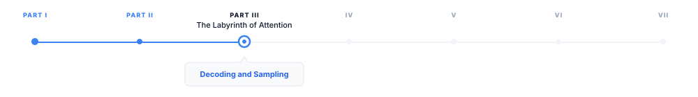
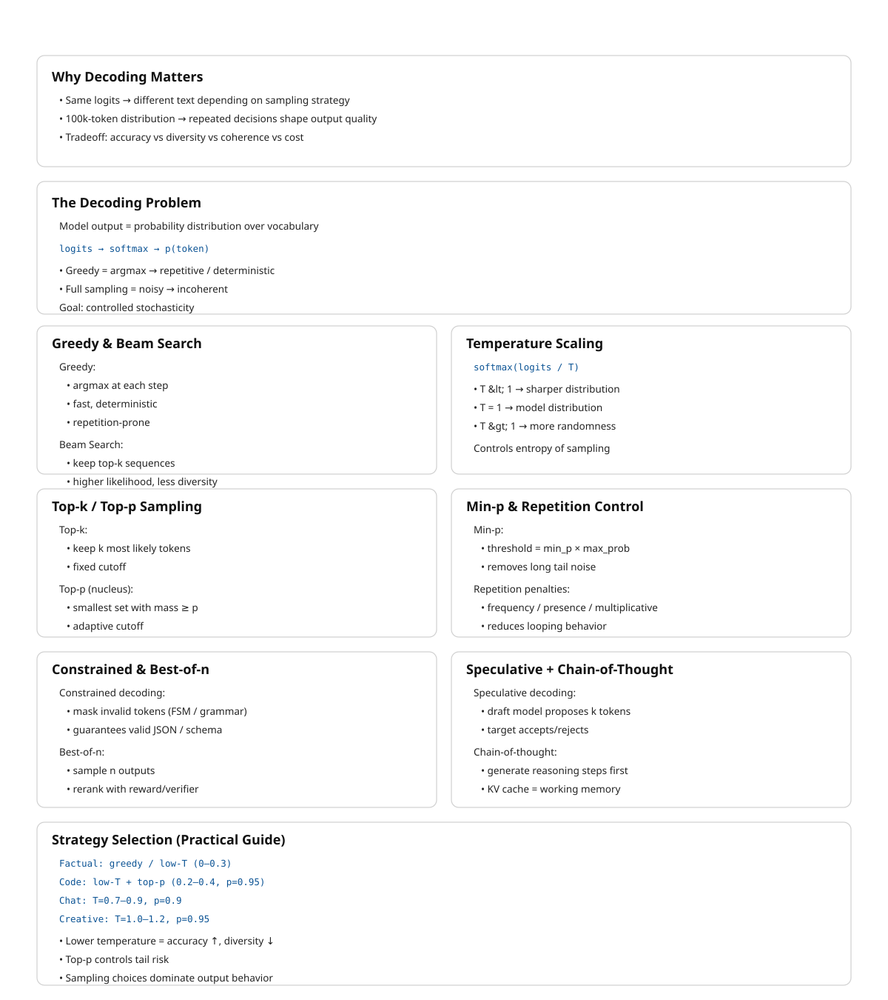

> **The canonical question for this chapter:**
> *The model produces a probability distribution over 100,000 tokens. How do you
> turn that distribution into the actual text the user sees, and how does that
> choice shape everything from creativity to factuality to cost?*

---

::: {.callout-note appearance="minimal"}
**Where are we?**

{#fig-progress width="80%"}

The transformer forward pass is complete. The model has produced a vector of
logits one score per vocabulary token. This chapter covers what happens next:
how those logits become a token, and how that single choice, made thousands of
times, produces the text the user reads. The decoding strategy is the last step
before output also one of the most consequential.
:::

---

## The decoding problem

After the transformer forward pass, the output is a vector of logits one
score per token in the vocabulary. Applying softmax converts these
to a probability distribution:

```
logits:        [2.3,  -1.2,  0.8,  4.1,  -0.3,  ...]   shape: [vocab_size]
probabilities: [0.04,  0.001, 0.01, 0.33,  0.004, ...]   shape: [vocab_size]
```

The highest-probability token is not always the right choice. Selecting it every
time known as greedy decoding produces text that is repetitive, overconfident, and
often worse than sampling from the distribution. Nevertheless sampling randomly from 
the full distribution produces incoherent text that assigns probability to every
token, including terrible ones.

Decoding is the set of strategies for navigating this tradeoff: selecting a
token (or sequence of tokens) from the distribution in a way that produces
output that is coherent, diverse, and appropriate for the task. It runs once
per generated token, which for a 500 token response means it runs 500 times.
Small differences in strategy compound into large differences in output.

---

## Greedy decoding

The simplest strategy: always select the token with the highest probability.

```python
def greedy_decode(logits):
    return logits.argmax(dim=-1)
```

Greedy decoding is deterministic the same prompt always produces the same
output. It is fast (no sampling required) and produces coherent local choices
at each step.

The problem: local optimality does not imply the global optimality. The highest-
probability token at step `t` may lead to a sequence that is less probable
overall than a sequence that takes a lower probability token at step `t` and
recovers. As a result, greedy decoding can become trapped in a local optimum.

The most visible symptom is repetition. Once a model enters a repetitive pattern,
greedy decoding has no escape mechanism, the most likely next token at each step
continues the pattern. The model knows, in some sense, that it is repeating
itself (it assigns lower probability to the repetition than to alternatives), but
greedy decoding ignores that signal and repeats anyway.

Greedy decoding is appropriate for tasks with a single correct answer (extracting
specific information, classification, structured output generation where diversity
is undesirable) and for debugging, where the deterministic output makes it easier
to isolate model behavior from sampling noise.

---

## Beam search

Beam search maintains a set of `k` candidate sequences and extends
all of them at each step, keeping only the `k` most probable overall:

```
Beam width k=2, step 1:
  Candidates: ["The cat", "A dog"]
  Scores:     [log P("The") + log P("cat"|"The"),
               log P("A") + log P("dog"|"A")]

Step 2: extend each candidate:
  "The cat sat", "The cat ran", "The cat is", ...   (vocab_size options)
  "A dog ran",   "A dog sat",   "A dog is", ...     (vocab_size options)

Keep top k=2 by cumulative log probability:
  ["The cat sat", "A dog ran"]
```

At the end of generation, the candidate with the highest cumulative log
probability is returned. Beam search finds sequences with higher overall
probability than greedy decoding because it can recover from locally suboptimal
choices.

### The beam search curse

Beam search dominated sequence-to-sequence tasks (translation, summarization)
from roughly 2015 to 2020. For tasks with constrained output spaces, it performs
well. For open-ended generation, it has a well-documented failure mode: it
produces output that is generic and boring.

High-probability sequences tend to be safe, common phrases. The beam converges
to the statistical mean of training data rather than producing specific, vivid
text. This is the beam search curse: the sequences with highest probability under
the model are not the sequences humans prefer. Human language is not the highest-
probability sequence, people regularly choose moderately probable, interesting
words over the most probable, expected ones.

Beam search is still used for translation (k=4 is typical), structured data
extraction, and code generation with hard constraints. For conversational and
creative generation, sampling-based methods have largely replaced it.

---

## Temperature sampling

Temperature is one of the most important hyperparameters in decoding. It adjusts the 
probability distribution over the next token before sampling, making the distribution 
either sharper or flatter.

### The temperature transformation

Before sampling, the logits are divided by a temperature parameter (T):

```
adjusted_probs = softmax(logits / T)
```

**T < 1.0 (cold):** the distribution become sharper and high-probability tokens 
receive relatively more probability mass, while low-probability tokens receive less. At
T → 0, the distribution approaches a point mass on the highest-probability token.
Consequently, stochastic sampling becomes deterministic, recovering the behavior of greedy 
decoding.

**T = 1.0:** the distribution is unchanged from the model's output.

**T > 1.0 (hot):** the distribution becomes flatter and probabilities are spread more 
evenly across tokens. At T → ∞, the distribution becomes uniform.

```
Logits:          [4.0,  2.0,  1.0,  0.5]

T=0.5 (cold):    softmax([8.0, 4.0, 2.0, 1.0]) → [0.86, 0.12, 0.02, 0.01]
T=1.0 (normal):  softmax([4.0, 2.0, 1.0, 0.5]) → [0.68, 0.17, 0.08, 0.07]
T=2.0 (hot):     softmax([2.0, 1.0, 0.5, 0.25])→ [0.45, 0.27, 0.16, 0.12]
```

### Choosing temperature

**T = 0 (greedy):** factual retrieval, classification, structured output.
Maximizes accuracy for tasks with correct answers.

**T = 0.1–0.4:** code generation, factual Q&A, tasks where accuracy matters but
some flexibility is useful. Concentrated distribution that rarely samples
improbable tokens.

**T = 0.7–1.0:** conversational responses, general-purpose assistants. Balanced
diversity and coherence. Most production systems operate in this range.

**T = 1.0–1.4:** creative writing, brainstorming, poetry. Higher diversity,
more surprising choices. Coherence may occasionally suffer.

**T > 1.5:** experimental. Useful for exploring the model's probability space,
not for production output.

Temperature is not a global constant and it should vary by task. A system that
writes creative fiction and also answers factual questions should use different
temperatures for each, ideally set automatically based on query classification.

---

## Top-k sampling

Temperature sampling from the full distribution can still sample very unlikely
tokens. If there are 100,000 tokens in the vocabulary, even after temperature
adjustment there may be thousands of tokens with non-negligible probability,
including tokens that produce incoherent output.

Top-k sampling restricts sampling to the `k` most probable tokens:

```python
def top_k_sample(logits, k, temperature=1.0):
    logits = logits / temperature
    top_k_values, top_k_indices = torch.topk(logits, k)
    filtered_logits = torch.full_like(logits, float('-inf'))
    filtered_logits.scatter_(0, top_k_indices, top_k_values)
    probs = torch.softmax(filtered_logits, dim=-1)
    return torch.multinomial(probs, num_samples=1)
```

The remaining probability mass is renormalized across the top-k tokens before
sampling. Tokens outside the top-k are masked with `-inf`, giving them zero
probability after softmax.

Top-k has a structural limitation: `k` is fixed regardless of the distribution
shape. When the model is very confident (one token at probability 0.95, the rest near
zero) top-k=50 forces sampling from 50 tokens when 49 of them are clearly wrong
choices. When the model is genuinely uncertain (500 tokens each at probability ~0.002)
top-k=50 discards 450 plausible options.
A fixed `k` handles neither scenario well. This motivates nucleus sampling.

---

## Nucleus (top-p) sampling

Nucleus sampling adapts the number of candidates to the distribution shape.
Instead of a fixed count `k`, it takes the smallest set of tokens whose
cumulative probability exceeds `p`:

```python
def nucleus_sample(logits, p, temperature=1.0):
    logits = logits / temperature
    probs = torch.softmax(logits, dim=-1)
    sorted_probs, sorted_indices = torch.sort(probs, descending=True)
    cumulative_probs = torch.cumsum(sorted_probs, dim=-1)
    sorted_indices_to_remove = cumulative_probs - sorted_probs > p
    sorted_probs[sorted_indices_to_remove] = 0
    sorted_probs /= sorted_probs.sum()
    sampled_index = torch.multinomial(sorted_probs, num_samples=1)
    return sorted_indices[sampled_index]
```

With `p = 0.9`: include the fewest tokens whose probabilities sum to at least 0.9.
Renormalize and sample from those tokens only.

When the model is confident (one token at 0.95 probability), the nucleus contains
only that token which is effectively greedy decoding. When the model is uncertain
(probability spread widely), the nucleus includes many tokens and sampling is
diverse. The nucleus size adapts to the situation rather than being fixed in
advance which makes it ideal for production. 

### Choosing p

**p = 0.9–0.95:** the most common range. Excludes the long tail of implausible
tokens while preserving diversity for plausible choices.

**p = 1.0:** sample from the full distribution there aren't any nucleus restriction.
Equivalent to pure temperature sampling.

**p = 0.5:** very concentrated. Appropriate for high-accuracy tasks but risks
becoming too deterministic.

Top-p and temperature are typically used together. Temperature shapes the
distribution; top-p determines the cutoff. A common production configuration:
`temperature=0.7, top_p=0.9`.

---

## Min-p sampling

A more recent alternative to top-p that addresses a subtle failure mode.

Top-p's cutoff is cumulative: if the nucleus already covers 90% of probability
mass, tokens beyond that are excluded regardless of their absolute probability.
In practice, this can include tokens with very low absolute probability if they
accumulate to push the total past `p`, especially when the distribution is flat.

Min-p sets a minimum absolute probability threshold instead: only sample from
tokens whose probability exceeds `min_p × max_token_probability`.

```python
def min_p_sample(logits, min_p, temperature=1.0):
    probs = torch.softmax(logits / temperature, dim=-1)
    max_prob = probs.max()
    threshold = min_p * max_prob
    filtered_probs = probs.clone()
    filtered_probs[probs < threshold] = 0
    filtered_probs /= filtered_probs.sum()
    return torch.multinomial(filtered_probs, num_samples=1)
```

With `min_p = 0.05`: if the most likely token has probability 0.4, only tokens
with probability $\geq$ 0.02 are considered. If the most likely token has probability
0.9, the threshold rises to 0.045 automatically restricting sampling when the
model is confident.

Min-p adapts to distribution shape like top-p but uses the maximum token
probability as the reference rather than the cumulative sum. Empirically, it
produces more coherent output than top-p for creative tasks while maintaining
diversity. 

---

## Repetition penalties

A common failure mode of sampling is that the model becomes trapped in repetitive 
loops. This issue is not solely caused by the decoding algorithm, it often reflects 
the model operating in a low-quality mode or producing a poorly calibrated probability 
distribution. Nevertheless, appropriate decoding strategies can help mitigate this problem.

### Frequency penalty

Reduces the logit of any token proportional to how many times it has appeared in
the generated output so far:

```
adjusted_logit[t] = logit[t] - frequency_penalty × count(t, generated_so_far)
```

A token that has appeared 5 times with `frequency_penalty = 0.5` has its logit
reduced by 2.5. Frequently used tokens become progressively less likely.

### Presence penalty

Reduces the logit of any token that has appeared at all, by a flat amount:

```
adjusted_logit[t] = logit[t] - presence_penalty × (1 if t in generated_so_far else 0)
```

Unlike frequency penalty, presence penalty does not scale with count, it applies
a flat reduction on first appearance and no additional reduction after that.
It discourages reusing any token at all, not repeatedly using a token many times.

### Repetition penalty (multiplicative)

Used in HuggingFace and most open-source implementations:

```
adjusted_logit[t] = logit[t] / repetition_penalty    if logit[t] > 0
adjusted_logit[t] = logit[t] × repetition_penalty    if logit[t] < 0
```

For `repetition_penalty > 1.0`, this divides positive logits and multiplies
negative logits, making previously generated tokens less likely regardless of
their sign.

### Practical considerations

Repetition penalties must be carefully calibrated. If the penalty is too strong, 
the model may avoid repeating necessary words, including common function words such 
as the, is, and and, which naturally occur multiple times in fluent text. 
Conversely, if the penalty is too weak, repetitive outputs may persist.

Most production systems apply penalties only to the generated portion, not the
prompt, you do not want tokens appearing in the prompt to be penalized in the
response. Context window position also matters: penalizing tokens from many turns
ago that have no relationship to the current generation is rarely useful.

---

## Structured decoding and constrained generation

For many production use cases, the output must conform to a specific format (
a valid JSON, a Python function, a response matching, a defined schema). Unconstrained
sampling may produce syntactically invalid output, requiring expensive retry
loops. Structured decoding guarantees valid output by constraining the logits
at each step.

### How constrained generation works

At each decoding step, a parser tracks the current state of the partially
generated output and computes the set of tokens that are valid at this position,
tokens that would not cause the output to become unparseable. All invalid tokens
are masked out (their logits set to `-inf`) before sampling.

```
Target format: JSON object with "name" (string) and "age" (integer)

After generating: {"name": "
  Valid next tokens:   any character that could appear in a JSON string
  Invalid next tokens: }, ], :, numbers, structural tokens

After generating: {"name": "Alice", "age":
  Valid next tokens:   digits (0–9), negative sign
  Invalid next tokens: letters, quotes, braces
```

The parser can be regex-based (valid tokens match the regex at the current
position), grammar-based (tokens permitted by a context-free grammar at the
current parse state), or schema-based (tokens consistent with a JSON schema
or Pydantic model).

### Implementations

**Outlines** (Willard & Louf, 2023): builds a finite state machine from the
schema or regex at compile time. At inference, the FSM advances after each token
and the valid next-token set is read from the FSM in O(1). The precomputed FSM
makes constraint checking negligible overhead.

**Guidance** (Microsoft): the earlier widely-used structured generation library.
Intercepts the generation loop and applies constraints at each step with a broader
feature set including branching and conditional generation.

**llama.cpp GBNF grammars**: built-in grammar-based constrained generation
using a BNF-like notation. Ships with llama.cpp without additional dependencies.


### Overhead

Constrained generation adds overhead in logit masking (computing the valid token
set and applying the mask which is O(1) per step with precomputed FSMs) and in reduced
sampling diversity (smaller effective vocabulary). Latency overhead is typically
5–15% relative to unconstrained generation with FSM-based approaches. The
alternative (parsing failures and retry loops) is far more expensive.

---

## Best-of-n sampling

Generate `n` independent completions for the same prompt and select the best one
according to some criterion:

```
Generate n=8 completions for the same prompt
Score each:
  - Reward model score (human preference prediction)
  - Verifier (run the code, check the math)
  - Self-consistency (most common answer across completions)
  - Model perplexity (model's own confidence in its output)
Return the highest-scoring completion
```

Best-of-n is a simple yet effective strategy for improving output quality by allocating 
additional computation during inference. The model generates n candidate outputs and 
selects the best one according to a scoring criterion. Performance typically scales 
log-linearly with n: increasing the number of samples from 1 to 4 often yields substantial 
improvements, whereas increasing it from 8 to 16 provides smaller, diminishing gains.

**Verifiable tasks** are where best-of-n works best. For math problems, the
answer can be verified for correctness. For code, it can be executed and tested.
Generate `n` solutions, keep those that pass verification, return the best or
majority-vote answer.

**Reward model reranking** generates `n` responses and scores them with a reward
model trained to predict human preference, effectively the RLHF reward signal
applied at inference time rather than training time.

**Self-consistency** (Wang et al., 2023) generates `n` answers with chain-of-
thought, returns the most common final answer. This improves accuracy on multi-
step reasoning tasks significantly without requiring a separate verifier.


---

## Speculative sampling

Autoregressive generation has an uncomfortable property: producing token 50 
requires having already produced tokens 1 through 49, one at a time, each 
requiring a full forward pass through the model. 

Speculative decoding is a way to avoid paying that tax token-by-token. 
A small, cheap **draft model** runs ahead and proposes a candidate sequence 
of `k` tokens. The target model then evaluates all `k` candidates in a 
*single* forward pass. The target model isn't generating here; it's grading 
a draft that's already been written.

Drafting versus grading raises the obvious question: how does the target model 
decide which of the draft's guesses to keep? The naive answer is a threshold: 
keep what the target model agrees with and discard the rest. This naive answer 
is wrong, and understanding *why* it's wrong is the key to understanding the 
whole algorithm.

### The acceptance rule

For each draft token `x_t`, accept it with probability:

```
P(accept x_t) = min(1, p_target(x_t) / p_draft(x_t))
```

Two regimes:

- **The target model likes the token at least as much as the draft did** 
($p_{target} \geq p_{draft}$): accept with probability 1.
- **The target model likes it less** ($p_{target} < p_{draft}$): accept only 
with probability $p_{target} / p_{draft}$. The draft model was, in effect, 
overconfident relative to the target, so the token survives only in proportion 
to how much the target actually endorses it.

### What happens on rejection and why the obvious fix is wrong

Suppose a draft token is rejected. The intuitive move is to sample a replacement 
directly from `p_target` at that position after all, the target model already 
computed that full distribution during verification. This turns out to *distort* 
the final output, and a small numeric example makes the distortion concrete.

Take a two-token vocabulary, `{A, B}`, where:

```
p_target(A) = 0.5,  p_target(B) = 0.5
p_draft(A)  = 0.9,  p_draft(B)  = 0.1
```

The draft model samples from its own distribution, so it proposes A 90% of the time. 
When it does, the acceptance probability is `min(1, 0.5/0.9) = 0.556`. If we reject 
and then naively resample straight from `p_target`:

```
P(final = A) = P(draft=A)·P(accept) + P(draft=A)·P(reject)·P(naive resample = A)
             = 0.9 × 0.556 + 0.9 × 0.444 × 0.5
             = 0.5 + 0.2 = 0.7
```

The final probability of A comes out to **0.7**, even though the target model only 
wanted A 50% of the time. Token A is getting double-counted: it wins a first chance 
through acceptance, and then (because a naive resample doesn't know that) a second, 
independent chance through rejection. Any token the draft model over-favored relative 
to the target ends up over-represented in the output. This is precisely the kind of 
quality drift speculative decoding is supposed to avoid.

### The residual distribution

The fix is to correct only into the probability mass that acceptance *hasn't already claimed*:

```
p_correction(x) = max(0, p_target(x) - p_draft(x)) / Z
```

This is **not** the target's raw distribution, it is the target's distribution with the 
draft's contribution subtracted out, clipped at zero, and renormalized by `Z`. Any token 
the draft over-proposed is zeroed out here, since it already had its fair shot via acceptance 
and cannot be picked a second time. Any token the draft under-proposed keeps some mass, since 
that's the only place where the target's true preference hasn't yet been accounted for.

Reworking the example: `p_correction(A) = max(0, 0.5 − 0.9) = 0`, so A can never be selected 
on correction. `p_correction(B) = max(0, 0.5 − 0.1) = 0.4`, and since it's the only token 
with nonzero mass, `Z = 0.4` and correction always yields B. Recomputing:

```
P(final = A) = 0.9 × 0.556 = 0.5                              matches p_target(A)
P(final = B) = 0.1 × 1 (direct accept) + 0.9 × 0.444 × 1 (correction) = 0.1 + 0.4 = 0.5   matches p_target(B)
```

Both tokens land exactly on the target's true probabilities. 

### Walking through a full sequence

The acceptance/correction step happens *per position*, scanned left to right, and stops at 
the first rejection. Suppose the draft model proposes five tokens continuing "The cat sat on the":

```
Draft sequence:  x1="mat"   x2="and"   x3="looked"  x4="very"   x5="happy"
```

One target-model forward pass over the prompt plus all five draft tokens yields the target's 
distribution at every position simultaneously, thanks to causal masking position 1 conditioned 
only on the real prompt, position 2 on the real prompt plus `x1`, and so on.

```
Position 1: x1="mat"     p_draft=0.7, p_target=0.8  → accept (prob. 1)
Position 2: x2="and"     p_draft=0.5, p_target=0.5  → accept (prob. 1)
Position 3: x3="looked"  p_draft=0.6, p_target=0.2  → accept w.p. 0.33 → suppose REJECTED
```

Once position 3 is rejected, positions 4 and 5 are discarded without ever being checked `x4` 
and `x5` were drafted under the assumption that "looked" was the accepted prefix, and that 
assumption no longer holds. Position 3 is then resolved by drawing from the residual distribution 
at that position, which excludes "looked" (already rejected) and favors whatever the target 
under-weighted relative to the draft say this yields "leapt."

```
Accepted this round:   "mat", "and", "leapt"
Discarded:              "looked", "very", "happy"
```

Three tokens survive from five drafted, produced by a single target forward pass rather than 
three sequential ones. The next round starts fresh: the draft model proposes another `k` tokens 
continuing from "...sat on the mat and leapt," and the cycle repeats.

---

## Chain-of-thought and reasoning tokens

A decoding-time technique that improves performance on reasoning tasks: before
producing the final answer, the model generates intermediate reasoning steps.

```
Without chain-of-thought:
  Q: "If a train travels 120 miles in 2 hours, what is its speed?"
  A: "60 miles per hour."

With chain-of-thought:
  Q: "If a train travels 120 miles in 2 hours, what is its speed?"
  A: "To find speed, I divide distance by time.
      Speed = 120 miles / 2 hours = 60 miles per hour."
```

Chain-of-thought is a decoding strategy in that it requires generating more
tokens before reaching the answer. The intermediate tokens are not just
scaffolding, they change the probability distribution over the final answer.
When the model writes out an intermediate calculation, that calculation is encoded
into the KV cache. Subsequent tokens attend to it. The final answer
is generated with the full reasoning chain as context, information that was not
available at the first token.

This is in-context computation: the model uses its own generated text as working
memory, offloading complex reasoning to the sequence rather than encoding it
entirely within the forward pass. The context window is not just for input but also 
it is the model's scratch pad.

---


## Decoding strategy selection guide

A practical reference for choosing decoding parameters by task:

| Task | Strategy | Temperature | Top-p | Notes |
|---|---|---|---|---|
| Factual Q&A | Greedy or low-T | 0–0.3 | 1.0 | Consistency over diversity |
| Code generation | Low temperature | 0.2–0.4 | 0.95 | Correctness matters; some diversity for alternatives |
| JSON / structured output | Constrained | 0.0–0.3 | — | Use constrained decoding; redundant with high-T |
| Translation | Beam or low-T | 0.1–0.3 | — | Beam k=4 or low-T sampling |
| Summarization | Low-medium | 0.3–0.6 | 0.9 | Some diversity; avoid repetition penalties for common words |
| Conversation | Medium | 0.7–0.9 | 0.9 | Naturalness and variety |
| Creative writing | High | 0.9–1.2 | 0.95 | Maximize diversity; consider min-p |
| Reasoning / math | Very low or CoT | 0.0–0.1 | — | Greedy for extraction; chain-of-thought for reasoning |
| Brainstorming | High | 1.0–1.4 | 0.95 | Divergent thinking; coherence secondary |

---

## Key takeaways

- The model outputs a probability distribution over the vocabulary at each step;
  decoding selects a token from that distribution — this choice, made thousands
  of times, determines the character of the output
- Greedy decoding (always pick the most probable token) is deterministic and
  accurate for factual tasks but produces repetitive, generic output for open-
  ended generation because local optimality does not imply global optimality
- Beam search maintains `k` candidate sequences and returns the highest cumulative
  probability sequence; better than greedy for constrained tasks but suffers the
  beam search curse for open-ended generation — highest-probability ≠ most
  interesting
- Temperature scales logits before softmax: below 1.0 sharpens the distribution
  (more deterministic), above 1.0 flattens it (more random); vary temperature
  by task rather than using a single global value
- Top-p (nucleus sampling) adaptively samples from the smallest token set
  covering probability mass `p` — the nucleus shrinks when the model is
  confident, expands when uncertain; it is the dominant production sampling
  strategy
- Min-p uses the maximum token probability as a reference threshold rather than
  cumulative mass, producing more coherent output in cases where top-p includes
  low-probability tokens
- Structured decoding masks invalid tokens at each step using FSMs or parsers,
  guaranteeing format correctness with ~5–15% overhead — far cheaper than retry
  loops
- Best-of-n generates multiple completions and selects the best; most effective
  for verifiable tasks (math, code) where correctness can be checked
  programmatically
- Chain-of-thought uses the KV cache as working memory — intermediate reasoning
  tokens change the probability distribution over the final answer; reasoning
  models extend this to thousands of deliberation tokens
- Higher temperature increases hallucination rate; factual and structured tasks
  should use low temperature or constrained decoding to respect the model's
  already-correct probability signal

{#fig-progress width="90%"}

---

## Further reading

- Holtzman et al. (2020). *The Curious Case of Neural Text Degeneration.* —
  Established why greedy and beam search fail for open-ended generation and
  introduced nucleus sampling. The analysis of probability maximization failure
  modes is essential.
- Fan et al. (2018). *Hierarchical Neural Story Generation.* — Introduced top-k
  sampling for neural text generation; the original motivation and evaluation.
- Leviathan et al. (2023). *Fast Inference from Transformers via Speculative
  Decoding.* — Speculative sampling with exact distribution preservation; the
  proof that the correction step maintains the target distribution is the key
  contribution.
- Wei et al. (2022). *Chain-of-Thought Prompting Elicits Reasoning in Large
  Language Models.* — Established chain-of-thought as a decoding-time technique.
- Willard & Louf (2023). *Efficient Guided Generation for Large Language Models.*
  — The Outlines paper; FSM-based constrained decoding with O(1) per-step
  overhead.


