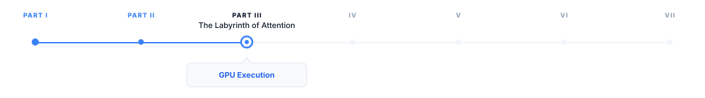
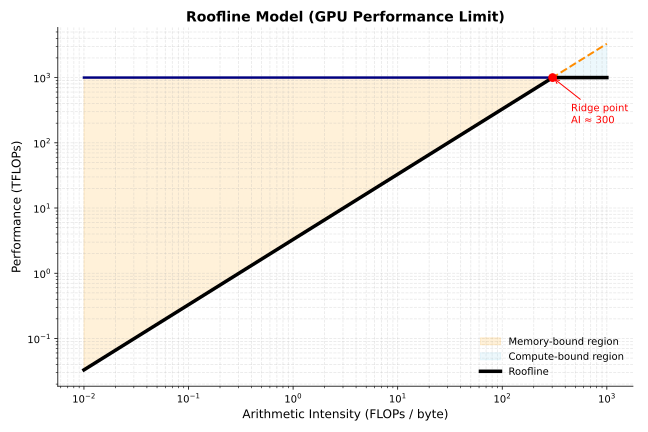

> **The canonical question for this chapter:**
> *When the model runs, what is GPU actually doing? Why does the same
> operation take wildly different amounts of time depending on how it is
> scheduled, and how the data is laid out in memory?*

---

::: {.callout-note appearance="minimal"}
**Where are we?**

{#fig-progress width="80%"}

The previous chapters established what the model computes: embeddings, attention,
feed-forward networks, the KV cache. This chapter covers *where* that computation
actually happens and why it behaves the way it does. Every optimization discussed
so far (FlashAttention, PageAttention, continuous batching, quantization) exists
because of specific GPU execution constraints. This chapter makes those
constraints explicit.
:::

---

## Why GPU execution deserves its own chapter

Every previous chapter has mentioned GPU constraints in passing: memory bandwidth,
arithmetic throughput, HBM capacity. This chapter makes those concepts precise.

Understanding GPU execution has direct impact ob system performance and it 
is not just an academic exercise for LLM engineers. A serving system operating at 
60% of a GPU's theoretical peak throughput can deliver 50% more throughput than one 
running at just 40%, without any additional hardware. This knowledge also explains 
why certain operations become bottlenecks, why quantization improves performance, 
why kernel fusion is so effective, and why the prefill and decode phases show 
different latency characteristics.

More directly: every optimization technique in serving (FlashAttention,
continuous batching, tensor parallelism) exists because of
specific GPU execution constraints. Understanding those constraints explains why
the optimizations take the form they do, rather than appearing as a collection of
unrelated tricks.

---

## GPU architecture fundamentals

A modern GPU is not a fast CPU. It is a fundamentally different compute
architecture optimized for a different class of problems.

### The execution model

A CPU has a small number of powerful cores (typically 8–128), each capable of
complex out-of-order execution, branch prediction, and deep caches. CPUs are
optimized for latency and completing a single thread of execution as fast as
possible.

A GPU has a massive number of simpler cores (an H100 has 16,896 CUDA cores)
organized into streaming multiprocessors (SMs). Each SM is not particularly fast
for a single operation, but thousands of them executing simultaneously produce
enormous total throughput. GPUs are optimized to complete as many
simple operations as possible per second, not completing any one operation quickly.

The programming model reflects on this: GPU programs are written as kernels that
execute the same operation on many data elements simultaneously. A matrix
multiplication kernel runs the same multiply operation on thousands of
elements in parallel. If there is data parallelism in your problem, a GPU exploits
it. If there is not, a GPU is slower than a CPU for that specific task.

LLM inference has enormous data parallelism: the same transformer operations
apply to every token in the sequence, and every element of every weight matrix
participates in the same type of computation. This structural match is why GPUs
dominate LLM inference.

### The memory hierarchy

GPU memory has multiple tiers with very different bandwidth and capacity:

```
Memory tier       Bandwidth        Capacity      Latency
──────────────────────────────────────────────────────────
Registers         ~80 TB/s         256 KB/SM     ~1 cycle
L1/SRAM           ~20 TB/s         256 KB/SM     ~30 cycles
L2 cache          ~5 TB/s          50 MB         ~200 cycles
HBM (VRAM)        ~3.35 TB/s       80 GB         ~600 cycles
PCIe (CPU RAM)    ~64 GB/s         TBs           ~microseconds
NVLink (GPU-GPU)  ~900 GB/s        —             ~microseconds
```
SRAM (often called shared memory or L1 cache) is the GPU's fast on-chip memory. 
It offers extremely low latency but limited capacity. HBM (High Bandwidth Memory), 
is the GPU's large off-chip memory although it provides massive bandwidth, 
accessing HBM is still significantly more expensive than accessing on-chip memory.

Every GPU computation ultimately reads data from HBM and writes results back to it. 
As a result, the central challenge of GPU kernel optimization is reducing HBM traffic 
by keeping frequently accessed data in SRAM for as long as possible which is the exact 
key insight behind FlashAttention.


### Streaming multiprocessors and warps

The Streaming Multiprocessor (SM) is the fundamental compute unit of an NVIDIA GPU. 
An H100 GPU contains many SMs operating in parallel, with each SM responsible for 
executing thousands of lightweight threads concurrently.

Each SM on an H100 contains:

- 128 CUDA cores for FP32 arithmetic operations.
- 4 Tensor Cores specialized for matrix multiplication.
- 256 KB of registers for storing temporary values used by active threads.
- 228 KB of on-chip SRAM, configurable between:
  - L1 cache for automatically caching memory accesses.
  - Shared memory for explicitly sharing data between threads in the same thread block.
- Warp schedulers that determine which groups of threads execute next.

GPU threads execute in groups called warps, where each warp consists of 32 threads.
Unlike CPU threads, which execute independently, all threads within a warp execute 
the same instruction at the same time on different pieces of data. NVIDIA refers to 
this execution model as SIMT (Single Instruction, Multiple Threads).

For example, consider the following code executed by a warp:

```python
if x > 0:
    y = a + b
else
    y = c + d
```
Suppose that among the 32 threads in the warp 20 threads satisfy $x > 0$ and 12 threads satisfy $x <= 0$
The GPU cannot execute both branches simultaneously within the same warp. Instead, it
execute $y = a + b$ for the 20 relevant threads while the other 12 threads remain temporarily inactive and than
execute $y = c + d$ for the remaining 12 threads while the first 20 threads remain inactive.
Conceptually, execution looks like:

```
Cycle 1:
[Active]   Threads 0-19  -> y = a + b
[Inactive] Threads 20-31

Cycle 2:
[Inactive] Threads 0-19
[Active]   Threads 20-31 -> y = c + d
```

Although each thread only needs one branch, the warp executes both branches 
sequentially, reducing parallel efficiency whcih is known as branch divergence.


An H100 has 132 SMs. With 4 warp schedulers per SM and 32 threads per warp,
the H100 can keep 132 × 4 × 32 = 16,896 threads active simultaneously. 

### Tensor cores

Standard CUDA cores perform scalar floating point operations. Tensor cores perform
matrix multiplications directly in hardware, at much higher throughput.

An H100 tensor core performs a 16×16×16 matrix multiplication in a single
operation. The H100 has 528 tensor cores, delivering approximately:

- 1,000 TFLOPS for BF16/FP16 matrix multiplications
- 1,979 TFLOPS for FP8 matrix multiplications
- 66 TFLOPS for FP32 scalar operations

The gap between tensor core throughput and scalar throughput
explains why matrix multiplication is fast and why all other operations are
relatively expensive on modern GPUs. 

## The roofline model

The roofline model is a simple framework for understanding whether a given
operation is compute-bound or memory-bandwidth-bound, and what the theoretical
maximum performance is:

```
Attainable performance = min(Peak FLOPS, Memory bandwidth × Arithmetic intensity)
```

Where arithmetic intensity = FLOPs executed / bytes read from memory.

{#fig-progress width="70%"}

The ridge point is where the roofline transitions from memory-bound to
compute-bound which is approximately 300 FLOPs/byte for the H100
(1,000 TFLOPS / 3.35 TB/s). Operations with arithmetic intensity above 300
are compute-bound and those below are memory-bandwidth-bound.

### LLM operations on the roofline

Different operations in LLM inference have very different arithmetic intensities:

**Large matrix multiplications** (prefill, large batches): Matrix multiplication 
achieves high arithmetic intensity by reusing each byte of weight data for every 
sequence in the batch. For example, with a batch size of 32 and $d_model = 4,096$, 
the arithmetic intensity is approximately 32 FLOPs/byte. This value approaches 
the roofline model's ridge point, indicating that performance is primarily limited 
by computational throughput rather than memory bandwidth.

**Vector-matrix products** (decode, batch size 1): The Q projection at a batch size of 
1 exhibits low arithmetic intensity because each byte of weight data is used in only 
one multiply operation. Consequently, the arithmetic intensity is approximately 1 
FLOP/byte, which is about 300× below the roofline model's ridge point. As a result, 
performance is severely limited by memory bandwidth, leaving the tensor cores underutilized.

**Attention with KV cache** (decode): extremely low arithmetic intensity. Reading
the full KV cache and computing a dot product with the query vector. Memory-
bandwidth-bound with near-zero compute utilization.

**Softmax, layer norm, element-wise ops**: essentially zero arithmetic intensity.
Read data, apply a simple function, write it back. Pure memory bandwidth
operations. No tensor core involvement.

The practical implication: for decode at small batch sizes, the GPU is almost
entirely idle arithmetically, waiting for data from HBM. Increasing batch size
is the primary lever for improving GPU utilization during decode, because it
amortizes weight reads across multiple sequences and increases arithmetic
intensity toward the ridge point.

---

## Prefill vs. decode: two different regimes

The roofline analysis explains why prefill and decode behave so differently and
they are not just slow and fast versions of the same operation. They are
different hardware bottlenecks entirely.

### Prefill: compute-bound

During prefill, all prompt tokens are processed simultaneously. The Q projection
operates on a matrix of shape `[n_prompt, d_model]`:

```
Q projection: [n_prompt, d_model] @ [d_model, d_model]
FLOPs:        2 × n_prompt × d_model²
Bytes:        d_model² × 2    (weight matrix, loaded once)

Arithmetic intensity = n_prompt FLOPs/byte
```

For n_prompt = 1,024 and d_model = 4,096: arithmetic intensity = 1,024 FLOPs/byte
which is above the ridge point. Prefill is compute-bound. The H100 runs near its
theoretical FLOPs ceiling. In order to make prefill faster it requires more FLOPs 
(more GPUs, higher clock speeds, or more efficient kernels).

### Decode: memory-bandwidth-bound

During decode, only one new token is processed at a time. The Q projection
operates on a vector of shape `[1, d_model]`:

```
Q projection: [1, d_model] @ [d_model, d_model]
FLOPs:        2 × 1 × d_model²
Bytes:        d_model² × 2    (same weight matrix)

Arithmetic intensity = 1 FLOPs/byte
```

For d_model = 4,096: arithmetic intensity = 1 FLOPs/byte which makes decode 
memory-bandwidth-bound. The H100 runs at approximately 1/300th
of its peak FLOPs utilization. Making decode faster requires loading weights
faster, higher bandwidth memory, quantization (fewer bytes per parameter), or
larger batches (sharing weight reads across sequences).

---

## Kernel fusion

Each operation in a transformer block, such as layer normalization, Q/K/V projection, 
softmax, and residual addition, can be implemented as a separate CUDA kernel. 
In this approach, every kernel reads its inputs from HBM and writes its outputs back 
to HBM before the next kernel executes. While this design is straightforward to implement, 
it is inefficient because intermediate results are repeatedly transferred to and from HBM 
despite being needed only by subsequent operations.

Kernel fusion addresses this inefficiency by combining multiple operations into a single 
CUDA kernel. Intermediate results are retained in registers or on-chip shared memory (SRAM) 
rather than being written to HBM after each operation. Only the final output is stored in HBM, 
reducing memory traffic, increasing arithmetic intensity, and improving overall performance.

### Example: fused layer norm and linear projection

Without fusion:

```python
x_norm = layer_norm(x)     # read x from HBM, write x_norm to HBM
q = x_norm @ W_Q           # read x_norm from HBM, write q to HBM
```

Two HBM reads, two HBM writes, for data that is only an intermediate result.

With fusion:

```
Single kernel:
  Read x from HBM once
  Compute layer norm in registers/SRAM
  Apply W_Q projection immediately
  Write q to HBM once
```

One HBM read, one HBM write. Memory traffic halved for this pair of operations.
The intermediate `x_norm` never leaves the chip.

### FlashAttention as kernel fusion

FlashAttention is the most impactful example of kernel fusion in LLM inference.
The naive attention computation reads and writes the n×n score matrix multiple
times (scaling, masking, softmax, and the final weighted sum). FlashAttention
fuses all of these into a single kernel that keeps intermediate scores in SRAM.

The memory traffic reduction is from O(n²) to O(n). At long sequence lengths,
this is the difference between attention fitting in available memory and not
fitting at all. Chapter REFF covers FlashAttention in detail; the point here is
that it is fundamentally a kernel fusion optimization, not an algorithmic
approximation. The result is mathematically identical to naive attention.

### Kernel fusion in practice

Production inference frameworks apply kernel fusion throughout the model:

- Layer norm fused into linear projections (Q, K, V, output projections)
- Attention scores, masking, and softmax fused (FlashAttention)
- Residual addition fused with layer norm
- Activation functions fused into FFN computation
- RoPE application fused into Q and K projection

The cumulative impact is typically 1.5–2× throughput improvement over naively
separate kernels, primarily by reducing HBM traffic.

---

## Precision and quantization at the kernel level

Quantization affects GPU execution at the kernel level, not just memory footprint.
Understanding this distinction separates knowing what quantization does from
knowing why it helps.

### Weight-only quantization

The most common serving quantization scheme: model weights are stored in INT4
or INT8, but computation happens in BF16/FP16.

During a weight-only quantized matrix multiplication:

```
1. Load INT4 weights from HBM          (4× fewer bytes than BF16)
2. Dequantize to BF16 in registers     (fast, negligible compute overhead)
3. Multiply with BF16 activations via tensor cores
4. Accumulate in FP32, write BF16 output to HBM
```

The benefit: decode is memory-bandwidth-bound. Reducing weight bytes by 4×
means 4× more weights can be streamed per second, directly improving decode
throughput by approximately 4× for bandwidth-limited operations.

The cost: dequantization adds compute overhead. For bandwidth-bound operations
(decode), this overhead is negligible. For compute-bound operations (prefill, large batches),
dequantization adds meaningful overhead. Weight-only quantization therefore
improves decode more than prefill, which is precisely where the improvement
is most needed.

### Activation quantization: INT8 and FP8

For compute-bound operations, quantizing both weights and activations to INT8
or FP8 allows tensor cores to operate at higher throughput:

- BF16 tensor cores: 1,000 TFLOPS
- FP8 tensor cores: 1,979 TFLOPS on H100 (approximately 2× faster)

Activation quantization is more complex than weight quantization because
activations have more dynamic range and they can contain outlier values that cause
large quantization errors when mapped to a narrow integer range.

**The outlier problem.** LLM activations contain outlier values in a small
fraction of channels, values that are orders of magnitude larger than typical.
These outliers are consistent across inputs and are a known property of large
language models. Naive quantization sets the scale by the outlier, compressing
all normal values to near-zero and destroying information.

**LLM.int8()** (Dettmers et al., 2022) addresses this by decomposing the matrix
multiplication: outlier channels are computed in full BF16 precision, and the
remaining channels (typically 99%+) are computed in INT8. The results are
combined. Quality is preserved while most of the memory savings are retained.

**SmoothQuant** (Xiao et al., 2023) migrates the quantization difficulty from
activations to weights, mathematically equivalent to scaling the activation
channels down and the corresponding weight rows up before quantization. The
result is more uniform activation distributions that quantize cleanly to INT8
without special outlier handling.

**FP8 inference** is available on H100 GPUs and has become the recommended
precision for large-scale serving: near-BF16 quality at roughly 2× the
arithmetic throughput. The H100's Transformer Engine handles FP8 scaling
automatically, making it practical without manual calibration.

---

## Tensor parallelism at the kernel level

When a model is too large for a single GPU, tensor parallelism distributes weight
matrices across multiple GPUs. The kernel-level implementation requires
communication between GPUs at each layer.

### Column and row parallelism

A linear projection `Y = X @ W` can be split in two ways:

**Column parallelism** splits W by columns:

```
W split into [W₁ | W₂] across 2 GPUs
GPU 0: Y₁ = X @ W₁    (partial output — subset of output dimensions)
GPU 1: Y₂ = X @ W₂    (partial output — complementary subset)
Combine: Y = [Y₁ | Y₂]    (concatenation, no communication needed here)
```

**Row parallelism** splits W by rows and requires split input:

```
W split into [W₁; W₂], X split into [X₁, X₂] across 2 GPUs
GPU 0: Y_partial₀ = X₁ @ W₁
GPU 1: Y_partial₁ = X₂ @ W₂
Combine: Y = Y_partial₀ + Y_partial₁    (all-reduce required)
```

In a transformer layer: Q, K, V projections use column parallelism, each GPU
computes a subset of attention heads. The output projection uses row parallelism.
Attention within each GPU is independent; an all-reduce synchronizes after the
output projection. The FFN follows the same pattern: column parallelism on the
first layer, row parallelism on the second, with one all-reduce between them.


### Pipeline parallelism and bubble overhead

Pipeline parallelism splits a transformer model across multiple GPUs by assigning 
different sets of layers to different devices. Instead of each GPU holding the full model, 
computation flows through GPUs sequentially, like an assembly line and each GPU processes 
a contiguous block of layers. To keep all GPUs busy, the input batch is divided into 
microbatches, which are then streamed through the pipeline:

```
Time step:        1    2    3  |  4    5    6    7    8  | 9   10   11
                 <-- Fill -->  | <---- Steady state ---> | <-- Drain -->

GPU 0 (L0 –L24): [1]  [2]  [3]   [4]  [5]  [6]  [7]  [8]   ·    ·    ·
GPU 1 (L25–L48):  ·   [1]  [2]   [3]  [4]  [5]  [6]  [7]  [8]   ·    ·
GPU 2 (L49–L72):  ·    ·   [1]   [2]  [3]  [4]  [5]  [6]  [7]  [8]   ·
GPU 3 (L73–L96):  ·    ·    ·    [1]  [2]  [3]  [4]  [5]  [6]  [7]  [8]
```


This creates a wave-like execution pattern where different GPUs work on different 
microbatches at different stages of the model. However, pipeline parallelism introduces 
idle time, known as the pipeline bubble. This occurs during pipeline fill (startup) 
and pipeline drain (shutdown), when not all GPUs are fully utilized.

Increasing the number of microbatches reduces bubble overhead by improving pipeline 
utilization, but it also increases memory usage and scheduling complexity. In practice, 
systems use 8–32 microbatches to keep bubble overhead under 10% while maintaining efficiency.


---

## CUDA graph capture

Every GPU operation requires a kernel launch: the CPU sends an instruction to the
GPU specifying which kernel to run with which parameters. For small operations,
kernel launch overhead can dominate the actual execution time.

For a transformer decode step at batch size 1:

- Total arithmetic work: small (bandwidth-bound, most of step time is HBM reads)
- Number of kernel launches: hundreds (one per operation across all layers)
- Kernel launch overhead: ~5–10 microseconds per launch

Hundreds of launches × 5–10 microseconds = milliseconds of CPU overhead per
decode step, for a step that may itself take only a few milliseconds of actual
GPU work. The CPU becomes the bottleneck.

CUDA graphs capture the sequence of kernel launches and their data dependencies
as a static graph, replayed without CPU involvement for each step. After the
initial capture, subsequent replays bypass CPU overhead entirely.

For decode at batch size 1, CUDA graph capture reduces per-step latency by
30–50%. The tradeoff: the graph is captured for a specific batch size and
sequence length; changing these requires recapture. Production inference
frameworks use CUDA graphs for decode (fixed batch size and one new token per
step) and not for prefill (variable sequence length per request).

---

## Key takeaways

- GPUs are throughput-optimized processors with thousands of simple cores; LLM
  inference maps well to GPUs because transformer operations are highly data-
  parallel — the same computation applied to every token and every weight element
- The GPU memory hierarchy spans registers (80 TB/s) to HBM (3.35 TB/s) to PCIe
  (64 GB/s); kernel optimization is the art of keeping hot data in fast memory
  and minimizing HBM round trips
- Tensor cores perform 16×16×16 matrix multiplications in hardware at ~15× the
  throughput of scalar CUDA cores; every operation expressible as matrix
  multiplication should be
- The roofline model predicts whether an operation is compute-bound (arithmetic
  intensity above ~300 FLOPs/byte for H100) or memory-bandwidth-bound (below);
  prefill is compute-bound, decode is severely memory-bandwidth-bound at
  ~1 FLOPs/byte
- MFU for decode at batch size 1 is approximately 0.3% — the GPU is nearly idle
  arithmetically; batching and quantization are the primary levers for improving
  this
- Kernel fusion eliminates intermediate HBM reads and writes between operations;
  FlashAttention reduces attention memory traffic from O(n²) to O(n) by keeping
  scores in SRAM throughout computation
- Weight-only INT4/INT8 quantization reduces decode latency proportionally to the
  bit reduction, with negligible dequantization overhead when bandwidth-bound;
  FP8 activation quantization improves prefill throughput by ~2×
- CUDA graph capture eliminates CPU kernel launch overhead — 30–50% latency
  reduction for decode at small batch sizes — by replaying a static kernel
  sequence without CPU involvement

{#fig-progress width="90%"}

---

## Further reading

- Williams et al. (2009). *Roofline: An Insightful Visual Performance Model for
  Multicore Architectures.* — The roofline model; essential reading for GPU
  performance analysis regardless of domain.
- Dao et al. (2022). *FlashAttention: Fast and Memory-Efficient Exact Attention
  with IO-Awareness.* — The most important kernel fusion example in LLM inference;
  the IO complexity analysis is the key insight.
- Dettmers et al. (2022). *LLM.int8(): 8-bit Matrix Multiplication for
  Transformers at Scale.* — The outlier problem and mixed-precision INT8
  quantization.
- Xiao et al. (2023). *SmoothQuant: Accurate and Efficient Post-Training
  Quantization for Large Language Models.* — Migrating quantization difficulty
  from activations to weights for clean INT8 inference.
- Shoeybi et al. (2019). *Megatron-LM: Training Multi-Billion Parameter Language
  Models Using Model Parallelism.* — Tensor and pipeline parallelism; the
  foundational implementation reference.


---

*← Previous: [09 — KV cache](09-kv-cache.md)*  
*Next: [11 — Decoding and sampling →](11-decoding-and-sampling.md)*