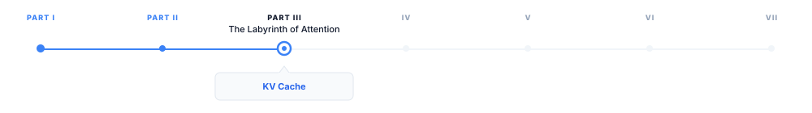
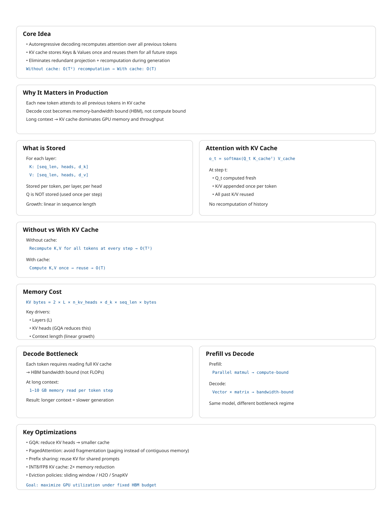

> **The canonical question for this chapter:**
> *Generating one token requires attending to every previous token. How do we
> avoid recomputing all of that work on every single generation step and what
> does managing that memory look like in a production system?*

---

::: {.callout-note appearance="minimal"}
**Where are we?**

{#fig-progress width="80%"}

The previous chapter showed how attention is computed in inference and
this chapter focuses on the engineering implications of that 
process when generation happens sequentially: at each step, 
the model must retain access to the keys and values from all 
previously generated tokens. While the KV cache makes this 
computationally practical, it becomes the primary memory management 
challenge in production scale LLM serving.
:::

---

## The problem that KV cache solves

Autoregressive generation is fundamentally sequential and generating 
each token requires attending to all previously generated tokens. 
To generate token `t`, the model must attend to all preceding tokens 
`0` through `t−1`, and generating each subsequent token expands the 
context by one, requiring the model to repeatedly process the entire 
accumulated sequence.


Without caching, generating a 500 token response to a 100 token prompt would
require:

```
Step 1:   process 101 tokens → generate token 101
Step 2:   process 102 tokens → generate token 102
...
Step 500: process 600 tokens → generate token 600
```

Total compute proportional to $101 + 102 + ... + 600 ≈ 175,000$ token 
processing steps. For large models, this process is highly 
inefficient: by step 500, most of the computation power is spent to 
reprocess tokens that were already handled at step 1, recomputing 
the same key and value vectors even though the underlying inputs have not 
changed.


The KV cache eliminates this redundancy by computing key and value 
vectors only once and stores them in memory. At each new generation 
step, the model computes the new token’s Q, K, and V vectors, 
retrieves the cached keys and values for all previous tokens, and 
performs attention over the full cached context.


With the KV cache:

```
Prefill:          process all 100 prompt tokens once, store their K and V
Each decode step: compute K, V for one new token, append to cache, attend
Total work:       proportional to 100 (prefill) + 500 (one step per token)
```

The savings grow with sequence length. Without the KV cache, practical LLM
deployment at today's context lengths would be economically infeasible.

---

## What is stored

For each token in the sequence, for each transformer layer, for each KV head,
the cache stores two vectors: the key and value produced by the linear
projections of that token's hidden state.

```
KV cache structure:

Layer 0:
  K: [seq_len, n_kv_heads, d_k]   ← key vectors for all tokens so far
  V: [seq_len, n_kv_heads, d_v]   ← value vectors for all tokens so far

Layer 1:
  K: [seq_len, n_kv_heads, d_k]
  V: [seq_len, n_kv_heads, d_v]

...

Layer L-1:
  K: [seq_len, n_kv_heads, d_k]
  V: [seq_len, n_kv_heads, d_v]
```

Query vectors are not cached because they are used only once: 
the query for token `t` is needed solely to compute attention at
generation step `t` and becomes irrelevant afterward. On the other hand, 
the key and value vectors for token `t` are reused at every subsequent 
step until generation ends. The KV cache exploit this asymmetry by 
storing persistent keys and values while recomputing only the transient 
query vectors.


---

## Attention with and without a KV cache

Consider a single attention head. After processing a sequence of length \(t\),

$$
K_t =
\begin{bmatrix}
k_1 \\
k_2 \\
\vdots \\
k_t
\end{bmatrix},
\quad
V_t =
\begin{bmatrix}
v_1 \\
v_2 \\
\vdots \\
v_t
\end{bmatrix}.
$$

To generate the next token, the model first computes the hidden state ($h_{t+1}$) and projects it to

$$
q_{t+1} = W_Q h_{t+1}, \quad
k_{t+1} = W_K h_{t+1}, \quad
v_{t+1} = W_V h_{t+1}.
$$

The attention output is

$$
o_{t+1} =
\text{softmax}\!\left(\frac{1}{\sqrt{d_k}} q_{t+1}
\begin{bmatrix}
K_t & k_{t+1}
\end{bmatrix}^T
\right)
\begin{bmatrix}
V_t & v_{t+1}
\end{bmatrix}.
$$


The important observation is that all previous keys and values already exist:

$$
K_t = [k_1, \dots, k_t], \quad V_t = [v_1, \dots, v_t].
$$

Only the final column $k_{t+1}, v_{t+1}$
must be computed and appended.

---

### Without caching

At step $t+1$, the model recomputes

$$
\{k_1, \dots, k_t, k_{t+1}\}, \quad \{v_1, \dots, v_t, v_{t+1}\}.
$$

The cost of the key/value projections is therefore $O(t+1)$.
Across an entire generation of length $T$,

$$
\sum_{t=1}^{T} O(t) = O(T^2).
$$

---

### With caching

The projections 

$$
k_i = W_K h_i, \quad v_i = W_V h_i
$$

are computed only once when token $i$ is created.
During generation of step $t+1$, the model only needs to compute the 
new projections $k_{t+1}, v_{t+1}$ which results in $O(1)$ projection cost per step.
Over a full sequence of length T, this accumulates to $\sum_{t=1}^{T} O(1) = O(T).$

The attention computation itself still grows linearly with context 
length, but the repeated projection cost has been eliminated.

---

## Memory arithmetic

KV cache memory is deterministic and computable from model hyperparameters and
sequence length:

```
KV cache bytes = 2 × L × n_kv_heads × d_k × seq_len × bytes_per_element
```

Where `2` is for K and V, `L` is the number of transformer layers, `n_kv_heads`
is the number of KV heads (equals `n_heads` for MHA, fewer for GQA), `d_k` is
the key/value dimension per head, and `bytes_per_element` is 2 for BF16.

### Examples

**LLaMA 2 7B** (L=32, n_kv_heads=32, d_k=128, BF16):

```
Per token: 2 × 32 × 32 × 128 × 2 = 524,288 bytes = 512 KB
4,096 tokens: 512 KB × 4,096 = 2 GB
```

**LLaMA 2 70B** (L=80, n_kv_heads=8, d_k=128, BF16):

```
Per token: 2 × 80 × 8 × 128 × 2 = 327,680 bytes = 320 KB
4,096 tokens:  320 KB × 4,096  = 1.28 GB
32,768 tokens: 320 KB × 32,768 = 10 GB
```

**GPT-3 175B** (L=96, n_kv_heads=96, d_k=128, BF16):

```
Per token: 2 × 96 × 96 × 128 × 2 = 4,718,592 bytes ≈ 4.5 MB
4,096 tokens: 4.5 MB × 4,096 = 18 GB
```

The GPT-3 numbers explain why GQA was adopted: reducing `n_kv_heads` from 96
to 8 reduces the per-token cache from 4.5 MB to 375 KB (12 times reduction)
with modest quality loss. GQA is now standard in nearly every new model
architecture for exactly this reason.

### The memory budget

A serving instance has a fixed GPU memory budget, divided between competing
claims:

```
Total GPU memory (e.g., 80 GB H100)
├── Model weights     (fixed, e.g., ~35 GB for LLaMA 2 70B in BF16 with GQA)
├── Activation memory (fixed per batch, ~1–3 GB)
├── KV cache          (variable that grow with sequence length and batch size)
└── Reserved          (CUDA overhead, fragmentation buffer, ~3 GB)

Available for KV cache: 80 - 35 - 2 - 3 ≈ 40 GB
```

For LLaMA 2 70B with 40 GB available:

```
Max tokens in cache: 40 GB / 320 KB ≈ 125,000 tokens

Batch size 32, avg sequence 4,096 tokens:
  32 × 4,096 = 131,072 tokens → barely fits

Batch size 32, avg sequence 8,192 tokens:
  32 × 8,192 = 262,144 tokens → does not fit
```

This is the core serving constraint: KV cache capacity limits concurrency at
long sequence lengths. Every additional token in context competes directly with
additional concurrent users for the same GPU memory.

---

## The lifecycle of a KV cache entry

Understanding the sequence of operations that touch the KV cache during a
single request makes the memory management problem concrete.

### Prefill

When a request arrives, the full prompt is tokenized and processed in a single
forward pass (the prefill phase). For each layer, K and V are computed for every
prompt token simultaneously and written to the KV cache:

```
Input:  [tok_0, tok_1, tok_2, ..., tok_n]  ← full prompt
Output: KV cache populated for positions 0 through n
        Model output: logits at position n → first generated token
```

Prefill is compute-bound and processing all prompt tokens in parallel is a large
batch matrix multiply that saturates GPU arithmetic throughput. It is the phase
where prompt length most directly affects latency: time to first token scales
with prompt length.

### Decode

Each decode step generates exactly one new token:

```
1. Embed new token → hidden state
2. Compute K, V for new token → append to KV cache
3. Compute Q for new token
4. Attend: Q against full KV cache (all positions 0 through current)
5. FFN and residual → logits → sample next token
```

Step 4 is memory-bandwidth-bound. The GPU reads the entire KV cache 
to compute attention for a single query vector. Arithmetic work is
trivial compared to the memory transfer. This is why decode throughput is limited
by HBM bandwidth, not by compute, and why longer sequences are slower per token.

### Request completion

When generation ends (stop token, max_tokens, stop sequence), the KV cache
entries for that request are freed. In a naive contiguous allocator this means
marking a region of memory as available. In PagedAttention it means returning
individual pages to the free pool.

---

## Naive allocation and its problems

The simplest KV cache allocation strategy: at request admission, allocate a
contiguous block of memory sized for the maximum possible output length. Hold
it until generation completes, then free it.

This produces two forms of waste:

**Internal fragmentation.** If the request was allocated 8,192 token positions
but only generated 200 tokens, the remaining 7,992 positions were reserved but
unused for the lifetime of the request. At 320 KB per token for LLaMA 2 70B,
that is 2.55 GB of unusable memory per such request.

**External fragmentation.** As requests arrive and complete with variable
lengths, the free memory becomes fragmented into non-contiguous gaps. A new
request requiring 1 GB may fail to be admitted even if 2 GB is technically free,
because no single contiguous 1 GB region is available.

On real workloads with variable request lengths, naive allocation wastes 60–80%
of available KV cache memory.

---

## PagedAttention

PagedAttention (Kwon et al., 2023) solves the fragmentation problem by borrowing
the virtual memory paging idea from operating systems.

Instead of allocating a contiguous block per request, PagedAttention divides
the KV cache into fixed-size pages which typically has 16 tokens per page. A page table
maps logical token positions to physical page locations. Pages are allocated
on demand as generation proceeds and freed immediately on completion.

```
Page table for three concurrent requests:

Request A (generating, 48 tokens so far):
  Logical positions 0–15  → Physical page 3
  Logical positions 16–31 → Physical page 7
  Logical positions 32–47 → Physical page 12

Request B (generating, 32 tokens so far):
  Logical positions 0–15  → Physical page 1
  Logical positions 16–31 → Physical page 9

Request C (generating, 64 tokens so far):
  Logical positions 0–15  → Physical page 2
  Logical positions 16–31 → Physical page 4
  Logical positions 32–47 → Physical page 5
  Logical positions 48–63 → Physical page 11

Free pages: [0, 6, 8, 10, 13, 14, 15, ...]
```

Physical pages are non-contiguous. Logical positions map to whatever physical
page is available. A new request needs four pages for a 64-token sequence; it
gets four pages from the free pool regardless of where they are in physical
memory.

Internal fragmentation is bounded to at most one partially filled page per
request (the current page being written). External fragmentation is eliminated
entirely and all free pages are usable regardless of their physical location.
PagedAttention achieves over 90% KV cache utilization on typical workloads,
compared to 20–40% for naive contiguous allocation.

### Prefix sharing

PagedAttention enables a further optimization: memory sharing between requests
with a common prefix.

If two requests share the same system prompt like a 1,000-token system prompt
that appears in every request to a production API, their KV cache pages for
that prefix are identical. There is no reason to store them twice.

With prefix sharing, the pages for the common prefix are marked as shared and
reference-counted. Multiple requests point to the same physical pages via their
page tables:

```
Request A page table:
  Positions 0–15   → Physical page 7  (shared system prompt, page 1)
  Positions 16–31  → Physical page 8  (shared system prompt, page 2)
  Positions 32–47  → Physical page 12 (private request A's user message)

Request B page table:
  Positions 0–15   → Physical page 7  (shared same physical pages)
  Positions 16–31  → Physical page 8
  Positions 48–63  → Physical page 15 (private request B's user message)
```

When both requests complete, the shared pages are not freed until all references
are released. This is copy-on-write semantics: pages are shared until a write
is required, at which point a private copy is made.

For a 1,000-token system prompt with 16 tokens per page: 63 pages of KV cache
are shared across all concurrent requests using that prompt. At 320 KB per token
for LLaMA 2 70B, this is 320 MB of KV cache that does not need to be
recomputed or stored per-request.

### Radix attention

Radix attention (SGLang, Zheng et al., 2023) generalizes prefix sharing to
arbitrary prefix trees rather than just common prefixes.

In applications with structured multi-step prompts system like agentic workflows, few-shot
templates, and multi-document retrieval, requests may share prefixes at multiple
points in their structure, not just at the beginning. Radix attention maintains
a trie (prefix tree) of all cached KV sequences. When a new request arrives,
the longest matching prefix in the trie is found and reused:

```
Prefix tree:
  [System prompt] → shared by all requests
    ├── [Document A] → shared by requests querying document A
    │   ├── [Query 1] → private to request 1
    │   └── [Query 2] → private to request 2
    └── [Document B] → shared by requests querying document B
        └── [Query 3] → private to request 3
```

This turns prefix sharing from a single-level optimization into a general
caching system for the KV cache. For agentic applications where many requests
share substantial common context, radix attention can dramatically reduce both
memory and compute.

---

## KV cache quantization

The KV cache can be stored in reduced precision to trade a small amount of
quality for significant memory savings.

**INT8 KV cache** stores key and value vectors as 8-bit integers rather than
16-bit floats. This provides a 2× memory reduction. Quality loss is typically
negligible for standard generation tasks K and V vectors have bounded ranges
as outputs of linear projections of layer-normalized hidden states, making them
well-suited to quantization.

**FP8 KV cache** uses 8-bit floating point rather than integer quantization.
H100 GPUs have native FP8 support. Better precision characteristics than INT8
for values with non-uniform distributions, with the same 2× memory reduction.

**INT4 KV cache** reduces to 4 bits for a 4× memory reduction. More quality
loss; requires careful calibration. Used in memory-constrained scenarios where
the alternative is rejecting requests.

The quality tradeoff for KV cache quantization is typically smaller than for
weight quantization for two reasons: quantization errors in the KV cache are
averaged across many attention heads (reducing their impact), and modern
calibration techniques can minimize the effect on attention score distributions.

INT8 KV cache quantization is now standard in production and is supported by
vLLM, TensorRT-LLM, and most major inference frameworks. The 2× memory savings
effectively doubles serving concurrency on fixed hardware.

---

## KV cache eviction

Some applications require sequences longer than the KV cache can hold. Rather
than rejecting these requests, The serving system can evict cached entries to 
make room for new ones, at the cost of a quality trade-off.


### Eviction policies

**Sliding window** evicts the oldest tokens, keeping only the most recent `w`
token positions in cache. Simple to implement. Degrades quality for any task
requiring long-range context, the model simply cannot attend to evicted
positions.

**H2O (Heavy-Hitter Oracle)** evicts tokens with the lowest cumulative attention
scores. Tokens that have received little attention weight in recent steps are
unlikely to be needed in future steps. Empirically preserves quality better
than sliding window eviction at the same cache budget.

**Attention sink preservation** always keeps the BOS (beginning of sequence)
token regardless of other eviction decisions. The
BOS token functions as an attention sink and many heads route excess attention
weight to it when no other token is highly relevant. Evicting the BOS token
causes attention distributions to become erratic and output quality to degrade
unpredictably. Any eviction policy should treat the BOS token as eviction-exempt.

**SnapKV** identifies important KV vectors per head using attention patterns from
a recent observation window, then evicts the remaining positions. Can maintain
quality at 10–20% of the full KV cache size for long documents make it useful for
very long context workloads where even INT8 quantization is insufficient.


---


## Key takeaways

- The KV cache stores key and value vectors for all previous tokens, avoiding
  quadratic recomputation cost; query vectors are not cached because they are
  used exactly once per step
- KV cache memory is precisely computable: `2 × L × n_kv_heads × d_k × seq_len
  × bytes_per_element`; GQA's reduction in KV heads is the primary architectural
  lever for reducing this cost
- Naive contiguous allocation wastes 60–80% of KV cache memory through internal
  and external fragmentation; PagedAttention eliminates both by allocating
  fixed-size pages on demand, achieving 90%+ utilization
- Prefix sharing lets multiple requests reference the same physical KV cache
  pages for a shared prompt prefix — identical K/V vectors computed once, stored
  once; radix attention generalizes this to arbitrary shared structure
- INT8 KV cache quantization provides a 2× memory reduction with negligible
  quality loss, effectively doubling serving concurrency on fixed hardware
- Eviction policies (sliding window, H2O, SnapKV) enable sequences longer than
  the cache capacity; attention sink preservation is mandatory — evicting the
  BOS token causes unpredictable quality degradation
- StreamingLLM enables unbounded generation on a fixed cache budget by combining
  BOS token preservation with a sliding recent window
- CPU offloading moves inactive request caches to DRAM, freeing GPU HBM for
  active requests at the cost of PCIe transfer latency on resumption
- KV cache metrics — utilization, prefix hit rate, eviction rate, throughput vs.
  sequence length — are the primary production signals for diagnosing memory
  pressure and serving efficiency

{#fig-progress width="90%"}

---

## Further reading

- Kwon et al. (2023). *Efficient Memory Management for Large Language Model
  Serving with PagedAttention.* — the foundational work on paged KV cache management.
- Zheng et al. (2023). *SGLang: Efficient Execution of Structured Language Model
  Programs.* — Introduces radix attention for generalized prefix tree sharing.
- Xiao et al. (2023). *Efficient Streaming Language Models with Attention Sinks.*
  — StreamingLLM and the attention sink phenomenon; directly relevant to eviction
  strategy design.
- Zhang et al. (2023). *H2O: Heavy-Hitter Oracle for Efficient Generative
  Inference of Large Language Models.* — Attention-score-based eviction.
- 

---
