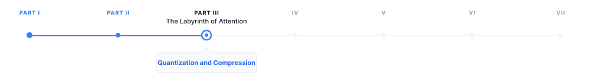
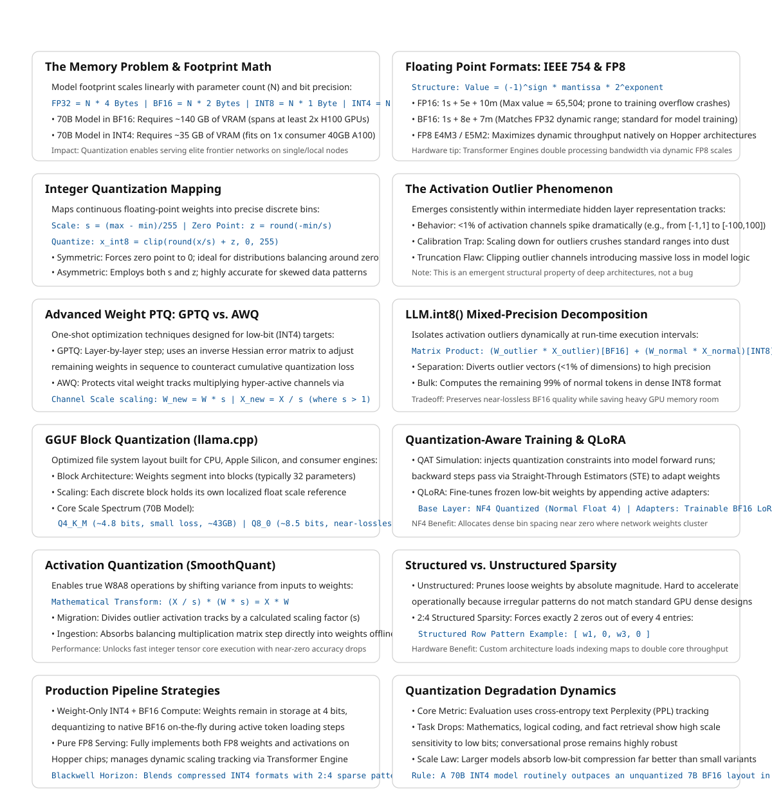

# Quantization and Model Compression

> **The canonical question for this chapter:**
> *A 70B parameter model in full precision requires 140 GB of GPU memory and
> costs a fortune to serve. How do you make it smaller, faster, and cheaper
> without making it useless?*

---

::: {.callout-note appearance="minimal"}
**Where are we?**

{#fig-progress width="80%"}

This chapter covers the numerical representation of the model itself: 
how reducing the precision of weights and activations affects memory, 
speed, and quality, and which techniques have become standard in production. 
Quantization is not an afterthought for most deployments, it is the difference 
between a model that fits and one that does not.
:::

---

## The memory problem

A language model's parameters are floating-point numbers. The precision of
those numbers (how many bits are used to represent each one) determines
how much memory the model occupies.

For a model with `N` parameters:

```
FP32 (4 bytes per parameter):   N × 4 bytes
BF16 (2 bytes per parameter):   N × 2 bytes
INT8 (1 byte per parameter):    N × 1 byte
INT4 (0.5 bytes per parameter): N × 0.5 bytes
```

For a 70B parameter model:

```
FP32:  70B × 4  = 280 GB   -> requires 4× H100s just for weights
BF16:  70B × 2  = 140 GB   -> requires 2× H100s
INT8:  70B × 1  =  70 GB   -> fits on 1× H100 with room for KV cache
INT4:  70B × 0.5 =  35 GB  -> fits on 1× H100 with substantial headroom
```

The difference between BF16 and INT8 is not just cost it is also whether a
model can be served on a single GPU at all. INT4 opens models to consumer
hardware: a 70B model at INT4 fits on a single 40 GB A100 or on two consumer
RTX 4090s. This is the practical motivation for quantization and everything 
else follows from it.

---

## Floating point formats

Understanding quantization requires understanding the number formats involved.

### IEEE 754 floating point

Standard floating point represents numbers as:

```
value = (-1)^sign × mantissa × 2^exponent

FP32 (float):  1 sign bit + 8 exponent bits + 23 mantissa bits = 32 bits
               Range: ±3.4 × 10^38, precision: ~7 decimal digits

FP16 (half):   1 sign bit + 5 exponent bits + 10 mantissa bits = 16 bits
               Range: ±65,504, precision: ~3 decimal digits

BF16:          1 sign bit + 8 exponent bits + 7 mantissa bits  = 16 bits
               Range: same as FP32, precision: ~2 decimal digits
```

The key difference between FP16 and BF16: BF16 keeps FP32's exponent range
(8 bits) but reduces the mantissa. This matters for training, large language
models encounter large gradient values that overflow FP16's limited range
(max ≈ 65,504) but fit comfortably in BF16's range. BF16 became the standard
training format for large models after FP16 was found to cause instability in
very deep networks.

### FP8

FP8 is a family of 8-bit floating point formats introduced with the H100 GPU:

```
E4M3: 1 sign + 4 exponent + 3 mantissa bits -> more precision, less range
E5M2: 1 sign + 5 exponent + 2 mantissa bits -> more range, less precision
```

The H100's Transformer Engine supports FP8 matrix multiplications natively,
roughly doubling throughput compared to BF16 on the same hardware. FP8 is
now the recommended training and inference format for frontier models on
H100-class hardware.

---

## Integer quantization

Integer formats represent numbers in a fundamentally different way, as scaled
integers rather than floating point values.

### The quantization mapping

To quantize a floating point value to INT8:

```
1. Find the range of values to quantize: [x_min, x_max]
2. Compute scale: s = (x_max - x_min) / 255
3. Compute zero point: z = round(-x_min / s)
4. Quantize: x_int8 = clip(round(x / s) + z, 0, 255)
5. Dequantize: x_approx = s × (x_int8 - z)
```

The round-trip introduces quantization error: `x_approx ≈ x`, not `x_approx = x`.
The magnitude of this error depends on the precision of the scale factor and
the distribution of values being quantized.

For INT8, values are mapped to the range [0, 255] (unsigned) or [-128, 127]
(signed). For INT4, the range is [0, 15] or [-8, 7]. The smaller the integer
range, the coarser the quantization, and the larger the potential error.

### Symmetric vs. asymmetric quantization

**Symmetric** quantization uses a single scale factor with zero point at 0:
```
x_int = round(x / s)
```
Simple and fast. Works well when the distribution is symmetric around zero.

**Asymmetric** quantization uses both scale and zero point, as shown above.
More accurate for asymmetric distributions (e.g., activations after ReLU,
which are always non-negative).


---

## The outlier problem

LLM quantization is harder than quantizing small networks for edge deployment.
The reason: outlier values.

LLM activations (the values produced by the model's hidden layers, not the
weights) contain a small fraction of channels with values that are orders of
magnitude larger than typical. In a layer where most activation values are in
the range [-1, 1], a few channels may have values in the range [-100, 100].

If you set the quantization scale based on these outlier channels, all the
normal-range values are compressed into a tiny fraction of the integer range,
losing most of their precision. If you clip the outlier channels, you
introduce large errors for those specific values.

This outlier phenomenon is a consistent property of large language models,
it appears in GPT-3, LLaMA, and their successors. It is not a training bug
but a structural feature of how the models represent information.

The major INT8 and INT4 quantization schemes are largely distinguished by
how they handle outliers.

---

## Post-training quantization methods

Post-training quantization (PTQ) quantizes a trained model without additional
training. It uses a small calibration dataset to measure activation statistics
and find optimal scale factors.

### LLM.int8()

Dettmers et al. (2022) introduced a mixed-precision decomposition specifically
for LLM outliers:

1. Identify the small fraction of "outlier" feature dimensions (typically
   less than 1% of channels, but containing most of the activation magnitude)
2. Extract those channels and compute them in full BF16 precision
3. Quantize all remaining channels to INT8 and compute in INT8
4. Sum the two partial results

```
W × X = W_outlier × X_outlier  (BF16)
      + W_normal  × X_normal    (INT8)
```

This preserves accuracy in the outlier channels while achieving INT8 efficiency
for the remaining 99%+ of computation. The memory savings are slightly less
than pure INT8 (due to the BF16 outlier channels), but the quality preservation
is close to BF16.

LLM.int8() enabled serving 175B+ parameter models on a single GPU for the
first time. It is integrated into HuggingFace Transformers as `load_in_8bit=True`.

### GPTQ

Frantar et al. (2022) introduced GPTQ, a one-shot weight quantization method
for INT4 quantization:

1. Process the weight matrix layer by layer
2. For each column (output neuron), quantize the weights to INT4
3. Compute the quantization error for this column
4. Propagate the error to unquantized columns using the inverse Hessian of
   the weight matrix, updating them to compensate for the quantized column's
   error
5. Repeat for each column in sequence

The Hessian-based error compensation is the key innovation. Instead of
quantizing each weight independently, GPTQ adjusts remaining weights to
compensate for already-quantized weights, minimizing cumulative error.

GPTQ typically achieves INT4 quantization with perplexity degradation of
less than 0.5 on standard benchmarks for models above 30B parameters. Below
30B, degradation is more noticeable. Larger models quantize more gracefully,
a well-known empirical observation without a fully satisfying theoretical
explanation.

GPTQ requires a calibration dataset (typically 128–512 samples from the
training data) and takes several hours to run for large models. The result
is stored as INT4 weights with FP16/BF16 scale factors.

### AWQ

Lin et al. (2023) introduced AWQ (Activation-aware Weight Quantization) with
a different approach to the outlier problem: instead of handling outlier
activations differently at inference time, AWQ identifies the weight channels
that correspond to the most important activations and protects them during
quantization.

The insight: not all weights are equally important. Weights that multiply
high-activation channels contribute more to the output than weights that
multiply low-activation channels. Quantizing the important weights with less
error and the unimportant weights with more error is better than treating
all weights equally.

AWQ achieves this through per-channel scaling: multiply important weight
channels by a scale factor > 1 before quantization (expanding their range
relative to the quantization step size, reducing quantization error) and
divide the corresponding activations by the same factor (maintaining the
mathematical equivalence of the operation):

```
W × X = (W × s) × (X / s)   for any scale s
```

If `s > 1` for the important channels, quantizing `W × s` to INT4 introduces
less error in the important channels than quantizing `W` directly. The
activation scaling by `1/s` is a free operation at inference time (absorbed
into the previous layer's output scaling).

AWQ is faster to apply than GPTQ (minutes rather than hours), does not require
Hessian computation, and achieves comparable or slightly better accuracy on
most benchmarks. It has become the preferred method for INT4 quantization in
many production pipelines.

---

## GGUF and llama.cpp quantization

GGUF (GPT-Generated Unified Format) is a model format developed by the
llama.cpp project, optimized for inference on consumer hardware, CPUs,
Apple Silicon, and consumer GPUs. It supports a range of quantization
schemes with different quality-size tradeoffs:

| Quantization | Bits per weight | Memory (70B) | Quality loss |
|---|---|---|---|
| Q2_K | ~2.6 | ~23 GB | Significant |
| Q3_K_M | ~3.4 | ~30 GB | Moderate |
| Q4_K_M | ~4.8 | ~43 GB | Small |
| Q5_K_M | ~5.7 | ~50 GB | Very small |
| Q6_K | ~6.6 | ~58 GB | Minimal |
| Q8_0 | ~8.5 | ~75 GB | Near-lossless |

The naming convention: Q4 = 4-bit quantization base, K = k-quants (a
more accurate block quantization scheme), M = medium size variant.

GGUF uses mixed-precision block quantization: weights are divided into blocks
(typically 32 values), each block is quantized with its own scale factor, and
additional "super-block" scale factors quantize the block scales themselves.
This reduces the overhead of storing per-block scale factors while maintaining
accuracy.

GGUF is the dominant format for local inference with Ollama, LM Studio, and
llama.cpp. It is not typically used in high-throughput serving (vLLM and
TensorRT-LLM use their own formats), but it is how most self-hosted models
run on consumer hardware.

---

## Quantization-aware training

Post-training quantization applies quantization after the fact, introducing
error that cannot be corrected. Quantization-aware training (QAT) incorporates
the quantization into the training process, allowing the model to adapt to
quantization during training.

### Simulated quantization

QAT uses simulated quantization: during the forward pass, weights and
activations are quantized to the target format; during the backward pass,
gradients flow through as if the quantization had not occurred (the straight-
through estimator). The model learns weight values that produce low loss
even after quantization.

```python
def quantize_forward(w, bits=8):
    # Quantize weights for forward pass
    scale = w.abs().max() / (2**(bits-1) - 1)
    w_int = torch.round(w / scale).clamp(-(2**(bits-1)), 2**(bits-1) - 1)
    w_quantized = w_int * scale  # Dequantize for computation
    # Straight-through: gradient passes through as if w_quantized = w
    return w + (w_quantized - w).detach()
```

The result: weights that, when quantized, produce minimal performance loss.
QAT typically achieves better quality than PTQ at the same bit width, at the
cost of requiring a full training run rather than a single post-processing
step.

### QLoRA

QLoRA (Dettmers et al., 2023) combines QAT with parameter-efficient fine-tuning:

1. Load the base model quantized to INT4 using NF4 (Normal Float 4, a
   4-bit floating point format designed for normally distributed weights)
2. Add trainable LoRA adapters in BF16
3. Fine-tune only the LoRA adapters, with the quantized base model frozen
4. Store gradients and optimizer states only for the adapter parameters

QLoRA enables fine-tuning a 70B model on a single 48 GB GPU, something that
would require multiple A100s with full-precision fine-tuning. It has become
the standard approach for fine-tuning large models on limited hardware.

### NF4: the normal float format

NF4 is a data type designed specifically for neural network weights. Unlike
INT4 which maps values uniformly, NF4 maps values so that each quantization
bin contains an equal fraction of weights from a normal distribution. Since
pretrained model weights follow approximately normal distributions, NF4
minimizes quantization error for typical weight distributions:

```
INT4 bins (uniform):    [-8, -7, -6, -5, -4, -3, -2, -1, 0, 1, 2, 3, 4, 5, 6, 7]
NF4 bins (non-uniform): denser near zero, sparser at extremes
                        matches normal distribution of pretrained weights
```

NF4 typically outperforms INT4 for weight quantization at 4-bit precision
because it allocates more precision where the weights actually are (clustered
near zero) rather than allocating precision uniformly across the possible range.

---

## Activation quantization

Weight quantization stores weights at reduced precision but typically performs
the actual matrix multiplications in BF16 or FP16 (dequantizing first).
Activation quantization goes further: both weights and activations are in
reduced precision during computation, allowing the use of integer or FP8
arithmetic units that are faster than BF16 arithmetic.

### SmoothQuant

Xiao et al. (2023) introduced SmoothQuant to address the outlier problem
for activation quantization. The key insight: quantization difficulty can be
migrated between activations and weights.

If activations have outlier channels (hard to quantize), and weights do not
(easy to quantize), we can:

1. Scale down the outlier activation channels by a factor `s_j`
2. Scale up the corresponding weight rows by the same factor `s_j`
3. The matrix product is unchanged: `(X / s) × (W × s) = X × W`
4. The scaled activations have a more uniform distribution which is easy to quantize
5. The scaled weights have larger values in specific rows and still quantizable

The scale factors are computed from activation statistics gathered on a
calibration dataset. The weight scaling is applied offline (absorbed into the
stored weights) and the activation scaling is applied as a single per-channel
multiply at inference time.

SmoothQuant enables W8A8 (8-bit weights and activations) quantization with
accuracy close to BF16, at roughly 1.5× the throughput of BF16 on hardware
with INT8 tensor cores.

### FP8 inference

FP8 (E4M3 and E5M2) is increasingly the preferred quantization format for
high-throughput serving on H100-class hardware. Unlike INT8, FP8 is a floating
point format with dynamic range, making it more robust to outliers without
the outlier-handling complexity of LLM.int8() or SmoothQuant.

The H100's Transformer Engine supports FP8 matrix multiplications with
automatic dynamic scaling: it monitors activation ranges during inference and
adjusts the FP8 scale factors to minimize quantization error in real time.
This makes FP8 practically zero-configuration compared to INT8 calibration.

FP8 inference on H100 achieves approximately 2× the throughput of BF16, with
quality typically within 0.5% of BF16 on standard benchmarks.

---

## Structured and unstructured sparsity

Quantization reduces the precision of each value. Sparsity takes a different
approach: set some values to exactly zero and skip their computation entirely.

### Unstructured sparsity

Prune individual weights based on magnitude or importance:

```
W = [0.23, -0.91, 0.04, 0.67, -0.02, 0.88, ...]
      keep   keep  zero  keep   zero   keep

50% sparse: approximately half the weights are zero
```

Unstructured sparsity requires sparse matrix arithmetic, computing only
the multiplications where the weight is non-zero. In theory, 50% sparsity
halves the computation. In practice, sparse arithmetic is harder to accelerate
on GPU than dense arithmetic, and the speedup is often much less than 50%.
Unstructured sparsity is difficult to exploit efficiently on current hardware.

### 2:4 structured sparsity (NVIDIA)

NVIDIA introduced 2:4 sparsity with the A100: in every group of 4 consecutive
weights, exactly 2 must be zero. The non-zero pattern must be this specific
structured form.

```
Dense: [w1, w2, w3, w4]
2:4:   [w1,  0, w3,  0]  or  [w1, w2,  0,  0]  or  [0, w2, w3,  0]  ...
```

This specific structure allows the hardware to represent the sparse matrix
compactly (store only the 2 non-zero values plus a 2-bit index indicating which
positions they occupy) and compute sparse matrix multiplications at roughly
2× the throughput of dense computation with nearly no quality loss.

Blackwell-generation GPUs (B100, B200) extend this to 2:4 sparsity combined
with FP4 quantization, potentially achieving 4× throughput compared to BF16
dense computation.

---

## Combining quantization techniques

Production deployments typically combine multiple techniques:

**Weight-only INT4 + BF16 compute** (most common for serving):
- Store weights as INT4 with per-group scales
- Dequantize to BF16 on-the-fly before matrix multiplication
- Compute in BF16 using tensor cores
- Memory savings: 4× over BF16; throughput gain: primarily from reduced memory
  bandwidth for weight loading

**FP8 weights + FP8 activations** (H100 production):
- Both weights and activations in FP8
- Compute using FP8 tensor cores (~2× throughput of BF16)
- Dynamic scaling via Transformer Engine
- Near-BF16 quality for most tasks

**INT4 weights + 2:4 sparsity** (Blackwell):
- Weights quantized to INT4 and pruned to 2:4 sparsity
- Compute using sparse FP4 tensor cores
- Potential 4-8× throughput improvement over dense BF16
- Quality impact requires careful calibration

**QLoRA for fine-tuning**:
- Base model in NF4
- Adapters in BF16
- Enables fine-tuning models 4× larger than would otherwise fit
- Merge adapters back to BF16 for serving, or serve with adapters

---

## Quality evaluation for quantized models

Quantization quality is measured on the same metrics as full-precision models,
but the comparison requires care.

**Perplexity** on a held-out dataset is the most reliable automatic metric
for quantization quality. A perplexity increase of less than 0.5 is typically
imperceptible in generated text while increases above 1.0 are noticeable.

**Downstream task benchmarks** (MMLU, HellaSwag, HumanEval) catch task-
specific degradation that perplexity may miss. Some tasks are more sensitive
to quantization than others, math and code tend to degrade before general
language.

**Outlier-sensitive tasks**: question answering tasks that require precise
recall of specific facts tend to be more sensitive to quantization than
open-ended generation. This is consistent with the outlier hypothesis, outlier
channels may be important for retrieving specific facts.

**Human evaluation**: for the final quality gate before production, human
preference evaluation (does this response feel worse?) is the most reliable
signal. Perplexity improvements from aggressive quantization do not always
translate to imperceptible quality in practice.

### The quantization degradation curve

Quantization quality degrades non-linearly with bit width and model size:

```
                     Quality (relative to BF16)
                     ▲
100% ──────────────────────────────────────── BF16
 99% ──────────────────────────────── FP8
 98% ──────────────────────────── INT8
 96% ───────────────────────── INT4 (large models, e.g., 70B)
 90% ────────────────── INT4 (medium models, e.g., 13B)
 80% ──────── INT4 (small models, e.g., 7B)
 60% ─── INT3 (typically unacceptable)
      ──────────────────────────────────────→ bit width
```

Large models are more robust to quantization than small models. A 70B model
at INT4 often outperforms a 7B model at BF16 while using similar memory.
This is the primary argument for quantizing large models rather than serving
small ones: you may get better quality at lower cost.

---

## Key takeaways

- Quantization reduces parameter precision from BF16 (2 bytes) to INT8 (1 byte)
  or INT4 (0.5 bytes), directly halving or quartering memory requirements —
  the difference between serving a 70B model on 2 GPUs vs. 1 GPU vs. a
  consumer card
- BF16 is the standard training format (matches FP32 range, handles gradient
  magnitudes that overflow FP16); FP8 on H100 is the emerging standard for
  inference (2× throughput with near-BF16 quality)
- The outlier problem — a small fraction of activation channels with very large
  values — is the core challenge of LLM quantization; LLM.int8(), AWQ, and
  SmoothQuant all address it differently
- GPTQ uses Hessian-based error compensation to minimize quantization error
  layer by layer; AWQ uses activation-aware weight scaling; both achieve near-
  lossless INT4 quantization for large models
- GGUF/llama.cpp quantization enables local inference on consumer hardware;
  Q4_K_M is the practical default for local deployment
- QLoRA combines INT4 base model quantization with BF16 LoRA adapters, enabling
  fine-tuning of 70B models on a single GPU — the standard approach for
  practitioners without datacenter hardware
- Larger models quantize more gracefully than smaller ones; a quantized 70B
  often outperforms a full-precision 13B while using similar memory
- 2:4 structured sparsity enables ~2× throughput on A100/H100 without quality
  loss; combined with FP4 on Blackwell GPUs, this is the next frontier of
  inference efficiency

{#fig-progress width="90%"}

---

## Further reading

- Dettmers et al. (2022). *LLM.int8(): 8-bit Matrix Multiplication for
  Transformers at Scale.* — The foundational paper on LLM quantization;
  identified the outlier problem and introduced mixed-precision decomposition.
- Frantar et al. (2022). *GPTQ: Accurate Post-Training Quantization for
  Generative Pre-trained Transformers.* — Hessian-based INT4 quantization;
  the first practical 4-bit quantization for models above 30B parameters.
- Lin et al. (2023). *AWQ: Activation-aware Weight Quantization for LLM
  Compression and Acceleration.* — Faster and often more accurate than GPTQ;
  now the preferred INT4 method in many production systems.
- Xiao et al. (2023). *SmoothQuant: Accurate and Efficient Post-Training
  Quantization for Large Language Models.* — Migrating quantization difficulty
  from activations to weights for W8A8 quantization.
- Dettmers et al. (2023). *QLoRA: Efficient Finetuning of Quantized LLMs.*
  — NF4 quantization combined with LoRA for fine-tuning on consumer hardware;
  introduced the NF4 data type and double quantization.
- Mishra et al. (2021). *Accelerating Sparse Deep Neural Networks.* — NVIDIA's
  2:4 structured sparsity and the hardware support for it in A100 and later.
- NVIDIA (2024). *FP8 Formats for Deep Learning.* — Technical specification
  of E4M3 and E5M2 formats and the H100 Transformer Engine's dynamic scaling.

---
