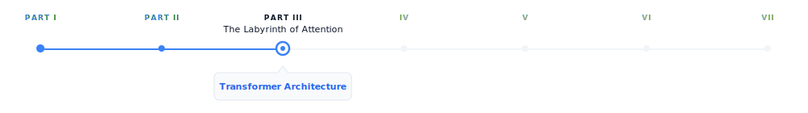
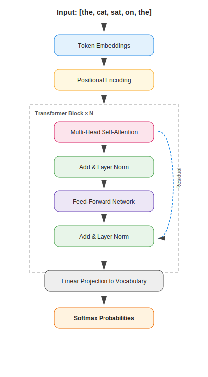

# Transformer Architecture

> **The canonical question for this chapter:**
> *Given a sequence of token embeddings, how does the transformer convert them
> into a prediction about what comes next and why is this architecture the one
> that won?*

---

 {#fig-progress width="100%"}

The prompt has been tokenized, the tokens have been converted to embedding
vectors, and the request has arrived at the inference server. Now the model
begins to think. This chapter covers the architecture that does the thinking
(what it is, why it is built this way, and what each component actually does.)


---

## Why the transformer won

Before 2017, sequence modeling was dominated by recurrent neural networks (
LSTMs and GRUs). These architectures processed text one token at a time, left to
right, maintaining a hidden state that carried information forward through the whole
sequence. They worked, but they had two fundamental problems.

The first was the bottleneck problem, all the information about the entire input had
to be compressed into a single fixed-size hidden state vector before being used
to generate output. For the long sequences, early information was inevitably lost
or distorted and the model had to decide what to remember and what to forget at
every step.

The second was parallelization. Because each step depended on the previous
step's hidden state, RNNs could not be parallelized across the sequence
dimension. While the model GPU hardware are heavily tuned for parallelisim 
training these models were fundamentally bottlenecked by sequential computation.

The transformer, introduced in Vaswani et al. (2017), eliminated both problems
with a single architectural decision: replace recurrence with attention. Every 
token attends directly to every other token in a single step, resulting in 
neither sequential dependency nor an information bottleneck, and the training 
can be fully parallelized across the sequence.


This is not a minor optimization but a different computational paradigm that
happens to be perfectly matched to the hardware of the last decade.

---

## The intuition before the math

Before working through the mechanics, it helps to have a mental model of what
the transformer is doing at a high level.

Think of each token as a person sitting in a room with everyone else who has
ever appeared in the same sequence. At each layer, every person can ask a
question of every other person, receive weighted answers based on relevance, and
update their understanding accordingly. After many rounds of this, each person's
understanding has been shaped by the entire room.

The questions are learned queries, the relevance weighting is attention, the 
updating occurs in the residual stream, and the many rounds correspond to the layers.


---

## The high-level forward pass

A transformer language model takes a sequence of token IDs as input and produces
a probability distribution over the vocabulary as output in other word a prediction of what
token comes next.

{width="30%"}

Each component serves a specific function. In the following sections we work through
them in order.

---

## Token embeddings and positional encoding

### Token embeddings

The first operation maps integer token IDs to continuous vectors using 
an embedding table, which is a matrix with shape `[vocab_size, d_model]` and
Each row is a learned vector for that token. Looking up token ID 42 retrieves 
row 42 of the embedding table.

For GPT-3, `d_model = 12,288` and the vocabulary has roughly 50,000 tokens.
The embedding table therefore has about 600 million parameters which is  a significant
fraction of the total model. These embeddings are learned end-to-end during
training; the model discovers what representation of each token is most useful
for predicting the next one.

The embedding table is shared with the output layer. The same matrix used to
look up input embeddings is used (transposed) to project the final hidden state
back to vocabulary space. This weight tying reduces parameters and improves
performance by enforcing geometric consistency between how tokens are represented
and how they are predicted. 

### Positional encoding

Attention, as we will see, is permutation-invariant which means if you shuffle the tokens
in the input, attention produces the same output for each token regardless of
order. This is a problem: `"the cat sat"` and `"sat cat the"` would be processed
identically. Positional encodings inject order information into the representations by adding
a position-dependent signal to each token embedding.

### Sinusoidal encoding (the original transformer) 

It uses a deterministic functions:

```
PE(pos, 2i)   = sin(pos / 10000^(2i / d_model))
PE(pos, 2i+1) = cos(pos / 10000^(2i / d_model))
```

Different dimensions oscillate at different frequencies that produces a unique
fingerprint for each position. These encodings are fixed and generalizes to
sequence lengths not seen during training.

### Learned positional embeddings**  
they replace the formula with a
second learned matrix of shape `[max_sequence_length, d_model]`, each position
gets its own trained vector, updated by gradient descent.

### Rotary Positional Embeddings (RoPE)
They are widely used in modern transformer architectures such as LLaMA, PaLM, and many recent open-weight large language models. Unlike absolute positional encodings, which are added directly to token embeddings before the attention mechanism, RoPE injects positional information directly into the self-attention computation itself.

The core idea behind RoPE is to encode position by applying a rotation to the query and key vectors in each attention head. For each token position, the representation is split into pairs of dimensions, and each pair is rotated by an angle that depends on the token’s absolute position. This rotation is structured so that when computing the dot product between a query at position `m` and a key at position `n`, the result depends on the relative offset `(m - n)` rather than their absolute positions.

More formally, RoPE treats each pair of dimensions in a query or key vector as a 2D plane and applies a rotation matrix whose angle increases linearly with position. For a given position `p`, each 2D subspace is rotated by:

$$
\theta_p = p \cdot \omega_i
$$

where $\omega_i$ is a frequency term that depends on the embedding dimension index. This design closely relates to sinusoidal encodings, but differs fundamentally in that the positional information is applied as a transformation of the query and key vectors rather than an additive signal.

In practice, each pair of dimensions is rotated using sine and cosine functions:

$$
\begin{pmatrix}
x'_1 \\
x'_2
\end{pmatrix}
=
\begin{pmatrix}
\cos(\theta_p) & -\sin(\theta_p) \\
\sin(\theta_p) & \cos(\theta_p)
\end{pmatrix}
\begin{pmatrix}
x_1 \\
x_2
\end{pmatrix}
$$

This rotation preserves vector magnitude while changing orientation, embedding positional structure geometrically into the representation space.

A key consequence of this formulation is that the dot product between a query at position `m` and a key at position `n` naturally depends on the relative distance `(m - n)`. This emerges from trigonometric identities that cause the absolute positional components to cancel out during the inner product. As a result, RoPE encodes relative position information implicitly without explicitly computing pairwise distances.

This property provides several important benefits:

- Firstly, it captures relative position information directly, which is often more meaningful for language modeling than absolute position. Language understanding typically depends on relationships between tokens rather than their absolute locations in a sequence.

- Secondly, RoPE improves extrapolation to longer sequences. Because the rotation is a smooth, continuous function of position, it generalizes beyond the training context window more gracefully than learned absolute embeddings. However, performance can still degrade for very long contexts if not trained appropriately.

- Thirdly, RoPE introduces no additional learned parameters for positional encoding. The positional structure is fully deterministic, making it parameter-efficient and reducing the risk of overfitting positional patterns.

In multi-head attention, each head applies the same rotational mechanism but operates in different learned subspaces. This allows different heads to specialize in different positional behaviors. Some heads naturally focus on local dependencies, while others capture long-range relationships due to accumulated phase differences.


### ALiBi (Attention with Linear Biases)
It takes a very different approach to positional information. Instead of explicitly encoding positions into token representations, ALiBi modifies the attention mechanism itself by adding a fixed bias to attention scores based on the distance between tokens.

In ALiBi, the attention score between a query at position `m` and a key at position `n` is penalized linearly according to their distance `|m - n|`. This means that tokens that are farther apart receive a progressively stronger negative bias, encouraging the model to focus more on nearby context while still allowing access to long-range dependencies when needed.

A key advantage of ALiBi is that it requires no positional embeddings at all—neither learned nor fixed sinusoidal ones. Instead, positional information is entirely encoded through the attention bias structure. This simplicity makes ALiBi highly efficient and robust, particularly for long-context extrapolation. It has been used in models such as MPT and has shown strong performance in settings where generalization to longer sequences is important.

For a query at position m and a key at position n, the attention score is adjusted as:

$$
\text{score}(m,n) = q_m \cdot k_n - \alpha_h \cdot |m - n|
$$ 

Here:
- $q_m \cdot k_n$ is the standard dot-product attention score
- $∣m−n∣$ is the absolute distance between tokens
- $\alpha_h$ is a head-specific slope (each attention head gets a different decay rate)

One of the key design choices in ALiBi is that different attention heads use different slopes. Some heads have a steep penalty (they focus very locally), while others have a shallow penalty (they can attend further away). This creates a natural diversity of attention ranges without explicitly designing multiple mechanisms. The slopes are not learned, Instead, they are fixed using a deterministic scheme that assigns geometrically spaced values. With this method it avoids additional parameters and ensures predictable extrapolation behavior.

---

## Self-attention: the core mechanism

Self-attention is an operation that allows every token to gather information
from every other token in the sequence. It is the defining innovation of the
transformer.

### The intuition
Consider: `"The cat slept on the bed because it was dark."`

What does `"it"` refer to? For a human, it’s clear that `"it"` refers to the environment, not `"the cat"` or `"the bed"`. A model needs to make this connection to process the sentence correctly. Self-attention allows the token `"it"` to look at every other token, assign an attention weight to each one (higher weight to the context suggesting darkness, lower weight to unrelated tokens like `"bed"`), and blend their representations into its own. After attention, the representation of `"it"` carries information about the surrounding environment being dark.


### Queries, keys, and values

Self-attention uses three learned linear projections of each token's embedding:
Query (Q), Key (K), and Value (V).

For a sequence of `n` tokens with embedding dimension `d_model`:

$$
Q = X W_Q \qquad shape: [n, d_k]
$$
$$
K = X W_K \qquad shape: [n, d_k]
$$
$$
V = X W_V \qquad shape: [n, d_v]
$$

Where `X` is the matrix of token embeddings and $W_Q$, $W_K$, $W_V$ are learned weight matrices.

The attention scores are computed as:


$$
\text{Attention}(Q, K, V)
= \text{softmax}\!\left(\frac{QK^{T}}{\sqrt{d_k}}\right)V
$$

Breaking this down:

1. $QK^T$ is dot product between every query and every key. The shape `[n, n]` and an entry `[i, j]` measures how much token `i` should attend to token `j`.

2. $\sqrt{d_k}$ scales the dot products by the square root of the key dimension. Without this, dot products in high dimensions become very large and pushes the softmax into regions with near-zero gradients and destabilizing training.

3. $softmax()$ converts scores to probabilities. Each row sums to 1.
   This is the attention weight matrix.

4. $× V$ is the weighted sum of value vectors. Each token's output is a blend of all
   value vectors, weighted by how much it attends to each position.

The result is a new representation for each token that has been informed by the
entire sequence. The attention chapter REFF goes deeper into the
computational mechanics and what attention heads actually compute.

### The causal mask

For language model training, the model must not attend to future tokens. When
predicting the token at position `i`, only positions `0` through `i-1` should
be visible, otherwise the model is simply reading the answer.

This is enforced by a causal mask: before softmax, a large negative value
(effectively `-∞`) is added to attention scores where `j > i`. After softmax,
these positions have attention weight 0.

```
Tokens:
Position:   0     1     2     3
           the   cat   sat    on

Causal Attention Matrix (upper triangle masked)

                 Key tokens →
              the   cat   sat    on
Query ↓
the           1.0   0.0   0.0   0.0
cat           0.3   0.7   0.0   0.0
sat           0.1   0.5   0.4   0.0
on            0.2   0.1   0.3   0.4
```

Each token attends to itself and all previous tokens and it will never see the future tokens.
This masking enables a decoder-only Transformer to function as an autoregressive language model. It allows the model to be trained on the full sequence in a single forward pass, while ensuring that each position can attend only to preceding tokens.

---

#### Bidirectional attention (encoder models)

Used in encoder-only models such as BERT, RoBERTa, and most embedding models.

Here, **no causal mask is applied**:

- each token can attend to all other tokens
- both left and right context are visible

This enables richer representations because every token is contextualized by the full sequence.

However, it breaks autoregressive generation:

> if a model can see future tokens, it cannot learn to predict them

Instead, encoder models are trained with masking objectives (e.g., masked language modeling), where some tokens are hidden and must be reconstructed.

---

#### Prefix masking (prefix-LM / partial bidirectionality)

A hybrid scheme used in some long-context and instruction models.

The sequence is split into two parts:

- **prefix (context)**: fully visible to itself and often to the entire sequence  
- **generation region (suffix)**: causal masking applies


This allows:

- bidirectional understanding of the prompt/context
- autoregressive generation for outputs

It is particularly useful for:
- long document conditioning
- retrieval-augmented generation
- structured prompt formats

---

#### Encoder–decoder (cross-attention masking)

Used in models like T5 and BART.

- Encoder self-attention → bidirectional (no causal mask)

- Decoder self-attention → causal mask (like GPT)

- Cross-attention → Decoder attends to encoder outputs:

  - decoder queries
  - encoder keys/values

This creates a structured information flow:

```
1. ENCODER BLOCKS
   - self-attention (bidirectional)
   - builds "memory of input"

        ↓

2. DECODER BLOCKS
   a) self-attention (causal)
      - looks at what has been generated so far

   b) cross-attention
      - looks at encoder memory
      - aligns output with input meaning
```

This design is ideal for transformation tasks (translation, summarization) because the model separates understanding (encoder) and generation (decoder).


---

## Multi-head attention

A single attention operation gives each token one way of relating to every other
token nevertheless tokens simultaneously relate to each other in multiple ways.

In `"John gave Mary the book"`, `John` relates to `gave` syntactically (as
subject), to `Mary` semantically (as giver to recipient), and to `the book` as
the transferred object. A single attention head cannot capture all of these
simultaneously and it results in production of a single weighted blend over the sequence.

Multi-head attention runs multiple attention operations in parallel, each with
its own learned Q, K, V projections. With this format each head can specialize in a different
type of relationship. Finally, the outputs of all heads are concatenated and projected through a learned output
matrix $W_O$ back to $d_{model}$ dimensions.

For GPT-3: `d_model = 12,288`, `h = 96` heads, `d_k = 128` per head. The 96
heads run in parallel, each attending to the sequence from a different perspective.

---

## The feed-forward network

After the attention sublayer, each token passes through a position-wise
feed-forward network (FFN) independently:

$$
FFN(x) = GeLU(x W_1 + b_1) W_2 + b_2
$$

The intermediate dimension is typically 4× the model dimension: for
`d_model = 1,024`, the FFN expands to 4,096 dimensions, applies the activation,
then projects back to 1,024.

Crucially, the FFN operates on each token independently and identically.
The attention layer mixes information across tokens; the FFN processes each
token in isolation. Together they form a complementary pair: attention gathers the
context and FFN processes it.


---

## Residual connections and layer normalization

### Residual connections

```
x = x + Attention(LayerNorm(x))
x = x + FFN(LayerNorm(x))
```

The output of each sublayer is added back to its input which gives the gradients a
direct path backward through the network, enabling training of very deep models.
Without residual connections, training a 96-layer network is extremely difficult
due to gradients vanishing or exploding before reaching the earlier layers.

Residual connections make the default behavior of each sublayer simply pass its input through unchanged. As a result, sublayers only need to learn small refinements on top of the identity function, which is a much easier optimization problem than learning the full transformation from scratch.


### Layer normalization

Layer normalization is used to stabilize the activations of a transformer by normalizing each token’s representation across its feature dimensions. Unlike normalization methods that have been used in convolutional networks, it operates independently on each token rather than across the batch or sequence.

Formally, for a hidden state vector $x \in \mathbb{R}^{d}$:

$$
\mathrm{LayerNorm}(x) = \frac{x - \mathrm{mean}(x)}{\sqrt{\mathrm{var}(x) + \varepsilon}} \cdot \gamma + \beta
$$

where:
- `mean(x)` and `var(x)` are computed over the feature dimension
- $\varepsilon$ is a small constant for numerical stability
- $\gamma$ and $\beta$ are learned scale and shift parameters and allow the model to restore or reshape the normalized representation if needed.

This normalization keeps activations in a controlled range, which prevents instability as signals propagate through many stacked layers. Without it, deep transformers become difficult to train due to exploding or vanishing activations in the residual stream.

---

#### Why not Batch Normalization?

Batch Normalization is rarely used in transformer language models for a fundamental reason: it depends on batch-level statistics.

In BatchNorm, normalization is computed across examples in a minibatch. This creates several problems for language modeling:

- **Inference mismatch**: at inference time, batch sizes are often 1 (especially in autoregressive decoding), making batch statistics unreliable or unavailable
- **Sequence variability**: token sequences have variable lengths, making batch-wise statistics inconsistent across steps
- **Autoregressive constraint**: generation happens one token at a time, so there is no meaningful “batch” context during decoding

Because of these issues, BatchNorm introduces instability and is incompatible with the sequential nature of language model inference. LayerNorm avoids this entirely by normalizing within each token independently.

---

#### Pre-LN vs Post-LN

The original transformer used **Post-LN**, where normalization is applied after the residual connection:

```
x = x + Sublayer(x)
x = LayerNorm(x)
```

Modern large language models instead use **Pre-LN**, where normalization happens before the sublayer:

```
x = x + Sublayer(LayerNorm(x))
```

Pre-LN is now the standard architecture because it significantly improves optimization stability in deep networks. While it can sometimes slightly reduce raw performance compared to Post-LN in certain setups, it provides much more reliable training at scale. It ensures that each sublayer receives well-conditioned inputs while maintaining a clean gradient flow through the residual stream. This stability benefit becomes increasingly important as models grow to hundreds of layers, where training dynamics would become difficult to control.

---

#### RMSNorm (modern simplification)

Some recent architectures replace LayerNorm with **RMSNorm (Root Mean Square Normalization)**, used in models such as LLaMA.

RMSNorm simplifies LayerNorm by removing the mean-centering step:

$$
\mathrm{RMSNorm}(x) = \frac{x}{\sqrt{\mathrm{mean}(x^2) + \varepsilon}} \times \gamma
$$


Key differences:
- no subtraction of the mean
- normalization is based only on vector magnitude
- slightly cheaper computationally
- empirically comparable or better performance in large-scale models

Despite its simplicity, RMSNorm preserves the key property needed for deep transformers: controlling the scale of activations in the residual stream.

---


## Stacking transformer blocks

A single transformer block gives the model one round of attention and one round
of FFN computation while modern LLMs stack many of them:

| Model | Layers | d_model | Heads | Parameters |
|---|---|---|---|---|
| GPT-2 Small | 12 | 768 | 12 | 117M |
| GPT-2 XL | 48 | 1,600 | 25 | 1.5B |
| GPT-3 | 96 | 12,288 | 96 | 175B |
| LLaMA 2 70B | 80 | 8,192 | 64 | 70B |
| LLaMA 3 405B | 126 | 16,384 | 128 | 405B |

Each layer refines the representation produced by the previous layer. Early layers
tend to encode syntactic features while middle layers encode semantic relationships and final layers encode task-specific features relevant to prediction. This hierarchy

---

## Architecture variants

The standard transformer has been modified in various ways by recent models.

### Grouped Query Attention (GQA)

Standard multi-head attention uses separate Q, K, and V projections for each head. In contrast, Multi-Query Attention (MQA) shares a single set of K and V projections across all heads, while keeping separate Q projections per head.
Grouped Query Attention (GQA) works in a middle ground: K and V are shared across groups of heads, while each head (or each group of heads) retains its own Q projections.

LLaMA 2 70B, LLaMA 3, and Mistral use GQA. The motivation is inference
efficiency: KV cache memory (chapter REFF) scales with the number of K, V heads and
fewer KV heads is equal to smaller cache, resulting in longer sequences and larger
batches at the same memory budget.

### Sliding window attention

Used by Mistral 7B. Instead of attending to all previous tokens, each token
attends only to a local window of the most recent `w` tokens. For long sequences
this reduces attention complexity from $O(n^2)$ to $O(n·w)$. Information from beyond
the window propagates through the layered structure of the network and multiple
layers of local attention can capture long-range dependencies indirectly.

### Activation functions (ReLU → Tanh → Sigmoid → GELU → Swish → GLU → SwiGLU)

The feed-forward network (FFN) in transformers is where most of the non-linear feature transformation happens and over time, activation functions have evolved from simple thresholding operations to smooth functions and finally to gated multiplicative mechanisms.

---

#### ReLU (Rectified Linear Unit)

$$
\text{ReLU}(x) = \max(0, x)
$$

ReLU is the simplest activation function, zeroing out all negative values while leaving positive values unchanged, which makes it computationally efficient and encourages sparse activations. However, this abrupt cutoff at zero can discard useful information, making it a useful starting point but not ideal for training deep transformer models.

#### Sigmoid

$$
\sigma(x) = \frac{1}{1 + e^{-x}}
$$

The sigmoid function was one of the earliest nonlinearities used in neural networks, mapping inputs into the range ((0, 1)) in a smooth and differentiable way that can be interpreted as a probability or gating mechanism; intuitively, it acts like a soft switch that controls how much of a signal passes through, from fully blocked at 0 to fully allowed at 1.

#### Tanh (Hyperbolic Tangent)

$$
\text{tanh}(x) = \frac{e^x - e^{-x}}{e^x + e^{-x}}
$$

Tanh was widely used in early neural networks and recurrent models before transformers, producing outputs in the range ([-1, 1]) with a smooth, zero-centered, symmetric shape that preserves both positive and negative signals; unlike ReLU, it does not discard negative information but instead compresses inputs into a bounded range, allowing both excitatory and inhibitory effects to be represented.

#### Why sigmoid and tanh are rarely used in transformers

Both sigmoid and tanh share a key limitation in that they saturate for large absolute values of (x), causing gradients to vanish in those regions and making optimization difficult in deep architectures such as transformers. Despite this, sigmoid remains important in practice, especially in gating mechanisms like GLU and LSTM-style components, as well as in attention-related soft selection functions where smooth probabilistic control is useful.

---

#### GELU (Gaussian Error Linear Unit)

$$
\text{GELU}(x) = x \cdot \Phi(x)
$$

GELU replaces hard thresholding with a smooth probabilistic gating function.

**Intuition:**
Instead of “drop or keep”, it asks:
> “how likely is this feature to be useful?”

This smoothness improves optimization stability and is used in BERT and early GPT-style models.

---

#### Swish

Swish is a simpler, learned-smooth alternative to GELU:

$$
\text{Swish}(x) = x \cdot \sigma(x)
$$

where \( \sigma(x) \) is the sigmoid function.

Swish is a smooth, fully differentiable activation similar in spirit to GELU, but simpler in form and notable for being non-monotonic, meaning it can both slightly suppress or enhance features depending on the input value. Intuitively, rather than using hard gating like ReLU or probabilistic gating like GELU, Swish applies a self-gated mechanism where each feature determines how much of itself to pass forward, which is why it often matches or slightly improves GELU’s performance while remaining conceptually simpler.


---

#### GLU (Gated Linear Unit)

instead of simply modifying the activation function, GLU introduces explicit gating between two learned projections, where the input is split into a content stream and a gate stream:
$$
\text{GLU}(x) = (x W_a) \odot \sigma(x W_b)
$$
This design separates “what to pass” from “how much to pass,” enabling multiplicative feature control that is substantially more expressive than standard pointwise activations.


---

#### SwiGLU (Swish-Gated Linear Unit)

Modern LLMs (LLaMA, PaLM, Mistral) use SwiGLU, which replaces the sigmoid gate with Swish:

$$
\text{FFN}(x) = ( \text{Swish}(x W_1) \odot (x W_2) ) W_3
$$

SwiGLU combines the smooth, self-gated nonlinearity of Swish with the multiplicative two-stream structure of GLU, so rather than simply applying a nonlinearity to a feature, it learns how two projected feature streams interact through multiplicative gating. This shift from pointwise transformation to learned feature interaction makes it significantly more expressive than standard activation functions.

#### Visual intuition: from tanh to GELU-like behavior

A useful way to build intuition for modern activation functions is to see how they evolve from simple bounded nonlinearities into smooth, ReLU-like gating mechanisms that combine stability with adaptive feature control.


{width="100%"}

#### Visual intuition: from sigmoid to Swish-like behavior

A useful way to build intuition for modern activation functions is to see how they evolve from simple probabilistic gating functions into smooth, self-modulated nonlinearities. Sigmoid starts as a soft on–off switch, squeezing inputs into ((0,1)), while Swish generalizes this idea by letting the input itself be modulated by a smooth gate, producing a function that behaves like a continuous, input-dependent scaling mechanism rather than a fixed probabilistic filter.

{width="70%"}


### Mixture of Experts (MoE)
Mixture of Experts (MoE) is used by Mixtral, reportedly GPT-4, it is a sparse Transformer architecture that increases model capacity without proportional increase in computation. It replaces the standard Feed-Forward Network (FFN) with multiple parallel FFNs (experts) and uses a learned routing mechanism to activate only a small subset per token.

Formulation

Given a set of experts $\text{FFN}_1, \dots, \text{FFN}_N$, a gating function computes routing scores:

$$
g(x) = \text{softmax}(W_r x)
$$

MoE enables sparse computation, where only a fraction of parameters are active per token. This allows model capacity to scale significantly while keeping per-token compute similar to dense models. For example, a model with 8 experts of 7B parameters (~47B total) may activate only 1–2 experts per token, resulting in compute comparable to a much smaller dense model.


---

## The output layer

After the final transformer block, the hidden state at the last token position
is projected back to vocabulary size:

$$
\text{logits} = h_{\text{final}} W_{\text{embed}}^{\top} \quad \text{shape: } [\text{vocab\_size}]
$$

This produces one unnormalized score per vocabulary token. Softmax converts
logits to probabilities:

$$
P(\text{token}_i) = \frac{\exp(\text{logits}_i)}{\sum_j \exp(\text{logits}_j)}
$$

The training objective (cross-entropy loss) maximizes the probability assigned
to the actual next tokenand that is the only thing the model is explicitly trained
to do. Chapter REFF covers training objectives in detail.

---


## What the model actually learns

The transformer is trained to predict the next token. That is all. There is no
explicit objective to learn grammar, facts, reasoning, or common sense, yet models
trained at scale acquire all of these.

Why? Because predicting the next token well requires understanding everything that
determines what comes next. Next-token prediction is a seems to be a simple objective that implicitly rewards
a comprehensive world model. In order to predict `"Paris"` after `"The capital of France
is"`, the model must have encoded the fact that Paris is the capital of France or to 
predict grammatically correct continuations, it must have internalized
syntactic rules.


---

## Key takeaways

- The transformer replaced recurrence with attention, enabling full parallelism
  during training and direct token-to-token interaction at any distance
- Token embeddings map integer IDs to continuous vectors; positional encodings
  inject order information; RoPE encodes relative
  rather than absolute position
- Self-attention allows every token to gather information from every other token
  via query-key dot products, scaled and softmaxed into attention weights over
  value vectors
- The causal mask enforces that tokens cannot attend to future positions, enabling
  autoregressive training on the full sequence in a single forward pass
- Multi-head attention runs multiple attention operations in parallel, each
  specializing in a different type of relationship.
- The feed-forward network processes each token independently after attention,
  acting as associative memory for facts learned during training
- Residual connections and layer normalization stabilize training of very deep
  networks; Pre-LN and RMSNorm are the current standard
- Modern variants (RoPE, GQA, SwiGLU, MoE) improve efficiency and performance
  without changing the fundamental architecture
- The next-token prediction objective implicitly rewards a comprehensive world
  model because everything that makes text predictable (grammar, facts, reasoning) 
  improves prediction quality


{#fig-progress width="90%"}

---

## Further reading

- Vaswani et al. (2017). *Attention Is All You Need.*: The original transformer
  paper. 
- Alammar, J. (2018). *The Illustrated Transformer.*: The clearest visual
  explanation of the architecture available. Essential companion to this chapter.

---

*← Previous: [06 — Embeddings and meaning representation](../part1-prompt-layer/06-embeddings-and-meaning.md)*  
*Next: [08 — Attention computation →](08-attention-computation.md)*
