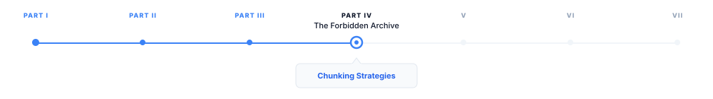
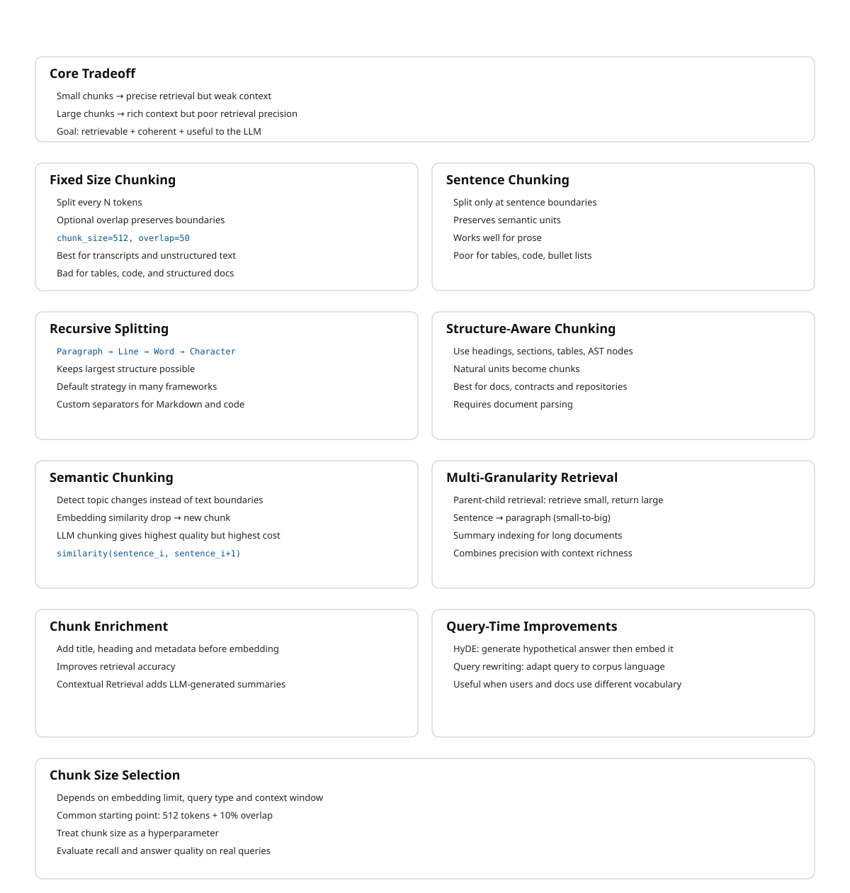

> **The canonical question for this chapter:**
> *A document might be 50,000 words while an embedding model can process 512 tokens.
> A retrieved context window might be limited to 5,000. How do you divide the document
> into pieces that are retrievable, coherent, and useful to the language model?*

---

::: {.callout-note appearance="minimal"}
**Where are we?**

{#fig-progress width="80%"}

Document ingestion produced clean text. Now that text must be divided into
retrievable chunks which is the most consequential preprocessing
decision in a RAG system. Poor chunking produces retrieval failures that no
downstream component can fix.
:::

---

## Why chunking exists and why it is hard

Embedding models have a maximum input length which is typically 512 to 8,192 tokens.
Embedding an entire document as a single vector loses granularity: a 10,000-word
technical manual embedded as one vector will match queries about any topic
covered in the manual, making retrieval imprecise. You want the chunk about
authentication to be retrieved for authentication questions and the chunk about
rate limiting to be retrieved for rate limiting questions, not the entire manual
for both.

At the same time, chunks must be semantically coherent. A chunk that cuts
mid-sentence, mid-argument, or mid-table is harder for the language model to
use correctly. The model receives a fragment without the context that makes it
interpretable.

The fundamental tension: small chunks are precise for retrieval but too small
to be self-contained. Large chunks are self-contained but imprecise for
retrieval. The right chunk size is a function of the document type, the query
distribution, the embedding model, and the language model's context window.

Getting chunking wrong is one of the most common RAG failure modes. A retrieval
system with perfect relevance ranking that retrieves incoherent chunks will
produce worse answers than a system with imperfect ranking that retrieves
coherent chunks. The language model cannot compensate for fragmented context.

---

## Fixed-size chunking

The simplest strategy: split the document into chunks of a fixed number of
tokens, with an optional overlap between adjacent chunks.

```python
def fixed_size_chunk(text: str, chunk_size: int, overlap: int) -> list[str]:
    tokens = tokenize(text)
    chunks = []

    start = 0
    while start < len(tokens):
        end = min(start + chunk_size, len(tokens))
        chunk_tokens = tokens[start:end]
        chunks.append(detokenize(chunk_tokens))
        start += chunk_size - overlap

    return chunks
```

For `chunk_size=512` and `overlap=50`: chunk 1 covers tokens 0–511, chunk 2
covers tokens 462–973, chunk 3 covers tokens 924–1435. Each chunk overlaps
with its neighbors by 50 tokens.

### Why overlap exists

Without overlap, a sentence that straddles a chunk boundary is split: the first
half is at the end of one chunk, the second half at the start of the next.
Neither chunk contains the complete sentence, and a query that matches the
complete sentence may not match either fragment.

Overlap ensures that every point in the document appears in at least one
complete chunk. For overlap of `k` tokens, any contiguous span of
`chunk_size - k` tokens or fewer is guaranteed to appear entirely within
at least one chunk.

The cost of overlap: the same content is embedded and stored multiple times,
increasing storage and compute cost. An overlap of 10% (50 tokens on a 512-
token chunk) increases storage by approximately 10% which is a small price for
significantly better boundary coverage.

### When fixed-size chunking is appropriate

Fixed-size chunking is fast, simple, and predictable. It works reasonably well
for homogeneous documents without meaningful structure (transcripts, continuous
prose), corpora where you cannot rely on structural markers (inconsistent
heading styles, poorly formatted PDFs), and prototyping.

It is inappropriate for documents with meaningful structure (technical
documentation, legal contracts) where semantic boundaries do not align with
token count boundaries, for tables and code which should not be split
arbitrarily, and for documents where context continuity is critical.

### Token-based vs. character-based splitting

Splitting on token count is more precise than splitting on character count
because token count directly maps to embedding model input length. Character-
based splitting produces chunks of unpredictable token length, a chunk of
2,000 characters might be 400 tokens for English prose or 700 tokens for
code with many short tokens.

---

## Sentence-based chunking

Instead of splitting at fixed token counts, split at sentence boundaries.
This preserves semantic units and avoids splitting mid-sentence.

```python
import spacy

nlp = spacy.load("en_core_web_sm")

def sentence_chunk(text: str,
                   max_tokens: int,
                   overlap_sentences: int) -> list[str]:
    doc = nlp(text)
    sentences = [sent.text.strip() for sent in doc.sents]

    chunks = []
    current_chunk = []
    current_length = 0

    for sentence in sentences:
        sentence_tokens = len(tokenize(sentence))

        if current_length + sentence_tokens > max_tokens and current_chunk:
            chunks.append(" ".join(current_chunk))
            current_chunk = current_chunk[-overlap_sentences:]
            current_length = sum(len(tokenize(s)) for s in current_chunk)

        current_chunk.append(sentence)
        current_length += sentence_tokens

    if current_chunk:
        chunks.append(" ".join(current_chunk))

    return chunks
```

Sentence detection requires a sentence boundary detector, spaCy, NLTK's
Punkt tokenizer, or regex-based heuristics for simple cases. Sentence detectors
are imperfect: abbreviations ("Dr.", "U.S."), decimal points, and ellipses
can confuse them.

Sentence-based chunking works well for dense prose where individual sentences
carry complete thoughts. It works poorly for bullet points and numbered lists
(items may not be complete sentences), tables (rows are not sentences), code
(statements are not sentences in the linguistic sense), and very long sentences
that exceed the chunk size on their own.

---

## Recursive character text splitting

LangChain's `RecursiveCharacterTextSplitter` is the most widely used chunking
implementation in production RAG systems. It splits on a hierarchy of
separators, trying each in order until chunks are within the size limit:

```
Separator hierarchy (default):
  1. "\n\n"   (paragraph break)
  2. "\n"     (line break)
  3. " "      (word boundary)
  4. ""       (character)
```

The algorithm tries to split on `"\n\n"`. If all resulting pieces are within
the size limit, done. If some pieces are still too large, it recursively
splits those on `"\n"`. If still too large, on `" "`. If still too large, on
individual characters.

This preserves the largest meaningful structure possible within the size limit.
For a well-formatted document, most chunks will be split at paragraph
boundaries. The character-level fallback is rarely triggered for natural text.

Custom separator hierarchies for specific document types:

```python
# For Markdown documents
markdown_separators = [
    "\n# ",    # H1 heading
    "\n## ",   # H2 heading
    "\n### ",  # H3 heading
    "\n#### ", # H4 heading
    "\n\n",    # Paragraph
    "\n",      # Line break
    " ",       # Word
]

# For code
code_separators = [
    "\nclass ",    # Class definition
    "\ndef ",      # Function definition
    "\n\n",        # Blank line
    "\n",          # Line
    " ",           # Token
]
```

The key insight: splitting at paragraph boundaries is almost always better
than splitting at arbitrary token counts, and the recursive approach tries for
paragraph boundaries first.

---

## Structure-aware chunking

For documents with explicit structure, the best chunking strategy uses that
structure directly rather than approximating it with text splitting.

### Heading-based chunking

For documents with hierarchical headings (HTML, Markdown, DOCX with proper
heading styles), chunk at heading boundaries. Each chunk is one section: from
a heading to the next heading at the same or higher level.

```python
def heading_chunk(document: ParsedDocument) -> list[Chunk]:
    chunks = []
    current_section = []
    current_heading = None
    current_level = 0

    for element in document.elements:
        if element.type == "heading":
            if current_section:
                chunks.append(Chunk(
                    text="\n".join(current_section),
                    heading=current_heading,
                    heading_level=current_level,
                    metadata=document.metadata
                ))
            current_section = [element.text]
            current_heading = element.text
            current_level = element.level
        else:
            current_section.append(element.text)

    if current_section:
        chunks.append(Chunk(
            text="\n".join(current_section),
            heading=current_heading,
            heading_level=current_level,
            metadata=document.metadata
        ))

    return chunks
```

This produces chunks that correspond to meaningful sections rather than
arbitrary text blocks. The heading becomes part of the chunk metadata,
enabling heading-based filtering and citation.

The limitation: sections vary enormously in length. A one-paragraph section
produces a tiny chunk; a multi-page section produces a huge one. Post-processing
applies fixed-size splitting to chunks that exceed the embedding model's
context limit while keeping chunks below the limit intact.

### Hierarchical chunking

Documents with nested structure (chapters contain sections contain subsections)
can be chunked at multiple levels simultaneously:

```
Chapter level:    "Chapter 4: Authentication"
  Section level:  "4.1 API Keys"
  Section level:  "4.2 OAuth 2.0"
    Subsection:   "4.2.1 Authorization Code Flow"
    Subsection:   "4.2.2 Client Credentials Flow"
  Section level:  "4.3 JWT Tokens"
```

A query about "authentication" might retrieve the chapter-level chunk. A query
about "OAuth authorization code flow" retrieves the specific subsection. Both
are indexed; retrieval chooses the appropriate level. Hierarchical chunking
requires a retrieval system that can handle multi-granularity documents,
typically by indexing all levels and using metadata to filter or re-rank
by granularity.

### Table handling

Tables should almost never be split across chunks. A partial table (some
rows at the end of one chunk, remaining rows at the start of the next) is
nearly useless to the language model. Two strategies:

**Keep tables whole.** Treat each table as an atomic chunk regardless of size.
If the table exceeds the embedding model's limit, summarize it or split into
row groups that include the header row in each group.

**Serialize by row group.** Convert the table to serialized text and chunk by
row groups, including the header in each chunk:

```python
def serialize_table_chunk(table: Table, rows_per_chunk: int) -> list[str]:
    header = "| " + " | ".join(table.headers) + " |"
    separator = "| " + " | ".join(["---"] * len(table.headers)) + " |"

    chunks = []
    for i in range(0, len(table.rows), rows_per_chunk):
        row_group = table.rows[i:i + rows_per_chunk]
        rows_text = "\n".join(
            "| " + " | ".join(str(cell) for cell in row) + " |"
            for row in row_group
        )
        chunks.append(f"{header}\n{separator}\n{rows_text}")

    return chunks
```

### Code chunking

Code has its own natural units: functions, classes, modules. Chunking at these
boundaries is almost always preferable to fixed-size splitting.

For Python, the AST provides exact function and class boundaries:

```python
import ast

def chunk_python_file(source_code: str) -> list[Chunk]:
    tree = ast.parse(source_code)
    chunks = []

    for node in ast.walk(tree):
        if isinstance(node, (ast.FunctionDef, ast.AsyncFunctionDef, ast.ClassDef)):
            start_line = node.lineno - 1
            end_line = node.end_lineno
            chunk_text = "\n".join(source_code.split("\n")[start_line:end_line])

            chunks.append(Chunk(
                text=chunk_text,
                metadata={
                    "type": type(node).__name__,
                    "name": node.name,
                    "start_line": node.lineno,
                    "end_line": node.end_lineno,
                }
            ))

    return chunks
```


---

## Semantic chunking

Rather than splitting on structural or syntactic boundaries, semantic chunking
splits where the meaning changes. Adjacent sentences discussing the same topic
are grouped together; a split is introduced when the topic shifts.

### Embedding-based semantic chunking

Embed each sentence independently, then compute the cosine similarity between 
adjacent sentence embeddings. A significant drop in similarity indicates a topic 
shift and marks the boundary for a new chunk.

```python
import numpy as np
from sklearn.metrics.pairwise import cosine_similarity

def semantic_chunk(sentences: list[str],
                   embedding_model,
                   percentile: float = 95) -> list[str]:

    embeddings = embedding_model.encode(sentences)

    similarities = [
        cosine_similarity([embeddings[i]], [embeddings[i+1]])[0][0]
        for i in range(len(embeddings) - 1)
    ]

    # Adaptive threshold: split where similarity is in the bottom percentile
    breakpoint_threshold = np.percentile(similarities, 100 - percentile)
    breakpoints = [
        i for i, sim in enumerate(similarities)
        if sim < breakpoint_threshold
    ]

    chunks = []
    start = 0
    for bp in breakpoints:
        chunks.append(" ".join(sentences[start:bp+1]))
        start = bp + 1
    chunks.append(" ".join(sentences[start:]))

    return chunks
```

### Advantages and costs of semantic chunking

Semantic chunking produces chunks that are more topically coherent than fixed-
size or structure-based chunking. Queries match chunks about the same topic
as the query, not just chunks that happen to contain the query terms at an
arbitrary text position.

The cost is significant: every sentence must be embedded individually during
chunking. For a document with 1,000 sentences and an embedding model that
takes 10ms per sentence, that is 10 seconds per document. At corpus scale
(millions of documents), this is a substantial offline cost that is usually
justified for high-value corpora where retrieval quality is critical.

### LLM-based semantic chunking

A more sophisticated approach: use a language model to identify thematic
boundaries directly.

```python
def llm_chunk(document: str, llm) -> list[str]:
    prompt = f"""Identify the major thematic sections in the following document.
Return a JSON list of character indices where each new section begins.

Document:
{document}

Return only the JSON array of character indices."""

    response = llm.complete(prompt)
    section_starts = json.loads(response)

    chunks = []
    for i, start in enumerate(section_starts):
        end = section_starts[i+1] if i+1 < len(section_starts) else len(document)
        chunks.append(document[start:end])

    return chunks
```

LLM-based chunking is expensive (one model call per document) and slow but
produces the highest-quality semantic boundaries. It is practical for high-
value documents (contracts, research papers, technical specifications) where
chunking quality directly affects critical business outcomes.

---

## Chunk enrichment

Raw chunks often lack context that was available in the document but is not
present in the chunk itself. Chunk enrichment adds this context before
embedding, making the resulting embeddings more informative.

### Prepending metadata

Include the document title, section heading, and other metadata in the chunk
text before embedding:

```python
def enrich_chunk(chunk: Chunk) -> str:
    parts = []

    if chunk.metadata.get("document_title"):
        parts.append(f"Document: {chunk.metadata['document_title']}")

    if chunk.metadata.get("section_heading"):
        parts.append(f"Section: {chunk.metadata['section_heading']}")

    if chunk.metadata.get("source_date"):
        parts.append(f"Date: {chunk.metadata['source_date']}")

    parts.append(chunk.text)

    return "\n".join(parts)
```

This changes what the embedding represents: instead of just the chunk text,
the embedding represents the chunk in the context of its document and section.
Queries about "authentication" will now match chunks in authentication sections
more reliably, because the section heading "Authentication" is part of the
embedded text.

### Contextual retrieval

Anthropic's contextual retrieval technique uses a language model to generate 
a brief context description for each chunk, prepended before embedding:

```python
def add_chunk_context(document: str, chunk: str, llm) -> str:
    prompt = f"""Given the following document:
<document>
{document}
</document>

And this chunk from the document:
<chunk>
{chunk}
</chunk>

Provide a brief (2–3 sentence) description of what this chunk is about and
how it relates to the broader document. This will be prepended to the chunk
to improve retrieval."""

    context = llm.complete(prompt)
    return f"{context}\n\n{chunk}"
```

The result: instead of embedding "The token expires after 3600 seconds by
default," you embed "This chunk describes the default expiration time for
authentication tokens in the API. It is from the Authentication section of
the API reference guide. The token expires after 3600 seconds by default."

The enriched embedding retrieves more accurately for queries about token
expiration, authentication configuration, or API defaults. The cost: one LLM
call per chunk during ingestion. Batch the calls, use a smaller model for
context generation, and cache results so that re-chunking does not require
regenerating contexts.

### Hypothetical document embeddings (HyDE)

A related technique applied at query time rather than ingestion time: instead
of embedding the raw query, use a language model to generate a hypothetical
document that would answer the query, then embed that hypothetical document
for retrieval.

The intuition: a query ("what is the default token expiration time?") and a
document chunk ("The token expires after 3600 seconds by default") may be
phrased very differently and have dissimilar embeddings. A hypothetical answer
("The default token expiration time is 3600 seconds, configurable via the
token_ttl parameter") is phrased similarly to the actual document content and
embeds more similarly.

```python
def hyde_retrieve(query: str, llm, retriever) -> list[Chunk]:
    hypothetical_doc = llm.complete(
        f"Write a brief passage that answers this question:\n{query}"
    )
    return retriever.retrieve(hypothetical_doc, top_k=5)
```

HyDE consistently improves retrieval quality for factual queries where the
query phrasing differs significantly from the document phrasing. It adds one
LLM call per query which is acceptable for most production systems where answer
quality is the priority.

### Query rewriting

A related technique operates at query time rather than ingestion time: rewrite
the user's query so that it more closely matches the language, terminology, and
writing style of the underlying document corpus before retrieval.

The motivation is the same as HyDE: retrieval systems operate in embedding
space, and semantically identical concepts may be expressed very differently by
users and documents. A user might ask:

> "How long does a login session last?"

while the documentation states:

> "Authentication tokens expire after 3600 seconds."

Although these refer to the same concept, the phrasing differs substantially.
A query rewriting model transforms the user query into language that more
closely resembles the corpus:

> "What is the default expiration time for authentication tokens?"

The rewritten query is then embedded and used for retrieval.

```python
def rewrite_retrieve(query: str, llm, retriever) -> list[Chunk]:
    rewritten_query = llm.complete(
        f"""Rewrite the following search query so that it matches the
terminology and writing style of technical documentation while preserving
its original meaning.

Query: {query}

Return only the rewritten query."""
    )

    return retriever.retrieve(rewritten_query, top_k=5)
```

Query rewriting differs from HyDE in an important way. HyDE generates a
hypothetical answer document and embeds that document for retrieval. Query
rewriting preserves the query format but adapts its vocabulary and style to
better align with the corpus.

This approach is particularly effective for domain-specific corpora where users
and documents use different terminology, such as medical records, legal
documents, internal company jargon, and technical documentation.


---

## Chunk size selection

There is no universal optimal chunk size. The right value depends on the
embedding model's context window (chunks cannot exceed the maximum input
length), the query type (short factual queries match short precise chunks;
long analytical queries match longer contextual chunks), the document type
(technical documentation with short precise sections warrants smaller chunks;
legal contracts with long interconnected clauses warrant larger ones), and the
retrieval top-k and context window (if you retrieve top-5 chunks into a 128k
context window, chunks can be large; if the context window is 4k tokens, keep
chunks under 1,000 tokens each).

### Empirical chunk size selection

The right approach: treat chunk size as a hyperparameter and evaluate
empirically.

1. Build a small evaluation set: 50–100 questions with known answers from
   your document corpus
2. Ingest the corpus with multiple chunk sizes (256, 512, 1024, 2048 tokens)
3. For each chunk size, measure retrieval recall (does the answer appear in
   the top-k retrieved chunks?) and answer quality (does the LLM produce a
   correct answer?)
4. Select the chunk size that maximizes answer quality on the evaluation set

This takes time but produces chunk sizes calibrated to your specific documents
and queries rather than arbitrary defaults. The defaults in most frameworks
(512 tokens, 10% overlap) are reasonable starting points, not optimal values.

---

## Multi-granularity retrieval

A single chunk size is a compromise. A better approach: index documents at
multiple granularities and retrieve from the most appropriate level.

### Parent-child chunking

Index small chunks for precise retrieval, but retrieve and pass larger parent
chunks to the language model for context:

```
Document
  └── Parent chunk (1,000 tokens): "Section 4.2: OAuth 2.0"
        ├── Child chunk (200 tokens): "Authorization Code Flow"
        ├── Child chunk (200 tokens): "Client Credentials Flow"
        └── Child chunk (200 tokens): "Token Refresh"
```

Retrieval operates on child chunk embeddings (precise matching). When a child
chunk is retrieved, the system returns its parent chunk (rich context). The
language model receives the full parent chunk, not the narrow child chunk.

This combines the retrieval precision of small chunks with the contextual
richness of large chunks which is the best of both without the tradeoff.

### Small-to-big retrieval

Similar to parent-child, but the relationship is sentence-to-paragraph: embed
sentences for retrieval, return the surrounding paragraph to the language model.

```python
def small_to_big_retrieve(query: str, retriever, document_store) -> list[str]:
    sentence_chunks = retriever.retrieve(query, top_k=10)

    paragraphs = set()
    for chunk in sentence_chunks:
        paragraph_id = chunk.metadata["paragraph_id"]
        paragraphs.add(document_store.get_paragraph(paragraph_id))

    return list(paragraphs)
```

### Summary indexing

For very long documents, index a summary of each section alongside the sections
themselves. Broad queries ("what is this document about?") match the summary.
Specific queries ("what is the default timeout?") match the section chunks.
The summary provides a navigational layer above the detailed content.

---


## Key takeaways

- Chunking is the most consequential preprocessing decision in a RAG system;
  incoherent chunks cannot be compensated for by better retrieval or a better
  language model
- Fixed-size chunking with overlap is simple and works reasonably well for
  homogeneous prose; 10% overlap costs 10% more storage and dramatically
  reduces boundary failures
- Recursive character splitting preserves the largest meaningful structure
  (paragraphs, then lines, then words) within the size limit — better than
  pure fixed-size splitting for most documents
- Structure-aware chunking at heading boundaries produces the most semantically
  coherent chunks for well-formatted documents; tables and code should always
  be treated as atomic units with splitting only at row or function boundaries
- Semantic chunking (embedding-based similarity breakpoints) produces the most
  topically coherent chunks at the cost of significant offline compute — worth
  it for high-value corpora, expensive at scale
- Chunk enrichment — prepending metadata, section headings, or LLM-generated
  context descriptions — improves retrieval by making embeddings more informative
  about the chunk's place in the document; contextual retrieval is high-impact
  when quality justifies the extra LLM calls
- HyDE improves retrieval at query time by embedding a hypothetical answer
  rather than the raw query, bridging the vocabulary gap between queries and
  documents
- Parent-child chunking combines retrieval precision (embed small child chunks)
  with contextual richness (return large parent chunks to the language model)
- Treat chunk size as a hyperparameter: build an evaluation set of 50–100
  representative questions and select chunk size empirically rather than
  using arbitrary defaults

{#fig-progress width="90%"}

---

## Further reading

- Anthropic (2024). *Introducing Contextual Retrieval.* — The contextual chunk
  enrichment technique; one of the highest-impact chunking improvements
  available with documented retrieval quality gains.
- Gao et al. (2023). *Precise Zero-Shot Dense Retrieval without Relevance
  Labels.* — The HyDE paper; generating hypothetical documents for retrieval.
- Liu et al. (2023). *Lost in the Middle: How Language Models Use Long
  Contexts.* — Establishes that chunk position within the context window
  affects how well LLMs use retrieved content; relevant for context assembly
  decisions.
- LangChain Documentation. *Text Splitters.* — Comprehensive reference for
  RecursiveCharacterTextSplitter and other splitters with configuration
  examples.
- LlamaIndex Documentation. *Node Parsers / Text Splitters.* — Alternative
  implementation reference with hierarchical chunking and parent-child
  strategies.

---