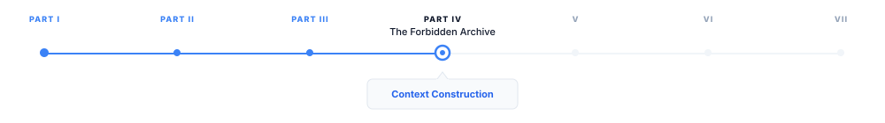
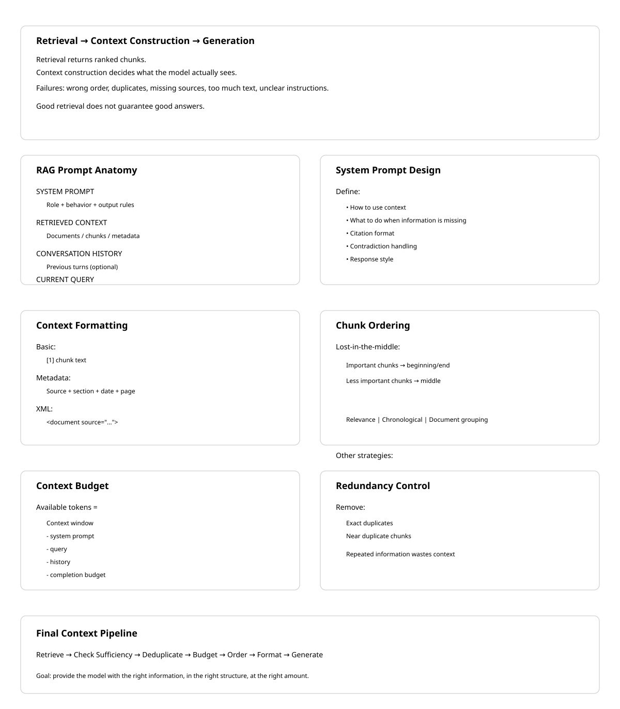

# Context Construction

> **The canonical question for this chapter:**
> *You have retrieved and reranked your chunks. Before generating a single token 
> of the response, how do you assemble those chunks into a prompt that ensures 
> the language model uses them correctly?*

---

::: {.callout-note appearance="minimal"}
**Where are we?**

{#fig-progress width="80%"}

Reranking narrowed the candidates to the ones worth showing the model. This
chapter covers the last engineering step before generation: turning a ranked
list of chunks into an actual prompt. Every decision here (formatting, order,
budget, framing) shapes what the model can reason about and what it will
believe, even though none of it involves the model itself.
:::

---

## The gap between retrieval and generation

Retrieval produces a ranked list of relevant chunks while generation requires a
single, coherent prompt. The space between these two (context construction) 
is where many RAG systems silently fail.

A system can have excellent retrieval (Recall@10 above 0.95) and an excellent
language model, and still produce poor answers because the context was
assembled carelessly. The model receives information in a confusing order,
with duplicate content, missing attribution, insufficient instruction about
what to do, or more text than it can effectively use.

Context construction is not just formatting it is also the engineering of what
the language model actually sees which determines what it can reason about,
what it will believe, and what kind of response it will produce. The content 
being assembled was not written by a human with a sense of narrative flow, it 
was retrieved mechanically and must be made coherent programmatically.

This chapter covers every decision in context construction: what to include,
in what order, how much, with what framing, and how to verify that the model
is actually using what you provide.

---

## Anatomy of a RAG prompt

A complete RAG prompt has multiple components, each serving a specific purpose:

```
┌─────────────────────────────────────────────────────────┐
│ SYSTEM PROMPT                                            │
│ Role definition, behavior instructions, output format    │
├─────────────────────────────────────────────────────────┤
│ RETRIEVED CONTEXT                                         │
│ The chunks that inform the answer                        │
├─────────────────────────────────────────────────────────┤
│ CONVERSATION HISTORY (if multi-turn)                      │
│ Prior turns in the current conversation                  │
├─────────────────────────────────────────────────────────┤
│ CURRENT QUERY                                             │
│ The user's actual question                                │
└─────────────────────────────────────────────────────────┘
```

Each component has design decisions that affect answer quality and none of them 
are optional for a production RAG system.

---

## The system prompt

The system prompt establishes the model's role, instructs it how to use the
retrieved context, and defines the output format.

### Baseline RAG system prompt

```
You are a helpful assistant. Answer questions based on the provided context.
If the context does not contain enough information to answer the question,
say so clearly rather than speculating.
```

This is functional but minimal. It does not tell the model what kind of
context it is receiving (document excerpts? structured data?), how
authoritative the context is (always trust it? verify it?), how to cite
sources, what to do when context chunks contradict each other, or how long
or detailed the response should be.

### Production RAG system prompt

```
You are a technical documentation assistant for Isengard Corp's API platform.

CONTEXT USAGE:
- Answer questions using only the provided documentation excerpts
- If the excerpts do not contain sufficient information, state clearly:
  "I don't have enough information in the provided documentation to answer this."
- Do not use general knowledge to supplement the context, users need
  answers specific to Isengard Corp's implementation
- When information spans multiple excerpts, synthesize them coherently

CITATIONS:
- Reference the source document for any specific claim
- Format citations as [Source: {document_title}, Section: {section}]
- If two excerpts contradict each other, note both and flag the discrepancy

RESPONSE FORMAT:
- Lead with the direct answer before any supporting explanation
- Use code examples from the documentation when relevant
- Keep responses concise, users are developers reading quickly

CONFIDENCE:
- Distinguish between "this documentation states X" and "this suggests X"
- If the documentation is ambiguous, say so
```

The additional specificity addresses failure modes seen in practice: models
that supplement retrieved context with hallucinated general knowledge (see
discussion of parametric memory as noise), models that do not cite sources, 
models that pick one side when context contradicts itself, and models that bury 
the answer in preamble.

### Domain-specific instructions

For specialized domains, the system prompt must address domain-specific
behaviors. **Legal RAG**: "Do not provide legal advice. Present the relevant
statutory text and precedent, then recommend the user consult a licensed
attorney." **Medical RAG**: "Present information from clinical guidelines.
Include the evidence level when indicated. Always recommend consulting a
healthcare provider." **Financial RAG**: "Present the relevant regulations
and data and never provide investment advice. Note the effective date of any
regulation cited." **Code assistant RAG**: "When presenting code from
documentation, preserve it exactly as written. Note the SDK or language
version it applies to."

---

## Retrieved context formatting

How you format the retrieved chunks in the prompt significantly affects model
behavior. The model attends differently to differently structured context.

### Basic formatting

```python
def format_chunks_basic(chunks: list[dict]) -> str:
    formatted = []
    for i, chunk in enumerate(chunks, 1):
        formatted.append(f"[{i}] {chunk['text']}")
    return "\n\n".join(formatted)
```

```
[1] The default token expiration is 3600 seconds. This can be configured
    via the token_ttl parameter in the authentication settings.

[2] Authentication tokens are invalidated immediately upon user logout
    regardless of the remaining TTL.
```

Simple, readable, works for most cases.

### Metadata-enriched formatting

Include source information to enable citation and help the model assess
credibility:

```python
def format_chunks_with_metadata(chunks: list[dict]) -> str:
    formatted = []
    for i, chunk in enumerate(chunks, 1):
        source_info = []
        if chunk.get('document_title'):
            source_info.append(f"Document: {chunk['document_title']}")
        if chunk.get('section'):
            source_info.append(f"Section: {chunk['section']}")
        if chunk.get('page'):
            source_info.append(f"Page: {chunk['page']}")
        if chunk.get('last_updated'):
            source_info.append(f"Updated: {chunk['last_updated']}")

        header = f"[Source {i}: {' | '.join(source_info)}]" if source_info else f"[{i}]"
        formatted.append(f"{header}\n{chunk['text']}")

    return "\n\n---\n\n".join(formatted)
```

```
[Source 1: Document: API Reference v3.2 | Section: Authentication | Updated: 2024-03]
The default token expiration is 3600 seconds. This can be configured
via the token_ttl parameter in the authentication settings.

---

[Source 2: Document: API Reference v3.2 | Section: Session Management | Updated: 2024-03]
Authentication tokens are invalidated immediately upon user logout
regardless of the remaining TTL.
```

The model can now cite sources specifically and has recency information to
assess which source is more current if sources conflict.

### XML-delimited formatting

XML tags provide unambiguous delimiters that are reliable even when chunk
content contains newlines, code blocks, or other text that might confuse
delimiter-based parsing:

```python
def format_chunks_xml(chunks: list[dict]) -> str:
    formatted = []
    for i, chunk in enumerate(chunks, 1):
        attrs = []
        if chunk.get('document_title'):
            attrs.append(f'source="{chunk["document_title"]}"')
        if chunk.get('section'):
            attrs.append(f'section="{chunk["section"]}"')

        attr_str = " " + " ".join(attrs) if attrs else ""
        formatted.append(
            f'<document index="{i}"{attr_str}>\n{chunk["text"]}\n</document>'
        )

    return "\n\n".join(formatted)
```

```xml
<document index="1" source="API Reference v3.2" section="Authentication">
The default token expiration is 3600 seconds. This can be configured
via the token_ttl parameter in the authentication settings.
</document>

<document index="2" source="API Reference v3.2" section="Session Management">
Authentication tokens are invalidated immediately upon user logout
regardless of the remaining TTL.
</document>
```


### Relevance score inclusion

Including relevance scores can help the model calibrate confidence:

```python
def format_chunks_with_scores(chunks: list[tuple[dict, float]]) -> str:
    formatted = []
    for i, (chunk, score) in enumerate(chunks, 1):
        confidence = "High" if score > 0.85 else "Medium" if score > 0.6 else "Low"
        formatted.append(
            f"[{i}] (Relevance: {confidence})\n{chunk['text']}"
        )
    return "\n\n".join(formatted)
```

If scores are noisy (as embedding similarities often are),
exposing them to the model can cause it to underweight actually relevant chunks
that scored slightly lower. Include scores only when they are well-calibrated.
---

## Ordering retrieved chunks

The order in which chunks appear in the context window matters and  it is not in
the direction most people assume.

### The lost-in-the-middle effect, revisited

Language models systematically underperform when relevant information sits in 
the middle of a long context. Here it becomes an active design constraint rather 
than a passive fact: the most important chunks should not be placed in the middle 
of the assembled context.

```
Context positions by model attention:

HIGH  ──────────────────────────
      ↑                        ↑
      Beginning                End
         ↓ MIDDLE: lowest attention ↓
LOW   ──────────────────────────
```

### Ordering strategies

**By relevance score (naive)** places the highest-scoring chunk first. This
puts the most relevant content at the beginning but potentially leaves the
second-most-relevant chunk buried in the middle if there are many chunks.

**Reverse relevance order** places the highest-scoring chunk last, exploiting
the recency bias of many models, information near the end of the context is
often well-attended.

**Lost-in-the-middle optimized ordering** places the most relevant chunks at
the beginning and end, less relevant chunks in the middle:

```python
def order_chunks_for_attention(
    chunks: list[tuple[dict, float]],  # (chunk, relevance_score) sorted by score
) -> list[dict]:
    """
    Place highest-relevance chunks at beginning and end.
    Fill middle with lower-relevance chunks.
    """
    if len(chunks) <= 2:
        return [chunk for chunk, _ in chunks]

    sorted_chunks = [chunk for chunk, _ in sorted(chunks, key=lambda x: x[1], reverse=True)]

    result = []
    toggle = True
    for chunk in sorted_chunks:
        if toggle:
            result.insert(0, chunk)
        else:
            result.append(chunk)
        toggle = not toggle

    return result
```

**Chronological ordering** suits documents with temporal structure (news
articles, changelogs, meeting notes) and the model can reason "the most recent
document says X, the earlier document said Y" only if ordering is
chronological.

**Document-coherent grouping** keeps chunks from the same document together
rather than interleaving them with chunks from other documents, preserving
intra-document coherence and making citations cleaner:

```python
def group_by_document(chunks: list[dict]) -> list[dict]:
    """
    Group chunks from the same document together,
    ordering groups by the highest-scoring chunk in each group.
    """
    from collections import defaultdict

    groups = defaultdict(list)
    for chunk in chunks:
        doc_id = chunk.get('document_id', chunk.get('source', 'unknown'))
        groups[doc_id].append(chunk)

    def group_score(doc_id):
        return max(c.get('relevance_score', 0) for c in groups[doc_id])

    ordered_groups = sorted(groups.keys(), key=group_score, reverse=True)

    result = []
    for doc_id in ordered_groups:
        result.extend(groups[doc_id])

    return result
```

---

## Context window budget management

The context window has a fixed size and managing what fits requires explicit
token accounting.

### Budget allocation

```python
def allocate_context_budget(
    model_context_window: int,          # e.g., 128000 tokens
    system_prompt_tokens: int,          # e.g., 500 tokens
    query_tokens: int,                  # e.g., 50 tokens
    conversation_history_tokens: int,   # e.g., 2000 tokens
    max_completion_tokens: int,         # e.g., 1000 tokens
    safety_margin: float = 0.95,        # don't fill to 100%
) -> int:
    """Returns the number of tokens available for retrieved context."""
    reserved = (
        system_prompt_tokens
        + query_tokens
        + conversation_history_tokens
        + max_completion_tokens
    )
    available = int(model_context_window * safety_margin) - reserved
    return max(0, available)

# Example
context_budget = allocate_context_budget(
    model_context_window=128000,
    system_prompt_tokens=500,
    query_tokens=50,
    conversation_history_tokens=2000,
    max_completion_tokens=1000,
)
# context_budget ≈ 118,175 tokens for retrieved context
```

The safety margin (5–10%) prevents edge cases where token counting is
slightly off from causing the request to fail.

### Filling the budget

Select chunks in relevance order until the budget is filled:

```python
def select_chunks_within_budget(
    ranked_chunks: list[dict],
    token_budget: int,
    tokenizer,
) -> list[dict]:
    selected = []
    tokens_used = 0

    for chunk in ranked_chunks:
        chunk_tokens = len(tokenizer.encode(chunk['text']))
        chunk_tokens_with_overhead = chunk_tokens + 50  # headers, delimiters

        if tokens_used + chunk_tokens_with_overhead <= token_budget:
            selected.append(chunk)
            tokens_used += chunk_tokens_with_overhead
        else:
            break  # usually better to skip than truncate a chunk mid-thought

    return selected
```

For smaller context windows (8k, 16k), budget management is critical and you
may only fit 3–5 chunks. For large context windows (128k+), it becomes less
constraining, but long contexts have their own failure modes: reduced
attention precision, higher cost, and longer TTFT.

### Handling conversation history

In a multi-turn conversation, prior turns compete with retrieved context for
the same budget. Strategies for managing this tradeoff: a **fixed history
window** (keep only the last N turns, simple, predictable budget),
**summarization of older turns** (use the model to compress turns that fall
outside the window), or **selective history** (identify which prior turns
are actually relevant to the current query and include only those).

```python
def compress_conversation_history(
    history: list[dict],
    max_history_tokens: int,
    tokenizer,
    llm,
) -> list[dict]:
    total_tokens = sum(len(tokenizer.encode(msg['content'])) for msg in history)

    if total_tokens <= max_history_tokens:
        return history

    cutoff = len(history) // 2
    old_turns, recent_turns = history[:cutoff], history[cutoff:]

    old_text = "\n".join(f"{m['role']}: {m['content']}" for m in old_turns)
    summary = llm.complete(
        f"Summarize this conversation excerpt in 2-3 sentences:\n{old_text}"
    )

    summary_message = {"role": "system", "content": f"[Earlier conversation summary]: {summary}"}
    return [summary_message] + recent_turns
```

---

## Deduplication and redundancy handling

Multiple retrieved chunks may contain the same information. Passing duplicates
wastes context window space and can cause the model to over-weight the
duplicated information, a specific instance of the general principle that
repetition biases generation.

### Exact deduplication

```python
def deduplicate_chunks(chunks: list[dict]) -> list[dict]:
    seen_hashes = set()
    unique_chunks = []

    for chunk in chunks:
        content_hash = hashlib.sha256(chunk['text'].encode()).hexdigest()
        if content_hash not in seen_hashes:
            seen_hashes.add(content_hash)
            unique_chunks.append(chunk)

    return unique_chunks
```

### Near-duplicate detection

Chunks from overlapping sources (the same document crawled from multiple
URLs, a document and its summary) may be semantically identical without being
textually identical:

```python
def remove_near_duplicates(
    chunks: list[dict],
    embeddings: np.ndarray,
    similarity_threshold: float = 0.95,
) -> list[dict]:
    """Remove chunks that are near-duplicates of already-selected chunks.
    Assumes chunks are ordered by relevance (most relevant first)."""
    selected_indices = []
    selected_embeddings = []

    for i, (chunk, embedding) in enumerate(zip(chunks, embeddings)):
        if not selected_embeddings:
            selected_indices.append(i)
            selected_embeddings.append(embedding)
            continue

        sims = cosine_similarity([embedding], selected_embeddings)[0]
        if sims.max() < similarity_threshold:
            selected_indices.append(i)
            selected_embeddings.append(embedding)

    return [chunks[i] for i in selected_indices]
```

Near-duplicate removal matters most for web-scraped corpora where the same
content appears on many pages, documents with headers and footers appearing
in many chunks, and FAQ-style content where similar questions have near-
identical answers.

---

## Handling contradictions in retrieved context

A well-curated corpus rarely contradicts itself but a real-world corpus
documentation with multiple versions, policies that have changed over time,
information from different departments frequently does.

When retrieved chunks contradict each other, naive context construction
passes the contradiction to the model without flagging it. The model either
picks one answer arbitrarily, hedges without clearly indicating the
contradiction, or fails to notice it at all.

### Detecting contradictions at context construction time

```python
def detect_potential_contradictions(
    chunks: list[dict],
    query: str,
    llm,
) -> list[tuple[int, int, str]]:
    """Check for potential contradictions between chunk pairs.
    Returns list of (chunk_i, chunk_j, explanation) tuples."""
    contradictions = []

    for i in range(len(chunks)):
        for j in range(i+1, len(chunks)):
            prompt = f"""Do these two passages contradict each other on any point
relevant to the query? If yes, explain the contradiction in one sentence.
If no, respond with "NO CONTRADICTION".

Query: {query}

Passage 1: {chunks[i]['text'][:500]}

Passage 2: {chunks[j]['text'][:500]}"""

            response = llm.complete(prompt).strip()
            if "NO CONTRADICTION" not in response.upper():
                contradictions.append((i, j, response))

    return contradictions
```

This approach requires O(n²) LLM calls for n chunks, expensive for large
candidate sets. Use it selectively for high-stakes queries or when the corpus
is known to have version-specific content.

### Flagging contradictions in the prompt

```python
def format_context_with_contradiction_flags(
    chunks: list[dict],
    contradictions: list[tuple[int, int, str]],
) -> str:
    formatted_chunks = format_chunks_with_metadata(chunks)

    if not contradictions:
        return formatted_chunks

    contradiction_notes = "\n".join([
        f"Note: Sources {i+1} and {j+1} may conflict: {explanation}"
        for i, j, explanation in contradictions
    ])

    return f"{formatted_chunks}\n\n[CONTEXT NOTES]\n{contradiction_notes}"
```

Explicitly flagging contradictions causes the model to acknowledge them in
its response rather than silently picking one side.

---

## Query placement and framing

The placement and phrasing of the user query relative to the context affects
how the model processes both.

**Context then query** (standard for most LLMs) reads context before seeing
the query, processing it without knowing specifically what to look for.

**Query then context** putting the question first, then the relevant
documentation, then the instruction to answer based on it above, lets the
model know what to look for before it reads the context, potentially
improving attention to relevant sections. Some models handle this better;
others expect context before query. Evaluate empirically for your specific
model.

### Explicit instruction placement

Instructions about how to use the context are more effective when placed
immediately adjacent to the context:

```python
def build_rag_prompt(
    system_prompt: str,
    context_chunks: list[dict],
    query: str,
    conversation_history: list[dict] = None,
) -> list[dict]:

    formatted_context = format_chunks_xml(context_chunks)
    messages = [{"role": "system", "content": system_prompt}]

    if conversation_history:
        messages.extend(conversation_history[:-1])

    user_content = f"""Based on the following documentation excerpts, answer the question.
If the excerpts don't contain the answer, say so.

<documentation>
{formatted_context}
</documentation>

Question: {query}"""

    messages.append({"role": "user", "content": user_content})
    return messages
```

---

## Context sufficiency checking

Before passing context to the generation model, check whether it actually
contains information relevant to the query. If the retrieved context is
insufficient, a well-configured RAG system should say so rather than
hallucinating.

### Lightweight sufficiency check

```python
def check_context_sufficiency(
    query: str,
    context_chunks: list[dict],
    embedding_model,
    min_relevance_threshold: float = 0.4,
) -> bool:
    """Quick check: is any retrieved chunk sufficiently similar to the query
    to likely contain useful information?"""
    if not context_chunks:
        return False

    query_embedding = embedding_model.encode(
        f"query: {query}", normalize_embeddings=True
    )

    for chunk in context_chunks:
        chunk_embedding = embedding_model.encode(
            f"passage: {chunk['text']}", normalize_embeddings=True
        )
        similarity = float(np.dot(query_embedding, chunk_embedding))
        if similarity >= min_relevance_threshold:
            return True

    return False
```

If this returns False, respond with a pre-defined "insufficient context"
response rather than sending low-quality context to the generation model.

### LLM-based sufficiency check

For higher accuracy at the cost of an additional LLM call:

```python
def llm_check_sufficiency(query: str, context: str, llm) -> bool:
    prompt = f"""Does the following context contain sufficient information
to answer the question? Respond with only YES or NO.

Question: {query}

Context:
{context[:2000]}"""

    response = llm.complete(prompt).strip().upper()
    return response.startswith("YES")
```


---

## Structured context for structured queries

Some queries are inherently structured, they ask about specific fields, want
tabular comparison, or require numerical computation. Unstructured text
chunks are often the wrong format for these queries.

### Tabular context

For queries comparing multiple options or entities:

```python
def format_tabular_context(
    entities: list[str],
    attribute_chunks: dict[str, dict[str, str]],  # entity → attribute → value
) -> str:
    all_attributes = set()
    for entity_data in attribute_chunks.values():
        all_attributes.update(entity_data.keys())

    attributes = sorted(all_attributes)
    header = "| Attribute | " + " | ".join(entities) + " |"
    separator = "|---|" + "---|" * len(entities)
    rows = []

    for attr in attributes:
        row_values = [
            attribute_chunks.get(entity, {}).get(attr, "N/A")
            for entity in entities
        ]
        rows.append(f"| {attr} | " + " | ".join(row_values) + " |")

    return "\n".join([header, separator] + rows)
```

For the query "compare the pricing of the Starter and Enterprise plans," a
tabular context is dramatically more useful than separate text chunks about
each plan.

### Key-value context

For queries asking about specific properties of a specific entity:

```python
def format_entity_context(entity_data: dict, entity_name: str) -> str:
    lines = [f"# {entity_name}"]
    for key, value in entity_data.items():
        if isinstance(value, list):
            lines.append(f"**{key}**: {', '.join(str(v) for v in value)}")
        else:
            lines.append(f"**{key}**: {value}")
    return "\n".join(lines)
```

---

## Citation and attribution in the response

Well-constructed context enables accurate citation in the response. Encourage
citation by including source identifiers in the context (as shown above),
instructing the model to cite in the system prompt, and verifying citations
after generation.

### Post-generation citation verification

```python
def verify_citations(
    response: str,
    context_chunks: list[dict],
) -> dict:
    """Check that cited sources exist in the context."""
    import re

    citations = re.findall(r'\[Source (\d+)[^\]]*\]', response)
    results = {
        "total_citations": len(citations),
        "valid_citations": 0,
        "invalid_citations": [],
    }

    for citation_num in citations:
        idx = int(citation_num) - 1
        if 0 <= idx < len(context_chunks):
            results["valid_citations"] += 1
        else:
            results["invalid_citations"].append(citation_num)

    return results
```

Hallucinated citations (where the model references "[Source 7]" when only 5
sources were provided) are a specific failure mode that citation verification
catches. Log these as retrieval quality signals: if the model needs a source
that was not retrieved, the retrieval stage is missing relevant content, and
this signal should feed back into the retrieval evaluation process.

---

## Putting it all together

A complete context construction function, drawing on every technique in this
chapter:

```python
def construct_rag_context(
    query: str,
    ranked_chunks: list[dict],           # already retrieved and re-ranked
    conversation_history: list[dict],
    system_prompt: str,
    tokenizer,
    embedding_model,
    model_config: dict,
) -> list[dict]:
    """Full context construction pipeline.
    Returns a messages list ready to send to the generation model."""

    # 1. Check context sufficiency
    if not check_context_sufficiency(query, ranked_chunks, embedding_model):
        return build_no_context_response_prompt(query, system_prompt)

    # 2. Deduplicate
    chunks = remove_near_duplicates(
        ranked_chunks, compute_embeddings(ranked_chunks, embedding_model)
    )

    # 3. Allocate token budget
    context_budget = allocate_context_budget(
        model_context_window=model_config['context_window'],
        system_prompt_tokens=count_tokens(system_prompt, tokenizer),
        query_tokens=count_tokens(query, tokenizer),
        conversation_history_tokens=count_tokens(conversation_history, tokenizer),
        max_completion_tokens=model_config['max_completion_tokens'],
    )

    # 4. Select chunks within budget
    chunks = select_chunks_within_budget(chunks, context_budget, tokenizer)

    # 5. Order for attention optimization
    chunks = order_chunks_for_attention(
        [(chunk, chunk.get('relevance_score', 0)) for chunk in chunks]
    )

    # 6. Group by document for coherence
    chunks = group_by_document(chunks)

    # 7. Format context
    formatted_context = format_chunks_xml(chunks)

    # 8. Build messages
    return build_rag_prompt(
        system_prompt=system_prompt,
        context_chunks=chunks,
        query=query,
        conversation_history=conversation_history,
    )
```

---

## Key takeaways

- Context construction is the bridge between retrieval and generation;
  excellent retrieval with poor context construction produces poor answers —
  the model can only reason about what it is actually shown
- The system prompt must explicitly instruct the model how to use retrieved
  context, what to do when context is insufficient, and how to cite sources
  — a minimal "answer based on context" instruction is not enough for
  production
- Metadata-enriched or XML-delimited formatting enables clean citations and
  helps the model assess source credibility; include document title, section,
  and recency information
- Chunk ordering matters because of the lost-in-the-middle effect (chapter
  05): place the most important chunks at the beginning or end, not buried
  in the middle of a long context
- Explicitly account for the context window budget by token, leaving safety
  margins; all components — system prompt, history, context, query,
  completion — compete for the same finite space
- Deduplicate near-duplicate chunks before passing to the model; repeated
  content wastes budget and inflates the model's confidence in that
  information
- When chunks contradict each other, flag the contradiction explicitly in
  the prompt rather than leaving the model to silently pick one side
- Check context sufficiency before generation; a system that says "I don't
  have enough information" is more useful than one that hallucinates an
  answer
- Post-generation citation verification catches hallucinated source
  references and provides retrieval quality signals that feed back into
  retrieval evaluation

{#fig-progress width="90%"}

---

## Further reading

- Liu et al. (2023). *Lost in the Middle: How Language Models Use Long
  Contexts.* — The empirical study establishing position bias in long-context
  LLMs; the foundation for the ordering strategies in this chapter.
- Shi et al. (2023). *Large Language Models Can Be Easily Distracted by
  Irrelevant Context.* — Demonstrates that irrelevant context actively hurts
  model performance, not just wastes space.
- Anthropic (2024). *Prompt Engineering Guide: Long Document QA.* — Best
  practices for XML-delimited context in Claude.
- Asai et al. (2023). *Self-RAG: Learning to Retrieve, Generate, and Critique
  through Self-Reflection.* — A model that generates its own retrieval
  necessity signals and critiques its own use of context.
- Xu et al. (2023). *RECOMP: Improving Retrieval-Augmented LMs with Context
  Compression and Selective Augmentation.* — Contextual compression for RAG,
  extending the compression techniques introduced in chapter 23.
- Gao et al. (2023). *Enabling Large Language Models to Generate Text with
  Citations.* — A systematic approach to citation in RAG-generated text.

---
