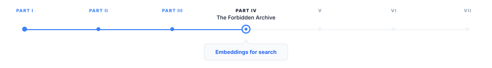
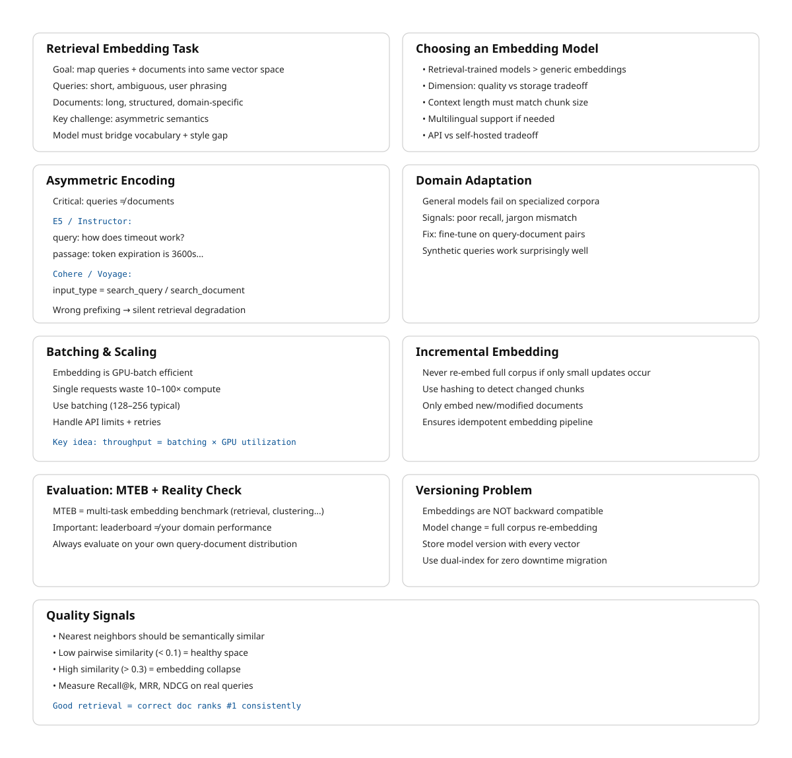

# Embeddings for Search

> **The canonical question for this chapter:**
> *You have 500,000 chunks from your document corpus. How do you convert them
> into vectors that make retrieval actually work, choosing the right model,
> encoding correctly for your domain, and handling the practical realities of
> embedding at scale?*

---

::: {.callout-note appearance="minimal"}
**Where are we?**

{#fig-progress width="80%"}


Chunking produced a list of text fragments. Now each fragment must become a
vector, a point in a high-dimensional space where semantic similarity
corresponds to geometric proximity. This chapter covers everything that
happens between a text chunk and a vector stored in your index: choosing the
right embedding model, encoding queries and documents correctly, managing
the operational complexity of embedding at scale, and knowing when your
embeddings are failing.
:::

---

## This chapter vs. chapter 06

Chapter 06 covered embeddings from the perspective of what happens inside a
generative LLM: the embedding table, the residual stream, how token
representations evolve through transformer layers, and what contextual
embeddings are.

This chapter covers embeddings from the perspective of building a retrieval
system: choosing and evaluating embedding models for your specific corpus and
query distribution, encoding documents and queries correctly, handling domain
shift, updating embeddings as documents change, and managing the operational
complexity of embedding a large corpus.

The underlying mathematics is the same. The engineering concerns are entirely
different.

---

## The retrieval embedding task

Retrieval embedding is a specific task with requirements that differ from
other embedding uses such as classification, clustering, or general semantic
similarity.

In retrieval, you have two types of inputs with asymmetric properties:

**Queries** are short, often incomplete, phrased as questions or keyword
phrases, written by users who may not use the same terminology as the
documents. A user asking "how long before my session times out" is asking
about the same thing as a document that says "the default token expiration
is 3600 seconds."

**Documents (chunks)** are longer, complete, written by authors using precise
domain terminology, often containing the answer to many possible queries
rather than to one specific query.

A retrieval embedding model must map these two types of inputs which are stylistically
and lexically different to nearby vectors when they are semantically related.
This is the core challenge, and it is different from general semantic
similarity, where both inputs have similar style.

The best retrieval embedding models are trained specifically for this
asymmetric task, using query-document pairs rather than symmetric text-text
pairs. Models trained only for general semantic similarity perform measurably
worse at retrieval even if they produce better representations for other tasks.

---

## Choosing an embedding model

The embedding model is one of the highest-impact decisions in a RAG system.
Switching models requires re-embedding the entire corpus, so the choice is
sticky and getting it right matters.

### The MTEB leaderboard

The Massive Text Embedding Benchmark (MTEB) is the standard reference for
comparing embedding models. It evaluates models across 56 datasets covering
8 task categories including retrieval, clustering, classification, reranking,
and semantic similarity.

For RAG systems, the retrieval subcategory of MTEB is most relevant. Key
retrieval datasets include BEIR (18 heterogeneous retrieval datasets covering
biomedical, financial, scientific, and general-purpose text), TREC (standard
IR benchmarks), and MIRACL (multilingual retrieval). 

**Critical caveat:** MTEB scores are averages across many datasets. A model
that ranks first on average may perform worse than a fifth-place model on your
specific domain. Always evaluate on data representative of your actual use case.

### Key selection criteria

**Retrieval-specific training.** Prefer models trained with query-document
contrastive objectives over general sentence encoders. Models explicitly listed
as "retrieval" or "embedding search" models in their documentation are trained
for this task.

**Embedding dimension.** Higher dimensions (1,536, 3,072) generally provide
better retrieval quality but cost more in storage and computation. For millions
of documents, the cost difference is significant. Matryoshka models allow
dimension reduction post-hoc which could be preferable for flexibility.

**Context window.** Must accommodate your chunk size. A model with a 512-token
context window cannot embed 1,000-token chunks without truncation. Models with
8,192-token contexts handle longer chunks but may not use the extra context
efficiently for all document types.

**Language coverage.** If your corpus is multilingual, use a multilingual
model. English-centric models tokenize non-English text inefficiently and
produce degraded embeddings for non-English content. mE5, multilingual-e5-large,
and similar models cover 100+ languages.

**Inference cost and latency.** Embedding 500,000 chunks at $0.0001 per 1,000
tokens costs $50. At $0.00002 per 1,000 tokens, it costs $10. For large corpora
embedded frequently, cost compounds. Latency also matters for query-time
embedding: if queries must be embedded before retrieval, embedding latency adds
directly to TTFT.

**Self-hosted vs. API.** API-based embedding (OpenAI, Cohere, Voyage) avoids
infrastructure management but creates a runtime dependency. Self-hosted models
(BGE, GTE, E5 via HuggingFace) require GPU infrastructure but give full control
over latency, cost, and data privacy.

### Evaluating on your data

The only reliable evaluation is on your own data:

1. Sample 200–500 representative queries from your expected query distribution.
2. For each query, identify the ground-truth relevant chunks.
3. Embed your corpus with each candidate embedding model.
4. For each query, retrieve top-k chunks and measure Recall@k (fraction of
   ground-truth chunks appearing in the top-k), MRR (Mean Reciprocal Rank),
   and NDCG (Normalized Discounted Cumulative Gain).
5. Select the model that maximizes these metrics on your evaluation set.


---

## Asymmetric encoding and instruction prefixes

Many retrieval embedding models require different encoding for queries vs.
documents. Using the same encoding for both is a common mistake that silently
degrades retrieval quality.

### Instruction-based models (E5, Instructor)

E5 and Instructor models prepend a task-specific instruction to each input.
The instruction tells the model what type of text it is encoding and what the
embedding will be used for:

```python
from sentence_transformers import SentenceTransformer

model = SentenceTransformer("intfloat/e5-large-v2")

# Queries: prepend "query: "
queries = ["query: how long before session timeout?"]
query_embeddings = model.encode(queries, normalize_embeddings=True)

# Documents: prepend "passage: "
documents = [
    "passage: The default token expiration is 3600 seconds, "
    "configurable via the token_ttl parameter in the authentication settings."
]
doc_embeddings = model.encode(documents, normalize_embeddings=True)
```

The instruction prefix shifts the model's representation toward the appropriate
mode. Query embeddings and passage embeddings are trained to be similar when
semantically related, even though they are encoded differently.


### Cohere and Voyage asymmetric encoding

Cohere and Voyage AI models expose the asymmetry through explicit `input_type`
parameters:

```python
import cohere

co = cohere.Client(api_key)

# Encode queries
query_response = co.embed(
    texts=["how long before session timeout?"],
    model="embed-english-v3.0",
    input_type="search_query",       # ← query encoding
)

# Encode documents
doc_response = co.embed(
    texts=["The default token expiration is 3600 seconds..."],
    model="embed-english-v3.0",
    input_type="search_document",    # ← document encoding
)
```

The `input_type` parameter is not optional and omitting it or using the wrong
value produces incorrect embeddings. This is a common source of subtle retrieval
bugs where the system appears to work (it returns results) but quality is
silently degraded.

### OpenAI embeddings

OpenAI's text-embedding-3 models do not require explicit query/document
differentiation. They can be used for both with the same API call:

```python
from openai import OpenAI

client = OpenAI()

def embed(texts: list[str]) -> list[list[float]]:
    response = client.embeddings.create(
        input=texts,
        model="text-embedding-3-large",
        dimensions=1024,  # MRL truncation
    )
    return [item.embedding for item in response.data]
```

The simplicity of the OpenAI interface makes it easier to use correctly, at
the cost of potentially lower retrieval quality compared to models with explicit
asymmetric training on specialized retrieval tasks.

---

## Batching and throughput for corpus embedding

Embedding a large corpus efficiently requires batching. Embedding one document
at a time is 10–100× slower than batching due to GPU underutilization and
per-request overhead.

### Optimal batch size

For GPU-hosted models:

```python
from sentence_transformers import SentenceTransformer
import numpy as np

model = SentenceTransformer("BAAI/bge-large-en-v1.5")

def embed_corpus(chunks: list[str], batch_size: int = 256) -> np.ndarray:
    all_embeddings = []

    for i in range(0, len(chunks), batch_size):
        batch = chunks[i:i + batch_size]
        batch_embeddings = model.encode(
            batch,
            normalize_embeddings=True,
            show_progress_bar=False,
            convert_to_numpy=True,
        )
        all_embeddings.append(batch_embeddings)

    return np.vstack(all_embeddings)
```

For API-based embedding, respect provider limits: OpenAI allows up to 2,048
inputs per request (max 8,191 tokens per input); Cohere allows up to 96 inputs
per request. Rate limits are typically 1,000–10,000 RPM depending on tier.

Implement retries with exponential backoff for API calls to handle transient 
failures, which are unavoidable in distributed systems operating at scale.


```python
from tenacity import retry, stop_after_attempt, wait_exponential

@retry(
    stop=stop_after_attempt(5),
    wait=wait_exponential(multiplier=1, min=1, max=60)
)
def embed_batch_with_retry(
    texts: list[str], client, model: str
) -> list[list[float]]:
    response = client.embeddings.create(input=texts, model=model)
    return [item.embedding for item in response.data]
```

### Incremental embedding

For corpora that change continuously, embedding only new and updated documents
is essential and re-embedding the full corpus on each run is prohibitively
expensive at scale:

```python
import hashlib

def compute_chunk_hash(chunk_text: str) -> str:
    return hashlib.sha256(chunk_text.encode()).hexdigest()

def embed_incremental(
    new_chunks: list[Chunk],
    existing_hashes: set[str],
    embedding_store
) -> int:
    """Embed only chunks not already in the store. Returns count of new chunks."""
    chunks_to_embed = [
        chunk for chunk in new_chunks
        if compute_chunk_hash(chunk.text) not in existing_hashes
    ]

    if not chunks_to_embed:
        return 0

    texts = [chunk.text for chunk in chunks_to_embed]
    embeddings = embed_corpus(texts)

    for chunk, embedding in zip(chunks_to_embed, embeddings):
        embedding_store.upsert(
            id=chunk.id,
            vector=embedding,
            metadata=chunk.metadata,
            text=chunk.text,
        )

    return len(chunks_to_embed)
```

Content hashing ensures idempotency: the same chunk embedded twice produces
one entry, not two.

---

## Domain adaptation

General-purpose embedding models are trained on diverse web text. For
specialized domains (medical literature, legal documents, financial filings,
source code) general models often underperform domain-specific alternatives.

### When domain adaptation is needed

Signs that general models are insufficient: retrieval recall on domain-specific
evaluation sets is significantly lower than on general benchmarks; queries use
domain terminology that general models do not represent well ("nociceptor,"
"collateralized debt obligation," "amortization schedule"); documents use
domain conventions (citation formats, abbreviations, structured fields) that
general models have not seen frequently.

### Domain-specific pre-trained models

Several domains have dedicated embedding models: BioMedBERT, PubMedBERT, and
BioBERT for biomedical text; Legal-BERT for legal documents; FinBERT for
financial text; CodeBERT and StarEncoder for source code. These models start
from domain-specific pretraining, meaning their tokenizer and base
representations are calibrated for domain vocabulary.

For retrieval specifically, domain-pretrained models still need retrieval
fine-tuning and pretraining alone is not sufficient for strong asymmetric
retrieval performance.

### Fine-tuning an embedding model

If no suitable domain model exists, or if retrieval quality remains insufficient
after trying domain models, fine-tune a general embedding model on domain-
specific query-document pairs.

Training data: pairs of (query, relevant_document_chunk) where the query is
representative of real user questions and the document chunk contains the
correct answer. Sources for training pairs include human annotation (most
reliable, expensive), synthetic generation (use an LLM to generate queries for
each chunk for example: "write 3 questions this passage answers" scales easily and 
works well), and mined pairs (Stack Overflow questions and accepted answers, FAQ pages,
support tickets with resolution notes).

```python
from sentence_transformers import SentenceTransformer, losses
from sentence_transformers.training_args import SentenceTransformerTrainingArguments
from datasets import Dataset

train_data = Dataset.from_dict({
    "anchor": ["how long before session timeout?", ...],          # queries
    "positive": ["The default token expiration is 3600...", ...], # relevant chunks
})

model = SentenceTransformer("BAAI/bge-large-en-v1.5")

train_loss = losses.MultipleNegativesRankingLoss(model)

training_args = SentenceTransformerTrainingArguments(
    output_dir="./fine-tuned-retrieval-model",
    num_train_epochs=3,
    per_device_train_batch_size=32,
    learning_rate=2e-5,
    warmup_ratio=0.1,
)

model.fit(
    train_objectives=[(train_data, train_loss)],
    args=training_args,
)
```

Fine-tuned models consistently outperform general models on domain-specific
retrieval by 5–20% on recall metrics. The investment (data collection plus
training) pays off quickly for high-value retrieval applications.

---

## Embedding stability and versioning

Embeddings are not stable across model versions, as a result updating a model
changes the vector representation of the same input text. A corpus embedded 
with `text-embedding-ada-002` is not compatible with `text-embedding-3-large`: 
they live in different vector spaces, and similarity scores between the two are 
meaningless.

### The model update problem

If you embed your corpus with model version V1 and switch to V2:
- Similarity scores between V1 document embeddings and V2 query embeddings
  are garbage
- Retrieval quality can degrade silently: results are still returned, but 
  they may be incorrect without any errors being raised.
- The only fix is to re-embed the entire corpus with V2

This creates a strong operational coupling between your corpus embeddings and
your query encoder. They must always use the same model version.

### Versioning strategy

Track the embedding model version with every stored embedding:

```python
{
    "chunk_id": "chunk-abc123",
    "text": "The default token expiration is 3600 seconds...",
    "embedding": [0.23, -0.87, ...],
    "embedding_model": "text-embedding-3-large",
    "embedding_model_version": "2024-02-01",
    "embedding_dimensions": 1024,
    "embedded_at": "2024-03-15T10:30:00Z",
}
```

When switching embedding models, you can either perform a big-bang migration by 
re-embedding the entire corpus with the new model (simpler but requiring downtime 
or a parallel index), or use a dual-index approach that maintains both old and new 
indices, routes new documents to the new index, and gradually migrates data while 
merging results at query time; this enables zero downtime but adds significant 
complexity.

---

## Embedding quality signals

How do you know if your embeddings are working without running full end-to-end
evaluation?

### Nearest-neighbor inspection

Sample 50 chunks from your corpus. For each, find the 5 nearest neighbors in
embedding space. If the neighbors are semantically related to the sample chunk,
embeddings are working correctly. If neighbors are unrelated embeddings are
failing.

```python
import numpy as np
from sklearn.metrics.pairwise import cosine_similarity

def inspect_nearest_neighbors(
    sample_chunks: list[str],
    all_chunks: list[str],
    all_embeddings: np.ndarray,
    embedding_model,
    k: int = 5
):
    sample_embeddings = embedding_model.encode(
        sample_chunks, normalize_embeddings=True
    )

    for chunk, embedding in zip(sample_chunks, sample_embeddings):
        similarities = cosine_similarity([embedding], all_embeddings)[0]
        top_k_indices = np.argsort(similarities)[::-1][1:k+1]  # exclude self

        print(f"\nQuery chunk: {chunk[:100]}...")
        print("Nearest neighbors:")
        for idx in top_k_indices:
            print(f"  [{similarities[idx]:.3f}] {all_chunks[idx][:80]}...")
```

### Embedding space health check

```python
def check_embedding_health(embeddings: np.ndarray):
    # Norm statistics — should be near 1.0 for normalized embeddings
    norms = np.linalg.norm(embeddings, axis=1)
    print(f"Norm stats: mean={norms.mean():.3f}, std={norms.std():.3f}")

    # Pairwise similarity — high average indicates embedding collapse
    sample_indices = np.random.choice(
        len(embeddings), min(1000, len(embeddings)), replace=False
    )
    sample = embeddings[sample_indices]
    pairwise_sims = cosine_similarity(sample)

    mask = ~np.eye(len(sample), dtype=bool)
    avg_sim = pairwise_sims[mask].mean()
    print(f"Average pairwise similarity: {avg_sim:.3f}")
    print("(< 0.1 is healthy, > 0.3 suggests potential collapse)")
```

High average pairwise similarity (> 0.3) suggests embedding collapse. When all
chunks are being mapped to similar vectors it means retrieval failed.
This can happen with domain shift (the model has not seen your document type),
poor text quality (chunks too short or too noisy), or model configuration
issues such as wrong prefix format.

### Query-document alignment evaluation

For a sample of known query-document pairs, compute the rank of the correct
document:

```python
def evaluate_retrieval(
    query_doc_pairs: list[tuple[str, str]],
    all_chunks: list[str],
    all_embeddings: np.ndarray,
    embedding_model
) -> dict:
    queries = [pair[0] for pair in query_doc_pairs]
    correct_chunks = [pair[1] for pair in query_doc_pairs]

    query_embeddings = embedding_model.encode(
        [f"query: {q}" for q in queries],
        normalize_embeddings=True
    )

    ranks = []
    for q_emb, correct in zip(query_embeddings, correct_chunks):
        similarities = cosine_similarity([q_emb], all_embeddings)[0]
        sorted_chunks = [all_chunks[i] for i in np.argsort(similarities)[::-1]]
        rank = (
            sorted_chunks.index(correct) + 1
            if correct in sorted_chunks
            else len(all_chunks)
        )
        ranks.append(rank)

    return {
        "recall@1":  sum(r <= 1  for r in ranks) / len(ranks),
        "recall@5":  sum(r <= 5  for r in ranks) / len(ranks),
        "recall@10": sum(r <= 10 for r in ranks) / len(ranks),
        "mrr":       sum(1/r for r in ranks) / len(ranks),
        "median_rank": np.median(ranks),
    }
```

Run this evaluation before deploying to production, and re-run whenever the
embedding model or corpus changes. Recall@5 above 0.8 is a reasonable bar for
most retrieval tasks and when it is below 0.6, investigate chunking and model 
choice before blaming retrieval algorithms.

---

## Late interaction models: ColBERT

Standard embedding models produce one vector per document, and retrieval is a
single vector comparison. Late interaction models like ColBERT produce one
vector per token, and retrieval involves matching token-level representations.

### How ColBERT works

ColBERT encodes both the query and the document into sequences of token-level
embeddings (not pooled to a single vector). Similarity is computed via MaxSim:
for each query token, find its most similar document token; sum these maximum
similarities across all query tokens.

```
Query: ["how", "long", "session", "timeout"]
  → 4 query token embeddings: [q1, q2, q3, q4]

Document: ["default", "token", "expiration", "3600", "seconds"]
  → 5 doc token embeddings: [d1, d2, d3, d4, d5]

MaxSim score = max_sim(q1, {d1..d5}) + max_sim(q2, {d1..d5})
             + max_sim(q3, {d1..d5}) + max_sim(q4, {d1..d5})
```

This allows fine-grained matching: "session timeout" in the query matches
"token expiration" in the document because the token-level embeddings for
"session" and "token" are similar in context, and "timeout" and "expiration"
are similar. Standard single-vector models must capture all of this in one
pooled vector, which is a lossy compression.

### ColBERT tradeoffs

**Better retrieval quality.** ColBERT consistently outperforms single-vector
models on retrieval benchmarks, often by significant margins on tasks requiring
multi-token matching.

**Higher storage cost.** Instead of one 1,024-dimensional vector per chunk,
ColBERT stores N vectors (one per token). A 200-token chunk requires
200 × 128-dimensional vectors.

**More complex retrieval.** MaxSim requires comparing all query token vectors
against all document token vectors. In practice, ColBERT uses approximate
nearest-neighbor retrieval to find candidate documents, then applies MaxSim
for precise re-ranking.

---

## Key takeaways

- Retrieval embedding is an asymmetric task — queries and documents have
  different styles and vocabulary; use models trained specifically for
  retrieval, not general semantic similarity models
- Always evaluate embedding models on your own domain data before committing;
  MTEB rankings reflect average performance across many datasets, not
  performance on your specific corpus
- Asymmetric encoding is required for models like E5, Instructor, Cohere, and
  Voyage: queries and documents must be encoded differently; using the wrong
  prefix or input_type silently degrades retrieval quality with no error thrown
- Batch embedding efficiently using appropriate batch sizes; implement retry
  with exponential backoff for API-based embedding; use content hashing for
  incremental updates to avoid re-embedding unchanged chunks
- Domain-specific models and fine-tuning on domain query-document pairs improve
  retrieval recall by 5–20% for specialized corpora; synthetic query generation
  from chunks is an effective and scalable way to create training data
- Embedding model versions are incompatible: switching models requires
  re-embedding the entire corpus; track model version with every stored
  embedding and plan migrations carefully
- Inspect embedding quality before deploying: nearest-neighbor inspection,
  pairwise similarity health checks, and known query-document pair evaluation
  catch failures that would otherwise appear as degraded answers in production
- ColBERT's token-level late interaction achieves higher retrieval quality than
  single-vector models at the cost of significantly more storage and retrieval
  complexity — worth it when single-vector recall is insufficient

{#fig-progress width="90%"}

---

## Further reading

- Karpukhin et al. (2020). *Dense Passage Retrieval for Open-Domain Question
  Answering.* — The foundational dense retrieval paper establishing the
  query-document asymmetric training paradigm.
- Khattab & Zaharia (2020). *ColBERT: Efficient and Effective Passage Search
  via Contextualized Late Interaction over BERT.* — Token-level late interaction
  retrieval.
- Wang et al. (2022). *Text Embeddings by Weakly-Supervised Contrastive
  Pre-training.* — E5; the instruction-prefix asymmetric encoding approach.
- Muennighoff et al. (2023). *MTEB: Massive Text Embedding Benchmark.* —
  The benchmark; essential reference for comparing embedding models.

---
