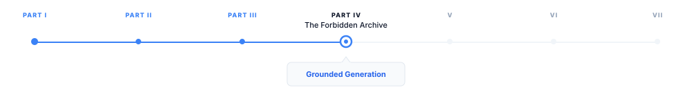
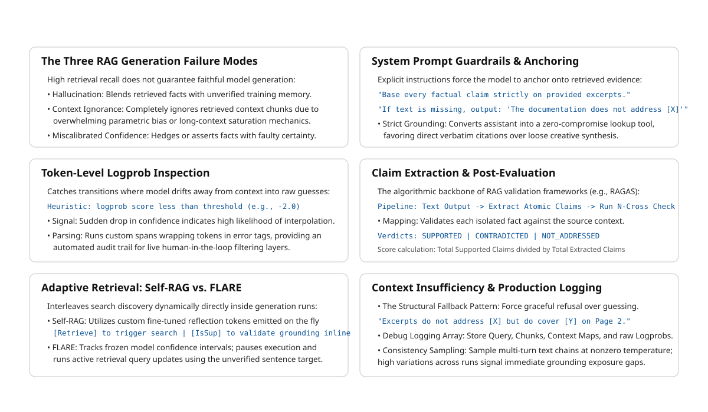

# Grounded Generation

> **The canonical question for this chapter:**
> *The model has the right context. Why does it still sometimes ignore it,
> supplement it with hallucinated facts, or generate claims the context
> never made and what can you do about all three?*


---

::: {.callout-note appearance="minimal"}
**Where are we?**

{#fig-progress width="80%"}

The prompt is assembled and sent. This chapter covers everything that happens
next: how the model uses (or fails to use) the context it was given, how to
detect when it goes wrong, and how to design a system that fails gracefully
when retrieval was insufficient. Context construction determined what the model
could see. Grounded generation determines whether it actually uses what it sees.
:::

---

## The three failure modes

Retrieval solves the knowledge problem by finding the right information.
Grounded generation addresses the fidelity problem by ensuring the model 
accurately incorporates that information into its responses. These are distinct 
challenges that require different solutions.

Even with perfect retrieval and careful context construction, generation fails
in three distinct ways:

**Hallucination despite retrieval.** The model supplements retrieved context
with parametric knowledge. A retrieved chunk states "the default token
expiration is 3600 seconds." The model generates that fact correctly, then
adds: "which aligns with the OAuth 2.0 standard recommendation of one hour."
The second clause came from training data, not the retrieved document. It may
be true. It may not be. The user cannot tell, and neither can you without
external verification.

**Context ignorance.** The model ignores the retrieved context entirely and
answers from parametric memory. This happens when training data contains a
strong competing answer, when the relevant passage sits in the middle of a long
context, or when instruction-following is insufficiently grounded. The
response looks like a success but is not grounded in the provided evidence.

**Miscalibrated confidence.** The model answers confidently when it should
express uncertainty, or hedges when the context clearly supports a direct
answer. Both are calibration failures, the model's expressed certainty does
not match the actual support in the retrieved context.

All three occur even in systems with high retrieval recall. Solving them
requires techniques applied at and after inference, which is what this
chapter covers.

---

## Extending the system prompt for faithfulness

Previous chapter built a production system prompt covering role, context usage,
citation format, and output structure. That prompt is necessary but not
sufficient for faithfulness. What it does not yet specify is the relationship
between retrieved context and parametric memory, which source wins when they
conflict, and how the model should signal when context is absent.


```
GROUNDING REQUIREMENTS:
- Base every factual claim on the provided documentation excerpts
- Do not supplement the documentation with knowledge from your training data,
  even if you are confident it is correct
- If you find yourself about to state something not in the provided excerpts,
  stop and instead say: "The documentation does not address [X]"
- The provided documentation is authoritative and if it contradicts what you
  know from training, trust the documentation

CALIBRATION:
- Distinguish between "the documentation states X," "the documentation implies X,"
  and "the documentation does not address X"
- Do not express more certainty than the documentation supports
- If the documentation is ambiguous, acknowledge the ambiguity explicitly
```

These two sections directly target the first two failure modes. The citation
instructions already present in the previous chapter's prompt address the third by
creating an audit trail that makes context ignorance visible.

### Grounding instruction strength

For applications where faithfulness is critical (medical, legal, financial)
use maximum grounding strength:

```
STRICT GROUNDING:
You are a documentation lookup system, not an assistant.
Your only job is to find and present information from the provided excerpts.
If the answer is in the excerpts, quote or closely paraphrase the relevant
passage. If it is not, say exactly: "Not found in provided documentation."
Do not add context, explanation, or interpretation beyond what the
documentation states.
```

Strict grounding reduces hallucination substantially but also reduces response
quality for complex questions, the model produces excerpts rather than
synthesis. Use it for narrow, high-stakes retrieval tasks and standard
grounding for broad, synthesis-heavy tasks.

---

## Chain-of-thought for faithfulness

Requiring the model to reason explicitly about the context before answering
reduces hallucination by forcing reference to retrieved content before
generating claims.

```python
def build_cot_grounding_prompt(
    query: str,
    context: str,
) -> str:
    return f"""You have access to the following documentation:

{context}

Before answering, identify the relevant passages from the documentation.
Then answer based only on those passages.

Question: {query}

Step 1 — Identify relevant passages:
[List the specific passages from the documentation relevant to this question]

Step 2 — Answer based on those passages:
[Answer the question using only the passages identified above]"""
```

The intermediate step grounds the model in specific text before it begins
generating its answer. This works because of how autoregressive generation
functions: each generated token is conditioned on all preceding tokens. When
the model generates a factual claim in Step 2, it is conditioned on having
just explicitly cited the source passage in Step 1. That citation increases
the probability of the faithful answer.


---

## Faithfulness at the token level

Faithfulness can be examined at the level of individual tokens, not just full
responses. Understanding where confidence drops during generation reveals
where the model is departing from retrieved context and filling from
parametric memory.

### Flagging low-confidence spans

Token logprobs indicate the model's confidence at each position. A sequence
of high-logprob tokens followed by a sudden drop suggests the model is
uncertain, often where it is bridging from retrieved context into parametric
knowledge:

```python
def flag_low_confidence_tokens(
    tokens: list[str],
    logprobs: list[float],
    threshold: float = -2.0,
) -> list[tuple[str, float, bool]]:
    """Returns (token, logprob, is_low_confidence) tuples."""
    return [
        (token, logprob, logprob < threshold)
        for token, logprob in zip(tokens, logprobs)
    ]

def highlight_uncertain_spans(
    token_flags: list[tuple[str, float, bool]]
) -> str:
    """Mark low-confidence spans for human review."""
    result = []
    in_uncertain_span = False

    for token, logprob, is_low_confidence in token_flags:
        if is_low_confidence and not in_uncertain_span:
            result.append("<<")
            in_uncertain_span = True
        elif not is_low_confidence and in_uncertain_span:
            result.append(">>")
            in_uncertain_span = False
        result.append(token)

    if in_uncertain_span:
        result.append(">>")

    return "".join(result)
```

This is a heuristic, models can be confidently wrong. But low-logprob spans
are disproportionately likely to contain hallucinations and are worth flagging
for review in high-stakes applications. The threshold of -2.0 is a starting
point; calibrate it against labeled examples from your own domain.

---

## Claim extraction and verification

The most rigorous post-generation check: extract atomic claims from the
response and verify each against the retrieved context independently.

```python
def extract_atomic_claims(response: str, llm) -> list[str]:
    prompt = f"""Extract all factual claims from the following text as a
JSON list. Each claim should be atomic (one fact per claim) and self-contained.

Text: {response}

Return only the JSON array of claim strings."""

    return json.loads(llm.complete(prompt))

def verify_claim_against_context(
    claim: str,
    context: str,
    llm,
) -> dict:
    prompt = f"""Does the following context support, contradict, or neither
support nor contradict this claim? Respond with exactly one of:
SUPPORTED / CONTRADICTED / NOT_ADDRESSED

Context: {context[:3000]}

Claim: {claim}

Verdict:"""

    verdict = llm.complete(prompt).strip().upper()
    return {
        "claim":            claim,
        "verdict":          verdict,
        "is_hallucination": verdict == "NOT_ADDRESSED",
        "is_contradiction": verdict == "CONTRADICTED",
    }

def verify_response_faithfulness(
    response: str,
    context: str,
    llm,
) -> dict:
    claims        = extract_atomic_claims(response, llm)
    verifications = [verify_claim_against_context(c, context, llm) for c in claims]

    total        = len(verifications)
    supported    = sum(1 for v in verifications if v["verdict"] == "SUPPORTED")
    hallucinated = sum(1 for v in verifications if v["is_hallucination"])
    contradicted = sum(1 for v in verifications if v["is_contradiction"])

    return {
        "total_claims":       total,
        "supported":          supported,
        "hallucinated":       hallucinated,
        "contradicted":       contradicted,
        "faithfulness_score": supported / total if total > 0 else 0,
        "claim_details":      verifications,
    }
```

This pipeline (extract claims, verify each) is the core of RAGAS and similar
automated faithfulness evaluation frameworks. The `NOT_ADDRESSED` verdict is
the direct hallucination signal: a claim the model made that no retrieved chunk
supports. The `CONTRADICTED` verdict is rarer but more serious meaning the model
asserted something that the retrieved context explicitly refutes.


---

## Self-RAG: faithfulness signals baked into generation

Standard RAG retrieves once before generation. Self-RAG (Asai et al., 2023)
integrates retrieval into the generation process itself, using special tokens
to let the model signal when it needs more context and whether its claims are
supported by what it has.

### The Self-RAG special tokens

Self-RAG fine-tunes a model to generate four types of special tokens alongside
regular text:

- `[Retrieve]` — model signals it needs additional context
- `[IsRel]` — signals whether a retrieved passage is relevant to the query
- `[IsSup]` — signals whether the generated claim is supported by retrieved context
- `[IsUse]` — signals whether the retrieved passage was useful for the response

### Self-RAG generation example

```
User: "How long does the default token last, and can it be extended?"

Model begins generating:
"The default token expiration time is [Retrieve]"
  → Retrieval triggered → context: "default is 3600 seconds"
"The default token expiration time is 3600 seconds [IsSup: fully supported].
This can be configured [Retrieve]"
  → Retrieval triggered → context: "token_ttl supports up to 86400 seconds"
"This can be configured via the token_ttl parameter, with a maximum of
86400 seconds [IsSup: fully supported]."
```

The model generates until it recognizes uncertainty, retrieves, continues,
interleaving retrieval and generation iteratively. Each `[IsSup]` annotation
makes the model's grounding status explicit, enabling the system to flag or
filter unsupported claims before they reach the user.

Self-RAG produces better-calibrated and more faithfully grounded responses
than standard RAG on tasks that require multi-step reasoning. The requirement
to fine-tune a model with these special tokens is its main limitation, it
cannot be applied to a frozen API-served model. Self-RAG is available as
fine-tuned model variants rather than as a prompting technique.

---

## FLARE: active retrieval during generation

FLARE (Jiang et al., 2023) addresses the same problem as Self-RAG but without
fine-tuning, using logprob uncertainty as the retrieval trigger:

```python
def flare_generate(
    query: str,
    initial_context: str,
    retriever,
    llm,
    max_iterations: int = 5,
    uncertainty_threshold: float = -2.0,
) -> str:
    current_context  = initial_context
    generated_so_far = ""

    for _ in range(max_iterations):
        response = llm.complete_with_logprobs(
            prompt=build_rag_prompt(query, current_context, generated_so_far)
        )

        if min(response.logprobs) >= uncertainty_threshold:
            # Confident — accept this sentence and continue
            generated_so_far += " " + response.text
        else:
            # Uncertain — retrieve before generating this sentence
            new_chunks       = retriever.retrieve(response.text, top_k=3)
            current_context += "\n\n" + format_chunks(new_chunks)
            # Do not advance generated_so_far — regenerate with augmented context

        if generated_so_far.rstrip().endswith(('.', '!', '?')):
            break

    return generated_so_far.strip()
```

When the model's next-token confidence drops below the threshold, generation
pauses, a new retrieval pass runs against the partial output as a query, and
the augmented context is used to regenerate from that point. The model never
produces the low-confidence sentence ,it retrieves first.

FLARE works well for long-form answers that span multiple topics, particularly
when the full scope of required context is not known at initial retrieval time.
The cost is higher latency (multiple retrieval-generation cycles) and
implementation complexity. For standard interactive queries, single-round
retrieval with strong grounding instructions is sufficient.

---

## Handling insufficient context

When retrieved context does not contain the information needed to answer the
query, the correct behavior is acknowledgment, not fabrication. This is the
most important single behavior in grounded generation: a system that says "I
don't have that information" is more useful and more trustworthy than one that
confidently provides a fabricated answer.

Previous chapter covered *detecting* context insufficiency before sending the prompt.
This section covers what the model should do when it encounters insufficiency
during generation and how to verify it behaves correctly afterward.

### Designing the insufficient-context response

```
INSUFFICIENT CONTEXT INSTRUCTIONS:
If the documentation does not contain sufficient information to answer:
1. State specifically what is missing:
   "The documentation does not address [X]"
2. State what related information is available, if any:
   "The documentation does address [Y], which may be related"
3. Do not speculate about the missing information
4. Suggest where the user might find the answer:
   "You may want to consult [appropriate resource type]"
```

The specificity of point 1 matters more than it looks. "I don't know" is
less useful than "The documentation addresses token expiration generally
(3600 seconds default) but does not cover enterprise-tier configurations
specifically." The latter tells the user exactly what is and is not available,
and what to look for elsewhere.

### Detecting when the model over-answers

After generation, verify that the model acknowledged insufficiency when it
should have rather than hallucinating an answer to fill the gap:

```python
def detect_hallucinated_sufficiency(
    query: str,
    context_chunks: list[dict],
    response: str,
    llm,
) -> bool:
    """Returns True if the response appears to contain facts not in the context."""
    context_preview = "\n".join(c['text'][:500] for c in context_chunks[:3])

    prompt = f"""A model was asked this question:
{query}

It had access to this context:
{context_preview}

It responded:
{response[:500]}

Does the response contain specific facts NOT present in the context?
Answer YES or NO only."""

    return llm.complete(prompt).strip().upper().startswith("YES")
```

If detected: log the hallucination, trigger a retry with stricter grounding
instructions, or flag for human review before the response reaches the user.

---

## Post-hoc citation attribution

Previous chapter set up numbered source references in the context format and
instructed the model to cite them. When the model fails to include citations
despite these instructions, they can be added in post-processing by
attributing each sentence to the most similar retrieved chunk:

```python
def add_citations_to_response(
    response: str,
    context_chunks: list[dict],
    embedding_model,
    similarity_threshold: float = 0.5,
) -> str:
    sentences        = split_into_sentences(response)
    chunk_texts      = [c['text'] for c in context_chunks]
    sent_embeddings  = embedding_model.encode(sentences, normalize_embeddings=True)
    chunk_embeddings = embedding_model.encode(chunk_texts, normalize_embeddings=True)

    cited = []
    for sentence, sent_emb in zip(sentences, sent_embeddings):
        similarities = chunk_embeddings @ sent_emb
        best_idx     = int(similarities.argmax())
        best_sim     = float(similarities[best_idx])

        if best_sim >= similarity_threshold:
            cited.append(f"{sentence} [Source {best_idx + 1}]")
        else:
            cited.append(f"{sentence} [Unverified]")

    return " ".join(cited)
```

The `[Unverified]` tag is the important output here. Sentences that cannot be
attributed to any retrieved chunk are direct hallucination candidates. Log them
as retrieval quality signals: if the model needed information that was not
retrieved, the retrieval stage has a coverage gap. 

---

## Consistency sampling

For high-stakes applications, generate multiple responses at nonzero
temperature and check for factual consistency across samples. A correctly
grounded response that accurately reflects a single underlying fact should
be consistent regardless of sampling randomness. Inconsistency across samples
indicates uncertainty, hallucination, or genuine ambiguity in the retrieved
context:

```python
def check_response_consistency(
    query: str,
    context: str,
    llm,
    n_samples: int = 5,
    temperature: float = 0.7,
) -> dict:
    responses = [
        llm.complete(
            prompt=build_rag_prompt(query, context),
            temperature=temperature,
        )
        for _ in range(n_samples)
    ]

    responses_text = "\n\n---\n\n".join(
        f"Response {i+1}: {r}" for i, r in enumerate(responses)
    )

    assessment = llm.complete(f"""Are these {n_samples} responses consistent
on all factual claims? If not, identify the inconsistencies.

Query: {query}

{responses_text}

Assessment (CONSISTENT or INCONSISTENT with explanation):""")

    return {
        "responses":              responses,
        "consistency_assessment": assessment,
        "is_consistent":          "INCONSISTENT" not in assessment.upper(),
    }
```

This requires n+1 LLM calls per query which is impractical for real-time systems.
Use it for: auditing high-stakes responses before delivery, generating
faithfulness training data, and diagnosing retrieval gaps (queries that are
consistently inconsistent across samples point to missing context rather than
model failure).

---

## Post-generation faithfulness filtering

Combine the techniques above into a filtering layer that sits between
generation and delivery. If faithfulness falls below threshold, retry with
stricter grounding. If it still fails, return a safe fallback rather than a
known-hallucinated response:

```python
def generate_with_faithfulness_filter(
    query: str,
    context: str,
    llm,
    max_retries: int = 2,
    faithfulness_threshold: float = 0.9,
) -> dict:

    grounding_strengths = ["normal", "strict", "very_strict"]

    for attempt, strength in enumerate(grounding_strengths[:max_retries + 1]):
        response     = llm.complete(build_rag_prompt(query, context, strength))
        verification = verify_response_faithfulness(response, context, llm)

        if verification["faithfulness_score"] >= faithfulness_threshold:
            return {
                "response":           response,
                "faithfulness_score": verification["faithfulness_score"],
                "attempts":           attempt + 1,
                "passed_filter":      True,
            }

        log_hallucination_attempt(query, context, response, verification)

    return {
        "response":           "I was unable to generate a sufficiently grounded "
                              "response from the available documentation. Please "
                              "consult the documentation directly or contact support.",
        "faithfulness_score": None,
        "attempts":           max_retries + 1,
        "passed_filter":      False,
    }
```

The escalating grounding strength on retry works because parametric memory
and retrieved context compete for influence over each generated token. Stronger
grounding instructions shift that competition toward the retrieved evidence.
The hard fallback is not a failure state to hide, it is a correct system
behavior. Always log these events and treat them as retrieval quality signals:
if the model cannot produce a faithful response, either the retrieved context
is insufficient or the query cannot be answered from this corpus.

---


## Grounded generation in production

### Logging for debuggability

Every response must be logged with: the query, the retrieved chunk IDs and
scores, the assembled context exactly as sent to the model, the generated
response, and any faithfulness scores computed. Without this, debugging
incorrect answers is intractable at scale, you cannot distinguish retrieval
failures from generation failures without seeing both sides of the prompt.

When users report incorrect answers, this log enables exact reconstruction of
what the model saw and what it generated. The distinction matters: if the model
received the right context and still generated a wrong answer, that is a
generation failure. If it received insufficient context, that is a retrieval
failure.

### Human-in-the-loop for high-stakes responses

For applications where errors have serious consequences, route
low-faithfulness responses or high-risk query patterns to human review before
delivery:

```python
def route_for_review(
    query: str,
    faithfulness_score: float,
    high_risk_patterns: list[str],
    faithfulness_threshold: float = 0.8,
) -> bool:
    if faithfulness_score < faithfulness_threshold:
        return True
    if any(pattern in query.lower() for pattern in high_risk_patterns):
        return True
    return False
```

### Feedback as ground truth

User feedback (thumbs down, explicit corrections, "this is wrong") is the
most valuable signal for grounded generation quality. It identifies failure
cases that automated faithfulness metrics miss, particularly miscalibrated
confidence (where the model was faithful but uncertain answers felt wrong) and
domain gaps (where the model was faithful to retrieved context that was itself
outdated or incomplete).

---

## Key takeaways

- Grounded generation fails in three distinct ways — hallucination despite
  retrieval, context ignorance, and miscalibrated confidence — each requiring
  a different intervention; retrieval quality alone cannot fix any of them
- The system prompt from chapter 24 needs two additions to address faithfulness:
  explicit grounding requirements (parametric memory loses to retrieved context)
  and explicit calibration language (distinguish "states," "implies," and "does
  not address")
- Chain-of-thought reasoning before answering reduces hallucination by forcing
  the model to cite source passages before generating claims; Step 1 conditions
  Step 2 through the autoregressive token dependency
- Token logprobs identify low-confidence spans during generation — where the
  model is most likely departing from retrieved context into parametric memory
- Claim extraction and verification provides the most diagnostically precise
  faithfulness signal: `NOT_ADDRESSED` verdicts are hallucinations,
  `CONTRADICTED` verdicts are the most serious failures
- Self-RAG embeds faithfulness signals into generation through special tokens
  (`[Retrieve]`, `[IsSup]`) but requires fine-tuning and cannot be applied to
  frozen API-served models
- FLARE uses logprob uncertainty to trigger mid-generation retrieval, bridging
  single-round RAG and the fully agentic retrieval architectures in chapter 26
- Post-generation faithfulness filtering with escalating grounding strength and
  a hard fallback prevents known-hallucinated responses from reaching users;
  every fallback is a retrieval quality signal
- Log the full context and response for every production query; without it,
  retrieval failures and generation failures are indistinguishable, and both
  look the same to the user

{#fig-progress width="90%"}


---

## Further reading

- Asai et al. (2023). *Self-RAG: Learning to Retrieve, Generate, and Critique
  through Self-Reflection.* — The Self-RAG framework with special tokens for
  generation-integrated faithfulness signals.
- Jiang et al. (2023). *Active Retrieval Augmented Generation.* — FLARE;
  uncertainty-driven retrieval during generation.
- Es et al. (2023). *RAGAS: Automated Evaluation of Retrieval Augmented
  Generation.* — Comprehensive RAG evaluation covering faithfulness, relevance,
  and groundedness.
- Min et al. (2023). *FActScoring: Fine-Grained Atomic Evaluation of Factual
  Precision in Long Form Text Generation.* — Atomic claim verification for
  faithfulness evaluation.
- Manakul et al. (2023). *SelfCheckGPT: Zero-Resource Black-Box Hallucination
  Detection for Generative Large Language Models.* — Consistency-based
  hallucination detection without ground truth.
- Gao et al. (2023). *Enabling Large Language Models to Generate Text with
  Citations.* — Systematic inline citation generation and verification.
- Shi et al. (2023). *Large Language Models Can Be Easily Distracted by
  Irrelevant Context.* — Evidence that irrelevant context causes active
  performance degradation; the generation-side counterpart to the lost-in-the-
  middle effect on context construction.

---
