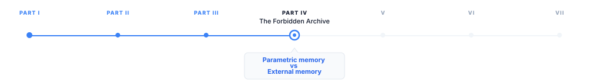

> **The canonical question for this chapter:**
> *A language model knows things. A retrieval system finds things. These are
> different cognitive acts and understanding exactly how they differ is what
> lets you design systems that use each one where it works best.*

---

::: {.callout-note appearance="minimal"}
**Where are we?**

{#fig-progress width="80%"}

Retrieval exists because parametric memory has fundamental limits. This chapter 
explores those limits in greater depth by examining the nature of parametric 
memory, the role of external memory, how the two interact, and how to design 
systems that leverage both effectively. 
:::

---

## Two different ways of knowing

Consider two employees at a company. The first has been there for twenty years.
He knows the company's history, culture, and procedures intuitively. When
someone asks a question, he answers from internalized understanding, he does
not need to look anything up. Her knowledge is fast, fluid, and deeply
integrated. It is also frozen: she knows things as they were when she last
learned them, and it takes effort to update.

The second is a researcher who joined last week. She does not know the company's
history, but she has access to every document the company has ever produced.
When someone asks a question, she searches the archives, finds the relevant
documents, and reads the answer. Her knowledge is current, precise, and
verifiable but it depends entirely on what is in the archives and whether
she can find it.

A language model with retrieval is both employees working together.

The first employee is **parametric memory** (knowledge encoded in the model's
weights through training). The second is **external memory** (knowledge stored
in a document corpus, retrieved at inference time). Neither is sufficient alone. 
Together, they cover each other's weaknesses.

---

## What parametric memory is

Parametric memory is the knowledge encoded in a model's parameters basically its
weights. It is everything the model learned by predicting the next token across
a training corpus of trillions of words.

This knowledge is not stored as facts in labeled locations. It is distributed
across billions of floating-point numbers, each contributing fractionally to
the model's behavior. When the model "knows" that Paris is the capital of
France, that knowledge is not a database entry, it is a statistical pattern
spread across the embedding table, the attention heads, and the feed-forward
layers of every transformer block.

### Properties of parametric memory

**Always available.** Parametric memory requires no lookup. Every piece of
knowledge the model has is accessible on every forward pass, with no retrieval
latency.

**Deeply integrated.** Parametric knowledge is woven into the model's
reasoning. When the model answers a question about French geography, it can
simultaneously apply its knowledge of European history, political structures,
and linguistic patterns without explicit retrieval of any of them. The
integration is seamless because all of it lives in the same substrate.

**Compressed and approximate.** The training corpus contains far more
information than fits in the parameter count. What gets encoded is statistical
regularities, patterns that appeared consistently enough across training
examples to survive gradient descent. Specific facts, especially rare ones,
are encoded imprecisely. The model reconstructs them from learned patterns
rather than retrieving them verbatim.

**Fixed at training time.** Parametric memory cannot be updated without
retraining. Events after the training cutoff, information not in the training
corpus, corrections to facts the model learned incorrectly, none of these
can be incorporated without a new training run.

**Opaque.** There is no mechanism to ask parametric memory for its source.
When the model produces a fact, it cannot say which document that fact came
from. The provenance is lost in the compression.

**Confident under uncertainty.** When the model does not know something, its
parametric memory does not respond with silence. It responds with whatever
continuation is statistically plausible in context. This is hallucination,
the model generating text that sounds like knowledge but is not grounded in
actual facts.

---

## What external memory is

External memory is a structured store of information that the model can query
at inference time (a vector database, a document corpus, a knowledge graph,
or a traditional database). It is external to the model: stored separately,
maintained independently, and accessed through a retrieval interface.

In a RAG system, the external memory is typically a collection of documents
chunked into passages, embedded as vectors, and stored in a vector database.
A query arrives, it is embedded, the most similar passages are retrieved, and
they are inserted into the prompt as context.

### Properties of external memory

**Updatable in real time.** New documents can be added, old documents expired,
and corrections made without touching the model's weights. The knowledge base
can be current as of minutes ago.

**Precise and verbatim.** Retrieved documents contain exact text from the
source. The model does not reconstruct the content, it reads it. Specific
numbers, dates, names, and quotations can be retrieved and cited exactly as
they appear in the source.

**Verifiable and citable.** Every retrieved passage has a source. The system
knows which document a fact came from, can provide citations, and can display
the source for user verification. The provenance is preserved.

**Bounded by what was indexed.** External memory can only surface what is
in the corpus. Knowledge not indexed (information not added, documents not
processed) is invisible to retrieval. The corpus boundary defines the limits
of what can be found.

**Quality-dependent on retrieval.** If retrieval fails to surface the relevant
passage, the model has no external knowledge to work with. A RAG system is
only as good as its retrieval. 

**Slower than parametric access.** External memory requires embedding the
query, searching the index, and retrieving documents before the model can use
the information. This adds latency (typically 50–500ms) that is absent for
parametric knowledge.

---

## The complementary structure

Parametric and external memory have complementary strength profiles. A well-
designed system delegates to each where it excels:

```
                    Parametric    External
                    Memory        Memory
                    ──────────────────────
Speed               Fast          Slower
Update cost         High          Low
Currency            Stale         Current
Coverage            Training data Indexed corpus
Precision           Approximate   Exact
Verifiability       None          Full
Private data        No            Yes
Reasoning ability   High          None (the model reasons)
Integration depth   Deep          Shallow
Failure mode        Hallucination Retrieval miss
```

---

## When to rely on parametric memory

Certain categories of knowledge are better served by parametric memory than
by retrieval.
 
### General reasoning and language

Grammar, syntax, logical inference, mathematical operations, programming
patterns, writing style, none of these are facts to be retrieved. They are
capabilities that emerged from training and are deeply integrated into the
model's generation process. Retrieval cannot help with "write a recursive
function" in the way it helps with "what is the current interest rate."

### Stable, well-documented knowledge

The capital of France, the speed of light, the date of World War II, the syntax
of Python, facts that are stable, widely documented, and unlikely to have
changed since training. For these, retrieval adds latency and complexity without
adding information. The model's parametric memory is sufficient.

### Synthesis and inference

When a question requires combining multiple pieces of knowledge in ways that
are not explicitly stated in any document, parametric memory's deep integration
is an advantage. "What are the implications of X for Y?" may not have a
document that answers it directly. The model's ability to reason across
integrated knowledge (drawing on history, economics, and science
simultaneously) is a parametric capability.

### Common knowledge about common things

Facts about widely documented subjects that appeared many times in the training
corpus are more reliably stored in parametric memory than rare or specialized
facts. The model's reconstruction of common knowledge is accurate; its
reconstruction of rare knowledge is not.

---

## When to rely on external memory

### Current information

Anything that changes after the training cutoff: news, prices, personnel,
policies, software versions, research findings. Parametric memory cannot help
here. External memory with regular updates is the only option.

### Private and proprietary data

Enterprise documents, customer records, internal policies, proprietary research, 
none of this is in the training corpus. Retrieval is the only mechanism to
give the model access to organization-specific knowledge.

### Precise facts and citations

Specific numbers, quotations, contractual terms, regulatory requirements, cases
where "approximately right" is not acceptable. External memory provides the
exact text; parametric memory approximates.

### Accountability and auditability

Cases where the source of information matters, legal, medical, financial,
regulatory. External memory provides citable sources. Parametric memory
provides assertions without provenance.

### Long-tail and specialized knowledge

Domain-specific jargon, rare technical standards, specialized procedures,
topics underrepresented in the training corpus. The model's parametric knowledge
of these is unreliable. A well-indexed specialized corpus outperforms parametric
reconstruction for niche domains.

---

## The interaction between the two

When both memories are available (a model with access to a retrieval system) 
they interact in ways that require careful system design.

### Which memory does the model prefer?

Research shows that the model's preference for parametric vs. retrieved knowledge 
depends on the relevance and quality of the retrieved context:

- When retrieved context is highly relevant and clearly addresses the question,
  the model generally uses it
- When retrieved context is irrelevant or contradicts the model's parametric
  memory, the model may ignore the retrieved content and answer from parametric
  knowledge
- When parametric memory is strong (the subject was well-represented in
  training), the model may underweight retrieved context even when it is relevant

This is not a binary choice the model makes consciously. It is an emergent
property of how attention weights retrieved context against parametric
associations. The model does not "decide" to trust one over the other
it attends to the full context and generates the most likely continuation.

### Parametric memory as noise

A counterintuitive failure mode: for questions where the correct answer is in
the retrieved context, a model with strong parametric associations to a
different answer may generate the wrong answer despite the retrieved evidence.

Example: a company changed its refund policy. The new policy is in the retrieved
document. The old policy appeared many times in the training data. The model
may generate the old policy from parametric memory rather than the new one from
the retrieved document.

This is one of the strongest arguments for grounded generation techniques
explicitly instructing the model to prefer retrieved context over internal assumptions. 
But even with careful prompting, the failure mode persists for strongly-encoded parametric 
beliefs.

### Parametric memory as context interpreter

The model's parametric knowledge is also what allows it to use retrieved
context intelligently. When a retrieved document contains technical jargon,
the model can interpret it because of parametric knowledge of the domain. When
a document is ambiguous, the model uses parametric context to resolve the
ambiguity. External memory provides the raw content; parametric memory provides
the interpretive framework.

A model with poor parametric knowledge of a domain will retrieve relevant
documents and still answer poorly, because it cannot reason about the content
effectively. This is why domain-specific fine-tuning (to improve parametric
knowledge of the domain) and domain-specific retrieval are complementary rather
than substitutes.

---

## Forms of external memory beyond RAG

RAG (retrieving passages from a vector database) is one form of external
memory. Others exist and are increasingly used in production systems.

### Structured databases

SQL databases, key-value stores, and graph databases provide structured external
memory. A model with tool use can query a SQL database to retrieve
exact records (sales figures, customer attributes, product specifications)
with guarantees of precision that vector search cannot provide.

For questions with exact, structured answers, a database query is superior to
vector search: "What was the revenue in Q3 2024?" is better answered by a
database query than by retrieving a passage that mentions Q3 revenue.

### Episodic memory stores

For agentic systems that operate over extended periods, episodic
memory stores record what the agent has done, observed, and learned in previous
sessions. This is a form of external memory that accumulates over time and
can be retrieved to inform current decisions. 

### Tool-accessed knowledge

Search engines, APIs, calculators, and code executors are forms of external
memory accessed through tools rather than vector retrieval. A model that can
search the web has access to a form of external memory that is more current
and more comprehensive than any prebuilt corpus. The tradeoff is latency,
reliability, and the need to process retrieved results rather than receiving
them in a controlled format.

### The knowledge graph

Knowledge graphs represent facts as typed relationships between entities:
(Paris, capital_of, France), (France, located_in, Europe). They are more
structured than document corpora and support logical inference over stored
relationships.


---

## Designing the memory split

For any application, the decision of what goes in parametric memory and what
goes in external memory is an architectural one that affects quality, cost,
maintainability, and update frequency.

### The update frequency heuristic

Knowledge that changes frequently → external memory.
Knowledge that is stable → parametric memory (or cached retrieval).

A customer support application for a product with rapidly evolving features
needs product documentation in external memory which changes with every release.
The general reasoning and communication style it needs from the model is
parametric.

### The precision heuristic

Knowledge that must be exact (legal terms, financial figures, technical specs)
→ external memory.
Knowledge that can be approximate (general explanations, background context)
→ parametric memory.

### The privacy heuristic

Knowledge that is confidential or proprietary → external memory with access
controls.
Knowledge that is public and stable → parametric memory is fine.

### The volume heuristic

A small number of highly-accessed facts can be effectively encoded through
fine-tuning (moving them into parametric memory). A large, diverse, or growing
corpus must go in external memory, there is no practical way to encode
millions of documents into model weights through fine-tuning.

### The accountability heuristic

When the source of information must be traceable → external memory.
When the answer is general knowledge without attribution requirement →
parametric memory.

---

## The emerging continuum

The sharp distinction between parametric and external memory is increasingly
a simplification. Several techniques blur the boundary:

**Fine-tuning for domain knowledge** moves external knowledge into parametric
memory through additional training. A model fine-tuned on a company's internal
documentation partially encodes that documentation into its weights. The result
is faster access and deeper integration, but at the cost of update agility.

**Memory-augmented models** like RETRO (Borgeaud et al., 2022) integrate
retrieval directly into the model architecture, retrieved documents are
processed by dedicated cross-attention layers rather than being inserted into
the context. The line between the model's parameters and the retrieval corpus
is architecturally blurred.

**Caching retrieved content in the context** creates a form of working memory
that persists across turns, more dynamic than parametric memory (it can change
with each session) but more structured than ad-hoc retrieval (it is explicitly
managed). Long-context models with large KV caches make this increasingly
practical.

**Continuous learning** progressively updates parametric memory from new data,
approaching the update agility of external memory while maintaining the access
speed of parametric memory. This remains computationally expensive but is an
active research direction.

---

## Key takeaways

- Parametric memory is knowledge encoded in model weights — always available,
  deeply integrated, fast, but fixed at training time, approximate, and opaque
- External memory is knowledge stored in a retrieval corpus — current, precise,
  verifiable, and updatable, but dependent on retrieval quality and slower to
  access
- The two memory types have complementary strength profiles: parametric memory
  handles reasoning, stable knowledge, and synthesis; external memory handles
  current information, private data, precise facts, and citable sources
- When both are available, the model does not make a binary choice — it attends
  to both, and strong parametric associations can override retrieved evidence
  even when retrieval is correct; grounded generation techniques address but
  do not fully eliminate this
- Structured databases, episodic memory stores, tool-accessed knowledge, and
  knowledge graphs are forms of external memory beyond vector search, each
  better suited to different knowledge types
- The decision of what goes in parametric vs. external memory is an architectural
  one driven by update frequency, required precision, privacy constraints,
  volume, and accountability requirements
- The boundary is blurring: fine-tuning moves external knowledge into parametric
  memory; memory-augmented architectures integrate retrieval into the model;
  long-context caching creates working memory that spans the two

---

## Further reading

- Lewis et al. (2020). *Retrieval-Augmented Generation for Knowledge-Intensive
  NLP Tasks.* — The original RAG paper; frames the parametric/non-parametric
  distinction explicitly and demonstrates complementarity.
- Borgeaud et al. (2022). *Improving Language Models by Retrieving from Trillions
  of Tokens (RETRO).* — Memory-augmented architecture integrating retrieval
  into the model rather than the context.
- Mallen et al. (2023). *When Not to Trust Language Models: Investigating
  Effectiveness of Parametric and Non-Parametric Memories.* — Empirical study
  of when models rely on which memory type and when each is more accurate.
- Shi et al. (2023). *Large Language Models Can Be Easily Distracted by
  Irrelevant Context.* — Retrieved context is not always used; irrelevant
  retrieval can degrade performance below the parametric-only baseline.
- Guu et al. (2020). *REALM: Retrieval-Augmented Language Model Pre-Training.*
  — Integrating retrieval into pre-training itself; the predecessor to RAG.

---
