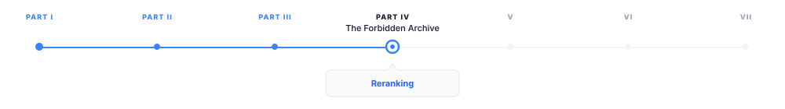
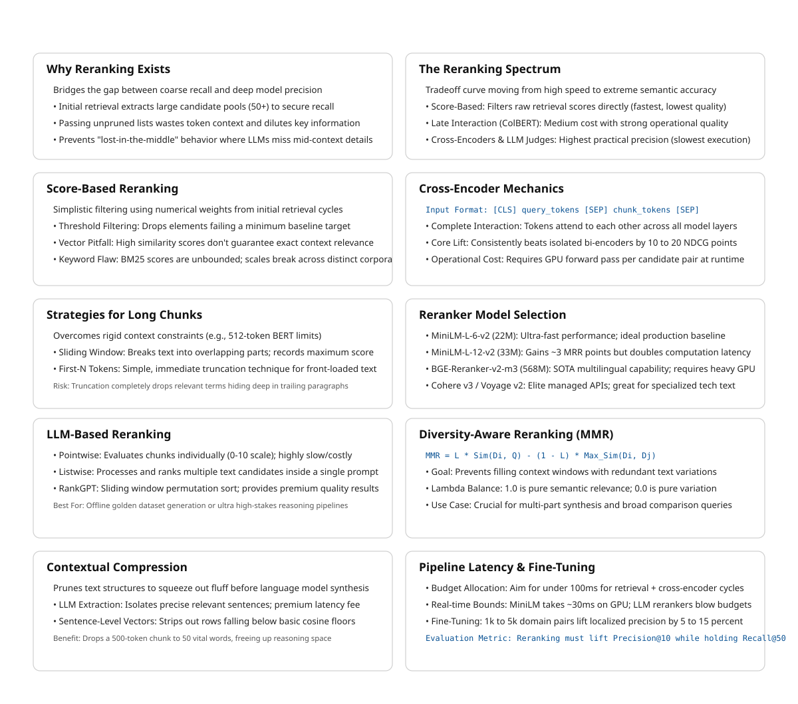

# Reranking

> **The canonical question for this chapter:**
> *Initial retrieval returns 50 candidates. The language model can use 10. How
> do you pick the right 10 and why is the answer more subtle than just sorting
> by embedding similarity?*

---

::: {.callout-note appearance="minimal"}
**Where are we?**

{#fig-progress width="80%"}

Initial retrieval maximized recallthat helps to find everything that might be relevant.
Now the problem inverts: among 50 candidates, which 10 should the language model
actually see? Passing all 50 wastes context budget, dilutes signal with noise,
and increases the probability of lost-in-the-middle failures. Reranking is the
precision stage, the step that decides which evidence the model gets to work with.
:::

---

## Why reranking exists as a separate stage

Recall and precision pull in opposite directions. A retriever that returns 50
candidates to maximize recall will include: chunks that directly answer the
query, chunks that are topically related but do not answer the specific question,
chunks that share surface features with the query but are semantically unrelated,
and chunks that answer part of a multi-part query but not the whole thing.

The language model receives whatever context you pass it. If you pass 50 chunks
(many irrelevant) several failure modes emerge. The model spends context
window budget on noise. Relevant information is diluted among irrelevant
information amd finally long contexts increase the probability of the 
lost-in-the-middle phenomenon, where the model fails to use information in the 
middle of a long context.

Reranking is the precision stage: given 50 candidates from initial retrieval,
identify the 10 most likely to help the model answer the query correctly.

---

## The spectrum of reranking approaches

Reranking methods form a spectrum from fast-and-approximate to slow-and-accurate:

```
Fast                                                         Accurate
  │                                                              │
  ▼                                                              ▼
Score-based    Bi-encoder     Late interaction    Cross-encoder    LLM judge
(retrieval     (embedding     (ColBERT           (BERT-based      (GPT-4 as
 scores)        similarity)    MaxSim)             reranker)        evaluator)
     ↑               ↑              ↑                  ↑                ↑
Already done   Initial          Medium             Best practical    Expensive;
in retrieval   retrieval        cost/quality       quality/cost      use for
               produces this    tradeoff           tradeoff          offline tasks
```

"Reranking" in common usage refers to applying a cross-encoder or late-
interaction model as a second stage after initial retrieval. The earlier parts
of the spectrum are usually considered part of retrieval itself.

---

## Score-based reranking

The simplest approach: use the scores from initial retrieval to filter candidates
before passing them to the language model.

### Threshold filtering

```python
def threshold_filter(
    candidates: list[tuple[str, float]],
    min_score: float = 0.7,
) -> list[tuple[str, float]]:
    return [
        (chunk_id, score) for chunk_id, score in candidates
        if score >= min_score
    ]
```

This works for cosine similarity scores but requires careful calibration. The
right threshold depends on the embedding model (different models have different
score distributions), the query type, and the corpus. A threshold tuned on one
distribution fails on another.

Thresholds on BM25 scores are even less reliable these scores are unbounded
and vary with corpus size and document length distribution.

### Why score-based filtering alone is insufficient

Embedding similarity is not the same as relevance. A chunk about a different
product from the same company might have a cosine similarity of 0.85 with the
query (above any reasonable threshold) while being completely irrelevant to
the specific question. Score-based filtering works only when similarity
correlates well with relevance, which holds for queries within the embedding
model's training distribution and breaks for out-of-distribution queries,
domain-specific content, or multi-hop reasoning.


---

## Cross-encoder reranking

Cross-encoders are the most widely used practical reranking approach, they 
consistently outperform bi-encoders for relevance scoring and fit within 
interactive latency budgets when deployed on GPU.

### Why cross-encoders are more accurate than bi-encoders

A bi-encoder encodes query and document independently:

```
Query  → Encoder → q_embedding (fixed vector)
Chunk  → Encoder → c_embedding (fixed vector)
Score  = cosine_similarity(q_embedding, c_embedding)
```

The query embedding does not "see" the chunk during encoding. Every
query-chunk interaction happens at score computation which is a single dot 
product.

A cross-encoder takes both as input simultaneously:

```
[CLS] query tokens [SEP] chunk tokens [SEP]
                  → Encoder
                  → [CLS] representation
                  → scalar relevance score
```

Query and chunk tokens attend to each other through all attention layers. The
model can detect that a chunk discusses the right concept in the wrong context,
that a surface-level match is semantically irrelevant, or that a specific phrase
in the query requires a specific phrase in the chunk that is absent.

This expressiveness is why cross-encoders consistently outperform bi-encoders
for relevance scoring by 10–20 NDCG points on standard benchmarks. The
tradeoff: cross-encoders cannot be pre-computed. Every query-chunk pair requires
a fresh forward pass, making them too slow for full-corpus search but fast
enough for a 50-candidate reranking step.

### Cross-encoder inference

```python
from sentence_transformers import CrossEncoder
import numpy as np

class CrossEncoderReranker:
    def __init__(
        self,
        model_name: str = "cross-encoder/ms-marco-MiniLM-L-6-v2"
    ):
        self.model = CrossEncoder(model_name, max_length=512)

    def rerank(
        self,
        query: str,
        candidates: list[tuple[str, str]],  # (chunk_id, chunk_text)
        top_k: int = 10,
        batch_size: int = 32,
    ) -> list[tuple[str, float]]:
        if not candidates:
            return []

        pairs = [(query, chunk_text) for _, chunk_text in candidates]

        # Score in batches to avoid OOM on GPU
        all_scores = []
        for i in range(0, len(pairs), batch_size):
            batch = pairs[i:i + batch_size]
            scores = self.model.predict(batch, show_progress_bar=False)
            all_scores.extend(scores.tolist())

        scored = sorted(
            zip([chunk_id for chunk_id, _ in candidates], all_scores),
            key=lambda x: x[1],
            reverse=True,
        )
        return scored[:top_k]
```

### Input length and truncation

Cross-encoders have a maximum input length (typically 512 tokens for BERT-based
models). The query plus chunk must fit within this limit. If the chunk is too
long, it must be truncated which may result in cuting the relevant portion.

Strategies for long chunks:

**Sliding window**: split the chunk into overlapping windows, score each, take
the maximum as the chunk score. Most reliable but multiplies inference calls.

**First-N tokens**: relevant facts often appear near the start of chunks; simple
and fast. Fails when the key passage is in the second half.

```python
def rerank_long_chunks(
    query: str,
    candidates: list[tuple[str, str]],
    reranker: CrossEncoder,
    max_chunk_tokens: int = 400,
    stride: int = 200,
) -> list[tuple[str, float]]:
    chunk_scores = {}

    for chunk_id, chunk_text in candidates:
        tokens = chunk_text.split()  # simplified; use real tokenizer in production

        if len(tokens) <= max_chunk_tokens:
            score = reranker.model.predict([(query, chunk_text)])[0]
        else:
            window_scores = []
            for start in range(0, len(tokens), stride):
                window = " ".join(tokens[start:start + max_chunk_tokens])
                window_scores.append(reranker.model.predict([(query, window)])[0])
            score = max(window_scores)

        chunk_scores[chunk_id] = score

    return sorted(chunk_scores.items(), key=lambda x: x[1], reverse=True)
```

### Cross-encoder model selection

The choice of cross-encoder involves quality, latency, and cost tradeoffs:

**ms-marco-MiniLM-L-6-v2** (22M parameters): fastest option, good for low-
latency requirements. ~39 MRR@10 on MS MARCO dev. The right default for most
production applications.

**ms-marco-MiniLM-L-12-v2** (33M parameters): better quality than L-6, roughly
2× slower. ~42 MRR@10. Worth the latency cost when quality is critical.

**BGE-Reranker-v2-m3** (568M parameters): state-of-the-art open-source cross-
encoder. Multilingual, strong across BEIR benchmarks. Requires GPU for
acceptable latency.

**Cohere Rerank 3** (commercial API): among the best retrieval quality available
for English. Priced per API call. No GPU infrastructure required.

**Voyage Rerank 2** (commercial API): strong competitor to Cohere, particularly
for code and technical content.


---

## LLM-based reranking

Using a large language model as the relevance judge. More accurate than cross-
encoders for complex relevance judgments but significantly more expensive.

### Pointwise LLM scoring

Score each candidate individually by asking the LLM whether it is relevant:

```python
def llm_rerank_pointwise(
    query: str,
    candidates: list[tuple[str, str]],
    llm,
    top_k: int = 10,
) -> list[tuple[str, float]]:
    scored = []

    for chunk_id, chunk_text in candidates:
        prompt = f"""On a scale of 0 to 10, how relevant is the following passage
to answering this query? Respond with only a number.

Query: {query}

Passage: {chunk_text}

Relevance score (0-10):"""

        response = llm.complete(prompt).strip()
        try:
            score = float(response)
        except ValueError:
            score = 0.0
        scored.append((chunk_id, score))

    return sorted(scored, key=lambda x: x[1], reverse=True)[:top_k]
```

This requires one LLM call per candidate. For 50 candidates, that is 50 LLM
calls it is expensive and slow (5–20 seconds depending on model and parallelism).

### Listwise LLM reranking

Score all candidates together in a single prompt:

```python
def llm_rerank_listwise(
    query: str,
    candidates: list[tuple[str, str]],
    llm,
    top_k: int = 10,
) -> list[tuple[str, float]]:
    candidates_text = "\n\n".join([
        f"[{i+1}] {chunk_text[:300]}..."
        for i, (_, chunk_text) in enumerate(candidates)
    ])

    prompt = f"""Rank the following passages by relevance to the query.
Return a JSON array of passage numbers in order of relevance (most relevant first).
Numbers only, no explanation.

Query: {query}

Passages:
{candidates_text}

Ranking (JSON array):"""

    response = llm.complete(prompt).strip()

    try:
        ranking = json.loads(response)
    except json.JSONDecodeError:
        ranking = list(range(1, len(candidates) + 1))

    result = []
    for rank, position in enumerate(ranking[:top_k]):
        idx = position - 1
        if 0 <= idx < len(candidates):
            result.append((candidates[idx][0], 1.0 / (rank + 1)))

    return result
```

One LLM call regardless of candidate count, but candidate text must fit in
the prompt. For 50 candidates at 300-character truncation: approximately 15,000
characters per query is feasible but expensive.

### Sliding window listwise reranking (RankGPT)

For long candidate lists that do not fit in a single prompt:

```python
def rankgpt_rerank(
    query: str,
    candidates: list[tuple[str, str]],
    llm,
    window_size: int = 20,
    step_size: int = 10,
    top_k: int = 10,
) -> list[tuple[str, float]]:
    ranked = list(candidates)

    # Slide window from bottom to top
    for start in range(len(ranked) - window_size, -1, -step_size):
        end = min(start + window_size, len(ranked))
        window = ranked[start:end]
        window_ranking = llm_rerank_listwise(query, window, llm, top_k=len(window))
        id_to_rank = {cid: r for r, (cid, _) in enumerate(window_ranking)}
        window.sort(key=lambda x: id_to_rank.get(x[0], len(window)))
        ranked[start:end] = window

    return [
        (chunk_id, 1.0 / (rank + 1))
        for rank, (chunk_id, _) in enumerate(ranked[:top_k])
    ]
```

RankGPT achieves high-quality rankings (comparable to or better than cross-
encoders on several benchmarks) but requires many LLM calls for long candidate
lists. It is impractical for real-time applications.

### When to use LLM reranking

LLM reranking is appropriate for offline processing (generating training data
for a smaller reranker), high-value queries where stakes justify cost and latency
(legal document review, medical information retrieval), complex relevance
judgments requiring multi-hop reasoning, and evaluation (grading retrieval
quality at scale). For most interactive applications, cross-encoder reranking
provides the best quality/cost/latency tradeoff.

---

## Diversity-aware reranking

Relevance alone is not sufficient. If the top 10 most relevant chunks all say
the same thing (different phrasings of the same fact) passing all 10 wastes
context window budget and adds no new information.

Diversity-aware reranking selects a set that is both relevant and diverse,
covering different aspects of the query.

### Maximum Marginal Relevance (MMR)

Maximum Marginal Relevance (MMR) iteratively selects chunks that maximize a 
combination of relevance to the query and  distance from already-selected chunks. 
It balances retrieving highly relevant chunks while avoiding selecting multiple 
chunks that contain the same information.

$$
\operatorname{MMR}(D_i) =
\lambda \operatorname{Sim}(D_i,Q)
-
(1-\lambda)
\max_{D_j \in S}
\operatorname{Sim}(D_i,D_j)
$$

where: $D_i$ is a candidate chunk being evaluated, Q is the query, S is the set 
of chunks already selected, $\operatorname{Sim}(D_i,Q)$ measures relevance between 
the chunk and query, $\operatorname{Sim}(D_i,D_j)$ measures redundancy between the 
candidate chunk and previously selected chunks, and $\lambda$ controls the trade-off 
between relevance and diversity.

At each iteration, MMR chooses:

$$
D^* =
\arg\max_{D_i \in R \setminus S}
\left[
\lambda \operatorname{Sim}(D_i,Q)
-
(1-\lambda)
\max_{D_j \in S}
\operatorname{Sim}(D_i,D_j)
\right]
$$

where R is the set of all retrieved candidate chunks.

```python
import numpy as np
from sklearn.metrics.pairwise import cosine_similarity

def mmr(
    query_embedding: np.ndarray,
    candidate_embeddings: np.ndarray,
    candidate_ids: list[str],
    top_k: int = 10,
    lambda_param: float = 0.5,  # 0 = pure diversity, 1 = pure relevance
) -> list[str]:
    query_similarities = (candidate_embeddings @ query_embedding).flatten()

    selected_indices = []
    remaining_indices = list(range(len(candidate_ids)))

    for _ in range(min(top_k, len(remaining_indices))):
        if not selected_indices:
            best_idx = remaining_indices[
                np.argmax(query_similarities[remaining_indices])
            ]
        else:
            selected_embeddings = candidate_embeddings[selected_indices]
            mmr_scores = []
            for idx in remaining_indices:
                relevance = query_similarities[idx]

                max_sim_to_selected = cosine_similarity(
                    [candidate_embeddings[idx]], selected_embeddings
                )[0].max()

                mmr_score = (
                    lambda_param * relevance
                    - (1 - lambda_param) * max_sim_to_selected
                )

                mmr_scores.append((idx, mmr_score))

            best_idx = max(mmr_scores, key=lambda x: x[1])[0]

        selected_indices.append(best_idx)
        remaining_indices.remove(best_idx)

    return [candidate_ids[i] for i in selected_indices]
```
lambda_param = 1.0 is pure relevance, meaning MMR becomes equivalent to sorting
chunks by query similarity.

lambda_param = 0.0 is pure diversity, selecting chunks that are maximally different
from previously selected chunks.

lambda_param = 0.5 provides an equal balance between relevance and diversity and is
a common default value.

MMR is computationally cheap because it operates on pre-computed embedding vectors
and cosine similarities. It is particularly effective for retrieval-augmented
generation (RAG) systems and document retrieval pipelines where highly relevant
chunks often contain overlapping or redundant information.


### When diversity matters

For factual queries with a single answer, diversity is counterproductive,
similar chunks provide useful redundancy if the most relevant one is imprecise.

For multi-part queries, complex questions, or queries requiring synthesis from
multiple sources, diversity is essential. "What are the pros and cons of OAuth
2.0?" benefits from chunks discussing both advantages and disadvantages, not
five chunks about the same advantage. Use diversity-aware selection for
summarization tasks, "compare/contrast" queries, "list" queries, and corpora
with heavy content duplication.

---

## Contextual compression

Rather than selecting which chunks to include, contextual compression extracts
only the relevant portion of each retrieved chunk which results in freeing context 
budget for more chunks or longer reasoning.

### LLM extraction

```python
def compress_chunk(query: str, chunk: str, llm) -> str:
    prompt = f"""Extract the portion of the following passage that is relevant
to answering the query. If nothing is relevant, return "IRRELEVANT".
Return only the extracted text, no explanation.

Query: {query}

Passage: {chunk}

Relevant excerpt:"""

    result = llm.complete(prompt).strip()
    return "" if result.upper() == "IRRELEVANT" else result
```

A 500-token chunk might compress to a 50-token relevant excerpt. The cost: one
LLM call per retrieved chunk. For 10 chunks, that is 10 LLM calls before the
final generation call.

### Sentence-level extraction

A cheaper alternative: extract only sentences similar to the query using
embedding similarity.

```python
def extract_relevant_sentences(
    query: str,
    chunk: str,
    embedding_model,
    top_k_sentences: int = 3,
    min_similarity: float = 0.4,
) -> str:
    sentences = split_into_sentences(chunk)
    if not sentences:
        return chunk

    q_emb = embedding_model.encode(query, normalize_embeddings=True)
    s_embs = embedding_model.encode(sentences, normalize_embeddings=True)
    similarities = s_embs @ q_emb

    relevant = [
        i for i, sim in enumerate(similarities) if sim >= min_similarity
    ]
    relevant = sorted(relevant, key=lambda i: similarities[i], reverse=True)[:top_k_sentences]
    relevant_sorted = sorted(relevant)  # restore original order for coherence

    return " ".join(sentences[i] for i in relevant_sorted)
```

Sentence extraction is faster than LLM extraction but less precise. It cannot
detect that a sentence is relevant only given the preceding sentence, or that
a tangentially related sentence is the key to answering the query.

---

## The full reranking pipeline

```
User query
     │
     ▼
[Optional] Query reformulation
     │
     ▼
Initial retrieval: dense + sparse, top-50 to top-100 
     │
     ▼
Cross-encoder reranking: top-50 → top-15
     │
     ▼
[Optional] MMR diversity selection: top-15 → top-10
     │
     ▼
[Optional] Contextual compression: extract relevant sentences per chunk
     │
     ▼
Context assembly → Language model 
```

Not every application needs every stage. The decision depends on latency budget,
quality requirements, and corpus characteristics.

### Latency budget allocation

For a 500ms TTFT target:

```
Query embedding:                   10ms
Dense retrieval (HNSW):            20ms
Sparse retrieval (BM25):           15ms
RRF fusion:                         5ms
Cross-encoder reranking
  (MiniLM-L-6, 50 candidates, GPU):30ms
Context assembly:                   5ms
LLM TTFT (first token):          ~200ms
──────────────────────────────────────
Total:                             285ms  ← within 500ms budget

With LLM reranking (50 candidates): +2,000ms  ← blows the budget
With MMR (cosine similarities):        +10ms  ← acceptable
```

The reranking budget is typically 20–100ms in interactive applications. Cross-
encoder reranking on GPU with small models (MiniLM) fits. Cross-encoder on CPU
does not for most TTFT targets. LLM reranking does not.

---

## Training custom rerankers

Off-the-shelf cross-encoders are trained on general retrieval datasets (MS MARCO,
Natural Questions) but for specialized domains, fine-tuning can improve NDCG@10
by 5–15%.

### Training data sources

**User click data**: queries users submitted plus results they clicked (positive)
and results they saw but did not click (negative). High quality, requires
sufficient production traffic.

**Synthetic generation**: use an LLM to generate queries for known-relevant
chunks and sample hard negatives from the retrieval system.

**LLM-judged pairs**: retrieve candidates, judge relevance with an LLM, train
the cross-encoder on those judgments.

### Fine-tuning a cross-encoder

```python
from sentence_transformers import CrossEncoder, InputExample
from torch.utils.data import DataLoader

train_samples = [
    InputExample(
        texts=["how long before session timeout?",
               "The default token expiration is 3600 seconds."],
        label=1.0,  # relevant
    ),
    InputExample(
        texts=["how long before session timeout?",
               "API rate limits apply to all endpoints."],
        label=0.0,  # not relevant
    ),
    # ... 1,000–5,000 more examples
]

model = CrossEncoder("cross-encoder/ms-marco-MiniLM-L-6-v2", num_labels=1)
train_dataloader = DataLoader(train_samples, shuffle=True, batch_size=32)

model.fit(
    train_dataloader=train_dataloader,
    epochs=3,
    warmup_steps=100,
    output_path="./domain-reranker",
)
```

Even 1,000–5,000 domain-specific examples produce measurable improvements for
specialized corpora. The investment is typically worthwhile for high-value RAG
applications where a general model underperforms.

---

## Measuring reranking quality

### Pipeline stage comparison

Measure how precision improves at each stage:

```python
def evaluate_pipeline_stages(
    eval_queries: list[dict],  # {query, relevant_chunk_ids}
    retriever,
    reranker,
    k_retrieve: int = 50,
    k_rerank: int = 10,
) -> dict:
    retrieval_recall    = []
    retrieval_precision = []
    reranking_precision = []

    for item in eval_queries:
        query        = item["query"]
        relevant_ids = set(item["relevant_chunk_ids"])

        retrieved    = retriever.retrieve(query, top_k=k_retrieve)
        retrieved_ids = {cid for cid, _ in retrieved}

        retrieval_recall.append(
            len(relevant_ids & retrieved_ids) / len(relevant_ids)
        )
        retrieval_precision.append(
            len(relevant_ids & {cid for cid, _ in retrieved[:k_rerank]}) / k_rerank
        )

        reranked     = reranker.rerank(query, retrieved, top_k=k_rerank)
        reranked_ids = {cid for cid, _ in reranked}

        reranking_precision.append(
            len(relevant_ids & reranked_ids) / k_rerank
        )

    return {
        f"retrieval_recall@{k_retrieve}":   np.mean(retrieval_recall),
        f"retrieval_precision@{k_rerank}":  np.mean(retrieval_precision),
        f"reranking_precision@{k_rerank}":  np.mean(reranking_precision),
        "precision_lift":
            np.mean(reranking_precision) / np.mean(retrieval_precision),
    }
```

A well-functioning reranker should lift Precision@10 by 20–50% relative to
initial retrieval while maintaining the Recall@50 of the retrieval stage.


---

## Key takeaways

- Reranking is the precision stage of a two-stage retrieve-then-rank pipeline;
  initial retrieval maximizes recall, reranking maximizes precision over the
  candidate set
- Cross-encoders jointly encode query and document through full attention,
  outperforming bi-encoders by 10–20 NDCG points; the tradeoff is that they
  cannot be pre-computed and are applied only to the candidate set (50–100
  chunks), not the full corpus
- For chunks longer than the cross-encoder's context limit, use a sliding window
  approach and take the maximum window score as the chunk score
- LLM-based reranking achieves the highest quality but is impractical for
  interactive applications — use it for offline tasks, training data generation,
  and evaluation
- MMR selects a set of chunks that is both relevant and diverse; the lambda
  parameter controls the tradeoff; use diversity selection for multi-part
  queries, summarization, and corpora with heavy content duplication
- Contextual compression extracts only the relevant portion of each chunk,
  freeing context budget — powerful when combined with a large top-k, at the
  cost of additional LLM calls per chunk
- Cross-encoder reranking on GPU with MiniLM adds ~30ms — fits within a 500ms
  TTFT budget; LLM reranking adds ~2,000ms and does not
- Fine-tuning a cross-encoder on 1,000–5,000 domain-specific examples improves
  NDCG@10 by 5–15% for specialized corpora; synthetic query generation from
  chunks is a scalable way to create training data
- Measure both Precision@k improvement and end-to-end answer quality; retrieval
  precision gains do not always translate linearly to answer quality gains

{#fig-progress width="90%"}

---

## Further reading

- Nogueira & Cho (2019). *Passage Re-ranking with BERT.* — Established cross-
  encoder reranking as the standard second-stage approach.
- Sun et al. (2023). *Is ChatGPT Good at Search? Investigating Large Language
  Models as Re-ranking Agents.* — RankGPT; listwise LLM reranking with sliding
  window.
- Pradeep et al. (2023). *RankZephyr: Effective and Robust Zero-Shot Listwise
  Reranking is a Breeze!* — Open-source LLM-based reranking.
- Liu et al. (2023). *Lost in the Middle: How Language Models Use Long Contexts.*
  — Why reranking and context compression matter for LLM context utilization.
- Cohere (2024). *Rerank 3 Technical Report.* — State-of-the-art commercial
  reranker; useful benchmark reference.

---
