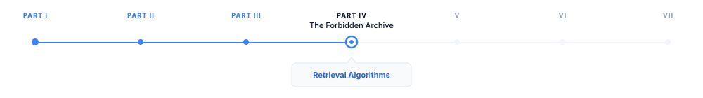

# Retrieval Algorithms

> **The canonical question for this chapter:**
> *Given a user query and a corpus of embedded chunks, what algorithms actually
> find the right chunks, and why is vector similarity alone not enough?*

---

::: {.callout-note appearance="minimal"}
**Where are we?**

{#fig-progress width="80%"}

The vector database is now in ready, and the queries are coming to be processed. 
This chapter explores the algorithms that transform a natural language query into 
a ranked list of relevant chunks, and explains why combining multiple retrieval 
methods consistently delivers better results than relying on any single approach. 
In a Retrieval-Augmented Generation (RAG) system, the retrieval stage has the greatest 
impact on answer quality, often more than the choice of language model or prompt design.

:::

---

## The retrieval problem

Retrieval is deceptively simple to describe: given a query, return the most
relevant chunks. In practice, no single algorithm reliably finds the right
chunks across all query types, corpus structures, and domain vocabularies.

Vector similarity search finds semantically related content but fails on exact
string matches, rare terms, and out-of-distribution vocabulary. Keyword search
(BM25) finds exact matches but fails when the query and document use different
words for the same concept. Re-ranking models produce better relevance signals
than either but are too slow to run over the full corpus. Each algorithm has
failure modes the others compensate for.

Production RAG systems that work reliably across diverse query types combine
multiple retrieval algorithms, using each where it performs best. This chapter
covers each algorithm in depth, then covers how to combine them.

---

## Dense retrieval: vector similarity search

Dense retrieval embeds the query and retrieves chunks whose embeddings are
nearest to the query embedding in vector space.

### What dense retrieval is good at

**Semantic matching.** The query "how long before my session expires" retrieves
the chunk "the default token expiration is 3600 seconds" because the embeddings
are nearby even though no words overlap.

**Paraphrase matching.** The query "terminate an employee" retrieves documents
about "offboarding" and "separation from the company", different words, same
concept.

**Cross-lingual retrieval.** With a multilingual embedding model, an English
query retrieves a French document about the same topic.

**Conceptual queries.** "Explain the difference between authentication and
authorization" retrieves relevant conceptual explanations even when the query
phrasing does not match any document passage verbatim.

### What dense retrieval fails at

**Rare and out-of-vocabulary terms.** The query "error code E1042" may produce
a poor embedding if E1042 is rare in the embedding model's training data. The
model has no strong statistical association to learn from, so E1042 gets embedded
near generic "error code" content rather than near the specific documentation
for E1042. The correct chunk may rank 500th.

**Exact string matching.** Product names, model numbers, person names, and
technical identifiers must match exactly. "GPT-4o" and "GPT-4" should not be
treated as semantically equivalent, they are different products and embedding
models can easily conflate them.

**High-specificity queries.** "What is the difference between TCP and UDP?"
embeds similarly to "compare two network protocols." Dense retrieval may surface
documents about other protocol comparisons that are not specifically about
TCP vs. UDP.

**Numerical and structured queries.** "Find all incidents from Q3 2024" requires
exact date matching. Embedding similarity cannot handle structured numerical
constraints.

---

## Sparse retrieval: BM25

BM25 (Best Match 25) is the dominant keyword retrieval algorithm. It extends
TF-IDF with term frequency saturation and length normalization, producing
relevance scores that behave well across a wide range of corpus and query types.

### The BM25 formula

For a query Q and document D:

$$
\mathrm{BM25}(D,Q) = \sum_{t \in Q} \mathrm{IDF}(t) \times 
\frac{\mathrm{TF}(t,D)\times(k_1+1)}
{\mathrm{TF}(t,D)+k_1\left(1-b+b\times\frac{|D|}{\mathrm{avgdl}}\right)}
$$

Where `t` iterates over query terms, `TF(t,D)` is term frequency in document D,
`IDF(t)` is $\log\left(\frac{N-\mathrm{df}(t)+0.5}{\mathrm{df}(t)+0.5}+1\right)$, N is total documents,
df(t) is documents containing term t, |D| is document length in tokens, avgdl
is average document length, k1 is the term frequency saturation parameter
(typically 1.2-2.0), and b is the length normalization parameter (typically 0.75).

**IDF** penalizes terms that appear in many documents ("the" and "is" get near-
zero IDF and a rare technical term gets high IDF).

**TF saturation** (k1 parameter) limits the advantage of high repetition. A
term appearing 100 times scores only marginally higher than one appearing 10
times. 

**Length normalization** (b parameter) favors shorter documents. A document that
mentions a query term once in 100 words scores higher than one that mentions it
once in 10,000 words.


### What BM25 is good at

**Exact term matching.** "Error code E1042" retrieves documents containing
"E1042" precisely, regardless of whether the embedding model has seen E1042 in
training.

**Named entities.** Person names, organization names, product names, and proper
nouns are retrieved reliably by exact match.

**Technical and domain-specific terminology.** Medical codes, legal citations,
scientific terms, and other domain vocabulary with precise meaning are handled
by exact matching.

### What BM25 fails at

**Vocabulary mismatch.** "Car" and "automobile" are the same concept but BM25
treats them as different terms. The query "automobile maintenance" does not
retrieve documents about "car repair."

**Conceptual queries.** "Explain how transformers work" has no single discriminating
term. Every technical document might contain "work"; many contain "transformer."
BM25 cannot reason about the conceptual relationship.

**Short queries.** BM25 degrades for one or two word queries because there are
few terms to score. "Timeout" as a query retrieves all documents mentioning
timeout regardless of whether they are about network timeouts, session timeouts,
or database timeouts.

---

## Hybrid retrieval

Combining dense and sparse retrieval consistently outperforms either alone on
real world RAG benchmarks. Their failure modes are complementary: BM25 catches
exact matches that dense retrieval misses; dense retrieval catches semantic
matches that BM25 misses.

### Reciprocal Rank Fusion (RRF)

RRF is the simplest and most robust fusion method that relies only on rank positions 
rather than score magnitudes, eliminating the need for score normalization.


For a set of retrieval systems, each producing a ranked list, RRF score for a chunk `c` 
is defined as:

$$
\mathrm{RRF}(c) = \sum_{s \in S} \frac{1}{k + \mathrm{rank}_s(c)}
$$

where `S` represents the set of retrieval systems, and $\mathrm{rank}_s(c)$ denotes the 
1-indexed rank of chunk `c` in the result list returned by system `s`. The parameter `k` 
is a smoothing constant, typically set to 60, that controls the influence of lower-ranked 
results. If a chunk does not appear in a system's result list, that system contributes a 
score of 0 for the chunk.


**Why RRF is robust.** RRF relies on rank positions rather than raw retrieval scores. 
For example, a chunk with a dense retrieval score of 0.99 receives the same contribution as 
a chunk with a score of 0.51 if both are ranked first. This avoids the need to normalize or 
align score scales across different retrieval systems. Additionally, RRF naturally handles 
varying result sets by rewarding chunks that consistently appear across multiple systems

**RRF in practice.** Retrieve a larger candidate pool from each system (e.g., top-50 or 
top-100 results) before applying fusion. RRF can promote chunks that are ranked moderately 
across multiple systems, for example, a chunk ranked 30th by one system and 5th by another 
may outperform a chunk appearing only in the top-10 of a single system.


### Weighted score combination

This is an alternative approach to normalize scores from each retrieval system to the same 
range, typically ([0,1]), and combine them using system-specific weights:

```
hybrid_score = α × normalized_dense_score + (1 - α) × normalized_bm25_score
```

Where `α = 1.0` is pure dense and `α = 0.0` is pure sparse. Weaviate uses this
with its `alpha` parameter. The limitation: BM25 scores are unbounded and skewed;
cosine similarity is bounded to [-1, 1] and normalization artifacts can cause
instability.

RRF is generally more robust than weighted combination in practice because it
does not require score normalization. Use weighted combination only when you
have domain-specific knowledge about the relative importance of semantic vs.
keyword matching for your query distribution.

---


## Query expansion and reformulation

Retrieval quality depends heavily on query phrasing. Users phrase queries
differently from how documents phrase answers. Query expansion and reformulation
bridge this gap.

**Synonym expansion** Expand queries with synonyms and related terms before 
performing BM25 retrieval. Simple synonym expansion can improve recall by matching 
additional relevant terms, but it may also introduce noise by adding less relevant 
matches. Careful tuning of the BM25 `k_1` parameter can help reduce the impact of 
these added terms on the final scoring.


**Multi-query retrieval.** Generate multiple semantically equivalent or complementary 
reformulations of the original query and retrieve results for each. The retrieved 
results are then merged and deduplicated to produce a more comprehensive candidate set. 
This approach consistently improves recall, particularly for ambiguous, underspecified, 
or poorly phrased queries. Although generating multiple queries with an LLM typically 
adds 200–500 ms of latency, the improvement in retrieval quality often justifies the 
additional cost when answer accuracy is the primary objective.

**Step-back prompting.** For complex analytical queries, first generate or retrieve 
information for a broader, more general "step-back" question and use it as additional 
context for answering the original query. This provides foundational knowledge that may 
be missing from the specific question.

For example, the query *"What causes the token refresh to fail?"* can benefit from 
retrieving background information on *"How does token refresh work?"* first. The broader 
context helps explain the underlying mechanism and makes it easier to identify and answer 
the specific failure causes.


---

## Contextual and conversational retrieval

In a multi-turn conversation, follow-up messages are often not self-contained.
"What about for enterprise customers?" makes no sense as a standalone retrieval
query without the previous turn's context.

**Standalone query generation** Rewrite the user's message into a self-contained 
query that incorporates the necessary context from previous conversation turns 
before performing retrieval.

Without standalone query generation, retrieval for follow-up questions often fails 
because the query lacks the context needed to identify the intended topic. For example, 
*"What about for enterprise customers?"* may retrieve general information about enterprise 
customers rather than information related to the specific subject discussed earlier. 
Generating standalone queries is one of the most common and effective improvements 
for conversational RAG systems.

**Conversation-aware embedding**, A faster alternative to standalone query generation is 
to concatenate recent conversation context with the current user query before creating the 
embedding.

This approach avoids the additional latency of an LLM-based rewriting step, but it is 
generally less reliable because the combined text may not accurately represent the user's 
true information need. The embedding can be influenced by irrelevant conversational details 
rather than focusing on the core query intent. Use standalone query generation when retrieval 
quality is the priority, and conversation-aware embedding when lower latency is more important.


---

## Knowledge graph retrieval

For some domains, structured knowledge in graph form enables retrieval that
pure text search cannot support.

### When graphs help

Consider a question about a complex regulatory requirement that depends on:
the regulation text (in documents), which entities are subject to it (structured
data), how it relates to other regulations (graph relationships), and which
exceptions apply (structured rules). Text retrieval finds the regulation document.
It cannot navigate the relationships between regulatory entities, exceptions,
and cross-references.

GraphRAG (Edge et al., 2024) extracts entities and relationships from documents
and builds a knowledge graph. Retrieval traverses the graph to gather related
entities before generating a response.

### Entity extraction for graph building

```python
def extract_entities_and_relations(text: str, llm) -> dict:
    prompt = f"""Extract entities and relationships from the following text.
Return a JSON object with:
- "entities": list of {{name, type, description}} objects
- "relations": list of {{subject, predicate, object}} triples

Text: {text}"""

    response = llm.complete(prompt)
    return json.loads(response)

# Build graph incrementally from corpus
import networkx as nx

graph = nx.DiGraph()
for chunk in corpus_chunks:
    extracted = extract_entities_and_relations(chunk.text, llm)

    for entity in extracted["entities"]:
        graph.add_node(entity["name"], **entity)

    for relation in extracted["relations"]:
        graph.add_edge(
            relation["subject"], relation["object"],
            label=relation["predicate"],
            source_chunk=chunk.id
        )
```

### Graph retrieval at query time

```python
def graph_retrieve(
    query: str, graph, text_retriever, k: int = 5
) -> list:
    query_entities = extract_entities(query)

    # Expand to related entities via graph traversal
    expanded = set(query_entities)
    for entity in query_entities:
        if entity in graph:
            expanded.update(nx.neighbors(graph, entity))

    # Gather chunks associated with expanded entities
    entity_chunks = []
    for entity in expanded:
        entity_chunks.extend(graph.nodes[entity].get("source_chunks", []))

    # Merge with standard text retrieval
    text_results = text_retriever.retrieve(query, top_k=k)
    return list(set(entity_chunks) | set(r[0] for r in text_results))
```

GraphRAG is powerful for corpora with rich entity relationships (medical
knowledge bases, legal systems, financial networks) but adds significant
ingestion complexity (entity extraction per chunk) and retrieval complexity
(graph traversal). 
---

## Retrieval evaluation

### Metrics

**Recall@k**: of all truly relevant chunks, what fraction appear in the top-k
retrieved chunks?

$$
\mathrm{Recall@k} =
\frac{
\left|\{\mathrm{relevant}\} \cap \{\mathrm{top\text{-}k\ retrieved}\}\right|
}{
\left|\{\mathrm{relevant}\}\right|
}
$$

This is the primary metric for RAG. If the relevant chunk is not in the top-k,
the language model cannot use it and no downstream component can compensate.

**Precision@k**: of the top-k retrieved chunks, what fraction are truly relevant?

$$
\mathrm{Precision@k} =
\frac{
\left|\{\mathrm{relevant}\} \cap \{\mathrm{top\text{-}k\ retrieved}\}\right|
}{
k
}
$$

**Mean Reciprocal Rank (MRR)**: average reciprocal rank of the first relevant
result across queries.

$$
\mathrm{MRR} =
\frac{1}{|\mathrm{queries}|}
\sum_{q \in \mathrm{queries}}
\frac{1}{\mathrm{rank\_of\_first\_relevant}(q)}
$$

**NDCG@k**: accounts for graded relevance and position. A relevant chunk at
rank 1 contributes more than the same chunk at rank 5.
$$
\mathrm{NDCG@k} =
\frac{\mathrm{DCG@k}}{\mathrm{IDCG@k}}
$$

$$
\mathrm{DCG@k} =
\sum_{i=1}^{k}
\frac{2^{rel_i}-1}{\log_2(i+1)}
$$

$$
\mathrm{IDCG@k} =
\sum_{i=1}^{k}
\frac{2^{rel_i^*}-1}{\log_2(i+1)}
$$


---

## The full retrieval pipeline

A production pipeline combining the techniques from this chapter:

```python
class HybridRetriever:
    def __init__(self, vector_db, bm25_index, embedding_model, llm):
        self.vector_db     = vector_db
        self.bm25          = bm25_index
        self.embedding_model = embedding_model
        self.llm           = llm

    def retrieve(
        self,
        query: str,
        conversation_history: list[dict] | None = None,
        filters: dict | None = None,
        top_k: int = 10,
    ) -> list[dict]:

        # Step 1: Resolve conversational context
        retrieval_query = query
        if conversation_history:
            retrieval_query = generate_standalone_query(
                conversation_history, query, self.llm
            )

        # Step 2: Dense retrieval
        query_embedding = self.embedding_model.encode(
            f"query: {retrieval_query}", normalize_embeddings=True
        )
        dense_results = self.vector_db.search(
            query_embedding, top_k=50, filters=filters
        )

        # Step 3: Sparse retrieval
        sparse_results = self.bm25.search(retrieval_query, top_k=50)

        # Step 4: Fuse with RRF
        fused = reciprocal_rank_fusion([dense_results, sparse_results], k=60)
        candidates = fused[:100]  # top-100 for re-ranking

        # Step 5: Re-rank 
        # reranked = reranker.rerank(retrieval_query, candidates, top_k)

        # Step 6: Return top results
        return [self.get_chunk(chunk_id) for chunk_id, _ in candidates[:top_k]]
```


---

## Key takeaways

- No single retrieval algorithm works well for all query types; dense retrieval
  excels at semantic matching, BM25 excels at exact term matching, and their
  failure modes are complementary — hybrid retrieval consistently outperforms
  either alone
- BM25 scores by term frequency (saturated), inverse document frequency, and
  length normalization; it is essential for exact matching of rare terms,
  product codes, and named entities that embedding models handle poorly
- Reciprocal Rank Fusion is the most robust fusion method because it depends
  only on rank positions, not score magnitudes — no normalization required;
  retrieve top-50 or top-100 from each system before fusing
- Multi-query retrieval generates paraphrase variants and fuses results,
  improving recall for ambiguous queries at the cost of one LLM call per query
- Standalone query generation is mandatory for multi-turn conversations; direct
  retrieval on follow-up questions without context rewriting consistently fails
  and is one of the most common fixable RAG failures
- GraphRAG adds entity-relationship traversal for domains with rich structured
  relationships; adds significant complexity and is only worth it when text
  retrieval quality is provably insufficient for relationship-dependent queries
- Recall@k on a held-out evaluation set is the only reliable way to measure
  retrieval quality; build this before tuning anything else in the RAG pipeline

{#fig-progress width="90%"}

---

## Further reading

- Robertson & Zaragoza (2009). *The Probabilistic Relevance Framework: BM25
  and Beyond.* — The authoritative BM25 reference; explains the mathematical
  motivation for saturation and length normalization.
- Karpukhin et al. (2020). *Dense Passage Retrieval for Open-Domain Question
  Answering.* — established dense retrieval for question answering.
- Cormack et al. (2009). *Reciprocal Rank Fusion Outperforms Condorcet and
  Individual Rank Learning Methods.* — The RRF paper.
- Ma et al. (2023). *Fine-Tuning LLaMA for Multi-Stage Text Retrieval.* — LLM-
  based query reformulation for improved retrieval.
- Edge et al. (2024). *From Local to Global: A Graph RAG Approach to Query-
  Focused Summarization.* — GraphRAG; entity-based retrieval for complex
  multi-document reasoning.
- Es et al. (2023). *RAGAS: Automated Evaluation of Retrieval Augmented
  Generation.* — End-to-end RAG evaluation framework including retrieval
  metrics.
- Thakur et al. (2021). *BEIR: A Heterogeneous Benchmark for Zero-Shot
  Evaluation of Information Retrieval Models.* — The standard benchmark for
  comparing retrieval algorithms across diverse domains.

---
