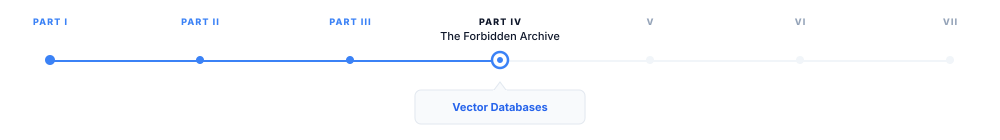
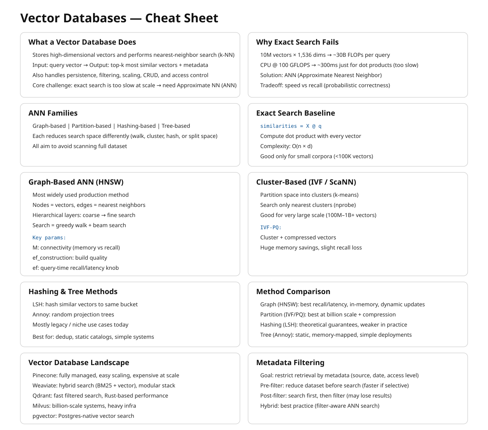

# Vector Databases

> **The canonical question for this chapter:**
> *You have 10 million embeddings and a query arrives. You need the 10 most similar
> vectors in under 50 milliseconds how does that actually work and which
> system should you use?*

---

::: {.callout-note appearance="minimal"}
**Where are we?**

{#fig-progress width="80%"}

Embeddings converted your chunks into vectors. Now those vectors need a home,
a system that stores them durably, indexes them for fast search, and returns
the most similar ones for any query in interactive latency. This chapter covers
how that works algorithmically and which systems implement it, and how to
choose between them.
:::

---

## What a vector database does

A vector database stores high-dimensional vectors and answers nearest-neighbor
queries: given a query vector, return the k vectors in the database most
similar to it, along with their associated metadata and document text.

Although conceptually simple, efficient vector search at scale is far from trivial. 
Exact nearest-neighbor search over 10 million 1,536-dimensional vectors requires 
computing 10 million dot products per query. At 1,536 dimensions and float32 
precision, each dot product requires 1,536 multiplications and 1,535 additions. 
For 10 million vectors, that is 30 billion floating-point operations per query. 
On a CPU doing 100 GFLOPS, that is 300 milliseconds too slow for an interactive 
system.

The solution is approximate nearest neighbor (ANN) search: algorithms that
find vectors very likely to be among the true top-k, fast enough for
interactive latency, with a small probability of missing some true nearest
neighbors. The accuracy/speed tradeoff is the central engineering parameter
of every vector search system.

Beyond search, a vector database also handles persistent storage of vectors
and metadata, metadata filtering (retrieve only vectors where
`source == "legal_docs"`), CRUD operations, consistency and durability
guarantees, horizontal scaling as the corpus grows, and access control.

Choosing the right system requires understanding how ANN algorithms work,
what the operational tradeoffs are, and what your actual requirements are.

---

## How ANN Search Works

ANN search is not one algorithm but a family of approaches with different
tradeoffs between build time, query latency, memory footprint, and recall.
Production vector databases typically implement several of these and let you
choose (or choose automatically based on your data). Understanding the whole
family, is what lets you diagnose why a system is slow, why recall is lower 
than expected, or which index type to reach for at a given scale.

### The exact search baseline

Before approximation makes sense, it helps to understand what you are
approximating away from. Exact nearest-neighbor search is brute-force: compute
the similarity between the query vector and every stored vector, sort by
similarity, return top-k. This is O(n × d) per query where n is the number of
vectors and d is the embedding dimension.

```python
import numpy as np

def exact_search(
    query_embedding: np.ndarray,
    corpus_embeddings: np.ndarray,
    k: int = 10
) -> tuple[list[int], list[float]]:
    # Assumes embeddings are normalized (unit vectors)
    # dot product = cosine similarity for normalized vectors
    similarities = corpus_embeddings @ query_embedding
    top_k_indices = np.argsort(similarities)[::-1][:k]
    top_k_scores = similarities[top_k_indices]
    return top_k_indices.tolist(), top_k_scores.tolist()
```

For small corpora (under ~100,000 vectors), exact search is fast enough.
FAISS's flat index, NumPy's matrix multiplication, and pgvector's exact search
all use this approach. It is the right choice when correctness matters more
than scale yet for larger corpora, you need ANN.

The approximate algorithms fall into four families based on how they narrow
the search space: graph-based, cluster-based (partitioning), hashing-based,
and tree-based. Each makes a different bet about the structure of your data.

---

### Graph-based methods

Graph-based ANN builds a proximity graph over the vectors (nodes are vectors,
edges connect "nearby" vectors) and answers queries by greedily walking the
graph toward the query.

**HNSW (Hierarchical Navigable Small World).** The most widely used ANN
algorithm in production vector databases. Weaviate, Qdrant, Milvus, and
pgvector all offer it as their primary index type.

The core idea: build a layered graph where each node is a vector and edges
connect nearby vectors. Higher layers have fewer nodes but longer-range
connections; lower layers have all nodes with short-range connections. Search
starts at the top layer (coarse navigation) and descends to lower layers
(fine-grained search).

```
Layer 2 (sparse):    o --------- o --------- o
                           ↓ descend
Layer 1 (medium):    o -- o -- o -- o -- o -- o
                           ↓ descend
Layer 0 (dense):     o-o-o-o-o-o-o-o-o-o-o-o-o
```

Search starts at the entry point at the top layer. Greedily navigate to the
nearest neighbor. Descend to the next layer. Repeat until layer 0. At layer 0,
perform a beam search over the local neighborhood. Return the top-k candidates
found. This gives O(log n) expected search time for well-distributed data,
compared to O(n) for exact search.

Key HNSW parameters:

`M` (max connections per node) — higher M means better recall but more memory
and slower build time. Typical values: 16–64.

`ef_construction` (beam width during index build) — higher values mean a
higher-quality index at the cost of longer build time. Typical values: 100–400.

`ef` (beam width during search, also called `ef_search`) — the primary
recall/speed tradeoff lever, adjustable at query time without rebuilding the
index. Higher ef means more nodes examined per query, better recall, higher
latency. Typical values: 50–500.

Representative recall-latency numbers at different `ef` settings (always
benchmark on your own data):

| ef  | Recall@10 | Latency (p99) |
|-----|-----------|---------------|
| 50  | 0.92      | 8 ms          |
| 100 | 0.97      | 15 ms         |
| 200 | 0.99      | 28 ms         |
| 500 | 0.999     | 65 ms         |

**NSG (Navigating Spreading-out Graph).** Predates and influenced HNSW's
practical adoption. Builds a single-layer graph (no hierarchy) but constructs
edges more carefully, starting from a k-NN graph and pruning edges to
minimize graph diameter while preserving navigability. NSG indexes are smaller
than HNSW for comparable recall because there is no multi-layer overhead, but
build time is longer and the algorithm is less forgiving of insertions after
the initial build. Used in some high-performance research systems more than
in mainstream managed databases.

**Vamana / DiskANN.** Developed by Microsoft Research specifically for
billion-scale search where the full index cannot fit in RAM. Vamana builds a
single flat graph (like NSG) but is explicitly designed so the graph can live
on SSD: each node's neighbor list is small and the graph has low diameter, so
a query touches only a small number of disk pages. DiskANN (the system built
on Vamana) achieves HNSW-competitive recall while indexing billions of vectors
on a single machine with far less RAM than an all-in-memory HNSW index would
require, at the cost of higher per-query latency (disk I/O instead of RAM
access). Milvus and Qdrant both support disk-resident indexes derived from this
line of work as an option for corpora too large to hold in memory affordably.

**Why graph methods dominate mainstream use.** They give the best recall per
unit of query latency for in-memory datasets, they support incremental
insertion reasonably well (important for RAG corpora that grow continuously),
and their query-time recall/speed tradeoff is tunable without rebuilding the
index (the `ef` parameter). The cost is build time and memory: graphs store
explicit edge lists, and construction requires many nearest-neighbor
computations per inserted vector.

---

### Cluster-based / partitioning methods

Rather than building a graph, these methods partition the vector space into
regions and restrict search to the regions closest to the query.

**IVF (Inverted File Index).** FAISS's primary index for large-scale search.
IVF clusters vectors into groups (Voronoi cells) using k-means. Each cluster
has a centroid, and at search time, the query is compared to all centroids, and
only the closest `nprobe` clusters are searched exactly.

```
Preprocessing:
  cluster all vectors into k clusters using k-means
  for each cluster, store the centroid and list of member vectors

Search:
  1. Compare query to all k centroids → find nprobe nearest centroids
  2. Search all vectors in those nprobe clusters exactly
  3. Return top-k from the searched vectors
```

Key parameters: `nlist` (number of clusters, typically `sqrt(n)` to `n/10`);
`nprobe` (clusters searched per query, the recall/speed lever). IVF is faster
than HNSW for very large datasets (100M+ vectors) because its flat cluster
structure maps better to SIMD-vectorized exact search within clusters. HNSW's
graph traversal has pointer-chasing that is harder to vectorize. The weakness
is recall at cell boundaries: a true nearest neighbor sitting just across a
cell boundary from the query can be missed unless `nprobe` is large enough to
cover neighboring cells.

**Product Quantization (PQ).** A compression technique layered on top of IVF
(or HNSW) that is important enough to understand on its own. PQ reduces vector
storage by dividing each d-dimensional vector into m sub-vectors of d/m
dimensions each, and quantizing each sub-vector to one of k centroids
(typically 256). The stored representation is m byte values rather than
d × 4 bytes.

```
Original:          1024 floats × 4 bytes = 4,096 bytes per vector
PQ(m=64, k=256):   64 bytes per vector   → 64× compression
```

The tradeoff: approximate distances from centroid reconstruction introduce
error. PQ is used when memory is the primary constraint and some recall loss
is acceptable.

**IVF-PQ and IVF-ADC.** IVF combined with product quantization for the vectors
stored within each cell. This is FAISS's standard configuration for
billion-scale search: coarse quantization (IVF) narrows the candidate set,
product quantization compresses storage and speeds up distance computation
within candidates. ADC (Asymmetric Distance Computation) keeps the query vector
unquantized while comparing against quantized database vectors, improving
accuracy over quantizing both sides. HNSW + PQ combines HNSW's recall with
PQ's memory efficiency and is similarly available in FAISS.

**ScaNN (Scalable Nearest Neighbors).** Google's production ANN system,
notable for a specific insight: not all quantization error matters equally.
Standard PQ minimizes reconstruction error uniformly across all vectors, but
what actually matters for retrieval is preserving the *relative ordering* of
distances near the query. ScaNN uses anisotropic vector quantization, which
weights quantization error along the direction that matters most for
maximum-inner-product ranking. It consistently tops ANN-Benchmarks leaderboards
for recall at a given queries-per-second budget. Available as an open-source
library; used internally at Google and adopted by some vector database backends.

**When partitioning methods win.** At very large scale (hundreds of millions
to billions of vectors) where memory is the binding constraint and where
insert-heavy workloads make graph maintenance expensive, cluster-based indexes
with compression (IVF-PQ, ScaNN) typically beat graph-based indexes on cost
per query at a given recall target.

---

### Hashing-based methods

**LSH (Locality-Sensitive Hashing).** The oldest ANN approach still in use.
The idea: design a family of hash functions such that nearby vectors are more
likely to collide (hash to the same bucket) than distant vectors. At query
time, hash the query, look only at vectors in the same bucket (or nearby
buckets via multiple hash tables), and rank by exact distance within that
small candidate set.

```
Random hyperplane LSH for cosine similarity:
  Generate k random hyperplanes through the origin
  hash(v) = sign(v · h_1), sign(v · h_2), ..., sign(v · h_k)
  → a k-bit binary code per vector

Vectors with the same (or very similar) k-bit code are likely to be close
in cosine similarity, the more hyperplanes two vectors agree on, the
smaller the angle between them is likely to be.
```

LSH has clean theoretical guarantees (bounds on the probability of missing a
true near neighbor) and very cheap hash computation. In practice it has mostly
been superseded by graph and cluster methods for text embedding retrieval: LSH
generally needs many hash tables to reach the recall that HNSW achieves with a
single graph, which inflates memory and query cost. LSH remains relevant for
specific settings in very high-dimensional sparse data, streaming settings where
index rebuild cost must be near zero, and some specialized deduplication and
fingerprinting tasks (near-duplicate detection, copyright matching) where its
collision guarantees are the actual point, not just a means to fast search.

---

### Tree-based methods

**Annoy (Approximate Nearest Neighbors Oh Yeah).** Spotify's ANN library.
Builds a forest of random projection trees: each tree recursively splits the
vector space with random hyperplanes, and a query descends each tree to a
leaf, collecting candidates from the leaves it lands in across all trees.

Annoy's distinguishing feature is memory-mapped, read-only indexes: once
built, an Annoy index can be mmap'd and shared across processes with no
per-process memory duplication, and it degrades gracefully under memory
pressure since the OS pages it in as needed. This makes it a good fit for
recommendation-style workloads with large static catalogs and many concurrent
readers. Its weaknesses relative to HNSW: no incremental insertion (the index
is built once and is immutable, updates require a full rebuild) and generally
lower recall per unit of query time on standard ANN benchmarks.


---

### Comparing the families

| Family    | Example              | Best at                                               | Weak at                              |
|-----------|----------------------|-------------------------------------------------------|--------------------------------------|
| Graph     | HNSW, NSG, Vamana    | Recall/latency for in-memory data; incremental inserts | Memory overhead; build time          |
| Partition | IVF, IVF-PQ, ScaNN   | Very large scale; compressed storage; cost per query  | Boundary recall; tuning nprobe       |
| Hashing   | LSH                  | Theoretical guarantees; near-duplicate detection; near-zero rebuild cost | Recall per byte vs. graph/partition methods |
| Tree      | Annoy                | Read-heavy, static, memory-shared workloads           | No incremental updates; lower recall at scale |

For text embedding retrieval in RAG systems specifically graph-based HNSW is 
the default choice up to tens of millions of vectors, and disk-resident graph
methods (DiskANN-derived) or IVF-PQ/ScaNN are the choice beyond that, when the 
index no longer fits affordably in RAM. LSH and tree methods are rarely the right 
choice for text retrieval today but are worth recognizing when you encounter them 
in older systems or adjacent problem domains (deduplication, recommendation).

---

## Vector database landscape

The major production vector databases differ in architecture, operational
model, and capability. Choosing the right one depends on corpus size,
operational requirements, and existing infrastructure.

### Pinecone

Fully managed, serverless vector database. Pinecone handles all infrastructure,
you store vectors and query them via API with no server management.

```python
from pinecone import Pinecone

pc = Pinecone(api_key="your-api-key")
index = pc.Index("your-index-name")

# Upsert vectors
index.upsert(vectors=[
    {
        "id": "chunk-abc123",
        "values": embedding,
        "metadata": {
            "text": "The default token expiration is 3600 seconds...",
            "source": "api-reference",
            "page": 42,
        }
    }
])

# Query
results = index.query(
    vector=query_embedding,
    top_k=10,
    include_metadata=True,
    filter={"source": {"$eq": "api-reference"}}
)
```

**Strengths:** zero operational overhead, automatic scaling, built-in metadata
filtering, strong consistency. **Weaknesses:** cost at scale (per vector stored
× queries per month), vendor lock-in, no self-hosting option, limited control
over index parameters. 

### Weaviate

Open-source, self-hostable, also available as a managed cloud service.
Module-based architecture allows integrating embedding models, rerankers, and
generative models directly into the database.

```python
import weaviate
import weaviate.classes.config as wc

client = weaviate.connect_to_local()

collection = client.collections.create(
    name="DocumentChunk",
    vectorizer_config=wc.Configure.Vectorizer.text2vec_openai(),
    properties=[
        wc.Property(name="text",   data_type=wc.DataType.TEXT),
        wc.Property(name="source", data_type=wc.DataType.TEXT),
    ]
)

# Hybrid search (vector + BM25) — Weaviate's primary differentiator
results = collection.query.hybrid(
    query="session timeout default",
    limit=10,
    alpha=0.7,  # 1.0 = pure vector, 0.0 = pure BM25
)
```

**Strengths:** built-in hybrid search, integrated reranking, active development,
self-hostable. **Weaknesses:** complex schema management, operational overhead
for self-hosted.

### Qdrant

Open-source, designed for high-performance filtered vector search. Written in
Rust for low latency and memory efficiency. Supports complex payload-based
filtering with high performance even under heavy filter conditions.

```python
from qdrant_client import QdrantClient
from qdrant_client.models import (
    Distance, VectorParams, PointStruct,
    Filter, FieldCondition, MatchValue
)

client = QdrantClient(url="http://localhost:6333")

client.create_collection(
    collection_name="document_chunks",
    vectors_config=VectorParams(size=1024, distance=Distance.COSINE),
)

client.upsert(
    collection_name="document_chunks",
    points=[
        PointStruct(
            id="chunk-abc123",
            vector=embedding,
            payload={
                "text": "The default token expiration is 3600 seconds...",
                "source": "api-reference",
                "access_level": "internal",
            }
        )
    ]
)

results = client.search(
    collection_name="document_chunks",
    query_vector=query_embedding,
    query_filter=Filter(
        must=[FieldCondition(
            key="access_level",
            match=MatchValue(value="internal")
        )]
    ),
    limit=10,
)
```

**Strengths:** excellent filtered search performance, Rust performance, memory
efficiency, native multi-vector support for ColBERT. **Weaknesses:** smaller
ecosystem than Pinecone or Weaviate. 

### Milvus / Zilliz

Milvus is an open-source vector database designed for large-scale deployments
(billions of vectors). Zilliz Cloud is the managed version.

```python
from pymilvus import MilvusClient

client = MilvusClient(uri="http://localhost:19530")

client.create_collection(
    collection_name="document_chunks",
    dimension=1024,
)

client.insert(
    collection_name="document_chunks",
    data=[{
        "id": 1,
        "vector": embedding,
        "text": "The default token expiration is 3600 seconds...",
        "source": "api-reference",
    }]
)

results = client.search(
    collection_name="document_chunks",
    data=[query_embedding],
    limit=10,
    output_fields=["text", "source"],
)
```

**Strengths:** scales to billions of vectors, GPU acceleration support, rich
index options (HNSW, IVF, DiskANN). **Weaknesses:** complex deployment
(multiple components), significant operational overhead. 

### pgvector

PostgreSQL extension that adds vector storage and search to an existing Postgres
database. Supports both exact and HNSW search.

```sql
CREATE EXTENSION vector;

CREATE TABLE document_chunks (
    id          UUID PRIMARY KEY DEFAULT gen_random_uuid(),
    text        TEXT NOT NULL,
    source      TEXT,
    embedding   vector(1024),
    created_at  TIMESTAMPTZ DEFAULT now()
);

-- HNSW index
CREATE INDEX ON document_chunks
USING hnsw (embedding vector_cosine_ops)
WITH (m = 16, ef_construction = 64);

-- Filtered vector search in standard SQL
SELECT id, text, source,
       1 - (embedding <=> $1::vector) AS similarity
FROM document_chunks
WHERE source = 'api-reference'
ORDER BY embedding <=> $1::vector
LIMIT 10;
```

**Strengths:** no new infrastructure if you already run Postgres, full SQL
expressiveness for filtering, ACID transactions, familiar operational model,
transactional consistency between vector and non-vector data. **Weaknesses:**
performance at very large scale (tens of millions of vectors) lags behind
dedicated systems; HNSW index takes significant memory. 

### ChromaDB

Lightweight, embedded vector database for prototyping and small-scale
applications.

```python
import chromadb

client = chromadb.PersistentClient(path="./chroma_db")
collection = client.create_collection("document_chunks")

collection.add(
    ids=["chunk-abc123"],
    embeddings=[embedding],
    documents=["The default token expiration is 3600 seconds..."],
    metadatas=[{"source": "api-reference"}]
)

results = collection.query(
    query_embeddings=[query_embedding],
    n_results=10,
    where={"source": "api-reference"},
)
```

**Strengths:** zero infrastructure, easy to get started, good for development
and prototyping. **Weaknesses:** limited production scalability, no operational
features of dedicated systems. 

---

## Metadata filtering

Most RAG applications need to restrict retrieval to a subset of the corpus.
A user in the legal department should retrieve from legal documents; a query
about 2024 regulations should not retrieve 2018 regulations. Metadata
filtering restricts the search space to vectors matching a filter condition
before or during similarity search.

### Pre-filtering vs. post-filtering

**Pre-filtering** applies the filter first, then searches only among matching
vectors:
```
Filter: source = "api-reference" → 50,000 vectors match
Search: find top-10 nearest among those 50,000
```
Accurate but can be slow if the filter does not reduce the search space
significantly, or if the index cannot efficiently restrict to filtered vectors.

**Post-filtering** searches first, then filters results:
```
Search: find top-100 nearest among all 1,000,000 vectors
Filter: keep only results where source = "api-reference" → 8 results
```
Fast for the search step (we are using ANN, not bruteforce!) but may return fewer 
than k results after filtering. Inflating the top-k (search for 1,000, filter to 10) 
compensates but increases search cost.

**Hybrid filtering** is the most efficient approach: use the filter to restrict
the index segments searched (coarse pre-filtering) and apply exact filter
checking to candidates from the restricted search. Qdrant's payload index,
Weaviate's inverted index, and pgvector's SQL WHERE clauses all enable this.

---


{#fig-progress width="90%"}

## Key takeaways

- Exact nearest-neighbor search is O(n × d) per query — too slow for
  interactive systems at scale; ANN algorithms (HNSW, IVF) trade a small
  recall loss for orders-of-magnitude speedup
- HNSW is the dominant ANN algorithm in production: layered graph structure
  gives O(log n) search; the `ef` parameter adjusts the recall/latency
  tradeoff at query time without index rebuild
- Product quantization compresses vectors by 4–64× at the cost of approximate
  distances; use when memory is the constraint and some recall loss is
  acceptable
- Choosing between vector databases depends on corpus size, operational model
  (managed vs. self-hosted), filtering complexity, and existing infrastructure
- pgvector is the right choice when you already run Postgres and your corpus
  is under ~5M vectors; dedicated systems (Qdrant, Weaviate, Pinecone) are
  better at scale
- Metadata filtering restricts search to relevant subsets; pre-filtering is
  accurate, post-filtering is fast, hybrid filtering combines the benefits;
  index the fields you filter on
- Multi-tenancy isolation is safest with namespaces or collections per tenant;
  metadata-based isolation relies on application-layer enforcement and is
  risky for strict data isolation requirements
- Store raw vectors durably in object storage as the canonical source of truth;
  the vector index is a derived artifact that can be rebuilt
- Hybrid retrieval (vector + BM25) consistently outperforms pure vector search
  for production RAG; prefer systems with native hybrid search support

---

## Further reading

- Malkov & Yashunin (2018). *Efficient and Robust Approximate Nearest Neighbor
  Search Using Hierarchical Navigable Small World Graphs.* — The original HNSW
  paper; the foundational algorithm in most production vector databases.
- Johnson et al. (2019). *Billion-Scale Similarity Search with GPUs.* — The
  FAISS paper; foundational for large-scale ANN and IVF.
- Jégou et al. (2011). *Product Quantization for Nearest Neighbor Search.* —
  The PQ paper; essential for understanding compressed vector search.
- Aguerrebere et al. (2023). *Similarity Search in the Blink of an Eye with
  Compressed Indices.* — ScaNN; Google's production ANN system with strong
  benchmark performance.
- Douze et al. (2024). *The FAISS Library.* — Comprehensive FAISS documentation
  and benchmarks across index types.

---
 