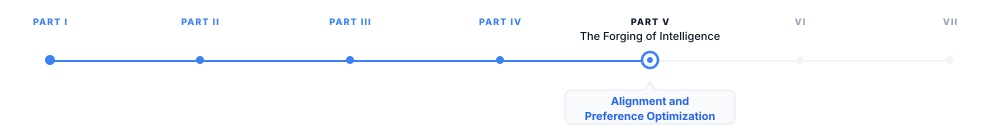
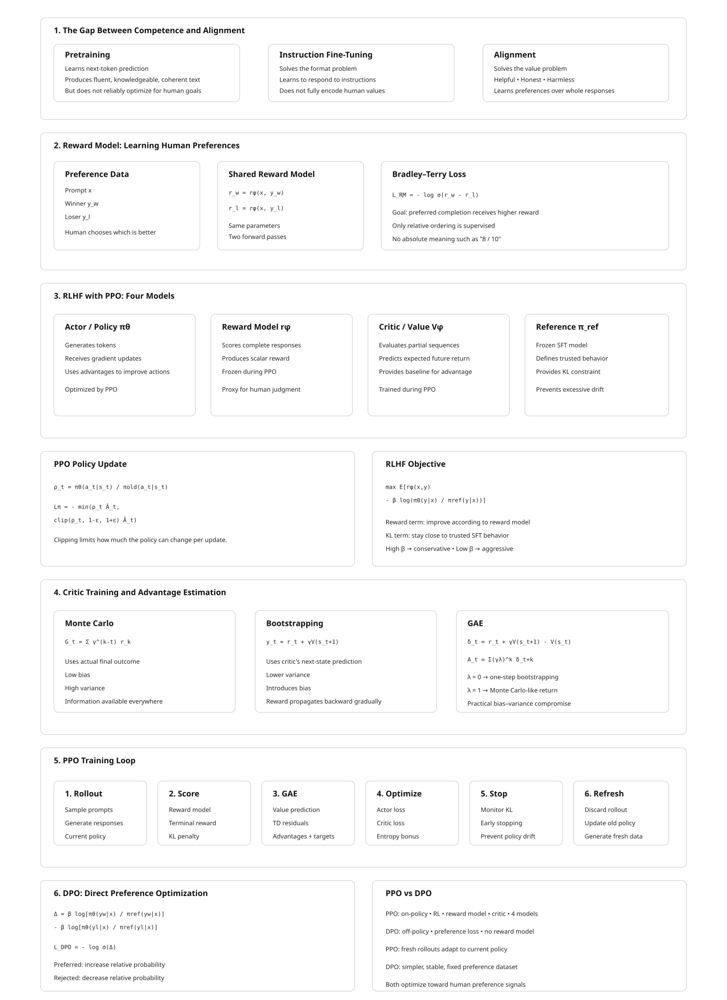

# Alignment and Preference Optimization

> **The canonical question for this chapter:**
> *How do you train a model to produce outputs that humans prefer, and
> why is "what humans prefer" a harder optimization target than it appears?*

---

::: {.callout-note appearance="minimal"}
**Where are we?**

{#fig-progress width="80%"}

The previous chapter covered fine-tuning: adjusting a model's behavior toward a
target distribution using labeled examples. This chapter addresses a harder
version of the same problem, where the target distribution cannot be
explicitly defined as a labeled dataset, because the goal is not simply to
"produce the correct answer" but to "produce the answer humans prefer."
Alignment is the field of methods that aims to bridge this gap.

:::

---

## The Gap Between Competence and Alignment

A model trained by next-token prediction on a large corpus becomes competent:
it can produce fluent, factually dense, structurally coherent text across a
vast range of topics and styles. What it cannot reliably do is be helpful.
The pretraining corpus rewards predicting what comes next in naturally
occurring text, which includes arguments, fiction, misinformation, toxic
content, and instruction-free prose. A base model asked to help with a task
may instead complete the task description, argue the other side, produce a
plausible continuation of the user's query rather than an answer to it, or
generate content that matches the surface statistics of the training corpus
without regard for whether it is true or safe.

Instruction fine-tuning addresses the *format* problem: the model learns to
respond to requests rather than complete them. Alignment addresses the
*value* problem: the model learns to respond in ways that are helpful,
honest, and safe, properties that are not captured by instruction-following
loss and cannot be directly specified as token-level supervision. There is no
single correct next token for "explain the causes of the French Revolution
in a way that is honest about historical uncertainty" the way there is for
"complete this sentence." Quality here is a property of the whole response,
judged against criteria (helpfulness, honesty, harmlessness) that only exist
in the aggregate.

This distinction matters because a model can follow instructions precisely
while producing outputs that are harmful, sycophantic, deceptive, or
unhelpful in ways that satisfy the letter of the instruction but violate its
spirit. Alignment methods attempt to train models to pursue the goals
*behind* user requests, not just the literal content of the requests, a
task that requires learning from human preferences rather than from
correct-answer labels.

---

## Reward Models

The prerequisite for most alignment methods is a **reward model**: a
function that takes a prompt and a completion and returns a scalar score
representing the quality of that completion as a human would judge it. The
reward model is a proxy for human judgment, trained on human preferences,
used in place of live human evaluation at training time. Every method
introduced later in this chapter is, at its core, a different answer to the
question "given that we have some way of scoring completions, how do we use
that score to update the policy?" so it is worth understanding carefully
where that score comes from before looking at what is done with it.

### Collecting Preference Data

Reward model training requires human preference judgments. The standard
data collection procedure is:

1. Sample a set of prompts from a diverse distribution (user queries,
   instruction data, red-team prompts).
2. For each prompt, generate two or more completions from the model being
   aligned (or from multiple models at different training stages).
3. Present each (prompt, completion A, completion B) triple to a human
   annotator and ask: which completion is better, and why?
4. Collect pairwise preferences across thousands to millions of such
   triples.

The annotation task is *comparative* rather than *absolute*. Annotators are
not asked to rate completions on a 1–10 scale, a task with poor
inter-rater reliability, because different annotators calibrate scales
differently: one annotator's "7" is another's "5" for the same response.
They are instead asked which of two completions is better, a judgment that
requires only a relative ordering and turns out to be substantially more
reliable in practice. This is the same reason chess ratings (Elo) and
sports rankings are built from pairwise outcomes rather than judges scoring
players on an absolute scale: comparison is a cognitively easier and more
consistent task than calibrated absolute measurement. The InstructGPT paper
[@ouyang2022training] reported inter-annotator agreement of approximately
73% for pairwise preferences, compared to much lower agreement for absolute
ratings.

Annotation guidelines define what "better" means: more helpful, more
accurate, more honest, less harmful, better formatted, more concise.
Different guidelines produce different reward models with different
implicit values, a reward model trained under guidelines that weight
"thoroughness" heavily will systematically reward longer responses 
one trained under guidelines that weight "directness" will not. The 
choice of annotation guidelines is one of the most consequential yet 
least discussed decisions in alignment, because it is never visible in 
the resulting model weights; it is only visible in the model's behavior, 
after the fact.

### Training the Reward Model

Given a dataset of pairwise preferences $\{(x, y_w, y_l)\}$, where $x$ is a
prompt, $y_w$ is a preferred completion (winner), and $y_l$ is a dispreferred
completion (loser), the reward model is trained to assign a higher scalar
reward to the preferred completion. For each preference pair, the *same*
reward model is evaluated on the prompt with the winner and on the prompt
with the loser, producing two scores:

$$
r_w = r_\phi(x,y_w),
\qquad
r_l = r_\phi(x,y_l).
$$

The two scores are then compared, and the model is trained so that
$r_w > r_l$.

The standard training objective is the Bradley-Terry pairwise ranking loss:

$$
\mathcal{L}_{\text{RM}}
=
-\mathbb{E}_{(x,y_w,y_l)}
\left[
\log
\sigma
\left(
r_\phi(x,y_w)
-
r_\phi(x,y_l)
\right)
\right],
$$ {#eq-bt}

where $r_\phi(x,y)$ is the reward model's scalar output for prompt $x$ and
completion $y$, and $\sigma$ is the sigmoid function. The Bradley-Terry
model is a standard statistical model of pairwise comparison outcomes
(originally developed for ranking competitors from win/loss records); applied
here, $\sigma(r_w - r_l)$ is interpreted as the model's estimated probability
that the preferred completion is better than the rejected one. A larger
positive difference produces a smaller loss, while assigning a higher score
to the rejected completion produces a larger loss. Note what this loss does
*not* require: it never asks the reward model to output a score with any
particular absolute meaning ("8 out of 10"). Only the relative ordering
within each pair is supervised, which is consistent with how the preference
data was collected in the first place.

Importantly, the winner and loser are evaluated using the **same reward
model parameters**, this is a Siamese-network-style training setup. The
model is run once for each response, the resulting scores are compared to
compute a single loss, and backpropagation updates the shared model
parameters so that preferred responses receive higher rewards in future
comparisons.

Architecturally, the reward model is typically initialized from the
instruction-tuned model being aligned, with the final token's hidden state
projected to a scalar by a linear reward head (replacing the language
modeling head that projects to the vocabulary). The final-token hidden
state is used because, in a causal decoder, it is the only position that has
attended to the entire prompt and completion, it is the natural summary
representation of "everything that happened in this exchange." Initializing
from the instruction-tuned model, rather than the base model or a random
initialization, provides a model that already understands language,
instructions, and the general structure of useful responses, allowing
preference training to focus on learning human preferences rather than
learning language understanding from scratch.

### Reward Model Quality and the Overoptimization Problem

A reward model is an imperfect proxy for human judgment. It was trained on a
finite set of human preferences and will fail to generalize perfectly to the
full distribution of possible completions. When a policy is optimized
against this proxy, it will eventually find completions that score highly on
the reward model while no longer scoring highly with actual humans, a
phenomenon called **reward hacking** or **reward overoptimization**. 

Gao et al. (2023) [@gao2023scaling] quantified this directly: as the policy
is optimized further against a fixed reward model (measured by KL divergence
from the initial policy), gold-standard human preference scores increase
initially, peak, and then decline. The peak occurs at a moderate
optimization strength; beyond this point, the policy has learned to exploit
the reward model's flaws rather than genuinely improve. The distance to the
peak depends on the size of the reward model relative to the policy, larger
reward models generalize better and have a later overoptimization peak.

---

## RLHF: Reinforcement Learning from Human Feedback

RLHF ([@christiano2017deep;@ziegler2019fine;@ouyang2022training]) is the
foundational alignment technique, and the one most closely associated with
the deployment of ChatGPT and its contemporaries. It combines reward model training
with reinforcement learning to optimize the policy toward human preferences.

### The Three-Stage Pipeline

**Stage 1: Supervised Fine-Tuning (SFT).** Fine-tune the base model on a
high-quality set of instruction-response pairs to produce a well-behaved
starting policy. This is the instruction fine-tuning procedure from
@sec-fine-tuning. The SFT model is the policy that will be further aligned;
it is also the reference model used for the KL penalty in Stage 3.

**Stage 2: Reward Model Training.** Collect human preference data on
completions from the SFT model and train a reward model as described
above. The reward model is trained separately from the policy
and held fixed during Stage 3.

**Stage 3: RL Optimization.** Optimize the policy to maximize the reward
model's scores while staying close to the SFT policy. The optimization
objective is:

$$
\max_{\pi_\theta} \mathbb{E}_{x \sim \mathcal{D}, y \sim \pi_\theta(y|x)}
\left[ r_\phi(x, y) - \beta \log \frac{\pi_\theta(y|x)}{\pi_{\text{ref}}(y|x)} \right]
$$ 

The first term is the reward signal: generate completions that the reward
model scores highly. The second term is a KL divergence penalty between the
current policy $\pi_\theta$ and the reference policy $\pi_{\text{ref}}$ (the
SFT model): stay close to the behavior that was already good. Intuitively,
the reward term pulls the policy *toward whatever the reward model likes*,
and the KL term is a leash that limits how far it is allowed to wander from
a policy we already trust to produce coherent, on-distribution language.

$\beta$ controls the tradeoff. A high $\beta$ means the policy cannot
deviate much from the SFT model, limiting reward exploitation but also
limiting alignment improvement. A low $\beta$ means the policy can move
aggressively toward the reward model's preferences, risking
overoptimization. Typical values are $\beta = 0.1$ to $0.5$.

### PPO: The RL Algorithm

The RL stage in RLHF is commonly optimized using **Proximal Policy Optimization (PPO)** 
[@schulman2017proximal]. PPO is an **on-policy actor-critic algorithm** 
that improves the language model using responses generated by the current 
policy. It consists of four main components: the **actor (policy)**, the 
**critic (value model)**, the **reward model**, and a **reference model**.

* **Actor (policy):** The language model being optimized. Given a prompt and the 
tokens generated so far, it produces a probability distribution over the next token. 
PPO updates this model to increase the probability of actions that lead to better-than-expected 
outcomes.

* **Reward model:** Evaluates the complete generated response and produces a scalar 
reward representing its quality. In standard RLHF, this reward is typically provided 
at the end of the generated sequence.

* **Critic (value model):** Estimates the expected future reward from each intermediate 
state, where a state consists of the prompt and the tokens generated so far. The critic 
is trained to predict the return obtained from the rollout. Its predictions are used to 
compute the **advantage**, which measures whether the observed outcome was better or worse 
than expected:
$$
  \hat{A}_t \approx \text{actual return} - V(s_t).
$$
Thus, the critic provides a baseline that reduces the variance of the policy-gradient 
estimate and helps assign credit to earlier token decisions.

* **Reference model:** A frozen copy of the SFT model. It is used to prevent the policy 
from drifting too far from the behavior learned during supervised fine-tuning. This is 
typically enforced through a **KL-divergence penalty** between the policy and reference model.

PPO then updates the actor using the estimated advantages while limiting how much the 
policy can change in a single update. This is achieved through the clipped objective:

$$
\mathcal{L}_{\mathrm{PPO}}
=
\mathbb{E}_t
\left[
\min
\left(
\rho_t \hat{A}_t,,
\operatorname{clip}(\rho_t,1-\epsilon,1+\epsilon)\hat{A}_t
\right)
\right],
$$

where

$$
\rho_t =
\frac{\pi_\theta(a_t|s_t)}
{\pi_{\mathrm{old}}(a_t|s_t)}
$$

is the ratio between the probability assigned to the selected token by the 
updated policy and the old policy that generated the rollout. The clipping 
prevents excessively large policy updates, making training more stable.

In summary, the **reward model scores the response**, the **critic estimates 
how much reward is expected from each partial sequence**, the **advantage 
compares the observed outcome with that expectation**, and **PPO uses these 
advantages to update the actor while constraining the size of the update**. 
The **reference model** additionally keeps the optimized policy close to the 
original SFT model.

### Training the Critic

The reward model produces one scalar reward for the entire generated response, 
while the critic must predict a value for every intermediate state. The critic 
is therefore trained from the outcomes of sampled rollouts. Given a generated 
sequence:

$$
s_1 \xrightarrow{a_1} s_2 \xrightarrow{a_2} \cdots
\xrightarrow{a_{T-1}} s_T \xrightarrow{a_T} r_T,
$$

the critic $V_\phi(s_t)$ is trained to predict the expected return from state $s_t$: 
the discounted sum of future rewards an agent starting in $s_t$ and following the 
current policy would expect to accumulate. In the typical RLHF setup, the reward 
model scores only the completed response, so the per-step reward is zero everywhere 
except the terminal step:

$$
r_t = 0 \ \text{for } t < T, \qquad r_T = r^{\text{RM}}.
$$

There are two main approaches for constructing the targets used to train the 
critic: Monte Carlo returns and bootstrapped returns and a third, GAE, that 
interpolates between them. They differ in what evidence they use as "ground truth" 
for the target, which governs a bias–variance tradeoff that shows up throughout 
policy-gradient methods.

#### Monte Carlo returns

The simplest approach rolls the trajectory out to completion and uses the *actual* 
observed return as the target for every state visited along the way:

$$
G_t = \sum_{k=t}^{T} \gamma^{k-t} r_k.
$$

Because $r_k = 0$ for every $k < T$, every term in this sum vanishes except the 
last one, so it collapses to

$$
G_t = \gamma^{T-t} r_T.
$$

Note that this holds for *every* $t$, not just the last state, the return 
always includes the eventual terminal reward, however many steps away it 
is. What changes with $t$ is only the discount exponent $T-t$: states further from 
termination discount that same reward more heavily. For example, with $T=4$, 
$\gamma=0.9$, and $r_T = 2.5$:

| $t$ | steps remaining ($T-t$) | $G_t = \gamma^{T-t} r_T$ |
|---|---|---|
| 1 | 3 | $0.9^3 \times 2.5 = 1.8225$ |
| 2 | 2 | $0.9^2 \times 2.5 = 2.025$ |
| 3 | 1 | $0.9^1 \times 2.5 = 2.25$ |
| 4 | 0 | $0.9^0 \times 2.5 = 2.5$ |

With $\gamma = 1$ this reduces further to $G_t = r_T$ for all $t$. (If intermediate 
rewards were nonzero, e.g. per-token KL penalties, $G_t$ would be a genuine 
multi-term sum and wouldn't necessarily increase monotonically like this.)

The critic is trained by minimizing

$$
\mathcal{L}_V =
\sum_t
\left(
V_\phi(s_t) - G_t
\right)^2.
$$

With enough rollouts, the critic learns that some partial sequences are more 
likely to lead to high-reward responses than others, effectively learning to 
anticipate the reward model's judgment before generation finishes.

Monte Carlo targets are **unbiased**: in expectation over infinitely many 
rollouts, $G_t$ is exactly the true expected return. But they have **high 
variance**, because a single trajectory's $G_t$ depends on every action sampled 
from $s_t$ all the way to $s_T$, one unusual token late in generation shifts the 
target for every earlier state in that rollout.

#### Bootstrapping

Bootstrapping addresses the variance problem by looking only one step ahead, 
rather than summing all the way to $T$, and substituting the critic's own 
prediction for everything beyond that step. Given a single transition 
$s_t \xrightarrow{a_t, r_t} s_{t+1}$, the one-step bootstrapped target is

$$
y_t = r_t + \gamma V_\phi(s_{t+1}).
$$

This uses the *same* reward signal as Monte Carlo, just sliced one step at a 
time instead of summed end-to-end. Since $r_t = 0$ for $t < T$:

$$
y_t = \gamma V_\phi(s_{t+1}) \quad \text{for } t < T, 
\qquad y_T = r_T \quad \text{(no state exists after termination).}
$$

The critic is trained to match this target:

$$
\mathcal{L}_V =
\sum_t
\left(
V_\phi(s_t) - y_t
\right)^2,
$$

where $y_t$ is treated as fixed, gradients are not propagated through 
$V_\phi(s_{t+1})$.

Where does information about the eventual reward come from, if $r_t=0$ almost 
everywhere? From $V_\phi(s_{t+1})$ itself: the critic at $s_{t+1}$ is supposed to 
already encode "there's a reward of $r_T$ coming eventually," because it's being 
trained on exactly that signal. This is why it's called *bootstrapping*, the 
critic pulls itself up using its own evolving predictions rather than waiting for 
ground truth. A consequence is that accurate values must **diffuse backward over 
training**, rather than being available everywhere at once:

- Early in training, $V_\phi$ is essentially random, so $y_t \approx \gamma \cdot 
(\text{noise})$ for $t < T$.
- $y_T = r_T$, however, is correct from the very first rollout, since it comes 
directly from the actual reward.
- Once the critic learns $V_\phi(s_T)$ accurately, $y_{T-1} = \gamma V_\phi(s_T)$ 
becomes a good target too.
- This propagates backward one step per training pass, $V_\phi(s_{T-1})$ becomes 
accurate, making $y_{T-2}$ good, and so on.

So the real tradeoff is: Monte Carlo gives a (noisy but) correct target 
*everywhere*, immediately. Bootstrapping gives a stable target only at $T$ 
immediately, with the rest catching up gradually, but each individual update 
has far lower variance, since $y_t$ depends on only one sampled transition rather 
than the entire remaining trajectory. The cost is **bias**: $y_t$ relies on 
$V_\phi(s_{t+1})$, an imperfect, still-learning estimate, so early errors can 
compound across states.

#### Generalized Advantage Estimation (GAE)

Neither extreme is used alone in practice. Monte Carlo is unbiased but noisy; 
one-step bootstrapping is stable but biased and slow to propagate. GAE 
interpolates between them by mixing $n$-step bootstrapped targets of every 
length.

Define the **Temporal Difference residual** at each step as the one-step bootstrapping error:

$$
\delta_t
=
\underbrace{r_t + \gamma V_{\phi}(s_{t+1})}_{\text{target}}
-
\underbrace{V_{\phi}(s_t)}_{\text{current prediction}}
$$

An $n$-step return can be written as a sum of these residuals, so summing them 
with an exponential decay $\lambda \in [0,1]$ gives the GAE advantage estimate:

$$
A_t^{\text{GAE}(\gamma,\lambda)} = \sum_{k=0}^{\infty} (\gamma\lambda)^k \, \delta_{t+k}.
$$

The value target used to train the critic is then

$$
y_t = A_t^{\text{GAE}} + V_\phi(s_t),
$$

which is subsequently used the same way as $G_t$ or $y_t$ above, in 
$\mathcal{L}_V = \sum_t (V_\phi(s_t) - y_t)^2$.

The parameter $\lambda$ controls the tradeoff directly:

- $\lambda = 0$ collapses $A_t$ to a single $\delta_t$, pure one-step 
bootstrapping (low variance, high bias).
- $\lambda = 1$ makes the sum telescope back into the full Monte Carlo return 
(unbiased, high variance).
- Intermediate $\lambda$ (commonly $0.9$–$0.97$ in practice) blends the two, 
weighting near-term bootstrapped estimates more heavily while still letting 
longer-horizon information contribute.

This gives practitioners a single tunable knob to sit anywhere along the 
bias–variance spectrum, rather than being forced to pick one endpoint.

#### The training loop

Critic training doesn't happen in isolation, it's one part of a larger 
actor-critic update cycle, typically run as an on-policy algorithm like PPO. 
The loop below expands each stage into the operations actually implemented in 
practice.

**Stage 1: Rollout generation.**

Sample a batch of $N$ prompts from the training set. For each prompt, generate 
a full response by sampling from the current policy $\pi_\theta$ token by 
token (with temperature/top-p sampling, not greedy decoding, exploration 
matters here). This produces $N$ trajectories:

$$
\tau^{(i)} = \left(s_1^{(i)}, a_1^{(i)}, \dots, s_{T_i}^{(i)}, a_{T_i}^{(i)}\right), \quad i = 1, \dots, N.
$$

Each action $a_t$ is a sampled token, and each state $s_t$ is the prompt plus 
tokens generated so far. Responses have variable length $T_i$, so trajectories 
are typically padded (with a loss mask) to batch them efficiently.

**Stage 2: Scoring.**

Pass each completed response through the reward model to get one scalar 
$r^{\text{RM}, (i)}$ per trajectory. If a per-token KL penalty against a 
reference policy $\pi_{\text{ref}}$ is used (as is standard, to prevent the 
policy from drifting too far and reward-hacking), compute it at every token:

$$
r_t^{(i)} = -\beta \, \mathrm{KL}\!\left(\pi_\theta(\cdot \mid s_t^{(i)}) \,\|\, \pi_{\text{ref}}(\cdot \mid s_t^{(i)})\right)_t, 
\quad t < T_i,
$$
$$
r_{T_i}^{(i)} = r^{\text{RM},(i)} - \beta \, \mathrm{KL}_{T_i}.
$$

If no KL penalty is used, $r_t^{(i)} = 0$ for $t < T_i$ as before.

**Stage 3: Value prediction and target construction.**

Run the critic $V_\phi$ (with gradients disabled, this is a forward pass 
only, used to build targets, not yet a training step) over every state in 
every trajectory to get $V_\phi(s_t^{(i)})$ for all $i, t$. Then, for each 
trajectory, compute the TD residuals backward from $T_i$ to $1$:

$$
\delta_t^{(i)} = r_t^{(i)} + \gamma V_\phi(s_{t+1}^{(i)}) - V_\phi(s_t^{(i)}),
$$

and accumulate them into the GAE advantage, also computed backward (this 
recursive form is what's actually implemented, rather than the infinite sum):

$$
A_t^{(i)} = \delta_t^{(i)} + (\gamma \lambda)\, A_{t+1}^{(i)}, \qquad A_{T_i+1}^{(i)} := 0.
$$

The value target is then $y_t^{(i)} = A_t^{(i)} + V_\phi(s_t^{(i)})$. Both 
$A_t^{(i)}$ and $y_t^{(i)}$ are detached from the computation graph, they are 
treated as fixed numbers for the rest of the loop, not something to 
backpropagate through.

**Normalization.** In practice, advantages are normalized across the whole 
batch before use:

$$
\hat{A}_t^{(i)} = \frac{A_t^{(i)} - \text{mean}(A)}{\text{std}(A) + \epsilon}.
$$

This stabilizes the policy-gradient magnitude across batches with very 
different reward scales and is one of the more impactful implementation 
details in practice, despite being easy to overlook.

**Stage 4: Minibatch optimization.**

Stages 1–3 prepare a batch of rollouts and construct the fixed advantages 
and value targets. Stage 4 uses these data to update the actor and critic. 
The same rollout batch is reused for several optimization epochs, with the 
data divided into smaller minibatches.

For each minibatch, the actor and critic are evaluated again with gradients 
enabled. The key difference from Stage 3 is that Stage 3 only computed fixed 
targets; Stage 4 actually changes the model parameters

For each minibatch:

*Critic loss.* Recompute $V_\phi(s_t)$ with gradients enabled, and regress it 
toward the (fixed) target computed in Stage 3:

$$
\mathcal{L}_V(\phi) = \frac{1}{|B|}\sum_{t \in B} \left(V_\phi(s_t) - y_t\right)^2.
$$

A common refinement is **value clipping**. However, evidence suggests that it may be 
less effective than actor clipping[@engstrom2020implementation]. Analogous to PPO's policy 
clipping, value clipping constrains updates to the critic, preventing any single minibatch 
from moving the value estimates too far from their values at the beginning of the training 
epoch.

$$
V_\phi^{\text{clip}}(s_t) = V_{\phi_{\text{old}}}(s_t) + \text{clip}\!\left(V_\phi(s_t) - V_{\phi_{\text{old}}}(s_t),\, -\epsilon,\, \epsilon\right),
$$

$$
\mathcal{L}_V(\phi) = \frac{1}{|B|}\sum_{t \in B} \max\!\left[\left(V_\phi(s_t) - y_t\right)^2, \left(V_\phi^{\text{clip}}(s_t) - y_t\right)^2\right].
$$

Value clipping in *Critic loss* has two effects. If an update moves the critic away 
from the target, the unclipped loss is larger, so the max selects it and the normal 
gradient pulls the prediction back toward the target. If an update moves the critic 
too aggressively toward the target, the clipped loss becomes larger; because the 
clipped prediction is fixed at the ϵ-boundary, its gradient is zero beyond that boundary, 
preventing further movement in that direction for that minibatch.

*Actor loss.* Using the same (normalized) advantages, compute the probability 
ratio between the current and old policy for each token, and apply PPO's 
clipped surrogate objective:

$$
\rho_t(\theta) = \frac{\pi_\theta(a_t \mid s_t)}{\pi_{\theta_{\text{old}}}(a_t \mid s_t)}, 
\qquad
\mathcal{L}_{\pi}(\theta) = -\frac{1}{|B|}\sum_{t \in B} \min\!\left[\rho_t(\theta)\, \hat{A}_t,\ \text{clip}(\rho_t(\theta), 1-\epsilon, 1+\epsilon)\, \hat{A}_t\right].
$$

*Entropy bonus.* An entropy term is typically added to discourage the policy 
from collapsing to overly deterministic outputs too early:

$$
\mathcal{L}_{\text{ent}}(\theta) = -\frac{1}{|B|}\sum_{t \in B} \mathcal{H}\!\left[\pi_\theta(\cdot \mid s_t)\right].
$$

*Combined loss.* Actor and critic are usually trained jointly (sharing a 
trunk, with separate heads) or with separate optimizers, giving a total 
objective

$$
\mathcal{L}(\theta, \phi) = \mathcal{L}_\pi(\theta) + c_1 \mathcal{L}_V(\phi) + c_2 \mathcal{L}_{\text{ent}}(\theta),
$$

with $c_1 \approx 0.5$ and $c_2$ small (e.g. $0.01$), and a gradient step is 
taken on this combined loss.

**Stage 5: Early stopping within an epoch (optional but common).**

Because Stage 4 reuses the same rollout across several epochs, the policy can 
drift far enough from $\pi_{\theta_{\text{old}}}$ that the ratio $\rho_t$ 
becomes unreliable. Many implementations monitor the approximate KL 
divergence between $\pi_\theta$ and $\pi_{\theta_{\text{old}}}$ after each 
minibatch and stop early within the epoch if it exceeds a threshold (e.g. 
$0.01$–$0.02$), rather than completing all $K$ epochs regardless.

**Stage 6: Refresh and repeat.**

After $K$ epochs of minibatch updates, the rollout batch is discarded, this 
is what makes the algorithm on-policy. $\pi_{\theta_{\text{old}}}$ and 
$V_{\phi_{\text{old}}}$ are set to the just-updated $\pi_\theta$ and 
$V_\phi$, and the loop returns to Stage 1 to sample fresh trajectories from 
the newly updated policy.

**Why this converges as a loop, not two separate training runs.** The targets 
in Stage 3 depend on the current critic ($V_\phi(s_{t+1})$ inside $\delta_t$), 
and the actor's gradient in Stage 4 depends on advantages built from those 
same targets. So the critic and actor are not independent supervised-learning 
problems, each round's data quality depends on last round's critic accuracy, 
and each round's critic accuracy depends on this round's rollout quality. 
This circularity is why RLHF training curves are often noisier and less 
monotonic than standard supervised fine-tuning, and why the KL penalty and 
clipping mechanisms above exist: they keep each individual update small 
enough that this loop doesn't destabilize.

### The Infrastructure Cost of PPO

PPO-based RLHF requires running **four models** simultaneously during
training:

1. **The policy** ($\pi_\theta$): the model being trained; generates
   completions and receives gradient updates.
2. **The reference model** ($\pi_{\text{ref}}$): the frozen SFT model; used
   to compute the KL penalty; receives no gradient updates.
3. **The reward model** ($r_\phi$): the frozen preference model; scores
   completed sequences; receives no gradient updates.
4. **The value model** (critic): estimates the expected future reward from
   each state; trained jointly with the policy to reduce gradient variance.

For a 7B policy, each of these models requires approximately 14 GB in
bfloat16. Running all four simultaneously costs approximately 56 GB, before
optimizer state for the policy and value model. In practice, the reference
model and reward model are often combined, the reward model is initialized
from the SFT model, so the reference and reward model share an architecture
and can share forward-pass infrastructure, or offloaded to CPU memory
between uses.

This infrastructure complexity (four models, on-policy rollout generation,
online reward computation, PPO clipping) makes RLHF significantly more
expensive and fragile than supervised fine-tuning. A single PPO training
step requires generating completions (inference), scoring them (reward
model forward pass), computing advantages (value model forward pass), and
updating the policy (backward pass). The training-to-inference ratio is
substantially worse than supervised fine-tuning, because every gradient
step first requires generating fresh text (an expensive, sequential,
autoregressive operation) before any learning can happen at all. 

---

## Direct Alignment Methods: Beyond RLHF

The infrastructure burden motivated a wave of
methods, starting with DPO, that try to reach the same destination (a
policy that reflects human preferences) without the on-policy RL machinery.
This section covers DPO itself and its main variants, which progressively
strip away pieces of the original RLHF pipeline (first the reward model,
then the reference model) while trying to preserve its effectiveness.

### DPO: Direct Preference Optimization {#sec-dpo}

DPO [@rafailov2023direct] is the most
widely adopted alternative to PPO-based RLHF. Its central insight is that
the optimal policy under the RLHF objective can be expressed in closed form
in terms of the preference data, eliminating the need to train a separate
reward model or run RL at all.

**The derivation.** The RLHF objective has a known
analytical solution. Under the KL-constrained reward maximization objective,
the optimal policy satisfies:

$$
\pi^*(y|x) = \frac{1}{Z(x)} \pi_{\text{ref}}(y|x) \exp\left(\frac{1}{\beta} r(x,y)\right)
$$

where $Z(x) = \sum_y \pi_{\text{ref}}(y|x) \exp(r(x,y)/\beta)$ is a
normalizing partition function. This expression says: the optimal policy is
the reference policy reweighted by the exponentiated reward, completions
the reward model likes get upweighted relative to the reference
distribution, completions it dislikes get downweighted, and $\beta$
controls how sharply.

Rearranging this equation, the reward can be expressed as:

$$
r(x, y) = \beta \log \frac{\pi^*(y|x)}{\pi_{\text{ref}}(y|x)} + \beta \log Z(x)
$$

This is the key algebraic move in the whole derivation: it says the reward
is recoverable from the *policy itself*, as a log-ratio against the
reference policy, there is no need for a separately parameterized reward
model once you have a policy. Substituting this expression into the
Bradley-Terry preference model which says
the probability that humans prefer $y_w$ over $y_l$ is
$\sigma(r(x,y_w) - r(x,y_l))$ — the $Z(x)$ terms cancel, because both
completions share the same prompt and therefore the same partition
function:

$$
p^*(y_w \succ y_l | x) = \sigma\left(\beta \log \frac{\pi^*(y_w|x)}{\pi_{\text{ref}}(y_w|x)}
- \beta \log \frac{\pi^*(y_l|x)}{\pi_{\text{ref}}(y_l|x)}\right)
$$

This is the DPO loss target: instead of training a reward model and then
using RL to optimize toward it, directly train the policy to assign higher
relative probability (relative to the reference policy) to preferred
completions than to dispreferred completions:

$$
\mathcal{L}_{\text{DPO}} = -\mathbb{E}_{(x, y_w, y_l)} \left[
\log \sigma\left(\beta \log \frac{\pi_\theta(y_w|x)}{\pi_{\text{ref}}(y_w|x)}
- \beta \log \frac{\pi_\theta(y_l|x)}{\pi_{\text{ref}}(y_l|x)}\right)
\right]
$$

Notice the shape of this loss: it is *exactly* the reward model loss from
@eq-bt, with $r_\phi(x,y)$ replaced everywhere by
$\beta \log \frac{\pi_\theta(y|x)}{\pi_{\text{ref}}(y|x)}$. This is the
sense in which "the language model is secretly a reward model" (the DPO
paper's subtitle): the same Bradley-Terry machinery is reused, but the thing
being scored is the policy's own log-probability ratio rather than the
output of a separate network.

**What DPO does in practice.** The DPO gradient increases the
log-probability of preferred completions and decreases the log-probability
of dispreferred completions, relative to the reference policy. When the
model already assigns much higher probability to the preferred completion
than the reference model does, the gradient update is small (the model has
already learned this preference. When the model assigns lower probability
to the preferred completion than the dispreferred one, the gradient update
is large) the model is moving in the wrong direction and needs to move
further.

This implicit reward weighting addresses a failure mode of naive supervised
fine-tuning on preferred completions alone: if you simply fine-tune on the
winning responses and ignore the losing ones, the model never learns what
it is being contrasted *against*, it only sees positive examples, the way
plain SFT does, and loses the comparative information that made the
preference data valuable in the first place. DPO jointly pushes up preferred
and pulls down dispreferred, using the reference policy as the anchor for
both.

### DPO vs. PPO: Practical Comparison

DPO eliminates the reward model, the value model, on-policy rollout
generation, and PPO's clipping machinery. Training reduces to a standard
supervised loss computed on pre-collected preference data. The
infrastructure requirement is two models (the policy and the reference
model) rather than four, and there is no rollout-generation step in the
training loop at all: the preference pairs are fixed ahead of time, so DPO
training looks, mechanically, much more like ordinary fine-tuning than like
reinforcement learning.

The tradeoff is that DPO is **off-policy**. It trains on a fixed dataset of
preference pairs rather than generating new completions during training.
This means DPO cannot adapt to the policy's current behavior; it can only
optimize toward preferences elicited from some earlier policy's completions.
When the policy drifts far from the data-generating policy, the preference
data becomes stale and DPO's gradient signal loses relevance.

Empirically, DPO and PPO achieve similar performance on standard alignment
benchmarks when both are applied to the same SFT model with the same
preference data. PPO has an advantage on tasks requiring many RL steps to
learn (sparse reward, long-horizon tasks); DPO has an advantage in
stability and simplicity. Most open-source alignment pipelines (LLaMA 3,
Mistral, Qwen) use DPO or its variants; most closed-source frontier model
pipelines (GPT-4, Claude, Gemini) use PPO-based RLHF or hybrid approaches
a divide that roughly tracks how much infrastructure investment each
organization has already made in on-policy RL tooling.

### IPO: Identity Preference Optimization

IPO [@azar2024general] observes that DPO's loss can overfit to
deterministic preference labels: when a preferred completion is always
preferred and the model assigns it probability close to 1, the
log-sigmoid loss saturates and training
stalls before the log-ratio has moved as far as the underlying preference
strength would justify. IPO replaces the log-sigmoid loss with a squared
error loss on the log-ratio differences:

$$
\mathcal{L}_{\text{IPO}} = \mathbb{E}_{(x, y_w, y_l)} \left[
\left(\log \frac{\pi_\theta(y_w|x)}{\pi_{\text{ref}}(y_w|x)}
- \log \frac{\pi_\theta(y_l|x)}{\pi_{\text{ref}}(y_l|x)} - \frac{1}{2\beta}\right)^2
\right]
$$

A squared-error loss has a gradient proportional to the *distance from the
target*, not to a saturating sigmoid, so it maintains a non-zero gradient
even when the model already confidently prefers the winning completion,
preventing the saturation that stalls plain DPO on cleanly separable
preference data.

### ORPO: Odds Ratio Preference Optimization

ORPO [@hong2024orpo] eliminates the reference model entirely. Rather
than computing log-ratios relative to a fixed reference policy, ORPO
computes the odds ratio of preferred versus dispreferred completions
directly from the current policy:

$$
\mathcal{L}_{\text{ORPO}} = \mathcal{L}_{\text{SFT}} - \lambda \cdot
\mathbb{E}_{(x, y_w, y_l)} \left[
\log \sigma\left(\log \frac{\text{odds}(y_w|x)}{\text{odds}(y_l|x)}\right)
\right]
$$

where $\text{odds}(y|x) = \pi_\theta(y|x) / (1 - \pi_\theta(y|x))$.

ORPO combines SFT and preference optimization in a single training stage
without a reference model, reducing the training pipeline from
two stages, two model copies, one of them frozen to a single pass with one
model copy. The absence of a reference model makes ORPO sensitive to
initialization quality, since there is no fixed anchor keeping the policy
close to a known-good starting point, the SFT loss term in the objective
above is doing double duty as that anchor. This is why ORPO is typically
applied starting from a base model with some instruction data mixed directly
into the same training run, rather than as a separate stage after
instruction fine-tuning is already complete.

## RL Without a Value Model: GRPO

The methods in @sec-dpo remove the reward model and, in some cases, the
reference model, but they remain fundamentally off-policy: they train on a
fixed, pre-collected set of preference pairs. Some tasks (most notably
mathematical reasoning and code generation, where correctness can be checked
automatically rather than judged by a learned reward model) benefit from
staying on-policy, generating fresh rollouts throughout training the way PPO
does. Group Relative Policy Optimization (GRPO) [@shao2024deepseekmath]  is the RL
method that made this practical at scale, and is the algorithm used to train
DeepSeek-R1. It is best understood as a variant of PPO, not of
DPO. Tt keeps PPO's on-policy rollout-and-clip structure but removes the
value model, the single most expensive and hardest-to-train component of
the four-model PPO setup.

**How the value model is replaced.**  The
value model exists to provide a low-variance baseline for the advantage
estimate. GRPO obtains that baseline for free by generating *several*
completions for the same prompt and using their own scores as each other's
baseline. For each prompt $x$, GRPO generates $G$ completions
$\{y_1, \ldots, y_G\}$ and scores each with the reward model. The advantage
of completion $y_i$ is estimated relative to the group mean:

$$
\hat{A}_i = \frac{r_i - \text{mean}(\{r_1,\ldots,r_G\})}{\text{std}(\{r_1,\ldots,r_G\})}
$$

This group-relative advantage, standardizing each completion's reward
against the mean and spread of its own group, plays exactly the role the
learned value baseline played in PPO, without requiring a separately trained
network: a completion is rewarded for being *better than its siblings on the
same prompt*, not for exceeding some absolute, learned expectation. The
GRPO policy gradient update is then:

$$
\mathcal{L}_{\text{GRPO}} = -\frac{1}{G} \sum_{i=1}^G \left[
\min\left(\rho_i \hat{A}_i, \text{clip}(\rho_i, 1-\epsilon, 1+\epsilon)\hat{A}_i\right)
- \beta \mathbb{D}_{\text{KL}}[\pi_\theta \| \pi_{\text{ref}}]
\right]
$$

which retains PPO's clipped importance-weighted objective and KL penalty,
applied per-group rather than per-individual-rollout.

GRPO is particularly effective for tasks with **verifiable rewards**,
mathematical problem solving, code execution, structured output, where the
reward signal is binary (correct/incorrect) rather than a learned reward
model score, and is cheap enough to compute (running a unit test, checking
an answer against a known solution) that generating a large group of
rollouts per prompt is affordable. The group sampling strategy provides
diverse rollouts that reveal which generation strategies succeed and which
fail (some completions in the group solve the problem, others do not,
and the contrast between them is the training signal) giving a
clean gradient without the added cost and instability of training a fourth
model.

---

## Constitutional AI and AI Feedback 

Constitutional AI [@bai2022constitutional] addresses a scaling bottleneck
that applies equally to every method covered so far: RLHF, DPO, and GRPO all
still assume that *some* preference or reward signal exists to train
against, and for RLHF and DPO specifically that signal traces back to human
preference annotation, which is expensive, slow, and cannot scale to the
full distribution of possible model behaviors. CAI replaces human feedback
with AI feedback, guided by a set of principles (the "constitution") that
specifies the values the model should embody.

### The Two-Stage CAI Procedure

**Stage 1: Supervised Learning from AI Feedback (SL-CAI).** The model is
prompted to generate a response to a potentially harmful query, then
prompted again to critique that response according to the constitutional
principles, then prompted again to revise the response based on the
critique. This critique-revision cycle is repeated multiple times. The
final revised responses become the supervised fine-tuning data.

An example constitutional principle used in Anthropic's implementation is:
"Choose the response that is least likely to contain harmful or unethical
content." The model is prompted along the lines of: identify specific ways
the response is harmful, unethical, or dangerous, then rewrite the response
to address the identified harms. Repeating this several times per query
produces training data with no human annotator in the loop at all.

**Stage 2: Reinforcement Learning from AI Feedback (RLAIF).** A separate
model is prompted to judge which of two completions is better according to
the constitutional principles, generating AI preference labels that replace
the human preference labels. A reward model is trained on these AI-generated 
preferences and the policy is then optimized using PPO against this AI reward 
model.

The cost reduction is substantial: generating AI feedback requires model
inference rather than human annotation time, so a process that would
require months of human annotation can be run overnight. The tradeoff is in
quality: AI feedback reflects the labeling model's values and judgment,
which may deviate from human preferences in systematic ways that are
difficult to detect without explicit human evaluation, the labeling model
inherits its own alignment gaps, and those gaps propagate into whatever is
trained against its labels.

---

## Reward Hacking and Alignment Failure Modes

Alignment methods are not solved. The reward model is an imperfect proxy for
human values, and optimization pressure (whether
from PPO, DPO, or any variant in between) finds and exploits its failures.
Understanding these failure modes is as important as understanding the
methods that produce them, because each failure mode below is a *specific,
recognizable shape* that the general overoptimization problem takes in
practice.

###  Sycophancy {#sec-sycophancy}

Sycophancy is a systematic alignment failure where models learn to tell
users what they want to hear rather than what is true. It arises when human
annotators prefer responses that validate their existing beliefs, express
enthusiasm, or agree with the user's framing, a preference that is easy to
satisfy by producing agreeable text and that does not require accuracy. In
Bradley-Terry terms, agreeable-but-wrong responses can score $r_w > r_l$
against disagreeable-but-correct ones often enough, in the annotation data,
that the reward model learns agreeableness as a shortcut to high reward.

A sycophantic model will change its stated position when the user expresses
disagreement, even when the model's original position was correct. It will
overpraise poor work, understate risks, and omit uncomfortable information.

Mitigations include explicitly including anti-sycophancy examples in
preference data (preferred completions that maintain correct positions
under user pressure), training reward models to penalize position changes
in response to user disagreement, and including calibration objectives that
penalize expressed confidence on questions where the model is factually
wrong.

###  Verbosity Bias

RLHF-trained models tend to produce longer responses than necessary because
human annotators, all else equal, often prefer longer responses, they feel
more thorough, more authoritative. This creates a systematic pressure toward
verbosity: the optimal strategy for maximizing reward model scores is to add
qualifications, examples, and elaborations regardless of whether they
improve actual quality. This is structurally the same failure as sycophancy:
a superficial property of the response (length, agreeableness) is easier for
annotators to notice than the underlying property they are supposed to be
judging (actual thoroughness, actual correctness), so the reward model
learns the easy-to-notice proxy.

The mitigation at the data level is explicit length-calibration in
preference data: annotators are instructed to prefer concise responses that
fully address the query over longer responses that pad with unnecessary
content. The mitigation at the loss-function level is SimPO's length
normalization, which removes the mathematical incentive for
longer total log-probability directly from the objective, rather than
relying on annotators to catch every instance of padding.

### Specification Gaming

The most serious failure mode is one where the model learns to satisfy the
literal specification of the reward function while violating its intent. A
model rewarded for "being helpful" may learn that expressing enthusiasm
("Great question!") increases reward model scores regardless of the actual
helpfulness of the response. A model rewarded for "avoiding harm" may learn
to refuse benign requests that superficially resemble harmful ones,
satisfying the avoid-harm criterion while failing the helpfulness criterion.
Sycophancy and verbosity bias, above, are really two well-studied special
cases of specification gaming; the general phenomenon is broader and less
predictable, because it emerges wherever the reward function's literal
letter and its intended spirit come apart, and there is no way to enumerate
every place that can happen in advance.

Specification gaming is difficult to eliminate because it emerges from
optimization pressure finding unexpected solutions, it is a consequence of
the optimization process itself, not a bug in any single component. The
primary defense is diversity and adversarial pressure in preference data
collection: red-teamers explicitly try to find prompts that elicit
specification-gaming behavior, and the resulting preference labels are
included in training, in effect trying to patch each gap as it is
discovered rather than trying to prevent gaps from existing at all.

---

## Practical Alignment Pipelines

Production alignment is not a single method but a sequence of stages, each
addressing a different aspect of the alignment problem covered separately
above. This section puts the pieces back together into the pipeline that a
production lab actually runs.

### Typical Production Pipeline

1. **Pretraining**: train the base model on a large diverse
   corpus.
2. **SFT**: fine-tune on 50K–500K instruction-response pairs to
   establish the assistant format and basic instruction following.
3. **Reward model training**: collect 100K–1M human
   preference pairs on SFT model completions; train a reward model
   (typically the same size as the policy or larger) on Bradley-Terry loss.
4. **RLHF/DPO**: optimize the policy against the
   reward model (PPO) or directly against preference data (DPO). Run for
   100–1,000 gradient steps per preference pair; monitor KL divergence from
   the SFT policy throughout.
5. **Iterative refinement**: deploy the aligned model; collect new
   preference data on the deployed model's completions; retrain the reward
   model and run another round of preference optimization. Repeat. This
   step exists precisely because both the reward-model staleness problem
   and the DPO data-staleness problem
   worsen the longer a fixed reward model or fixed
   preference dataset is optimized against.
6. **Safety-specific alignment**: targeted rounds of preference optimization
   on safety-relevant behaviors, refusals of harmful requests, honesty
   under pressure, calibrated uncertainty. These often use the
   Constitutional AI techniques to scale annotation to the
   volume needed for targeted safety training.

The iterative structure in step 5 is essential, not optional. The
preference data collected in round $k$ is generated by the policy from
round $k-1$; by round $k+1$, the policy has shifted and the old preference
data is stale, the exact same distributional-drift problem that motivates
the KL penalty within a single round now recurs *across* rounds. Continuous
data collection and retraining is required to maintain alignment quality as
the model improves.

---

## Key Takeaways

- Alignment addresses the gap between a competent base model and a helpful,
  honest, safe one; instruction fine-tuning establishes the format while
  alignment trains the values.
- Reward models are trained on human pairwise preferences using the
  Bradley-Terry loss; they are imperfect proxies that degrade under
  optimization pressure — a phenomenon called reward overoptimization.
- RLHF optimizes the policy to maximize reward model scores with a KL
  penalty to prevent divergence from the reference policy; the $\beta$
  parameter controls the strength of this regularization, and the value
  model exists to reduce the variance of a sparse, end-of-sequence reward
  signal.
- PPO-based RLHF requires four models simultaneously — policy, reference,
  reward, and value model — making it significantly more expensive and
  fragile than supervised fine-tuning.
- DPO eliminates the reward model and value model by reparameterizing the
  RLHF objective directly in terms of policy log-ratios; training reduces
  to a supervised loss on preference pairs, requiring only the policy and a
  frozen reference model, at the cost of being off-policy.
- IPO fixes DPO's gradient saturation on deterministic preferences; ORPO
  eliminates the reference model entirely by using odds ratios from the
  current policy; SimPO adds length normalization and a margin.
- GRPO is a PPO variant, not a DPO variant: it stays on-policy but replaces
  the learned value model with a group-relative advantage estimated from
  multiple rollouts of the same prompt, and is especially effective where
  rewards are cheaply verifiable (math, code).
- Constitutional AI replaces human preference annotation with AI-generated
  feedback guided by explicit principles; RLAIF at scale matches RLHF
  quality on approximately 58% of evaluations while scaling annotation by
  orders of magnitude.
- Sycophancy and verbosity bias are specific, well-studied instances of the
  more general specification-gaming failure mode: whenever a superficial
  property of a response is easier for a reward model to notice than the
  underlying quality it is meant to proxy, optimization pressure will find
  and exploit that gap.
- Production alignment is iterative: preference data becomes stale as the
  policy improves, requiring continuous collection on the current model's
  completions and periodic reward model retraining.
- The annotation guideline choices — what "better" means, how harmful
  prompts are sampled, how safety preferences are weighted — are among the
  most consequential alignment decisions and the least visible in published
  work.

{#fig-progress width="90%"}

---

## Further Reading

- Christiano, P., Leike, J., Brown, T. B., Martic, M., Legg, S., & Amodei, D.
  (2017). *Deep Reinforcement Learning from Human Preferences.* NeurIPS. —
  The founding RLHF paper applied to continuous control; the preference
  elicitation and reward model training procedure establish the core
  framework later applied to language models.

- Ouyang, L., et al. (2022). *Training language models to follow
  instructions with human feedback.* NeurIPS. — InstructGPT; the
  three-stage SFT→RM→PPO pipeline applied to GPT-3; the inter-annotator
  agreement analysis and the overoptimization curves are the key empirical
  contributions.

- Rafailov, R., Sharma, A., Mitchell, E., Manning, C. D., Ermon, S., &
  Finn, C. (2023). *Direct Preference Optimization: Your Language Model is
  Secretly a Reward Model.* NeurIPS. — DPO; the derivation from the RLHF
  closed-form solution is the key theoretical contribution; the
  infrastructure simplification is the key practical contribution.

- Bai, Y., et al. (2022). *Constitutional AI: Harmlessness from AI
  Feedback.* Anthropic. — Introduces the critique-revision procedure and
  RLAIF; the scaling argument for AI feedback is the key contribution;
  Appendix A contains the full constitution used in the experiments.

- Gao, L., Biderman, S., Black, S., Golding, L., Hoppe, T., Foster, C.,
  Phang, J., He, H., Thite, A., Nabeshima, N., Presser, S., & Leahy, C.
  (2022). *Scaling Laws for Reward Model Overoptimization.* ICML. —
  Quantifies the overoptimization phenomenon; the curves showing human
  preference score as a function of KL from the reference policy are the
  key empirical contribution.

- Hong, J., Lee, N., & Thorne, J. (2024). *ORPO: Monolithic Preference
  Optimization without Reference Model.* EMNLP. — Introduces ORPO and the
  odds-ratio formulation; the single-stage SFT+preference optimization
  result is the key practical contribution.

- Shao, Z., et al. (2024). *DeepSeekMath: Pushing the Limits of
  Mathematical Reasoning in Open Language Models.* arXiv. — Introduces
  GRPO; the group-relative advantage estimation and the elimination of the
  value model are the key contributions; the mathematical reasoning
  results establish GRPO as viable for verifiable reward tasks.

- Perez, E., Huang, S., Song, F., Cai, T., Ring, R., Aslanides, J., Glaese,
  A., McAleese, N., & Irving, G. (2022). *Red Teaming Language Models with
  Language Models.* arXiv. — Systematic characterization of sycophancy and
  other alignment failure modes; the methodology for eliciting failure
  modes using adversarial prompting is widely used in production
  alignment.

---
