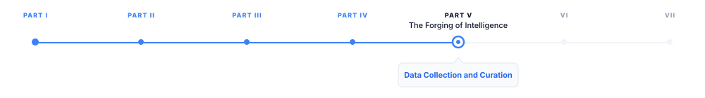

# Data Collection and Curation

> **The canonical question for this chapter:**
> *Before a model can answer anything, it must read everything. How does the
> raw internet become training data and why are the choices made here the
> ones that propagate furthest and are corrected least easily?*

---

::: {.callout-note appearance="minimal"}
**Where are we?**

{#fig-progress width="80%"}

Part IV showed how retrieval gives the model access to external knowledge at
inference time. Part V rewinds the clock entirely. The model had to learn
to do all of that from somewhere. This chapter covers where: the construction
of the training corpus that precedes everything else in Part V. Data
collection is not a preprocessing step you get out of the way before the
real work begins. It is the first architectural decision of the entire system.
:::

---

## Why data is the real foundation

Every capability an LLM has (reasoning, coding, translation, summarization,
answering questions about French geography and quantum mechanics) traces back
to the data it was trained on. The model has no built-in knowledge of the
world. It has patterns compressed from text. Those patterns are only as good
as the text that produced them.

This means data collection is where the model's capabilities are fundamentally
shaped. Architecture decisions matter (attention, depth, positional encoding)
but modern LLMs share a largely converged architecture. What they know, what
they get wrong, what biases they carry, and what blind spots they have are
primarily determined by data, not architecture.

Most papers spend one paragraph on data and thirty pages on model design. This
is backwards. The architecture of a 2024 model is recognizable from a 2020
model. The data is where they diverge.

---

## What scale actually means

Training corpora are large enough that intuitions built on normal datasets
break down. Some grounding numbers:

GPT-3 trained on roughly 300 billion tokens. LLaMA 2 used 2 trillion tokens.
Frontier models from 2024 are estimated to have trained on 10–15 trillion
tokens. A token is approximately 0.75 words in English, so 1 trillion tokens
is roughly 750 billion words, about 5 million books.

No human has read 5 million books. No team of humans has read 5 million books.
The model has, in a statistical sense, absorbed patterns from all of them.

This scale creates an immediate engineering constraint: you cannot curate 10
trillion tokens by hand. You cannot read a meaningful fraction of it. Every
quality decision must be made programmatically, which means every quality
decision is imperfect. The question is not how to achieve perfect curation but
it is how to make systematic decisions that produce the best results across
billions of documents without ever seeing most of them.

---

## The primary sources

Modern LLM training data comes from four broad categories. Real datasets blend
all of them in deliberate proportions.

### Web crawls

The largest source by volume. Common Crawl has been running automated web
snapshots since 2008, releasing monthly snapshots each containing petabytes of
raw HTML from billions of pages. The appeal is obvious: the web is the largest
corpus of human-written text ever assembled. The problem is equally obvious:
most of it is garbage. Spam, SEO content, duplicate pages, auto-generated text,
comment sections, scraped aggregator sites, and machine-translated content sit
alongside high-quality journalism, technical documentation, and encyclopedic
reference.

Raw web crawl data is unusable without extensive filtering. The question is
how to filter aggressively enough to remove noise without losing diversity.

### Curated text corpora

Books, academic papers, and high-quality long-form writing. Books3, Project
Gutenberg, and the Pile's academic subsets (ArXiv papers, PubMed abstracts,
Wikipedia) fall into this category. These sources are much smaller by volume
than web crawls (Wikipedia in all languages is roughly 20 billion tokens, a
rounding error at frontier scale) but they contribute disproportionately to
factual grounding, structured reasoning, and citation quality. They are heavily
oversampled relative to their share of the internet.

### Code repositories

GitHub and other code hosts. This has become a major data category not only
because it teaches models to write and understand code, but because code has
structural properties that improve general reasoning: it is unambiguous, logical,
hierarchical, and extensively annotated with natural language in comments and
docstrings.

Models trained on large code corpora show improved performance on non-coding
tasks including mathematics and structured reasoning, even when evaluated on
tasks that have nothing to do with code. The mechanism is still debated, but
the empirical result is consistent across model families.

### Instruction and dialogue data

Conversations, Q&A pairs, and instruction-following examples. This category
is distinct because it teaches the model the format and register of being
helpful, how to respond to a question, how to follow a directive, how to
structure an explanation. It is often synthetic (generated by another model)
or manually curated (human-written examples). It is typically much smaller
in volume than web data but has outsized influence on how the final model
behaves at inference time.


---

## The data pipeline

Raw collection is just the beginning. Every serious training pipeline includes
a sequence of filtering, deduplication, and quality scoring steps. Here is a
representative pipeline for web data:

```
Raw HTML from crawl
      │
      ▼
Language identification
(discard non-target languages or assign per-language weights)
      │
      ▼
Text extraction
(strip HTML tags, boilerplate, navigation menus, ads, footers)
      │
      ▼
Length and format filtering
(discard very short pages, pages with too many special characters,
 pages where text-to-total-content ratio is too low)
      │
      ▼
Heuristic quality filtering
(word count, punctuation ratio, stop word ratio,
 line length distribution, duplicate line fraction)
      │
      ▼
Deduplication
(exact match by hash, near-duplicate via MinHash or SimHash,
 substring deduplication for repeated passages)
      │
      ▼
Classifier-based quality scoring
(trained model predicts P(high quality); discard below threshold)
      │
      ▼
Toxicity and safety filtering
(remove documents matching harmful content classifiers)
      │
      ▼
Domain weighting and mixing
(upsample high-quality sources, set per-domain proportions)
      │
      ▼
Final training corpus
```

Each step involves tradeoffs. Aggressive quality filtering produces a cleaner
corpus but reduces volume, which may hurt diversity and underrepresented
language coverage. Loose filtering preserves volume but degrades signal. There
is no universally correct threshold, the right settings depend on the target
model, the available compute budget, and empirical evaluation on smaller runs.

---

## Deduplication: the underrated problem

Duplicate content in training data is a serious and underappreciated problem
that affects both quality and benchmark integrity.

At web scale, the same article gets republished hundreds of times across
aggregator sites, blogs, and content farms. If a document appears 500 times
in the training set and once in the test set, the model has not learned to
generalize it has only learned to memorize. This inflates benchmark performance
and degrades real-world capability.

Worse, repeated exposure to the same document teaches the model that this
content is important. A piece of misinformation that went viral and was copied
ten thousand times gets disproportionate weight relative to a single careful
correction.

Deduplication happens at multiple granularities:

**Exact deduplication** removes documents with identical content. This is
cheap and straightforward, hash the document, compare against a lookup table,
discard matches.

**Near-duplicate detection** removes documents that are semantically identical
but not textually identical. Two articles with 95% word overlap but different
headlines should not both appear in training. MinHash and SimHash are standard
approaches: they produce a fingerprint of the document's n-gram distribution
that allows fast approximate comparison across billions of documents.

**Substring deduplication** removes repeated passages within documents, not
just repeated documents. A web page that contains the same boilerplate legal
disclaimer 200 times should not contribute 200 unique training examples.

Research from Google (Lee et al., 2022) demonstrated that aggressive
deduplication consistently improves model quality even when it reduces total
token count. Less data, cleaner signal, better model, a counterintuitive
result that has held up across multiple model families.

---

## Quality filtering: what "quality" means

Quality filtering is philosophically tricky because "quality" is a value
judgment and the judgment embedded in your filtering approach shapes what
the model learns is normal.

### Heuristic filtering

The most common approach uses signals computed from the document itself:

- Average word length (too short suggests gibberish; too long suggests
  technical jargon or non-natural language)
- Ratio of alphabetic characters to total characters (low ratio suggests
  spam or code fragments)
- Presence of stop words (a proxy for natural language vs. keyword lists)
- Distribution of line lengths (regular short lines suggest poetry or
  bullet content; extremely variable suggests scraped layout artifacts)
- Ratio of duplicate lines within a document (high ratio suggests boilerplate
  or repeated headers)
- Presence of known spam or adult content patterns


### Classifier-based filtering

The more sophisticated approach trains a classifier on examples of high and
low-quality text. You take a small set of documents you believe are high
quality (Wikipedia articles, selected books, academic papers), a set you
believe are low quality (scraped spam, auto-generated content), train a
binary classifier, and use its score to filter the full corpus.

This approach was used to produce C4 (Colossal Clean Crawled Corpus), where
a fastText classifier trained on Wikipedia and Common Crawl data scored
documents and filtered those below a threshold. The resulting corpus was
significantly smaller than the raw crawl but dramatically higher quality.

**The bias this introduces.** The classifier inherits the biases of its
positive examples. If high-quality training examples are predominantly English
and from Western academic and journalistic traditions, the classifier will
score content from other cultural, linguistic, and domain contexts lower,
not because those documents are low quality, but because they are dissimilar
from the examples the classifier was trained to recognize as high quality.


### Perplexity-based filtering

A variant: use a smaller, already-trained language model to score each
document's perplexity. Very high perplexity (the model is very surprised by
the text) suggests low-quality or anomalous content. Very low perplexity
(the model already knows this text well) may suggest repeated or memorized
content.

The limitation: a small model trained on web text will score high-quality
text in specialized domains (medical literature, legal documents, code
documentation) as high perplexity simply because it is unfamiliar. Perplexity
filtering can inadvertently remove exactly the specialized knowledge that
makes the training data valuable.

---

## Domain mixing and data proportions

Collecting data is one problem and deciding how much of each source to include
is another, the decision matters as much as collection quality.

Frontier models deliberately oversample high-quality sources relative to their
share of the raw internet. A representative mixing strategy:

| Source | Share of training tokens | Share of raw internet |
|---|---|---|
| Web crawl (filtered) | ~45% | ~99% |
| Books | ~20% | <0.1% |
| Code | ~15% | ~1% |
| Academic papers | ~10% | <0.1% |
| Wikipedia | ~5% | <0.01% |
| Instruction / dialogue | ~5% | near zero |

These proportions are not derived from first principles. They are found through
empirical ablations: train smaller models on different mixes, evaluate across
benchmark suites, and iterate toward the mix that produces the best results.
This is expensive and also one of the least documented aspects of frontier
model development. Mixing ratios are among the most guarded details in model
technical reports.

### Domain mixing and capability

Mixing decisions directly affect model capabilities. A model trained with
higher code proportion shows better performance on code-related tasks, on
mathematical reasoning, and (empirically, though mechanistically unclear)
on structured reasoning tasks generally. A model with more multilingual data
performs better across languages. A model with more instruction data is
more naturally helpful without additional fine-tuning.

Changing the mix at frontier scale (adjusting proportions for a 15 trillion
token training run) is a multi-month commitment. Getting it right requires
either expensive experiments at smaller scale (with uncertain extrapolation
to full scale) or expensive mistakes at full scale.

---

## The data contamination problem

A fundamental requirement of valid evaluation is that the test set must not
appear in the training data. If the model has seen the answers, the evaluation
tells you nothing about generalization.

At the scale of modern training corpora, this is genuinely difficult to
guarantee. The internet contains solutions to many standard benchmarks:
HumanEval coding problems appear on GitHub; MMLU questions appear in study
guides and Quora discussions; GSM8K math problems appear on math tutoring
sites; BIG-Bench tasks appear in academic papers that post-date the benchmark
but pre-date many models.

Contamination detection requires:
1. Collecting all known evaluation datasets
2. Running n-gram matching between evaluation examples and training documents
3. Removing or flagging contaminated training documents
4. Reporting contamination rates explicitly in publications

Many papers do this imperfectly or not at all. When a model achieves
dramatically higher scores than predecessors on a specific benchmark,
contamination is one of the first alternative hypotheses to evaluate. The
difficulty of ruling it out cleanly is one reason the field has moved toward
harder-to-memorize benchmarks, live coding challenges, human preference
evaluation, new tasks created after the training cutoff.

---

## The web as a cultural artifact

One underappreciated aspect of using the web as training data is the fact that 
the web is not a neutral sample of human knowledge. It overrepresents certain 
voices, certain languages, certain time periods, and certain topics.

English accounts for roughly half of web content despite being spoken by only
17% of the world's population. Technical and academic content from the United
States and Western Europe is disproportionately represented. Recent content
is more represented than historical content. Content from wealthy countries
with high internet penetration is more represented than content from countries
with lower penetration.

A model trained primarily on this data will reflect these asymmetries: it
will know more about some cultures, regions, and perspectives than others.
It will have stronger capabilities in some languages than others. This is not
a bug in any simple sense (it is a direct consequence of training on the
data that exists) but it has real downstream consequences for who the model
serves well and who it serves poorly.

These asymmetries can be partially corrected through deliberate data sourcing:
specifically mining underrepresented language content, partnering with
institutions that have access to non-web text corpora, and applying
language-specific oversampling. They cannot be fully corrected because the
underlying data simply does not exist in comparable volume for all languages
and cultures.

---


---

## Key takeaways

- LLM training requires trillions of tokens; no human-curated dataset exists
  at this scale, so web crawls are the primary source — but raw web data is
  low quality and requires extensive filtering before use
- Every serious training pipeline includes language identification, text
  extraction, heuristic quality filtering, deduplication, and classifier-based
  scoring; each step involves tradeoffs between quality and diversity
- Deduplication is as important as quality filtering — repeated content
  teaches memorization rather than generalization; aggressive deduplication
  consistently improves model quality even when it reduces token count
- Domain mixing is a deliberate design choice: high-quality sources (books,
  academic papers, Wikipedia) are heavily oversampled relative to their share
  of the raw internet; these proportions are found empirically, not derived
  from first principles
- Classifier-based quality filtering inherits the biases of its training
  examples; content that is dissimilar from Western academic and journalistic
  norms may be scored lower even when it is high quality on its own terms
- Data contamination with evaluation benchmarks is a real and underreported
  problem; detecting it requires explicit n-gram matching between training
  documents and all known evaluation datasets
- The web overrepresents certain languages, cultures, and perspectives; these
  asymmetries propagate directly into model capabilities and cannot be fully
  corrected after training

---

## Further reading

- Gao et al. (2020). *The Pile: An 800GB Dataset of Diverse Text for Language
  Modeling.* — One of the most documented large training corpora, with
  detailed source breakdowns and per-domain analysis.
- Lee et al. (2022). *Deduplicating Training Data Makes Language Models
  Better.* — Empirical demonstration that aggressive deduplication improves
  quality even at reduced token count.
- Raffel et al. (2020). *Exploring the Limits of Transfer Learning with a
  Unified Text-to-Text Transformer.* — Introduces C4 and the classifier-based
  filtering approach that became standard.
- Longpre et al. (2023). *The Data Provenance Initiative.* — Systematic audit
  of data licensing and consent in popular training datasets.
- Touvron et al. (2023). *LLaMA 2: Open Foundation and Fine-Tuned Chat
  Models.* — Contains one of the more transparent descriptions of data mixing
  decisions and filtering heuristics for a frontier model.
- Penedo et al. (2023). *The RefinedWeb Dataset for Falcon LLM: Outperforming
  Curated Corpora with Web Data, and Web Data Only.* — Demonstrates that
  heavily filtered web data can match or exceed curated corpora.

---
