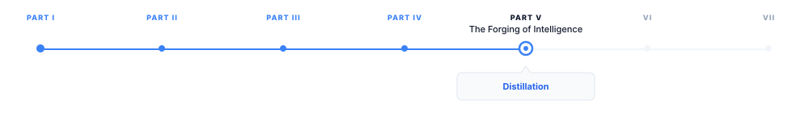
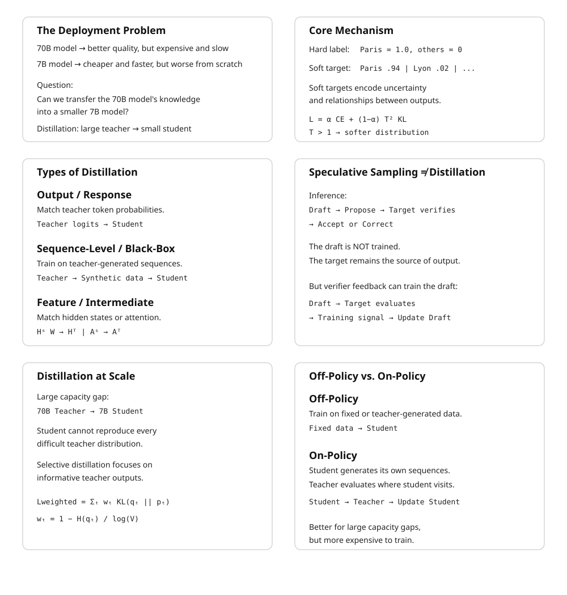

# Distillation

> **The canonical question for this chapter:**
> *How do you transfer the knowledge of a large, expensive model into a
> smaller, cheaper one and why does training on a teacher's output
> distributions produce a better student than training on the original
> data alone?*

---

::: {.callout-note appearance="minimal"}
**Where are we?**
{#fig-progress width="80%"}

This chapter addresses the gap between the best model you can train and 
the best model you can serve: distillation transfers capability from a 
large teacher to a small student, closing that gap at a fraction of the 
inference cost.
:::

---

## The Deployment Problem That Distillation Solves

Scaling laws favor large models. A 70B-parameter model achieves lower loss than
a 7B-parameter model trained for the same number of tokens on the same data.
But serving a 70B model in production costs roughly 10× more per token than 
serving a 7B model, more GPU memory, more compute per forward pass, more infrastructure. 
For latency-sensitive applications, the 70B model may not meet response time
requirements at all.

The naive response is to train a smaller model from scratch. But a 7B model
trained from scratch on the same data achieves meaningfully lower quality than
a 70B model. The question is whether there is a better starting point for the
7B model than random initialization, whether the 70B model's learned
knowledge can be transferred to make the 7B model better than it would be
from scratch on the same compute budget.

Distillation answers yes. Hinton, Vinyals, and Dean (2015) showed that training
a small student model to match the output distribution of a large teacher model
(rather than to match the one-hot targets of the original training labels)
produces students that substantially outperform identically-sized models trained
on the original data alone. The mechanism is information-theoretic: the teacher's
soft output distributions carry more signal per example than the hard labels,
because they encode the teacher's uncertainty and the relative similarity
between classes or tokens.

---

## Knowledge Distillation: The Core Mechanism

### Hard Labels vs. Soft Targets

In standard training, the loss at each position is the cross-entropy between
the model's predicted distribution and a one-hot target: probability 1.0 on
the correct token, probability 0.0 on all others. The one-hot target discards
the structure of the probability space, it treats "the wrong answer" as a
single undifferentiated category.

A teacher model's output distribution over the vocabulary is richer. For a
prompt ending in "The capital of France is", a teacher model might assign:
- 0.94 probability to "Paris"
- 0.02 probability to "Lyon"
- 0.01 probability to "Marseille"
- 0.003 probability to "Brussels"
- smaller probabilities to hundreds of other tokens

The non-Paris probabilities carry information. "Lyon" being more probable than
"Brussels" encodes that Lyon is a French city, that the model knows France has
multiple major cities, and that cities structurally fit this slot better than
countries do. A student trained to match this distribution learns all of these
relationships from a single example. A student trained on the one-hot target
"Paris" learns only that "Paris" is correct and the rest of the probability mass
is uninformative noise in the gradient signal.

Hinton et al. formalized this with temperature-scaled softmax. The teacher's
logits $z_i$ are converted to probabilities using a temperature $T$:

$$
q_i^T = \frac{\exp(z_i / T)}{\sum_j \exp(z_j / T)}
$$

At $T = 1$, this is the standard softmax. At $T > 1$, the distribution is
softened: high-probability tokens become less dominant and low-probability
tokens become more visible. At $T \to \infty$, the distribution approaches
uniform. The same temperature is applied to the student's logits when
computing the distillation loss, so the student learns to reproduce the
teacher's softened distribution.

### The Distillation Loss

The student is trained on a weighted combination of two losses:

$$
\mathcal{L}_{\text{distill}} = \alpha \cdot \mathcal{L}_{\text{CE}}(y, p_s)
+ (1 - \alpha) \cdot T^2 \cdot \mathcal{L}_{\text{KL}}(q^T_\tau, p^T_s)
$$

where:
- $\mathcal{L}_{\text{CE}}(y, p_s)$ is the standard cross-entropy loss between
  the student's predictions and the ground-truth hard labels $y$
- $\mathcal{L}_{\text{KL}}(q^T_\tau, p^T_s)$ is the KL divergence between
  the teacher's temperature-softened distribution $q^T$ and the student's
  temperature-softened distribution $p^T_s$
- $\alpha \in [0, 1]$ controls the relative weight of the two losses
- $T^2$ is a scaling factor that compensates for the reduced magnitude of
  gradients from the softened distributions

The $T^2$ scaling term deserves explanation. When temperature $T$ is applied,
the softmax output values are compressed toward $1/V$ (where $V$ is the
vocabulary size). The gradients of the KL loss with respect to the student's
logits are proportional to $1/T^2$ relative to the hard-label gradients.
Multiplying by $T^2$ restores the gradient magnitudes to the same scale,
ensuring that the distillation signal and the hard-label signal contribute
comparably to the weight update regardless of temperature.

In practice for language model distillation:
- $\alpha = 0.5$ is a common default, giving equal weight to both losses
- $T = 2$ to $T = 4$ is typical; higher temperatures are used when the teacher
  is much more confident than the student
- When ground-truth labels are unavailable (the student is trained on
  teacher-generated text), the hard-label term is dropped: $\alpha = 0$,
  pure distillation

---

## Types of Distillation for Language Models

Distillation for language models comes in several flavors that differ in what
is transferred from teacher to student, and when.

### Output (Response) Distillation

The simplest form: train the student to match the teacher's token-level output
distributions. For each token position in a training sequence, the teacher
produces a probability distribution over the vocabulary; the student is trained
to minimize KL divergence from that distribution.

This requires running the teacher model on the training corpus to generate
soft targets, which are then stored and used for student training. Storage
cost is substantial: for a vocabulary of 100,000 tokens and float16 precision,
each token position requires 200 KB of soft targets. A training corpus of
100 billion tokens would require 20 petabytes of stored soft targets which is
infeasible. In practice, soft targets are either computed on-the-fly during
student training (requiring the teacher to be available in memory alongside the
student) or truncated to the top-$k$ logits (storing only the $k$ highest
teacher probabilities, discarding the long tail which contributes little signal).

Top-$k$ logit storage with $k = 20{,}000$ retains roughly 95% of the KL
divergence signal while reducing storage by 5×. DistilBERT and DistilGPT-2
used top-$k$ approximations for exactly this reason.

### Sequence-Level (Black-Box) Distillation

When the teacher's internal logits are unavailable (either because it is a
proprietary API or because storing full distributions is infeasible) the
student can be trained on sequences generated by the teacher rather than on
the teacher's distributions.

The student treats teacher-generated sequences as training data and minimizes
standard next-token prediction loss against them. This is called black-box
distillation or data distillation. It is strictly less efficient than
distribution-level distillation (the student sees only samples from the
teacher's distribution, not the distribution itself) but it is the only
option when internal model access is unavailable.

This is the mechanism underlying most current synthetic data pipelines.
When GPT-4 generates 10,000 instruction-response pairs and
those pairs are used to train a smaller model, the smaller model is being
distilled from GPT-4 via sequence-level distillation. The term "synthetic
data" emphasizes the data generation aspect; the term "distillation" emphasizes
the knowledge transfer aspect.

### Feature (Intermediate) Distillation

Rather than matching only the teacher's output distributions, feature
distillation trains the student to match the teacher's intermediate
representations, the hidden states at each layer. This transfers more
information but requires architectural compatibility between teacher and
student: the student's hidden dimension must match the teacher's, or an
additional projection layer must bridge the mismatch.

PKD (Patient Knowledge Distillation, Sun et al., 2019) distills BERT by
matching the student's intermediate layer outputs to selected layers of
the teacher. TinyBERT (Jiao et al., 2020) extends this to match attention
matrices, hidden states, and the embedding layer simultaneously, using learned
projection matrices to handle dimension mismatches:

$$
\mathcal{L}_{\text{attn}} = \frac{1}{h} \sum_{i=1}^{h} \text{MSE}(A_i^S, A_i^T)
$$

$$
\mathcal{L}_{\text{hidden}} = \text{MSE}(H^S W_h, H^T)
$$

where $A_i^S$ and $A_i^T$ are the student's and teacher's attention matrices
for head $i$, $H^S$ and $H^T$ are hidden states, and $W_h$ is a learned
projection. TinyBERT achieves 96.8% of BERT-base performance at 7.5× faster
inference and 7.5× smaller model size, the most favorable efficiency tradeoff
published for BERT-family distillation.

Feature distillation is less commonly applied to generative LLMs, where
architectural differences between teacher and student are larger and the
intermediate representations are harder to align meaningfully. Attention
pattern matching works well when the student has the same number of heads as
the teacher but fails when the student uses GQA and the teacher uses MHA,
for example.

### Speculative Sampling and Its Connection to Distillation

Speculative sampling (covered in the Decoding and Sampling chapter) is primarily 
an **inference technique**, not a model-training technique. It uses two models: 
a small, fast **draft model** and a large, more accurate **target model** (also 
called the verifier). The draft model quickly generates several candidate tokens. 
The target model then evaluates these tokens and decides which ones to accept. 
Rejected tokens are replaced by samples from a correction distribution defined 
using the target and draft probabilities.

The important property is that this procedure preserves the target model's
output distribution. In other words, although the draft model proposes the
tokens, the final sequence is distributed exactly as if it had been generated
directly by the target model.

This is **not distillation** because the draft model is not being trained to
imitate the target model. The target model is simply being used to verify the
draft model's proposals during inference:

[
\text{Draft model}
\rightarrow
\text{proposes tokens}
\rightarrow
\text{Target model verifies}
\rightarrow
\text{accept or correct}
]

However, the same verification process can provide a training signal for
improving the draft model. If we fine-tune the draft model so that it proposes
tokens that the target model is more likely to accept, the draft model gradually
learns to approximate the target model's behavior. The target model therefore
acts as a teacher, while the draft model acts as a student.

Conceptually, the process becomes:

[
\text{Draft model proposes}
\rightarrow
\text{Target model evaluates}
\rightarrow
\text{Training signal}
\rightarrow
\text{Update draft model}
]

This creates a connection to **knowledge distillation**. The goal is no longer
simply to use the draft model for faster inference; we are actively training it
to behave more like the target model. In this setting, the target model provides
the supervision signal, often through its probability distribution or through
feedback about which draft tokens it accepts.

Thus, it is useful to distinguish two cases:

* **Speculative sampling:** the draft model is used to accelerate inference,
  while the target model remains the source of the final output distribution.
* **Distillation-inspired draft training:** feedback from the target model is
  used to improve the draft model so that it generates proposals closer to the
  target model's distribution, increasing the acceptance rate and potentially
  making speculative sampling more efficient.

The key idea is therefore not that speculative sampling itself is a form of
distillation. Rather, **the verifier's feedback during speculative decoding can
be used as a training signal to distill some of the target model's behavior into
the draft model**.

---

## Distillation at Scale: LLM-to-LLM

Distilling a 175B-parameter teacher into a 7B-parameter student is
qualitatively different from distilling a 110M-parameter teacher into a
66M-parameter student. The capacity gap is much larger and the student's 
ability to represent the teacher's distributions is correspondingly more limited.

### The Capacity Gap Problem

A 7B-parameter student cannot faithfully reproduce all of a 70B teacher's
probability distributions. For difficult predictions (ambiguous sequences
where the teacher assigns roughly equal probability to multiple continuations)
the student lacks the capacity to represent the full distribution and will
collapse to a lower-entropy approximation. The distillation loss will be large
at these positions regardless of training duration.

The practical implication: distillation with a very large capacity gap produces
students that are good at easy predictions (common patterns, high-confidence
teacher outputs) but poor at difficult predictions (rare patterns, uncertain
teacher outputs). This is not a failure of the distillation algorithm, it is a
fundamental capacity constraint. A 7B model cannot represent what a 70B model
knows; it can only approximate it.

This motivates selective distillation: targeting the distillation loss at
positions where the teacher's distribution is most informative and down-weighting
positions where the teacher is either highly confident (low information in the
soft targets) or highly uncertain (student cannot match the distribution
regardless). The confidence-weighted distillation loss:

$$
\mathcal{L}_{\text{weighted}} = \sum_t w_t \cdot \mathcal{L}_{\text{KL}}(q^T_t, p^T_{s,t})
$$

where $w_t = 1 - H(q_t) / \log V$ is a weight that decreases as the teacher's
entropy $H(q_t)$ approaches its maximum $\log V$. This concentrates the
distillation signal on positions where the teacher's distribution is
informative, neither trivially predictable nor maximally uncertain.

### On-Policy vs. Off-Policy Distillation

Standard distillation is off-policy: the student is trained on sequences from
the original training corpus or teacher-generated sequences, which may not
match the distribution of sequences the student itself would generate.

On-policy distillation trains the student by having it generate sequences,
then computing the KL divergence between the student's and teacher's
distributions on those student-generated sequences. This ensures the student
receives gradient signal at the points in distribution space it actually
visits, rather than points from a fixed dataset that may be far from the
student's current behavior.

GKD (Generalized Knowledge Distillation, Agarwal et al., 2024) formalizes
this distinction and shows that on-policy distillation consistently outperforms
off-policy distillation for language models, particularly at large capacity
gaps. The improvement is most pronounced for open-ended generation tasks where
the student's distribution can deviate substantially from the training corpus
distribution.

The cost of on-policy distillation is that it requires generating sequences
during training, which adds inference-time compute (running the student in
generation mode) to the training-time compute (running the student and teacher
in forward-pass mode). This roughly doubles the per-step training cost relative
to off-policy distillation.

---

## Reasoning Distillation

The distillation of reasoning capability in particular chain-of-thought
reasoning, deserves separate treatment because it involves transferring
a qualitatively different type of knowledge than factual recall or language
modeling.

### Chain-of-Thought Distillation

Large models (70B+) benefit substantially from chain-of-thought prompting:
producing a step-by-step reasoning trace before the final answer significantly
improves accuracy on mathematical, logical, and multi-step tasks. Small models
(7B and below) receive less benefit from standard CoT prompting, apparently
because they lack the capacity to generate accurate reasoning traces.

Distillation of reasoning capability from a large teacher to a small student
involves training the student on teacher-generated reasoning traces, not just
teacher-generated final answers. The student learns both to produce reasoning
traces (the process) and to arrive at correct answers (the outcome).

Ho et al. (2022) showed that a 250M-parameter student trained on GPT-3's
chain-of-thought outputs substantially outperforms a 540B-parameter model
prompted with standard CoT on several reasoning benchmarks, demonstrating
that the reasoning capability can be compressed to a dramatically smaller
model when the teacher's reasoning traces are used as training targets.

### Step-Level vs. Outcome-Level Supervision

A key design choice in reasoning distillation is whether to supervise the
student at the level of individual reasoning steps or only at the final
answer.

**Outcome-level supervision** trains the student to produce the correct final
answer, regardless of the reasoning path taken. This is what standard
sequence-level distillation on teacher-generated outputs provides. The student
may learn shortcuts or alternative reasoning paths that differ from the
teacher's.

**Step-level supervision** trains the student to match the teacher's
intermediate reasoning steps, not just the final answer. This requires
either parsing the teacher's reasoning traces into discrete steps (fragile)
or using a process reward model that scores each step's quality (expensive).

For mathematical reasoning, step-level supervision produces more reliable
generalization, students that have learned to execute each reasoning step
correctly generalize better to novel problem structures than students trained
only on correct final answers. 

### DeepSeek-R1 as Reasoning Distillation

DeepSeek-R1 (2025) provides one of the most striking examples of reasoning
distillation at scale. DeepSeek's large reasoning model (671B parameters)
was used to generate long reasoning traces on a diverse set of mathematical,
coding, and logical problems. These traces (including both correct and
incorrect reasoning paths, with the correct paths labeled) were used to
train smaller distilled models at 1.5B, 7B, 14B, 32B, and 70B parameter
scales.

The 70B distilled model achieved performance competitive with o1-level
reasoning on mathematical benchmarks, despite being trained for a fraction
of the compute of the original reasoning model. The 7B distilled model
substantially outperformed models of equivalent size that had not been
trained on reasoning traces. The results established reasoning distillation
as a practical technique for transferring deliberate reasoning capability
to deployable model sizes.

---

## Self-Distillation and Compression Without a Teacher

A model can be distilled from a previous version of itself, or from a
higher-capacity configuration of the same architecture. These self-distillation
approaches do not require a separate teacher model.

### Born-Again Networks

Furlanello et al. (2018) showed that training a model of the same architecture
to reproduce its own predictions (using the trained model as teacher for
a freshly initialized student of identical size) consistently improves
performance. The improvement comes from the same mechanism as standard
distillation: the soft targets from the trained model carry more gradient
signal than the original hard labels. Repeating this process (the student
becomes the teacher for the next generation) produces "born-again network
ensembles" that outperform the original model despite having identical capacity.

For language models, self-distillation is sometimes applied as a final training
stage: after a full training run, the model is used as a teacher for an
additional fine-tuning pass over high-quality data. The model corrects its
own errors, sharpens its distributions on high-confidence outputs, and
reduces inconsistency across similar inputs.

### Layer Dropping and Progressive Shrinking

A different approach to distillation without a separate teacher: start with a
large trained model and progressively remove layers or attention heads, fine-
tuning after each removal to recover performance. This is sometimes called
structured pruning but is mechanistically similar to distillation when the
remaining layers are fine-tuned to reproduce the full model's behavior.

The Michel et al. (2019) analysis of BERT attention heads found that many
attention heads can be removed with minimal performance impact, and that the
removal order matters: removing the least important heads first and fine-tuning
after each step produces much better results than removing all low-importance
heads simultaneously. This sequential pruning-and-fine-tuning procedure is
equivalent to distilling the pruned model from the full model after each step.

---

## Distillation vs. Fine-Tuning vs. Training from Scratch

The three primary approaches to obtaining a capable small model have different
cost structures, performance profiles, and use cases.

**Training from scratch on the original data** gives the most architectural
freedom (the student can use any architecture, vocabulary, and training
procedure) and avoids any intellectual property concerns about using a
proprietary teacher's outputs. The cost is that the student achieves
significantly lower quality than either distillation or fine-tuning at the
same parameter count, because it lacks any guidance from a better model.
Scaling laws predict the outcome exactly: the trained-from-scratch model
follows the power law for its size and data budget.

**Fine-tuning a pretrained model** is the dominant paradigm for adapting
general models to specific domains or tasks. Fine-tuning
starts from a pretrained checkpoint (which already encodes language
understanding and world knowledge) and adjusts weights to improve
performance on a target distribution. Fine-tuning is fast and effective
but does not produce a smaller model: the student has the same parameter
count as the starting checkpoint.

**Distillation** produces a smaller model with better performance than
training from scratch at the same size. It requires access to either a
teacher model's outputs or the teacher's internal distributions, and it
requires a training run of the student (unlike pure inference-time compression
techniques like quantization). The performance gain over training from scratch
is real and consistent, but the gap between a distilled 7B model and the
original 70B teacher is substantial, distillation compresses knowledge but
does not fully preserve it.

---

## Distillation and Quantization: Stacking Compression

Distillation and quantization are complementary compression
techniques that can be applied together. Quantization reduces precision of
weights (FP32 → INT8 → INT4) and reduces memory and sometimes compute cost.
Distillation reduces model size (70B → 7B parameters) and reduces memory
and compute cost.

Applied in sequence (distill to a small model, then quantize) the
compression factors multiply. A 70B model quantized to INT4 occupies roughly
35 GB (70B × 0.5 bytes/param), which fits on a single H100 but with no
headroom. A 7B model distilled from the 70B model and then quantized to INT4
occupies approximately 3.5 GB, fitting on a consumer GPU with substantial
headroom.

---

## Key Takeaways

- Distillation trains a small student model to match a large teacher model's
  output distributions rather than hard training labels; the soft targets
  carry more information per example because they encode the teacher's
  uncertainty and the relative similarity between wrong answers.
- The distillation loss combines cross-entropy on hard labels and KL divergence
  from temperature-softened teacher distributions; the $T^2$ scaling factor
  compensates for reduced gradient magnitudes from the softened distributions.
- Temperature scaling softens the teacher's output: at $T = 1$ the standard
  distribution is used; at $T > 1$ low-probability tokens become more visible,
  providing richer gradient signal to the student.
- Output distillation requires either on-the-fly teacher inference or storing
  soft targets; full vocabulary storage at 100k tokens costs 200 KB per token
  position, making top-$k$ truncation ($k \approx 20{,}000$) standard practice.
- Black-box (sequence-level) distillation — training on teacher-generated text
  rather than teacher distributions — is the mechanism underlying most
  synthetic data pipelines; it is less efficient than distribution-level
  distillation but requires no access to teacher internals.
- Feature distillation matches intermediate layer representations as well as
  outputs; TinyBERT achieves 96.8% of BERT performance at 7.5× smaller size
  by matching attention matrices and hidden states with learned projections.
- The capacity gap is the binding constraint for large-to-small distillation:
  a 7B student cannot faithfully represent a 70B teacher's distributions at
  difficult, high-entropy positions regardless of training duration.
- On-policy distillation — generating student sequences and computing KL
  divergence on them — outperforms off-policy distillation at large capacity
  gaps, at the cost of inference-time compute during training.
- Reasoning distillation transfers chain-of-thought capability by training on
  teacher-generated reasoning traces; DeepSeek-R1 distilled reasoning traces
  from a 671B model into models as small as 7B with substantial reasoning
  capability retained.
- Distillation and quantization are complementary: distilling 70B → 7B and
  then quantizing to INT4 reduces memory from ~140 GB to ~3.5 GB, a 40×
  compression that makes the model runnable on a consumer GPU.

{#fig-progress width="90%"}

---

## Further Reading

- Hinton, G., Vinyals, O., & Dean, J. (2015). *Distilling the Knowledge in a
  Neural Network.* NeurIPS Deep Learning Workshop. — The founding paper;
  the temperature-scaled softmax and the $T^2$ gradient scaling are introduced
  here; the MNIST and speech recognition experiments establish the mechanism
  cleanly.

- Sanh, V., Debut, L., Chaumond, J., & Wolf, T. (2019). *DistilBERT, a
  distilled version of BERT: smaller, faster, cheaper and lighter.* NeurIPS
  EMC2 Workshop. — The most cited practical distillation result; the 40%
  size reduction at 97% GLUE performance defined practitioner expectations
  for distillation efficiency.

- Jiao, X., et al. (2020). *TinyBERT: Distilling BERT for Natural Language
  Understanding.* EMNLP. — Extends distillation to attention matrices and
  hidden states with learned projections; the two-stage distillation procedure
  (general pre-training distillation then task-specific distillation) is the
  key engineering contribution.

- Ho, N., et al. (2022). *Large Language Models are Reasoning Teachers.* ACL.
  — Demonstrates chain-of-thought distillation; the result that a 250M student
  trained on GPT-3 CoT outputs outperforms much larger models prompted with
  CoT is the key finding.

- Agarwal, R., et al. (2024). *On-Policy Distillation of Language Models:
  Learning from Self-Generated Mistakes.* ICLR. — Introduces GKD and the
  on-policy vs. off-policy distillation distinction for language models;
  the theoretical analysis of why on-policy signal matters at large capacity
  gaps is the key contribution.

- Furlanello, T., Lipton, Z., Tschannen, M., Itti, L., & Anandkumar, A.
  (2018). *Born Again Neural Networks.* ICML. — Demonstrates that self-
  distillation improves
  performance; the ensemble interpretation of born-again networks is the
  key theoretical framing.

- DeepSeek-AI. (2025). *DeepSeek-R1: Incentivizing Reasoning Capability in
  LLMs via Reinforcement Learning.* arXiv. — Covers the distillation
  of reasoning traces from the 671B model to 1.5B–70B student models.

- Michel, P., Levy, O., & Neubig, G. (2019). *Are Sixteen Heads Really Better
  than One?* NeurIPS. — Analysis of attention head importance in BERT; the
  finding that most heads can be removed with minimal impact motivates
  structured pruning approaches; the sequential pruning-and-fine-tuning
  result motivates the distillation framing.

---