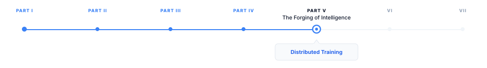
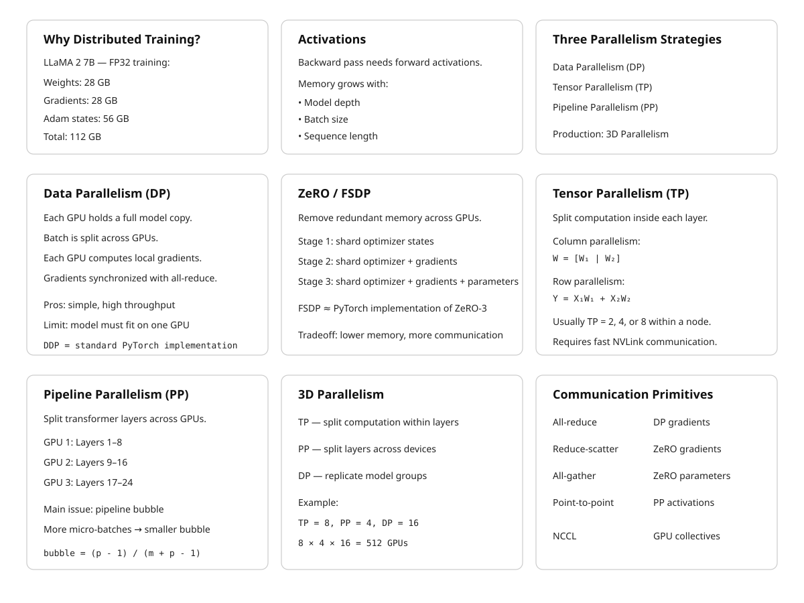

# Distributed Training

> **The canonical question for this chapter:**
> *How do you train a model whose parameters, gradients, and activations
> do not fit in a single GPU and what does each parallelism strategy
> cost you in communication overhead, memory, and engineering complexity?*

---

::: {.callout-note appearance="minimal"}
**Where are we?**

{#fig-progress width="80%"}

We are in Part IV. Chapter @sec-training-loop covered the single-machine training loop: the
forward pass, loss computation, backward pass, and optimizer step as they
execute on one device. This chapter asks what happens when the model, the data,
or both are too large for one device to hold which is the case for every
large language model trained in the past five years.
:::

---

## The Problem: Nothing Fits

The numbers make the problem concrete. LLaMA 2 7B has 7 billion parameters.
In float32, each parameter occupies 4 bytes: 28 GB just for the weights.
Training also requires storing gradients, another 28 GB, and Adam optimizer
state (first and second moment estimates for every parameter), another 56 GB.
Total: 112 GB for 7 billion parameters in full precision. An H100 GPU has
80 GB of HBM. The weights alone saturate the memory budget; gradients and
optimizer state overflow it by a factor of two.

For LLaMA 2 70B: 1.12 TB of optimizer state, gradients, and weights combined.
For GPT-3 175B: 2.8 TB. For the largest models in active research, parameter
counts reach into the hundreds of billions or trillions, with optimizer state
occupying multiple petabytes. No single GPU has ever existed that could hold
these numbers, and none is on the near-term roadmap.

Training activations compound the problem. During the backward pass, the
gradient of the loss with respect to each layer's input must be computed.
Computing this gradient requires the layer's activations (the intermediate
values computed during the forward pass) to be available at backward time.
For a 7B-parameter model trained with context length 4,096 and batch size 1,
storing full activations requires roughly 70 GB using float16. For batch size 32:
2.24 TB. Activation recomputation (gradient checkpointing) can trade this memory
cost for additional compute (the activations are discarded during the forward
pass and recomputed during the backward pass) but introduces a 30–40%
compute overhead.

Distributed training resolves the memory problem by distributing the model
and the data across multiple GPUs and multiple nodes. The price is communication:
moving tensors across GPUs requires interconnect bandwidth and introduces
synchronization points that can dominate runtime if not carefully managed.
The field has developed three orthogonal parallelism strategies (data
parallelism, tensor parallelism, and pipeline parallelism) each addressing
a different aspect of the memory and compute problem, and several frameworks
for combining them.

---

## Data Parallelism

Data parallelism is the simplest and oldest distributed training strategy. Each
GPU holds a complete copy of the model. The training batch is split across GPUs:
if the global batch size is 2,048 sequences and there are 64 GPUs, each GPU
processes 32 sequences. Each GPU performs a full forward and backward pass on
its local mini-batch, producing local gradients. After the backward pass, the
gradients from all GPUs are aggregated (summed and then divided by the number
of GPUs) so that each GPU updates its weights using the gradient that would
have been computed from the full global batch. This gradient aggregation step
is an all-reduce operation.

### The All-Reduce

An all-reduce takes $N$ values distributed across $N$ participants, reduces
them with an associative operation (summation, in this case), and returns the
result to all participants. For gradient aggregation in data parallelism:

- Each GPU has a gradient tensor $g_i$ for its local batch.
- After all-reduce, every GPU holds $\bar{g} = \sum_{i=1}^{N} g_i / N$.
- Each GPU applies $\bar{g}$ to its weight update.

The communication volume is $2 \times P \times \text{dtype\_bytes}$ per
all-reduce operation (the factor of 2 accounts for the reduce followed by
broadcast), where $P$ is the number of parameters. For LLaMA 2 7B in float16:
$2 \times 7 \times 10^9 \times 2 = 28$ GB per step.

NVLink (within a node) provides 600 GB/s bidirectional bandwidth on H100 SXM.
A 28 GB all-reduce over NVLink takes approximately 47 milliseconds, ignoring
latency. Across nodes over InfiniBand (400 Gb/s = 50 GB/s per port), the same
all-reduce takes over half a second, longer than a typical training step for
a 7B model. Data parallelism across nodes is therefore bandwidth-limited and
practical only when the compute-to-communication ratio is high (large batch
sizes, long sequences, large models).

### Gradient Accumulation

When the desired global batch size exceeds what GPU memory can hold in a single
step, gradient accumulation allows accumulating gradients over multiple forward-
backward passes before performing the all-reduce and weight update. If target
global batch size is 2,048 and each GPU can hold a micro-batch of 4 sequences,
the GPU performs 512 forward-backward passes, accumulating gradients, before
synchronizing.

Gradient accumulation decouples the effective batch size from the per-step
memory requirement. It does not reduce memory consumption for the model weights,
gradients, or optimizer state, those are determined by the model, not the batch
size, but it allows using a global batch size that would otherwise require more
GPUs than are available.

The cost is throughput: 512 micro-batches require 512 forward-backward passes
per update. CUDA graph capture can reduce the per-step overhead,
but the fundamental compute cost is unchanged. Gradient accumulation is a
memory-compute tradeoff that trades latency for batch size flexibility.

### DDP: PyTorch DistributedDataParallel

PyTorch's DistributedDataParallel (DDP) is the standard implementation of
data parallelism. DDP wraps a model and, after each backward pass, performs
an all-reduce of gradients across all participating processes using NCCL
(NVIDIA Collective Communications Library). DDP overlaps gradient communication
with the backward pass using gradient bucketing: as gradients for later layers
are computed, gradients for earlier layers (whose backward pass is already
complete) are all-reduced while the backward pass continues. This overlap can
hide a substantial fraction of the communication latency.

DDP's limitation is the memory requirement: every GPU holds the full model.
For models that fit in GPU memory with some headroom, DDP is the lowest-
complexity distributed training option. It scales to thousands of GPUs with
near-linear throughput scaling, limited primarily by the all-reduce bandwidth.
GPT-3 was trained using data parallelism as a component of a hybrid strategy.
At 96 GPUs with a global batch size of roughly 3.2 million tokens, DDP
communication overhead was manageable.

---

## ZeRO: Sharding Optimizer State, Gradients, and Parameters

DDP requires each GPU to hold a full copy of the model parameters, gradients,
and optimizer state. For large models, this redundancy is the binding memory
constraint. ZeRO (Zero Redundancy Optimizer), introduced by Rajbhandari et al.
(2020) at Microsoft, eliminates this redundancy through sharding.

ZeRO defines three stages, each eliminating a different component of
per-GPU redundancy:

**ZeRO Stage 1: Optimizer State Partitioning.** The optimizer state (Adam
moments) is sharded across GPUs: each GPU holds the optimizer state for a
$1/N$ partition of the parameters. Gradients are still all-reduced (giving
each GPU the full gradient), but each GPU only updates and stores the optimizer
state for its partition. After the optimizer step, an all-gather reconstructs
the full updated parameters on each GPU.

Memory reduction: optimizer state drops from $O(P)$ to $O(P/N)$ per GPU.
For Adam in float32 with N=64 GPUs: 56 GB of optimizer state per GPU becomes
875 MB.

**ZeRO Stage 2: Gradient Partitioning.** In addition to Stage 1, gradients
are also sharded. Each GPU accumulates and stores only the gradients for its
parameter partition. A reduce-scatter (rather than all-reduce) delivers the
summed gradient only to the GPU responsible for that partition, after which
each GPU applies the optimizer step to its shard. An all-gather then
reconstructs full parameters.

Memory reduction: gradients drop from $O(P)$ to $O(P/N)$ per GPU. With N=64:
28 GB of gradients per GPU becomes 437 MB.

**ZeRO Stage 3: Parameter Partitioning.** Parameters themselves are sharded.
Each GPU permanently holds only a $1/N$ slice of the parameters. During the
forward pass, an all-gather reconstructs the full parameters for each layer
as it is needed, then discards them after the layer's computation is complete.
The backward pass similarly all-gathers parameters as needed and performs
reduce-scatter for gradients.

Memory reduction: the per-GPU parameter memory drops from $O(P)$ to $O(P/N)$.
For LLaMA 2 7B with float16 weights across 64 GPUs: 14 GB → 219 MB per GPU.
The total optimizer state, gradient, and weight memory per GPU drops from
112 GB to approximately 1.75 GB.

The cost of ZeRO-3 is communication volume. Where DDP performs one all-reduce
of $2P$ bytes per step, ZeRO-3 performs three communication operations, an
all-gather for parameters during the forward pass ($P$ bytes), a reduce-scatter
for gradients during the backward pass ($P$ bytes), and another all-gather
for parameters during the backward pass ($P$ bytes), totaling $3P$ bytes.
This is 50% more communication than DDP's $2P$ bytes, but the memory savings
are often decisive for large models.

### ZeRO: A Concrete Example (N=4 GPUs, 4 Parameter Partitions)

We track three state types per GPU: **parameters** $W$, **gradients** $G$, and
**optimizer state** (Adam moments $m,v$).

---

#### Baseline: DDP

Every GPU holds everything, full redundancy.

```text
GPU 0            GPU 1            GPU 2            GPU 3
W0 W1 W2 W3      W0 W1 W2 W3      W0 W1 W2 W3      W0 W1 W2 W3
G0 G1 G2 G3      G0 G1 G2 G3      G0 G1 G2 G3      G0 G1 G2 G3
m0 v0            m0 v0            m0 v0            m0 v0
m1 v1            m1 v1            m1 v1            m1 v1
m2 v2            m2 v2            m2 v2            m2 v2
m3 v3            m3 v3            m3 v3            m3 v3
```

**Step:** Each GPU runs forward and backward on its local mini-batch, producing
local gradients. An **all-reduce** sums and averages these gradients, so every
GPU obtains the same full gradient $G$. Every GPU then independently runs the
optimizer update:

$$
W' = \operatorname{Opt}(W,G,m,v)
$$

Because all GPUs have identical $W$, $G$, and optimizer states, they all compute
the same updated parameters $W'$. No parameter communication is required after
the optimizer step.

---

#### Stage 1: Shard Optimizer States

Optimizer state is split across GPUs; parameters and gradients are still
replicated.

```text
GPU 0            GPU 1            GPU 2            GPU 3
W0 W1 W2 W3      W0 W1 W2 W3      W0 W1 W2 W3      W0 W1 W2 W3
G0 G1 G2 G3      G0 G1 G2 G3      G0 G1 G2 G3      G0 G1 G2 G3
m0 v0            m1 v1            m2 v2            m3 v3
```

**Step:** After backward, an **all-reduce** gives every GPU the full gradient
$G=[G_0,G_1,G_2,G_3]$. Each GPU is responsible for updating only the parameter
partition for which it owns the optimizer state:

```text
GPU 0 → update W0 using G0, m0, v0
GPU 1 → update W1 using G1, m1, v1
GPU 2 → update W2 using G2, m2, v2
GPU 3 → update W3 using G3, m3, v3
```

After the optimizer step, the updated parameters exist as separate shards:

```text
GPU 0 → W0'
GPU 1 → W1'
GPU 2 → W2'
GPU 3 → W3'
```

Because ZeRO-1 still expects every GPU to hold the complete model for the next
forward pass, an **all-gather** combines these updated shards so that every GPU
again has:

```text
W0' W1' W2' W3'
```

The optimizer state remains sharded; only the updated parameters are
reconstructed on every GPU.

---

#### Stage 2: Shard Optimizer States + Gradients

Replace the all-reduce with a **reduce-scatter**: each GPU receives only the
gradient shard it owns.

```text
GPU 0            GPU 1            GPU 2            GPU 3
W0 W1 W2 W3      W0 W1 W2 W3      W0 W1 W2 W3      W0 W1 W2 W3
G0               G1               G2               G3
m0 v0            m1 v1            m2 v2            m3 v3
```

**Step:** Each GPU first computes local gradients for the full model. The
**reduce-scatter** sums the corresponding gradients across GPUs and leaves only
the relevant gradient partition on each GPU:

```text
GPU 0 → G0
GPU 1 → G1
GPU 2 → G2
GPU 3 → G3
```

Each GPU can now update its own parameter partition using its local gradient
and optimizer state:

```text
GPU 0 → W0' = Opt(W0, G0, m0, v0)
GPU 1 → W1' = Opt(W1, G1, m1, v1)
GPU 2 → W2' = Opt(W2, G2, m2, v2)
GPU 3 → W3' = Opt(W3, G3, m3, v3)
```

The updated parameter shards are then **all-gathered**, reconstructing the full
updated model $[W_0',W_1',W_2',W_3']$ on every GPU. The parameters are therefore
still replicated during the next forward pass, but the gradients and optimizer
states remain sharded.

---

#### Stage 3: Shard Everything

No GPU permanently holds a full copy of anything.

```text
GPU 0            GPU 1            GPU 2            GPU 3
W[:,0:k]         W[:,k:2k]        W[:,2k:3k]       W[:,3k:4k]   ← parameter shards
G0               G1               G2               G3
m0 v0            m1 v1            m2 v2            m3 v3
```

The parameter shards represent slices of the parameters of every layer; GPU 0
does not own one complete layer while GPU 1 owns another.

Full parameters are reconstructed **on demand** via all-gather, used for
computation, and then discarded.

**Forward:** For each layer $\ell$:

$$
\text{all-gather } W_\ell
\rightarrow
\text{compute layer } \ell
\rightarrow
\text{discard full } W_\ell
$$

Only the parameters needed for the current layer are temporarily reconstructed
on each GPU.

**Backward:** For each layer $\ell$:

$$
\text{all-gather } W_\ell
\rightarrow
\text{compute gradients}
\rightarrow
\text{reduce-scatter } G_\ell
\rightarrow
\text{discard full } W_\ell
$$

The reduce-scatter leaves each GPU with only the gradient corresponding to its
parameter shard.

**Step:** Each GPU now has the three pieces of state required to update its
local parameter shard:

```text
GPU 0 → W[:,0:k]  + G0 + m0,v0 → W'[:,0:k]
GPU 1 → W[:,k:2k] + G1 + m1,v1 → W'[:,k:2k]
GPU 2 → W[:,2k:3k]+ G2 + m2,v2 → W'[:,2k:3k]
GPU 3 → W[:,3k:4k]+ G3 + m3,v3 → W'[:,3k:4k]
```

Crucially, unlike ZeRO-1 and ZeRO-2, the updated parameter shards are **not
all-gathered permanently after the optimizer step**. They remain distributed.
On the next forward pass, the parameters are again all-gathered temporarily,
layer by layer, when they are needed for computation. This is what allows
ZeRO-3 to keep the model parameters sharded throughout training.

---


### FSDP: PyTorch's ZeRO-3 Implementation

PyTorch's Fully Sharded Data Parallel (FSDP) is the standard production
implementation of ZeRO-3, available from PyTorch 1.12. FSDP shards parameters,
gradients, and optimizer state across GPUs within a process group. It integrates
with PyTorch's autograd system and supports mixed precision, gradient
checkpointing, and CPU offloading.

FSDP's key configuration decision is the sharding unit. Sharding at the
module level (per transformer block, for example) limits the all-gather to
one block's parameters at a time, reducing peak memory usage during forward
and backward passes. Sharding at finer granularity reduces memory further but
increases the number of all-gather calls and the associated latency.

A typical FSDP training configuration for a 70B-parameter model on 64 H100s:
- Parameter dtype: bfloat16 (2 bytes per parameter)
- Optimizer dtype: float32 (8 bytes per parameter for Adam)
- Per-GPU parameter memory: $140 \times 10^9 \times 2 / 64 \approx 4.4$ GB
- Per-GPU optimizer state: $140 \times 10^9 \times 8 / 64 \approx 17.5$ GB
- Total per-GPU: ~22 GB, well within an 80 GB H100


---

## Tensor Parallelism

Data parallelism and ZeRO shard the data and the optimizer state, but the
forward pass through a single transformer layer still runs on a single device.
For very large models (hundreds of billions of parameters) individual layers
are too large to fit on one GPU even with ZeRO-3. Tensor parallelism shards
the computation within individual layers.

### Column and Row Parallelism for Linear Layers

The key insight, from Megatron-LM (Shoeybi et al., 2019), is that large matrix
multiplications in transformer layers can be split across devices with minimal
communication.

Consider a linear layer $Y = XW$ where $X \in \mathbb{R}^{B \times d}$ is the
input and $W \in \mathbb{R}^{d \times h}$ is the weight matrix. This can be
parallelized two ways:

**Column parallelism** splits $W$ along columns: $W = [W_1 \mid W_2]$ across
two GPUs, with $W_1, W_2 \in \mathbb{R}^{d \times h/2}$. Each GPU computes
$Y_i = X W_i \in \mathbb{R}^{B \times h/2}$ independently, since both GPUs
need the full input $X$. The outputs are concatenated: $Y = [Y_1 \mid Y_2]$.
No communication is required during the forward pass (assuming $X$ is already
replicated on both GPUs). An all-gather concatenates outputs.

**Row parallelism** splits $W$ along rows: $W = [W_1^T \mid W_2^T]^T$, with
each GPU holding $W_i \in \mathbb{R}^{d/2 \times h}$. The input must be split
correspondingly: $X = [X_1 \mid X_2]$, with each GPU receiving its slice.
Each GPU computes $Y_i = X_i W_i \in \mathbb{R}^{B \times h}$. The outputs
are summed: $Y = Y_1 + Y_2$. An all-reduce sums the partial outputs.

In a transformer's self-attention layer, the Q/K/V projection matrices are
parallelized with column parallelism (output is split across heads, which maps
naturally to column splits). The output projection after attention is
parallelized with row parallelism. Together, this requires exactly two
communication operations per attention layer, one all-reduce after the output
projection during the forward pass and one during the backward pass. For a
transformer with $L$ layers, tensor parallelism introduces $2L$ all-reduce
operations per forward-backward pass.

{#fig-progress width="80%"}

For GPT-3 with 96 layers and tensor parallelism degree 8: 192 all-reduce
operations per step. On NVLink (600 GB/s), where each all-reduce involves
roughly $2 \times h \times \text{dtype\_bytes} \approx 2 \times 12{,}288 \times 2 = 48$ KB
per operation, the communication overhead is manageable within a single node.
Across nodes (InfiniBand at 50 GB/s), the same all-reduces are approximately
12× slower, making cross-node tensor parallelism impractical for most model
sizes.

**Tensor parallelism degree** is typically 2, 4, or 8 (powers of 2, matching
NVLink topology) and is applied within a node. An 8-way tensor-parallel split
across 8 H100s connected by NVLink has minimal communication overhead. Extending
to 16-way requires cross-node links and pays a substantial bandwidth penalty.

### Attention Heads as Natural Split Units

Multi-head attention is naturally amenable to tensor parallelism because each
attention head is independent. With 96 attention heads (GPT-3's configuration)
and 8-way tensor parallelism, each GPU handles 12 heads. The head outputs are
concatenated and projected back to the model dimension with row parallelism.
This is architecturally clean and communication-efficient: the 8-way split
exactly partitions the head dimension without any cross-head dependencies during
the attention computation.

Grouped-query attention (GQA, used in LLaMA 2 70B and most subsequent models)
reduces the number of KV heads relative to query heads. With 8 KV heads and
tensor parallelism degree 8, each GPU holds exactly 1 KV head, an efficient
split. At tensor parallelism degree greater than the number of KV heads,
GQA and tensor parallelism become incompatible without replication.

---

## Pipeline Parallelism

Tensor parallelism splits computation within a layer. Pipeline parallelism
splits computation across layers, assigning different layers to different
devices. Device 0 holds layers 1–8; device 1 holds layers 9–16; and so on.

The forward pass moves left to right: device 0 processes a micro-batch and
passes its output activation to device 1, which processes it and passes to
device 2, and so on. The backward pass moves right to left: device 3 computes
gradients for its layers and passes gradient tensors to device 2, which
continues back to device 0.

### The Pipeline Bubble

Naive pipeline parallelism has a critical inefficiency: pipeline bubbles.
When device 0 finishes its forward pass and passes activations to device 1,
device 0 must wait, it has nothing to do until the backward pass gradient
arrives from device 1. This idle time is the pipeline bubble.

For a pipeline of $p$ stages and a mini-batch split into $m$ micro-batches,
the pipeline bubble occupies a fraction $\frac{p-1}{m + p - 1}$ of the
total training time. With $p = 4$ stages and $m = 8$ micro-batches:
bubble fraction = $3/11 \approx 27\%$. With $m = 32$: $3/35 \approx 8.6\%$.
Larger micro-batch counts reduce the bubble overhead but increase memory for
in-flight activations.

Megatron-LM's interleaved pipeline schedule reduces the bubble further by
assigning non-contiguous layer chunks to each device (device 0 holds layers
1–4 and layers 17–20, device 1 holds layers 5–8 and layers 21–24, etc.).
The interleaved schedule reduces the bubble fraction to $\frac{1}{m}
\cdot \frac{p-1}{p}$, cutting the overhead by roughly a factor of the
number of interleaved chunks per device. The cost is increased communication:
activations must be passed between non-adjacent layer chunks at interleaving
boundaries.


---

## 3D Parallelism: Combining All Three

Production training of large models combines data, tensor, and pipeline
parallelism simultaneously. This combination is called 3D parallelism.

The standard configuration, used in Megatron-LM and adopted broadly:

- **Tensor parallelism (TP)** within a node, using NVLink. Typical TP degree:
  4 or 8. This is the inner loop, tightest communication requirement.
- **Pipeline parallelism (PP)** across nodes at small scale, or within a node
  at large TP degree. Typical PP degree: 2–8. Communication is point-to-point
  between adjacent stages (only activation tensors, not all-reduces) so
  it tolerates higher latency than TP.
- **Data parallelism (DP)** at the outermost level, across the largest
  dimension of the GPU cluster. Typical DP degree: 8–1,024. All-reduces run
  over InfiniBand between data-parallel replica groups.

For a training run on 512 H100s with TP=8, PP=4, DP=16:
- 8 GPUs in each tensor-parallel group (within a single node)
- 4 nodes in each pipeline-parallel group (across nearby nodes, low latency)
- 16 data-parallel replicas (all-reduce across 16 groups of 32 GPUs)

The total GPU count: $8 \times 4 \times 16 = 512$. This maps naturally to
a cluster of 64 8-GPU nodes organized into 16 groups of 4 nodes.

GPT-3 was trained with TP=8, PP=8, DP=6 on 384 A100 GPUs. LLaMA 2 70B was
trained with TP=8, PP=1, DP=56 on 2,048 A100 80GB GPUs.

---

## Communication Primitives and Interconnects

Efficient distributed training requires efficient collective communication
operations. NCCL (NVIDIA Collective Communications Library) implements these
for GPU clusters. The key collectives:

| Operation | Description | Use in distributed training |
|-----------|-------------|---------------------------|
| All-reduce | Sum tensors across all ranks, return result to all | DDP gradient aggregation |
| Reduce-scatter | Sum tensors, distribute partial results | ZeRO gradient reduction |
| All-gather | Concatenate shards from all ranks | ZeRO parameter reconstruction |
| Broadcast | Send tensor from one rank to all | Parameter initialization |
| Point-to-point | Send tensor from rank $i$ to rank $j$ | Pipeline stage activation passing |


---


## Key Takeaways

- A 7B-parameter model requires approximately 112 GB for weights, gradients,
  and Adam optimizer state in mixed precision — exceeding a single H100's 80 GB
  HBM even before activations, requiring distributed training for all models
  at and above this scale.
- Data parallelism replicates the full model on each GPU and splits the batch;
  ZeRO stages 1–3 eliminate the redundant optimizer state, gradients, and
  parameters respectively, reducing per-GPU memory from $O(P)$ to $O(P/N)$.
- ZeRO-3 (implemented as PyTorch FSDP) enables training models of arbitrary
  size on any number of GPUs at the cost of 50% more communication volume than
  standard DDP ($3P$ bytes versus $2P$ bytes per step).
- Tensor parallelism splits matrix multiplications within layers across devices,
  requiring two all-reduce operations per transformer layer; the bandwidth
  requirement limits tensor parallelism to within-node NVLink connections.
- Pipeline parallelism splits layers across devices; the pipeline bubble wastes
  a fraction $\frac{p-1}{m+p-1}$ of compute time, which shrinks toward zero
  as the number of micro-batches $m$ grows.
- 3D parallelism combines tensor parallelism (inner, NVLink), pipeline
  parallelism (middle, cross-node), and data parallelism (outer, InfiniBand)
  to scale to thousands of GPUs with each dimension exploiting the appropriate
  interconnect.
- NVLink (900 GB/s on H100 SXM) is 18× faster than InfiniBand NDR (50 GB/s);
  this bandwidth gap is the primary reason tensor parallelism is confined within
  nodes.
- Mixed-precision training uses bfloat16 for forward and backward passes (matching
  float32's dynamic range without overflow) and float32 for optimizer state;
  total memory footprint is $16P$ bytes for Adam.
- Gradient checkpointing reduces activation memory from $O(L \times B \times T)$
  to $O(\sqrt{L})$ at 30–40% additional compute; FlashAttention already
  recomputes attention within this budget.
- Well-optimized training runs on H100 clusters achieve 38–46% MFU; the
  remaining 54–62% is lost to communication, pipeline bubbles, and memory
  bandwidth bottlenecks.
- At 4,096 GPUs, expect roughly 4 GPU failures per hour; asynchronous
  checkpointing eliminates checkpoint latency from the critical path by
  snapshotting to host RAM while training continues.

{#fig-progress width="90%"}

---

## Further Reading

- Rajbhandari, S., Rasley, J., Ruwase, O., & He, Y. (2020). *ZeRO: Memory
  Optimizations Toward Training Trillion Parameter Models.* SC. — Introduces
  the three stages of ZeRO; the memory analysis is precise and the scaling
  experiments demonstrate near-linear throughput scaling to 400+ GPUs.

- Shoeybi, M., Patwary, M., Puri, R., LeGresley, P., Casper, J., & Catanzaro, B.
  (2019). *Megatron-LM: Training Multi-Billion Parameter Language Models Using
  Model Parallelism.* arXiv. — Introduces column/row parallelism for transformer
  layers and the interleaved pipeline schedule; the communication analysis
  is the foundational treatment of tensor parallelism for LLMs.

- Narayanan, D., et al. (2021). *Efficient Large-Scale Language Model Training
  on GPU Clusters Using Megatron-LM.* SC. — Combines tensor, pipeline, and
  data parallelism into 3D parallelism; the analysis of pipeline bubble fraction
  and the 1F1B schedule are the key contributions.

- Micikevicius, P., et al. (2018). *Mixed Precision Training.* ICLR. —
  Introduces the float16/float32 mixed-precision training procedure with dynamic
  loss scaling; the gradient underflow analysis motivates loss scaling clearly.

- Chen, T., et al. (2016). *Training Deep Nets with Sublinear Memory Cost.*
  arXiv. — Introduces gradient checkpointing; the $O(\sqrt{n})$ memory-compute
  tradeoff analysis is the key result.

- Chowdhery, A., et al. (2022). *PaLM: Scaling Language Modeling with
  Pathways.* JMLR. — Reports 46.2% MFU on TPU v4 with detailed analysis
  of communication overlap and efficiency at 6,144 chips; the infrastructure
  section is unusually detailed for a model paper.

- Touvron, H., et al. (2023). *LLaMA 2: Open Foundation and Fine-Tuned Chat
  Models.* — Section 2.1 describes the training infrastructure: 2,048 A100
  GPUs, custom fast interconnect, training efficiency optimizations, and MFU
  figures; a concise real-world 3D parallelism case study.

- Lian, X., et al. (2023). *FSDP: Fully Sharded Data Parallel Training.* PyTorch
  Blog. — The engineering design document for PyTorch FSDP; covers the sharding
  unit tradeoffs, mixed precision integration, and the async checkpoint API.

---