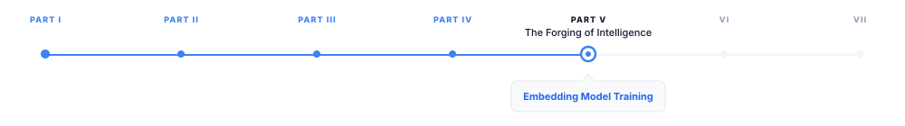

# Embedding Model Training

> **The canonical question for this chapter:**
> *Why are embedding models trained so differently from generative models
> and what does contrastive learning actually teach a model about the
> geometry of meaning?*

---

::: {.callout-note appearance="minimal"}
**Where are we?**

{#fig-progress width="80%"}

We are at the end of Part IV. Every chapter in this part has covered how
generative models learn: next-token prediction, alignment, reasoning. This
final chapter covers a parallel training discipline for a different kind of
model, one that is never asked to generate text, only to represent it.

Two earlier chapters already covered embeddings from the outside: @sec-Embeddings-and-Meaning
described what embeddings are and how they organize meaning geometrically,
from the perspective of a generative model's forward pass. 
@sec-Embeddings-for-Search explained how to use a pretrained embedding model 
to build a retrieval system, including selecting an appropriate model, encoding 
queries and documents correctly, and evaluating retrieval quality.
Both of those chapters treat the embedding model as a finished artifact. This 
chapter opens it up: how that artifact gets built, and why the training process 
explains both the strengths and the failure modes you'll see when you use one.
:::

---

## Two Kinds of Learning

There are two fundamentally different things a language model can be trained
to do. The first is generation: given a prefix, predict what comes next.
This is next-token prediction, and it is what GPT, LLaMA, Claude, and every
other generative model optimizes. The second is representation: given a
piece of text, produce a fixed-size vector that encodes its meaning in a way
that supports comparison. This is what embedding models do, and the training
objective that teaches it is contrastive learning, a fundamentally
different signal from next-token prediction.

The distinction matters because it explains something that surprises people
the first time they hit it: a generative model can write fluent, accurate
text while producing embeddings (its hidden states) that are poorly
organized for retrieval. Next-token prediction never directly optimizes the
property retrieval needs, that semantically similar texts land close
together in vector space. Embedding models are trained specifically to
organize the space for that purpose, and everything below is about how.

---

## The Contrastive Learning Framework

Contrastive learning teaches a model by comparison: given an anchor text,
pull its representation toward representations of semantically similar texts
and push it away from representations of semantically dissimilar texts. The
model is not told what meaning is, it is only told which pairs of texts
are similar and which are dissimilar, and it must organize its representation
space accordingly.

### Positive and Negative Pairs

A contrastive training example consists of:

- An **anchor** $q$: typically a query or a source sentence.
- A **positive** $d^+$: a text semantically similar to the anchor, the
  correct document for a query, a paraphrase, a translation.
- One or more **negatives** $d^-_1, d^-_2, \ldots$: texts semantically
  dissimilar to the anchor, documents that do not answer the query,
  random sentences from the corpus.

The model is trained to assign high similarity scores to $(q, d^+)$ pairs
and low similarity scores to $(q, d^-)$ pairs, using cosine similarity
between the normalized embeddings:

$$
\text{sim}(q, d) = \frac{f(q) \cdot f(d)}{\|f(q)\| \cdot \|f(d)\|}
$$

where $f(\cdot)$ is the embedding model mapping text to a vector.

### The InfoNCE Loss

The dominant contrastive loss for embedding models is InfoNCE,
also called the NT-Xent loss or the in-batch softmax loss.
For a batch of $N$ anchor-positive pairs, with the $N-1$ other positives in
the batch serving as negatives for each anchor:

$$
\mathcal{L}_{\text{InfoNCE}} = -\frac{1}{N} \sum_{i=1}^{N} \log
\frac{\exp(\text{sim}(q_i, d^+_i) / \tau)}
{\sum_{j=1}^{N} \exp(\text{sim}(q_i, d_j) / \tau)}
$$

where $\tau$ is a temperature parameter controlling the sharpness of the
distribution. At low $\tau$, the loss heavily penalizes any similarity to
negatives; at high $\tau$, the loss is more forgiving of moderate
similarities to negatives. Temperature is typically learned or set to a
small value (0.01–0.05) to encourage the model to sharply distinguish
positives from negatives.

### What InfoNCE Optimizes

InfoNCE has a clean information-theoretic interpretation: it is a lower bound
on the mutual information between the anchor and the positive. In practice,
it implements a classification task, given the anchor, identify which of
the $N$ candidates in the batch is the positive. The loss is the
cross-entropy of this $N$-way classification.

As $N$ grows, the task gets harder and the model is forced to produce more
discriminative embeddings. This is why batch size is a critical
hyperparameter for contrastive learning, larger batches provide more
negatives, a harder classification task, and a better-organized embedding
space. A batch of 256 pairs is a 256-way classification at each step; a
batch of 32,768 pairs (achievable with gradient accumulation and in-batch
negative sharing across GPUs) is a 32,768-way classification. The difference
in embedding quality between small and large batches can be dramatic, this
is one of the most important practical findings in embedding model training.

---

## In-Batch Negatives and Their Limitations

Using the other positives in the batch as negatives (in-batch negatives)
is efficient: no additional inference is required, since their embeddings
are computed as part of the batch forward pass anyway. The cost is that
in-batch negatives are random: drawn from the data distribution, not
selected to be informative.

### False Negatives

A significant problem with in-batch negatives is false negatives. For a
batch of 256 query-document pairs, the 255 in-batch negatives for a given
query are *assumed* to be non-relevant to that query. But in a large corpus,
many documents are relevant to many queries. If a batch happens to contain
two queries about the same topic, each query's positive may also be
relevant to the other query yet each is treated as a negative for the
other.

False negatives inject incorrect gradient signal: the model is penalized for
correctly identifying a relevant document, which actively pushes relevant
documents apart in embedding space. For domains where document-query
relevance is dense (many documents genuinely relevant to each query) false
negatives are frequent enough to meaningfully degrade training.

Mitigation strategies:

**Deduplication.** Remove duplicate or near-duplicate documents from the
training corpus, reducing the odds that an in-batch negative is secretly
relevant.

**False-negative filtering.** For each anchor, check whether each in-batch
negative is actually relevant (using BM25 overlap, a weaker model's
similarity score, or explicit relevance labels) and exclude confirmed
relevant documents from the negative set before computing the loss.

**Explicit negative sampling.** Supplement in-batch negatives with negatives
that are known, by construction, to be irrelevant, which lowers the expected
false-negative rate without requiring per-batch filtering.

---

## Hard Negative Mining

Random negatives (in-batch or otherwise) are easy negatives: they are
semantically very dissimilar from the anchor and provide little gradient
signal once the model has learned basic semantic organization. A model that
has already learned "astronomy queries aren't satisfied by cooking
documents" gets almost no signal from a batch that pairs astronomy queries
with cooking negatives, the correct prediction is trivial.

Hard negatives are semantically similar to the anchor but still not the
correct positive, documents that are topically related but don't answer
the specific query, or paraphrases that are subtly wrong. They force the
model to develop fine-grained discrimination within a semantic neighborhood,
not just between broad topics.

### BM25 Hard Negatives

The simplest strategy: use BM25 to
retrieve the top-$k$ documents for each query, then treat documents that
rank highly but aren't the known positive as hard negatives. BM25 retrieves
documents that share vocabulary with the query but may not be semantically
equivalent, which is exactly the hard-negative property.

For "What is the capital of Australia?", BM25 might surface documents about
Australian geography, government, and cities. Documents about Australian
cities that aren't Canberra are hard negatives: they share vocabulary and
topic, but don't answer the question. Training on these teaches the model to
distinguish "relevant Australian city" from "the correct answer to this
specific question", a much finer distinction than random negatives provide.

### Cross-Encoder Hard Negatives

A more powerful strategy uses a cross-encoder (a model that takes a
(query, document) pair as direct input and produces a relevance score) to
select negatives that score high on relevance but aren't the positive.
Cross-encoders are typically BERT-style models fine-tuned on relevance
labels; they're more accurate than bi-encoders (the embedding model
architecture) because they model query-document interaction directly,
rather than inferring it through embedding similarity.

The procedure: for each query, retrieve the top-100 documents with a weak
embedding model or BM25, score each with a cross-encoder, and select the
highest-scoring non-positive documents as hard negatives. These are the most
semantically plausible non-relevant documents, the ones most likely to
fool the embedding model being trained.

Cross-encoder mining substantially improves embedding quality but adds
cross-encoder inference cost to the training pipeline. Standard practice is
to run hard negative mining once, before training begins, and store the
mined negatives as part of the training data, rather than mining live
during training.

### Curriculum Hard Negatives

Negatives that are too hard (extremely close to the positive in embedding
space) can destabilize training early on, when the model's embeddings are
still poorly organized. The gradient signal from a near-impossible negative
is noisy and can move embeddings in counterproductive directions.

Curriculum hard-negative training addresses this by scheduling negative
difficulty over the course of training: start with easy (random) negatives,
and progressively introduce harder ones as the embedding space becomes
better organized. Difficulty is controlled by the similarity score between
negative and anchor, low similarity is easy, high similarity is hard.

In practice, many training pipelines skip explicit curriculum scheduling and
instead use a fixed mixture of in-batch negatives (easy) and mined hard
negatives (hard), controlling the mixing ratio to achieve a similar
stabilizing effect with less implementation complexity.

---

## Why Encode Queries and Documents Differently

@sec-Embeddings-for-Search covers the mechanics of
asymmetric encoding in detail, the "query: " / "passage: " prefixes, the
`input_type` parameters, the code for calling each API correctly. Worth
revisiting here is *why* training produces this asymmetry in the first
place, since that's a training-side question the earlier chapter doesn't
answer.

A symmetric embedding model runs queries and documents through the same
encoder and compares them in the same space which forces the encoder to
represent short, underspecified information-need expressions and long,
information-dense text in a way that's directly comparable. That's a harder
representational problem than it sounds: a query and its correct document
are lexically and stylistically dissimilar even when they're semantically
equivalent, so a model trained without regard for this asymmetry tends to
overweight surface similarity and underweight the actual semantic match.

Training addresses this with either two distinct encoders, or one shared
encoder conditioned on a learned prefix or token that tells it which role
the input is playing:

$$
\text{sim}(q, d) = f_Q(q) \cdot f_D(d)
$$

Both encoders (or both conditioning modes) are optimized jointly, so their
outputs land in the same embedding space but each is free to specialize
for its input type. Empirically, most production models keep the same
backbone for both and rely on the prefix alone to shift behavior; the
improvement over no prefix at all is modest per-example but consistent
across retrieval benchmarks, which is why it's now close to universal in
retrieval-oriented embedding models.

---

## Training Data for Embedding Models

The quality and diversity of training data is the primary determinant of
embedding model performance. Contrastive learning needs (anchor, positive)
pairs; where those pairs come from determines what the model learns to
represent.

### Weakly Supervised Pairs

Large-scale pretraining uses weakly supervised pairs, pairs that are
*probably* related, without verified relevance labels. Common sources:

**Question-passage pairs from web data.** Web pages often contain a
question in a heading followed by a passage that answers it. Noisy (the
passage may not actually answer the question) but  billions of
such pairs exist in web crawls.

**Title-body pairs.** An article's title and its body text are likely
related. A Wikipedia article's title and its first paragraph form a
reasonable positive pair.

**Adjacent sentences.** Sentences next to each other in a document are
typically related.

**Back-translation pairs.** Translate a sentence to another language and
back; the original and the round-trip translation are (ideally) semantic
equivalents, forming a positive pair without any human annotation.

**Duplicate question pairs.** Q&A forums like Quora mark questions as
duplicates of each other, high-quality positive pairs for models optimized
for question answering.

E5 was pretrained on roughly 1.5 billion (anchor, positive) pairs from these
weak-supervision sources before fine-tuning on supervised data. The
pretraining phase teaches broad semantic organization; fine-tuning teaches
task-specific discrimination.

### Supervised Pairs

Fine-tuning on explicitly labeled (query, positive, negative) triples
substantially improves on weak supervision alone. The datasets that show up
in nearly every competitive model's training recipe:

**MS MARCO**: 500,000 genuine search-engine queries paired with relevant
web passages. The closest thing embedding model training has to a gold
standard; almost every competitive model includes it.

**Natural Questions (NQ)**: 300,000 Google-search queries paired with
Wikipedia passages containing the answer. A different query distribution
from MS MARCO: more factual, shorter answers.

**HotpotQA**: multi-hop questions requiring reasoning across multiple
documents, a harder retrieval scenario than single-document relevance.

**FEVER**: fact-verification pairs: claims and the Wikipedia evidence
passages that support or refute them. Useful for training evidence
retrieval rather than answer retrieval.

**SNLI / MultiNLI**: natural language inference pairs (entailment,
contradiction). Useful for general semantic similarity rather than
retrieval specifically.

---

## Model Architecture Choices

Embedding models use transformer architectures similar to generative
models, but with a critical extra step: aggregating per-token
representations into a single fixed-size vector.

### Pooling Strategies

A transformer produces one representation per input token. Embedding models
need a single vector. Common strategies:

**[CLS] token pooling.** Use the representation of the first token ([CLS])
as the sentence embedding, the approach used in BERT and its early
fine-tuned derivatives (Sentence-BERT, DPR). [CLS] attends to every other
token during the forward pass, so in principle it aggregates the whole
sequence.

**Mean pooling.** Average the representations of all non-padding tokens.
Mean pooling consistently outperforms [CLS] pooling for semantic similarity
tasks, because averaging is a less noisy aggregation than relying on one
token's representation. Most modern embedding models (E5, BGE, Nomic Embed)
use mean pooling as the default.

**Weighted mean pooling.** Weight token representations by attention scores
or learned importance weights before averaging. Can help on variable-length
text by downweighting padding-adjacent tokens, but adds complexity without
a consistent improvement over plain mean pooling in most benchmarks.

**Last-token pooling.** Use the representation of the final non-padding
token. This is the natural choice for decoder-only models (LLaMA, Mistral)
used as embedding models: under causal attention, the last token is the only
one that has attended to the entire sequence, so its representation is the
only one that encodes the full input.

### Encoder-Only vs. Decoder-Only Backbones

Traditional embedding models use encoder-only architectures (BERT, RoBERTa)
with bidirectional attention, every token attends to every other token,
which suits embedding well: representing a document benefits from each word
attending to words on both sides, not just the ones that came before it.

A 2023–2024 development complicates this picture: using decoder-only models
(LLaMA, Mistral) as embedding backbones. Decoder-only attention is causal
(left-to-right), which is architecturally worse-suited to embedding but
these models are pretrained on far more data than encoder-only models, and
that richer pretraining apparently more than compensates.

E5-Mistral-7B fine-tunes Mistral 7B as an embedding model using last-token
pooling and achieves state-of-the-art MTEB results, outperforming
BERT-scale encoder models on most tasks despite the attention disadvantage.

The practical tradeoff: BERT-scale encoders (110M–340M parameters) are fast
and cheap to run at query time. 7B-parameter decoder embedding models
produce higher-quality embeddings at 20–50× the inference cost. For
latency-sensitive query-time encoding, encoder models remain the standard.
For offline corpus indexing, where throughput matters more than
per-request latency, large decoder-based embedding models are increasingly
viable.

### A Note on Matryoshka Representation Learning

@sec-Embeddings-and-Meaning covered what Matryoshka Representation Learning
(MRL) *is* and how it's used at inference time truncating an embedding to
a smaller prefix without retraining. The training-side version is a
modification to the loss: instead of computing InfoNCE once on the full
embedding, it's computed at several prefix lengths and summed:

$$
\mathcal{L}_{\text{MRL}} = \sum_{m \in \mathcal{M}} c_m \cdot
\mathcal{L}_{\text{InfoNCE}}(f(x)[1:m])
$$

where $\mathcal{M}$ is a set of target dimensions (e.g., {64, 128, 256, 512,
1024, 1536}) and $f(x)[1:m]$ is the first $m$ dimensions of the embedding.
This is what forces the model to pack the most important semantic
information into the earliest dimensions, it's penalized at training time
for any prefix length that fails to stand on its own, not just for the full
vector.

---

## The Two-Stage Training Pipeline

Modern embedding models are trained in two stages that mirror the
pretraining/fine-tuning split for generative models.

### Stage 1: Contrastive Pretraining on Weak Supervision

Train on billions of weakly supervised (anchor, positive) pairs using
in-batch negatives. The goal is broad semantic organization, the
large-scale geometry of the space. The signal is noisy but abundant.

Typical hyperparameters:
- **Batch size**: as large as possible, 16,384–65,536 pairs per step for
  large-scale pretraining. Bigger batches mean more in-batch negatives, a
  harder effective task, and a better-organized space.
- **Temperature**: 0.02–0.07, learned or fixed; lower values produce
  sharper embeddings with clearer cluster boundaries.
- **Learning rate**: 1×10⁻⁴ to 5×10⁻⁴ with warmup, higher than generative
  fine-tuning, since the model is being trained on the contrastive
  objective from a relatively unshaped starting point, not lightly adjusted.

### Stage 2: Fine-Tuning on Supervised Data with Hard Negatives

Fine-tune on a curated mixture of supervised retrieval datasets (MS MARCO,
NQ, FEVER, etc.) with mined hard negatives. The goal shifts to fine-grained
discrimination within the neighborhoods Stage 1 already established.

Key differences from Stage 1:
- **Smaller batch size**: 256–1,024 pairs, supervised data is scarce
  relative to weak supervision.
- **Hard negatives**: 1–7 per positive, mined via BM25 or cross-encoder
  retrieval.
- **Lower learning rate**: 1×10⁻⁵ to 1×10⁻⁴, preserving Stage 1's
  large-scale geometry while refining local discrimination.
- **Task-specific prefixes**: query/passage asymmetric prefixes are added
  at this stage if the model uses them.

The two stages together produce models that are both broadly semantic
(Stage 1) and precisely discriminative (Stage 2) a combination that's
difficult to get from supervised data alone, since supervised retrieval
datasets are far too small on their own to establish broad semantic
organization.

---

## Why Embedding Models Fail

Two failure modes are worth calling out specifically here because they
trace directly back to training-data choices rather than anything you can
fix at retrieval time.

### Out-of-Domain Queries

Embedding models trained primarily on web retrieval data (MS MARCO, for
instance, is derived from Bing search logs) perform well on general web
queries and poorly on specialized domain queries, because they've simply
never seen clinical notes, legal contracts, or scientific abstracts during
training. The model organizes these texts by whatever surface-level
semantic content it can infer which may not match the relevance structure
a domain expert would assign.

Domain-adaptive fine-tuning (continuing training on domain-specific
(query, passage) pairs, even weakly supervised ones) is the direct fix,
because it's a training intervention: it changes what the model has seen,
not how retrieval is run at query time.

### Lexical Mismatch on Rare Terms

Embedding models handle synonymy well (queries and documents using
different words for the same concept still retrieve correctly) but can
fail on exact technical terms that are rare in the training corpus: product
codes, proprietary terminology, neologisms. If a term barely appears during
training, its embedding never gets enough gradient signal to settle into a
useful position, and retrieval on that term becomes unreliable.

This is the complementary failure to BM25's: BM25 fails on synonymy but
succeeds on exact lexical match, embedding models invert that. It's a
training-side fact worth knowing, even though the fix (hybrid retrieval) is
a retrieval-time decision.

---

## Key Takeaways

- Embedding models are trained with contrastive objectives — not next-token
  prediction — because organizing the embedding space by semantic
  similarity is a property next-token prediction doesn't directly optimize.
- InfoNCE loss implements a softmax over in-batch similarities, minimizing
  the negative log-probability of identifying the correct positive among all
  negatives; batch size is the single most impactful hyperparameter, since
  it sets the difficulty of that classification task.
- In-batch negatives are efficient but introduce false negatives whenever a
  batch contains multiple genuinely relevant documents for the same query;
  deduplication and false-negative filtering mitigate this.
- Hard negatives — semantically similar but non-relevant documents — are
  what teaches fine-grained discrimination; BM25 mining, cross-encoder
  mining, and curriculum scheduling are the three standard approaches, each
  trading off mining cost against negative quality.
- Query/document asymmetry exists in training because a single encoder
  forced to represent both short queries and long documents identically
  tends to overweight surface similarity over semantic match; separate
  encoders or conditioning prefixes, trained jointly into one shared space,
  fix this.
- Pooling strategy (mean vs. CLS vs. last-token) and backbone choice
  (encoder-only vs. decoder-only) are training-architecture decisions with
  real quality/cost tradeoffs — mean-pooled encoders are cheap and fast,
  large decoder backbones with last-token pooling currently top MTEB at much
  higher inference cost.
- The two-stage pipeline — contrastive pretraining on billions of weak
  pairs, then supervised fine-tuning with hard negatives — produces models
  that are both broadly semantic and precisely discriminative, a
  combination supervised data alone is too scarce to achieve.
- Embedding model failures on out-of-domain queries and rare exact-match
  terms both trace back to what the training data did and didn't cover —
  domain-adaptive fine-tuning and hybrid retrieval are the respective fixes,
  one training-side and one retrieval-side.

---

## Further Reading

- van den Oord, A., Li, Y., & Vinyals, O. (2018). *Representation Learning
  with Contrastive Predictive Coding.* arXiv. — Introduces InfoNCE and its
  mutual information lower bound interpretation; the foundational
  contrastive learning paper, with the batch-size/task-difficulty connection
  implicit here and made explicit in later work.

- Karpukhin, V., Oğuz, B., Min, S., Lewis, P., Wu, L., Edunov, S., Chen, D.,
  & Yih, W. (2020). *Dense Passage Retrieval for Open-Domain Question
  Answering.* EMNLP. — Introduces DPR and the bi-encoder architecture; the
  hard-negative mining procedure and MS MARCO training setup define the
  standard embedding model training recipe.

- Reimers, N., & Gurevych, I. (2019). *Sentence-BERT: Sentence Embeddings
  using Siamese BERT-Networks.* EMNLP. — Adapts BERT for sentence-level
  embeddings via siamese networks and mean pooling; establishes that pooled
  BERT embeddings substantially outperform [CLS] pooling for semantic
  similarity.

- Wang, L., Yang, N., Huang, X., Jiao, B., Yang, L., Jiang, D., Majumder, R.,
  & Wei, F. (2022). *Text Embeddings by Weakly-Supervised Contrastive
  Pre-training.* arXiv. — The E5 paper; the two-stage weakly-supervised
  then supervised training pipeline and the query/passage asymmetric prefix
  approach are the key contributions.

- Kusupati, A., Bhatt, G., Rege, A., Wallingford, M., Sinha, A., Ramanujan,
  V., Howard-Snyder, W., Chen, K., Kakade, S., Jain, P., & Farhadi, A.
  (2022). *Matryoshka Representation Learning.* NeurIPS. — Introduces MRL
  and the nested-dimension training objective.

- Wang, L., et al. (2023). *Improving Text Embeddings with Large Language
  Models.* arXiv. — E5-Mistral; demonstrates that decoder-only LLM
  backbones fine-tuned with synthetic training data outperform
  encoder-only models on MTEB; the synthetic (query, passage) data
  generation procedure using GPT-4 is the key methodological contribution.

---