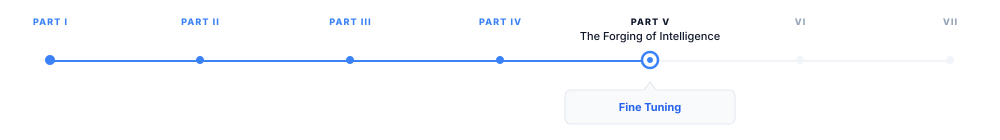
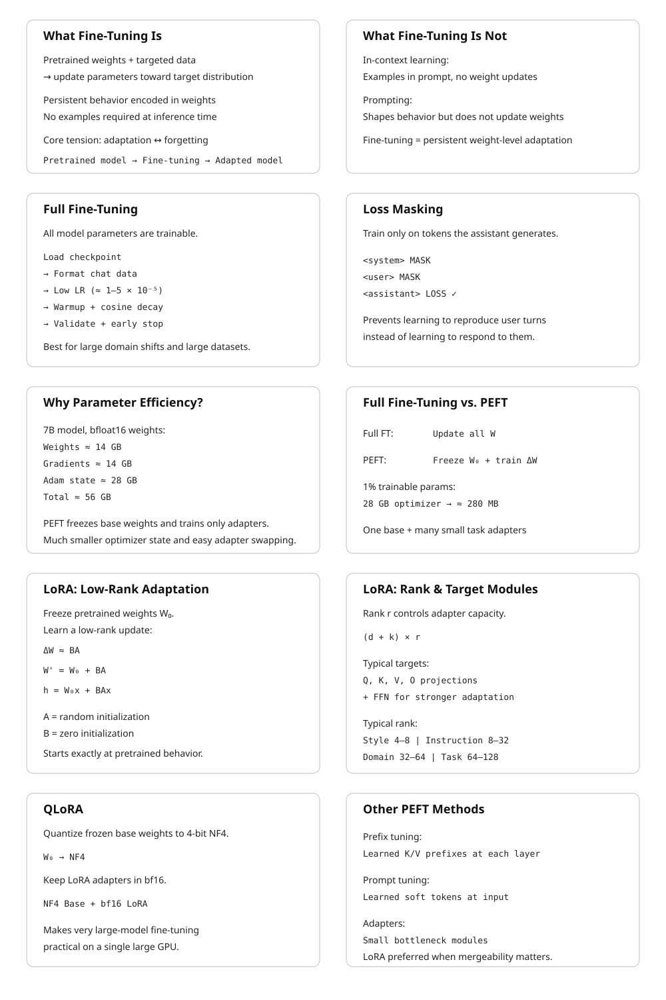

# Fine-Tuning and Parameter-Efficient Adaptation {#sec-fine-tuning}

> **The canonical question for this chapter:**
> *How do you take a pretrained model and make it reliably good at a
> specific task or domain and when is it better to update all the weights,
> a small adapter, or none of them?*

---

::: {.callout-note appearance="minimal"}
**Where are we?**

{#fig-progress width="80%"}

This chapter addresses a common problem: you already have the right-sized model, 
but it does the wrong things. Fine-tuning adjusts a pretrained model's behavior 
toward a target distribution. Parameter-efficient methods do this while touching 
only a small fraction of the model's weights.
:::

---

## What Fine-Tuning Is and What It Is Not

A pretrained language model is a general-purpose next-token predictor. It has
learned, from a large and diverse corpus, a compressed representation of
language, factual knowledge, and reasoning patterns. What it has not learned
is how to behave usefully in response to a specific type of input, a medical
question, a customer support query, a legal document, a Python function stub.

Fine-tuning adjusts the model's parameters using a smaller, targeted dataset
that represents the behavior you want. The optimizer runs the same forward-
backward-update loop as pretraining, but on a different data
distribution, typically for far fewer steps, and usually with a much lower
learning rate. The pretrained weights are the starting point; fine-tuning
moves them in the direction that reduces loss on the target distribution.

This is not the same as in-context learning, where the model's behavior is
shaped by examples in the prompt without any weight updates. In-context
learning is fast and requires no training, but it is limited by context length
and is not persistent: the model reverts to its base behavior as soon as the
examples leave the context window. Fine-tuning is persistent: the adjusted
behavior is encoded in the weights and requires no prompt-time examples to
activate.

It is also not the same as prompting or system prompt engineering. A well-crafted
system prompt can substantially shape model behavior, but it cannot install
new knowledge or reliably suppress deeply ingrained behaviors. Fine-tuning
can do both, within limits set by the pretrained model's capacity.

The central tension in fine-tuning is between adaptation and forgetting.
Every gradient step that reduces loss on the target distribution risks
increasing loss on the original distribution. A model fine-tuned aggressively
on medical text may forget how to write Python. A model fine-tuned on customer
support transcripts may lose nuance in open-ended generation. Managing this
tension (adapting without catastrophically forgetting) is the core engineering
challenge that parameter-efficient methods address.

---

## Full Fine-Tuning

### The Basic Procedure

Full fine-tuning updates all model parameters. The procedure:

1. Load the pretrained checkpoint.
2. Format the fine-tuning dataset in the model's chat template,
   marking which tokens should contribute to the loss (typically the assistant
   turns only, not the system prompt or user inputs, which the model cannot
   control).
3. Run the training loop with a low learning rate, typically 1–5 × 10⁻⁵,
   substantially below the peak learning rate used during pretraining.
4. Apply a short warmup (100–500 steps) and cosine decay to near zero.
5. Evaluate on a held-out validation split at regular intervals; stop when
   validation loss plateaus or begins increasing.

### Loss Masking

One critical implementation detail: loss masking. In instruction fine-tuning,
the model is trained to produce assistant responses to user queries. The model
should not receive loss signal for predicting the user's question, it has no
control over what the user asks. Standard practice masks the loss on all
non-assistant tokens, computing the cross-entropy only over tokens the model
is being trained to generate.

Without loss masking, the model receives gradient signal from predicting the
user's tokens, which teaches it to complete user-turn patterns rather than
respond to them. The resulting model generates text that looks like a
conversation rather than one side of a conversation, a subtle but consequential
difference that is easy to miss and consistently degrades instruction following
quality.

Concretely, for a sequence formatted as:

```
<|system|>You are a helpful assistant.<|end|>
<|user|>What is the capital of France?<|end|>
<|assistant|>The capital of France is Paris.<|end|>
```

The loss is computed only over the tokens in the `<|assistant|>` turn:
"The capital of France is Paris." The system prompt and user turn are in the
input but not in the loss.

### Learning Rate Selection

Full fine-tuning is sensitive to learning rate. Too high: the pretrained
representations are overwritten before the optimizer can find a stable solution,
producing incoherent outputs or loss spikes. Too low: the model does not
adapt meaningfully within a reasonable number of steps.

The standard heuristic: use 10–100× lower learning rate than the peak learning
rate used during pretraining. For a model pretrained at peak LR = 3 × 10⁻⁴,
fine-tuning typically uses 1–3 × 10⁻⁵. Layerwise learning rate decay
(applying a lower learning rate to earlier layers and a higher rate to later
layers) can preserve general representations in early layers while allowing
task-specific adaptation in later layers. Typical decay factor: 0.8–0.9 per
layer from the top.

### When Full Fine-Tuning Is Appropriate

Full fine-tuning is appropriate when:

- The target distribution is substantially different from the pretraining
  distribution (medical text, legal text, a specialized programming language).
- The fine-tuning dataset is large enough to justify the parameter count being
  updated (roughly 100K–1M examples for a 7B model; fewer for smaller models).
- Serving infrastructure allows storing multiple fine-tuned model copies,
  since each full fine-tune produces a separate set of weights.
- The compute budget permits full fine-tuning: for a 70B model, full fine-tuning
  requires the same distributed infrastructure as pretraining, since all
  parameters, gradients, and optimizer state must be held in memory.

For most practitioners working with models above 7B parameters, full fine-tuning
is impractical without significant GPU resources. Parameter-efficient methods
exist precisely to make adaptation tractable on smaller hardware.

---

## The Case for Parameter Efficiency

A 7B-parameter model in float16 requires 14 GB for weights alone. Full fine-
tuning additionally requires gradients (14 GB) and Adam optimizer state (28 GB):
56 GB total before activations. An H100 has 80 GB; full fine-tuning of a 7B
model fits on a single H100, but barely. A 13B model requires 104 GB which
exceedes a single GPU's capacity. A 70B model requires 560 GB for full
fine-tuning, seven H100s at minimum, just for optimizer state.

Parameter-efficient fine-tuning (PEFT) methods reduce this cost by updating
only a small subset of parameters while holding the pretrained weights frozen.
The optimizer state is computed only for the trainable parameters. For a method
that trains 1% of parameters, the optimizer state shrinks to 1% of its full
fine-tuning size: from 28 GB to 280 MB for a 7B model. The fine-tuned adapter
weights are similarly small (a 1% adapter for a 7B model occupies roughly
140 MB) making it practical to maintain many task-specific adapters
simultaneously and swap them at inference time.

---

## LoRA: Low-Rank Adaptation

LoRA (Low-Rank Adaptation, Hu et al., 2021) is the dominant parameter-efficient
fine-tuning method in current practice. It is conceptually simple, works across
model families without architectural changes, and consistently delivers
performance competitive with full fine-tuning at a fraction of the trainable
parameter count.

### The Core Idea

The hypothesis underlying LoRA: the update to a weight matrix during fine-tuning
has low intrinsic rank. That is, the change $\Delta W$ that fine-tuning would
apply to a weight matrix $W_0 \in \mathbb{R}^{d \times k}$ can be approximated
by a low-rank decomposition:

$$
\Delta W \approx BA
$$

where $B \in \mathbb{R}^{d \times r}$ and $A \in \mathbb{R}^{r \times k}$,
with rank $r \ll \min(d, k)$.

During training, $W_0$ is frozen and only $A$ and $B$ are updated. The forward
pass computes:

$$
h = W_0 x + \Delta W x = W_0 x + BAx
$$

$A$ is initialized from a random Gaussian; $B$ is initialized to zero, so
$\Delta W = BA = 0$ at the start of training and the model begins from exactly
the pretrained behavior. As training proceeds, $A$ and $B$ adjust to represent
the task-specific update.

At inference time, the adapter can be merged: $W' = W_0 + BA$ is a weight
matrix of the same shape as $W_0$ that incorporates the fine-tuning update.
Merging adds zero inference overhead, the merged model runs at identical speed
to the base model with no adapter infrastructure required. Alternatively,
multiple adapters can be kept separate and swapped at serving time, supporting
multi-tenant serving of many fine-tuned models from a single base checkpoint.

### Rank and Parameter Count

The rank $r$ is the primary hyperparameter. For a typical transformer weight
matrix with $d = k = 4096$ (LLaMA 2 7B's hidden dimension), a LoRA adapter
at rank $r = 16$ has:

$$
(d + k) \times r = (4096 + 4096) \times 16 = 131{,}072 \text{ parameters}
$$

The original matrix has $d \times k = 16{,}777{,}216$ parameters. The LoRA
adapter at rank 16 represents 0.78% of the original matrix's parameters.

For a 7B model where LoRA is applied to all attention projection matrices
(Q, K, V, O) and both FFN matrices across 32 layers, at rank $r = 16$:

$$
\text{Adapters} = 32 \text{ layers} \times 6 \text{ matrices} \times 2 \times 4096 \times 16 \approx 25M \text{ parameters}
$$

25 million trainable parameters out of 7 billion total: 0.36%. The optimizer
state for these 25M parameters requires approximately 200 MB in float32 Adam.
Compare to full fine-tuning's 28 GB optimizer state.

### Which Matrices to Apply LoRA To

The original LoRA paper applied adapters only to the Q and V attention
projection matrices, based on the observation that these matrices show the most
task-specific variation during full fine-tuning. Subsequent work found that
applying LoRA to all attention matrices (Q, K, V, O) and optionally the FFN
layers produces better performance at the cost of more trainable parameters.

The current standard for instruction fine-tuning: apply LoRA to Q, K, V, and O
projections at rank 16–64. For domain adaptation requiring more substantial
weight changes, extend to the FFN up and down projection matrices. For
embedding adaptation (useful when the fine-tuning data introduces vocabulary
not well-represented in the base model), apply LoRA to the embedding layer
as well.

### Rank Selection in Practice

The optimal rank depends on the complexity of the adaptation task:

| Task | Typical rank | Trainable params (7B model) |
|------|-------------|----------------------------|
| Style adaptation | 4–8 | 6M–12M |
| Instruction following | 8–32 | 12M–50M |
| Domain adaptation | 32–64 | 50M–100M |
| Task-specific fine-tuning | 64–128 | 100M–200M |

Higher rank captures more of the full fine-tuning update but requires more
memory and compute. Ranks above 128 rarely improve over full fine-tuning and
sometimes perform worse, suggesting that the low-rank hypothesis breaks down
at high ranks: the adapter can represent arbitrary updates, losing the
regularization benefit of the low-rank constraint.

---

## QLoRA: Quantized LoRA

QLoRA (Dettmers et al., 2023) extends LoRA to make fine-tuning of very large
models practical on consumer hardware by quantizing the frozen base model
weights while keeping the LoRA adapters in full precision.

### The Method

The base model weights $W_0$ are quantized to 4-bit NormalFloat (NF4), a
quantization format optimized for normally distributed weights (which transformer
weights approximately are). NF4 quantization reduces the base model's memory
footprint by roughly 8× relative to float32, or 4× relative to bfloat16.

The LoRA adapters $A$ and $B$ are kept in bfloat16. During the forward pass,
$W_0$ is dequantized from NF4 to bfloat16 for the computation $W_0 x$, then
requantized for storage. The adapter computation $BAx$ runs in bfloat16
throughout.

Memory for fine-tuning a 65B model with QLoRA on a single A100 80GB:
- Base weights in NF4: approximately 33 GB
- LoRA adapters in bfloat16: approximately 600 MB
- Optimizer state for adapters: approximately 1.2 GB
- Activations: approximately 6 GB
- **Total: approximately 41 GB** which fits on a single A100 80GB

Without QLoRA, fine-tuning a 65B model requires a minimum of eight A100s
for model weights alone, plus distributed optimizer state across additional
GPUs. QLoRA makes this a single-GPU task, with performance within 1–2
percentage points of full fine-tuning on most benchmarks.

---

## Prefix Tuning and Prompt Tuning

Before LoRA, the dominant parameter-efficient approach was prefix tuning
(Li and Liang, 2021) and its simpler variant, prompt tuning (Lester et al.,
2021).

### Prefix Tuning

Prefix tuning prepends a sequence of learned continuous vectors (the prefix)
to the key and value matrices at every attention layer. The prefix vectors are
not token embeddings; they are free parameters optimized directly by gradient
descent to minimize loss on the fine-tuning task.

Formally, for attention layer $l$, the prefix tuning method augments the
key and value matrices:

$$
K_l' = [P_K^l \| K_l], \quad V_l' = [P_V^l \| V_l]
$$

where $P_K^l$ and $P_V^l$ are learned prefix matrices of shape
$[\text{prefix\_length} \times d_{\text{head}}]$, and $[\cdot \| \cdot]$
denotes concatenation. The model's attention at each layer can attend to
both the prefix vectors and the original sequence.

With a prefix length of 10 tokens and a 12-layer, 768-dimensional BERT-base
model, prefix tuning requires:
$$
2 \times 10 \times 768 \times 12 = 184{,}320 \text{ parameters}
$$

approximately 0.1% of BERT-base's 110M parameters. Li and Liang showed that
prefix tuning at this parameter count reaches within 0.1–2% of full fine-tuning
performance on table-to-text generation and summarization tasks.

### Prompt Tuning

Prompt tuning is a simplified version of prefix tuning that prepends learned
vectors only to the input embedding layer rather than to every attention layer.
The prefix is a sequence of "soft tokens" (continuous vectors that occupy
positions before the actual input in the embedding space) that are optimized
to steer the model toward the target task.

Lester et al. demonstrated that at model scale (11B parameters), prompt tuning
matches full fine-tuning performance with only a few hundred tunable parameters.
At smaller scales (below roughly 1B parameters), there is a significant
performance gap. This scale-dependence limits prompt tuning's applicability:
it works well for very large models but poorly for the 7B–13B models that
practitioners most commonly fine-tune.

LoRA has largely supplanted prefix and prompt tuning in practice because LoRA
works well across the full range of model sizes without the scale-dependence
limitation and is easier to implement and tune.

---

## Adapter Layers

Adapter tuning (Houlsby et al., 2019) inserts small bottleneck modules between
existing transformer layers. Each adapter consists of a down-projection from
the model dimension $d$ to a bottleneck dimension $r$, a nonlinearity, and
an up-projection back to $d$:

$$
\text{Adapter}(h) = h + W_{\text{up}} \cdot \text{ReLU}(W_{\text{down}} \cdot h)
$$

where $W_{\text{down}} \in \mathbb{R}^{r \times d}$ and
$W_{\text{up}} \in \mathbb{R}^{d \times r}$. The residual connection ensures
that the adapter begins as an identity function when $W_{\text{up}}$ is
initialized to zero.

With $r = 64$ and $d = 768$ (BERT-base), each adapter adds
$2 \times 64 \times 768 = 98{,}304$ parameters. With two adapters per
layer (after self-attention and after FFN) across 12 layers: approximately
2.4M parameters, or 2.2% of BERT-base.

Adapter layers add inference latency because they introduce extra matrix
multiplications in the forward pass. Unlike LoRA, adapter layers cannot be
merged into the base weights, the bottleneck structure prevents the algebraic
simplification that makes LoRA merging possible. For latency-sensitive
applications, this is a meaningful disadvantage. LoRA has largely replaced
adapter layers as the preferred PEFT method, precisely because LoRA can be
merged at inference time while adapters cannot.

---

## LoRA Variants and Extensions

### DoRA: Weight-Decomposed Low-Rank Adaptation

DoRA (Liu et al., 2024) decomposes the weight matrix into magnitude and
direction components and applies LoRA to the direction component only:

$$
W' = \frac{m}{\|W_0 + BA\|_c} (W_0 + BA)
$$

where $m$ is a learned magnitude vector and $\|\cdot\|_c$ is the column-wise
norm. By separating magnitude adaptation (a scalar per column) from directional
adaptation (the LoRA component), DoRA improves performance on tasks requiring
both fine-grained feature adjustment and large-scale representation changes.
DoRA consistently outperforms LoRA at the same rank, with minimal additional
parameter overhead from the magnitude vectors.

### LoRA+

LoRA+ (Hayou et al., 2024) observes that the optimal learning rates for the
$A$ and $B$ matrices in LoRA are not equal. The $B$ matrix, initialized to
zero, starts with zero gradient and requires a higher learning rate to adapt
quickly. The $A$ matrix, initialized randomly, starts with larger gradients
and benefits from a lower learning rate. LoRA+ sets a fixed ratio between the
$A$ and $B$ learning rates (typically 16×), improving convergence speed
with no additional parameters or architectural changes.

### VeRA: Vector-based Random Matrix Adaptation

VeRA (Kopiczko et al., 2024) takes the low-rank hypothesis further. Rather
than training full $A$ and $B$ matrices, VeRA uses fixed random matrices $A$
and $B$ (not trained) and trains only scalar vectors $d$ and $b$ that scale
the columns of $B$ and $A$ respectively:

$$
\Delta W = \Lambda_b B \Lambda_d A
$$

where $\Lambda_b$ and $\Lambda_d$ are diagonal scaling matrices. VeRA reduces
the trainable parameter count to roughly 1.6M for a 7B model — an order of
magnitude below LoRA at rank 16 — while achieving 90–95% of LoRA's performance
on most tasks. For extremely memory-constrained settings, VeRA extends the PEFT
frontier further toward the "train almost nothing" extreme.

---

## Instruction Fine-Tuning

Instruction fine-tuning which is training a base model to follow natural language
instructions, deserves its own treatment because it is the most consequential
application of fine-tuning in practice. It is what transforms a base model
(a powerful but unruly next-token predictor) into an assistant (a model that
reliably responds to requests).

### The Data Format

Instruction fine-tuning data consists of (instruction, response) pairs, often
with an optional context or system prompt. These are formatted using the model's
chat template and trained with loss masking on the response tokens:

```
<|system|>
You are a helpful, harmless, and honest assistant.
<|end|>
<|user|>
Explain the difference between supervised and unsupervised learning.
<|end|>
<|assistant|>
Supervised learning trains a model on labeled examples — pairs of input
and desired output — while unsupervised learning finds structure in
unlabeled data without explicit targets. In supervised learning, the
training signal is the error between predictions and labels...
<|end|>
```

### Data Volume and Quality

The surprising finding from early instruction tuning research (Wei et al., 2022;
Sanh et al., 2022) was that a small number of high-quality instruction-response
pairs (on the order of 1,000 to 50,000 examples) can substantially improve
instruction following, even for models with billions of parameters. FLAN (Wei
et al., 2022) showed improvements from fine-tuning on 60 tasks; Alpaca (Taori
et al., 2023) used 52,000 GPT-3.5-generated examples to produce a competitive
instruction follower from LLaMA.

More recent work has established that quality matters more than quantity. The
LIMA paper (Zhou et al., 2023) trained on only 1,000 carefully curated examples
and produced a model competitive with those trained on orders of magnitude more
data. The implication: instruction tuning teaches the model a format and response
style, not new knowledge. The knowledge is already in the pretrained weights;
fine-tuning activates it in the right pattern. Given this, a small number of
high-quality demonstrations suffices to establish the pattern; low-quality
examples dilute the signal without contributing knowledge.

### Multi-Task Instruction Tuning

Training on diverse instruction types improves generalization beyond any single
task. FLAN-T5 (Chung et al., 2022) fine-tuned on 1,836 tasks from 473 datasets,
covering classification, generation, reasoning, translation, and summarization.
The diversity prevents the model from overfitting to the instruction format
of any single task family and produces a model that generalizes to instruction
formats not seen during fine-tuning.

The practical lesson: instruction fine-tuning datasets should sample broadly
across task types, domain contexts, response lengths, and instruction phrasings.
A dataset that is narrow in any of these dimensions will produce a model that
responds well to instructions resembling those in the training set and poorly
to others.

---

## Catastrophic Forgetting and How to Manage It

Fine-tuning on a narrow distribution degrades performance on the original
distribution. This is catastrophic forgetting: the gradient updates that improve
performance on the target task also move weight values away from configurations
that support the base model's broader capabilities.

The empirical pattern: catastrophic forgetting is most severe when the
fine-tuning distribution is very different from the pretraining distribution,
when the learning rate is high, when training runs for many epochs, and when
the fine-tuning dataset is small. Any of these conditions allows the optimizer
to move weights far from the pretrained values.

### Mitigation Strategies

**Data mixing.** Include a fraction of general-purpose data (from the original
pretraining distribution or a proxy for it) alongside the fine-tuning data.
A mixing ratio of 5–20% general data is typically sufficient to substantially
reduce forgetting while minimally degrading task-specific performance. The cost
is a slight reduction in task performance, since some gradient steps go toward
maintaining general capability rather than improving task performance.

**Lower learning rates and fewer epochs.** The most direct lever. Running for
1–3 epochs at 1 × 10⁻⁵ learning rate causes less forgetting than running for
10 epochs at 5 × 10⁻⁵. Early stopping on validation loss prevents
overadaptation.

**LoRA as implicit regularization.** Because LoRA constrains weight updates
to a low-rank subspace, it intrinsically limits how far the adapted weights
can deviate from the pretrained values. Full fine-tuning allows arbitrary
weight changes; LoRA allows only rank-$r$ changes. This acts as a regularizer
that reduces catastrophic forgetting, which is one reason LoRA often matches
full fine-tuning quality while using far fewer resources.

---

## Serving Multiple Fine-Tuned Models

A significant operational advantage of LoRA over full fine-tuning is the
ability to serve multiple fine-tuned models from a single base checkpoint.

With full fine-tuning, each fine-tuned model is a separate set of 7B (or 13B,
or 70B) weights. Serving $N$ fine-tuned models requires $N$ full model copies
in memory, or dynamically loading models from storage at request time, which
introduces unacceptable latency.

With LoRA, the base model weights are shared across all adapters. Serving $N$
LoRA-fine-tuned models requires one copy of the base weights (14 GB for 7B
bfloat16) plus $N$ small adapters (roughly 150 MB each at rank 16 for a 7B
model). For $N = 100$ adapters, the memory footprint is approximately 29 GB
versus 1,400 GB for full fine-tuning.


---

## Choosing Between Fine-Tuning Approaches

The decision between full fine-tuning, LoRA, QLoRA, and other PEFT methods
depends on available hardware, dataset size, performance requirements, and
operational constraints.

| Scenario | Recommended approach |
|----------|---------------------|
| 7B model, 1× A100 80GB, large dataset | Full fine-tuning or LoRA rank 64 |
| 7B model, 1× consumer GPU (24 GB), any dataset | QLoRA rank 16–32 |
| 13B–70B model, limited GPUs | QLoRA rank 16–64 |
| 70B+ model, large GPU cluster | Full fine-tuning with FSDP |
| Many tasks from one base model | LoRA rank 16, separate adapters per task |
| Very small dataset (<1K examples) | LoRA rank 4–8, with data mixing |
| Minimal memory, acceptable quality drop | VeRA |

A practical benchmark for 7B models: LoRA rank 16 trained for 3 epochs on
50,000 instruction pairs runs in approximately 4–6 hours on a single A100 80GB
and consistently achieves 95–98% of full fine-tuning quality on instruction-
following benchmarks. This is the most common fine-tuning workload in practice
and the appropriate baseline for evaluating whether a more expensive approach
is warranted.

---

## Key Takeaways

- Fine-tuning adjusts a pretrained model's behavior using a targeted dataset;
  it is persistent (encoded in weights), unlike in-context learning, and
  installs behavioral patterns rather than new knowledge.
- Loss masking on non-assistant tokens is essential for instruction fine-tuning:
  computing loss over user turns teaches the model to complete conversations
  rather than respond to them.
- Full fine-tuning requires optimizer state equal to roughly 4× the weight
  memory in float32 Adam; a 7B model needs approximately 56 GB for weights,
  gradients, and optimizer state combined.
- LoRA freezes base weights and trains low-rank updates $\Delta W = BA$ with
  $r \ll d$; at rank 16 on a 7B model, this trains approximately 25M parameters
  (0.36% of total) while achieving 95–98% of full fine-tuning quality.
- LoRA adapters can be merged into base weights at inference time
  ($W' = W_0 + BA$), adding zero latency overhead compared to the unmodified
  base model.
- QLoRA quantizes base weights to 4-bit NF4 and trains LoRA adapters in
  bfloat16, reducing fine-tuning memory for a 65B model from 500+ GB to
  approximately 41 GB — fitting on a single A100 80GB.
- Instruction fine-tuning data quality dominates quantity: LIMA demonstrated
  that 1,000 carefully curated examples produce competitive instruction
  following, because fine-tuning teaches response format rather than knowledge.
- Catastrophic forgetting is mitigated by data mixing (5–20% general data),
  low learning rates (1–5 × 10⁻⁵), short training runs (1–3 epochs), and
  LoRA's intrinsic low-rank regularization.
- Multi-adapter serving from a shared base model requires one base checkpoint
  plus small adapter files (~150 MB each); 100 LoRA adapters for a 7B model
  occupy ~29 GB versus ~1,400 GB for 100 full fine-tuned copies.
- DoRA improves over LoRA by decomposing weight updates into magnitude and
  direction; LoRA+ improves convergence by using a 16× higher learning rate
  for $B$ than $A$; VeRA reduces trainable parameters to ~1.6M for a 7B model
  using fixed random matrices with learned scalars.

{#fig-progress width="90%"}

---

## Further Reading

- Hu, E. J., Shen, Y., Wallis, P., Allen-Zhu, Z., Li, Y., Wang, S., Wang, L.,
  & Chen, W. (2021). *LoRA: Low-Rank Adaptation of Large Language Models.*
  ICLR. — The founding paper; the low-rank weight update hypothesis and the
  merge-at-inference property are introduced here; the GPT-3 fine-tuning
  experiments establish the quality-efficiency tradeoff clearly.

- Dettmers, T., Pagnoni, A., Holtzman, A., & Zettlemoyer, L. (2023).
  *QLoRA: Efficient Finetuning of Quantized LLMs.* NeurIPS. — Introduces
  NF4 quantization, double quantization, and paged optimizers; the 65B
  fine-tuning on a single GPU result is the key empirical contribution.

- Li, X. L., & Liang, P. (2021). *Prefix-Tuning: Optimizing Continuous Prompts
  for Generation.* ACL. — Introduces prefix tuning; the comparison to full
  fine-tuning on table-to-text and summarization tasks is the key evaluation;
  the soft prompt interpretation motivates the design.

- Houlsby, N., et al. (2019). *Parameter-Efficient Transfer Learning for NLP.*
  ICML. — Introduces adapter layers; the bottleneck architecture and the
  near-full-fine-tuning performance at 3% parameter overhead established
  parameter-efficient fine-tuning as a serious alternative to full fine-tuning.

- Zhou, C., Liu, P., Xu, P., Iyer, S., Sun, J., Mao, Y., Ma, X., Efrat, A.,
  Yu, P., Yu, L., Zhang, S., Ghosh, G., Lewis, M., Zettlemoyer, L., &
  Levy, O. (2023). *LIMA: Less Is More for Alignment.* NeurIPS. — Demonstrates
  that 1,000 high-quality instruction examples suffice for competitive alignment;
  the central argument that fine-tuning teaches format rather than knowledge is
  stated and supported clearly.

- Chung, H. W., et al. (2022). *Scaling Instruction-Finetuned Language Models.*
  JMLR. — The FLAN-T5 paper; systematic evaluation of instruction tuning across
  1,836 tasks demonstrates that task diversity is the primary driver of
  generalization beyond the fine-tuning distribution.

- Liu, S.-Y., et al. (2024). *DoRA: Weight-Decomposed Low-Rank Adaptation.*
  ICML. — Introduces magnitude-direction decomposition; the consistent
  improvements over LoRA across NLP and vision tasks make it the strongest
  current alternative to base LoRA.

- Kirkpatrick, J., et al. (2017). *Overcoming catastrophic forgetting in neural
  networks.* PNAS. — Introduces Elastic Weight Consolidation; the Fisher
  information regularization framing is the key theoretical contribution;
  the sequential task learning experiments establish the catastrophic forgetting
  problem quantitatively.

---
