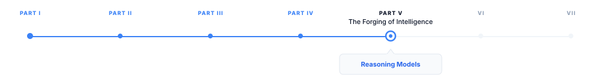

# Reasoning Models and Test-Time Compute

> **The canonical question for this chapter:**
> *What changes when a model is trained to think before it answers and
> how does spending more computation at inference time trade off against
> spending more computation at training time?*

---

::: {.callout-note appearance="minimal"}
**Where are we?**

{#fig-progress width="80%"}

The previous chapters explained how language models are trained and aligned. 
This chapter examines a broader shift in the field's understanding of intelligence: 
rather than relying solely on larger models and more training data, modern systems 
increasingly achieve stronger performance by allocating more computation to inference-time 
reasoning. Reasoning models embody this paradigm, representing a qualitatively different 
approach from the generation models discussed throughout the rest of this book.

:::

---

## The Core Idea: Thinking as Computation

Every model described in this book so far generates a response in a single
left-to-right pass through the sequence. The model receives a prompt, produces
tokens one at a time, and stops. The amount of computation devoted to producing
the response is approximately fixed: it scales with the length of the output
but not with the difficulty of the problem. A model answering "What is 2 + 2?"
and a model solving a competition mathematics problem spend roughly the same
compute per output token.

This is a strange property when you consider how humans approach difficult
problems. A human expert solving a hard problem does not simply produce the
answer at a rate proportional to how many words the answer takes. They pause,
consider multiple approaches, check intermediate results, backtrack when
something goes wrong, and arrive at the answer only after a process that
takes substantially more time than reading the answer would take. The output
is short; the process that produces it is long.

Reasoning models are language models trained to externalize this process,
to produce a chain of intermediate computations before the final answer. The
computation is not hidden inside a forward pass; it is written out as tokens.
More thinking means more tokens, and more tokens means more compute. The model
can thus spend variable amounts of inference compute depending on problem
difficulty, in the same way that a human expert spends more mental effort on
harder problems.


---

## Chain-of-Thought Prompting: The Precursor

The empirical foundation for reasoning models is chain-of-thought (CoT)
prompting [@wei2022chain]. The finding: large language models
prompted to produce step-by-step reasoning before the final answer substantially
outperform the same models prompted to produce only the final answer, on
mathematical, logical, and multi-step reasoning tasks.

The original demonstration used few-shot examples that showed the reasoning
process:

```
Q: Roger has 5 tennis balls. He buys 2 more cans of tennis balls.
Each can has 3 tennis balls. How many tennis balls does he have now?

A: Roger started with 5 balls. 2 cans × 3 balls per can = 6 balls.
5 + 6 = 11. The answer is 11.
```

By showing the model this format, subsequent questions elicit similar step-by-step
reasoning. The improvement over direct answering is large: Wei et al. reported
gains of 10–40 percentage points on grade-school math and logical reasoning
benchmarks for models above approximately 100B parameters.

The mechanism appears to be that intermediate tokens serve as working memory.
A transformer's residual stream (the hidden state that accumulates information
as tokens are processed) has finite capacity. Complex multi-step reasoning
exceeds what can be held in a single forward pass. By writing intermediate
results as tokens, the model offloads working memory to the context window,
which has essentially unlimited capacity compared to the residual stream.
Each reasoning step becomes part of the context that conditions subsequent
steps, allowing chains of reasoning that extend far beyond what the model's
architecture could represent in a single forward pass.

Zero-shot CoT (simply appending "Let's think step by step" to the prompt
without few-shot examples) also improves performance substantially,
suggesting that the reasoning format is broadly learned during
pretraining rather than requiring explicit demonstration.

---

## From Prompting to Training: Teaching Models to Reason

CoT prompting improves reasoning for large models but is unreliable for smaller
ones. The natural next step: train models to produce reasoning chains rather than 
relying on prompting to elicit them.

### Supervised Reasoning Fine-Tuning

The straightforward approach: collect examples of (problem, reasoning chain,
answer) triples and fine-tune on them with standard next-token prediction loss.
This is reasoning distillation (@sec-Reasoning-Distillation) when the reasoning chains are
generated by a larger teacher model, and it works: models fine-tuned on
teacher-generated reasoning chains substantially outperform base models at
the same parameter count on reasoning benchmarks.

The limitation of supervised reasoning fine-tuning is the quality ceiling
imposed by the teacher. The student can learn to imitate the teacher's reasoning
style but cannot discover reasoning strategies the teacher never demonstrated.
If the teacher makes systematic errors in a domain the student inherits those errors.

### Outcome-Supervised Reward Models

A more powerful approach uses verifiable correctness rather than teacher
imitation as the training signal. For tasks with objectively correct answers
(mathematics, code execution, formal logic) the model can be evaluated by
checking its final answer against a ground truth, without reference to whether
its reasoning matches any particular teacher's style.

An outcome-supervised reward model (ORM) assigns reward 1 to a completion
that produces the correct final answer and reward 0 to one that does not.
Training with RL against this binary reward (using PPO or GRPO)
allows the model to discover reasoning strategies that work, not just strategies
that match a teacher's demonstrations. The model can find shortcuts, novel
decompositions, or verification strategies that no human teacher demonstrated,
as long as they lead to correct answers.

The cost of ORM training: it requires tasks with verifiable answers. Open-ended
generation, summarization, and most real-world tasks do not have objectively
correct answers, so ORM cannot be applied directly. This limitation confines
reasoning model training primarily to mathematics, code, and formal domains
which happen to be exactly the domains where the most dramatic capability
improvements have been observed.

### Process Reward Models

Process reward models (PRMs) extend ORM by providing reward at individual
reasoning steps rather than only at the final answer. A PRM scores each step
of a reasoning chain as correct, incorrect, or neutral, providing dense
training signal rather than a single terminal reward.

Lightman et al. [@lightman2024let] showed that PRMs substantially outperform ORMs on
competition mathematics: a model trained with process supervision reaches
higher accuracy than a model trained with outcome supervision at the same
compute budget, because the dense step-level signal reduces the credit
assignment problem. The model receives feedback at each reasoning step rather
than waiting until the end of a potentially long chain to discover that
something went wrong.

Training a PRM requires human annotation of intermediate reasoning steps —
expensive and time-consuming. The current approach to scaling PRM annotation
uses a combination of:

1. **Monte Carlo estimation**: generate many continuations from each intermediate
   state; the probability that a correct final answer is reached estimates the
   quality of that state without explicit annotation.
2. **Model-assisted annotation**: use a stronger model to judge each step's
   correctness, following the RLAIF approach.
3. **Formal verification**: for mathematical reasoning, use a formal proof
   checker (Lean, Isabelle) to verify each step automatically.

---

## OpenAI o1 and the Deliberate Reasoning Paradigm

OpenAI's o1 model (2024) marked the public introduction of reasoning models
as a distinct product category. o1 produces a hidden chain of thought,
a reasoning trace that is not shown to users but consumes tokens and compute
before the visible response is generated. The reasoning trace can be thousands
of tokens long for difficult problems; the visible response is then generated
conditioning on this extended reasoning context.

The reported capabilities: o1 scored in the 89th percentile on the 2024
American Mathematics Competition (AMC), compared to GPT-4o's 50th percentile.
On the 2024 USA Mathematical Olympiad qualifying exam, o1 ranked in the top
500 nationally, a benchmark previously requiring human mathematical olympiad
competitors. On competitive programming benchmarks, o1 ranked above the 90th
percentile of Codeforces participants.

These gains come entirely from test-time compute: o1 is not necessarily a
larger model than GPT-4o, but it spends substantially more compute generating
the reasoning trace before the answer. The effective compute per response is
10–100× that of a direct-answer model on difficult problems.

### The Hidden Reasoning Trace

One architectural decision in o1 worth noting: the reasoning trace is hidden
from users. This is not a technical constraint (the trace is generated as
tokens) but a product decision. Exposing the full reasoning trace would
reveal failure modes (the model contradicting itself, pursuing incorrect
approaches before self-correcting, expressing uncertainty it does not show
in the final answer) that might reduce user confidence. It also prevents
users from directly prompting specific reasoning strategies, maintaining
cleaner product behavior.

The trade-off is interpretability: users cannot inspect the reasoning process
and researchers cannot fully audit the chain of thought for the systematic
errors that process reward models attempt to correct. This opacity is a design
choice that different reasoning model implementations have made differently.

---

## DeepSeek-R1: Open Reasoning at Scale

DeepSeek-R1 (DeepSeek-AI, 2025) is the most detailed public account of
reasoning model training at scale. It uses GRPO with verifiable
rewards and demonstrates that capable reasoning can emerge from RL training
on verifiable tasks without requiring supervised reasoning chain examples as
the primary training signal.

### The Training Recipe

DeepSeek-R1's training proceeds in four stages:

**Stage 1: Cold start data.** A small set of high-quality long chain-of-thought
examples (a few thousand) is used to initialize the model in the reasoning
format. Without this cold start, pure RL from a base model produces incoherent
reasoning traces that do not converge to structured reasoning chains within
a reasonable number of RL steps. The cold start acts as a format anchor.

**Stage 2: Reasoning-oriented RL.** GRPO is applied with two reward signals:
accuracy reward (correct final answer for math and code) and format reward
(the model must produce the reasoning trace inside `<think>` tags and the
final answer in a specified format). No step-level reward; only outcome
supervision. The model is allowed to generate reasoning traces of up to 32,768
tokens.

What emerges from Stage 2 is striking: the model spontaneously develops
behaviors that resemble deliberate reasoning strategies, extended exploration
of problem structure, self-verification by checking answers against the original
problem, and explicit backtracking when an approach fails:

```
<think>
Let me try the substitution u = x² + 1. Then du = 2x dx.
Wait, that doesn't help because I have x³ in the numerator.
Let me try a different approach. If I write x³ = x(x²), and
x² = u - 1, then...
</think>
```

These behaviors were not demonstrated in training data, they emerged from
optimization pressure toward correct answers. This is a significant empirical
finding: RL with verifiable rewards on reasoning tasks can produce qualitatively
new reasoning behaviors not present in the training distribution.

**Stage 3: Rejection sampling and supervised fine-tuning.** The Stage 2 model
generates many reasoning traces for a large set of problems; only traces that
lead to correct answers are retained. These correct-trace, correct-answer pairs
are used for a supervised fine-tuning pass. This stage improves reasoning
quality and consistency, filtering out the incorrect reasoning paths that
emerge during RL training.

**Stage 4: Full alignment RL.** A final round of GRPO incorporating both
verifiable rewards and general preference rewards (for helpfulness and safety
on non-reasoning tasks), producing the final aligned model.

### Emergent Reasoning Behaviors

The DeepSeek-R1 technical report documents several behaviors that emerge from
Stage 2 RL training without explicit supervision:

**Aha moments**: the model explicitly recognizing mid-chain that its current
approach is wrong and switching strategies. These appear as "Wait, I made
an error above" or "Actually, let me reconsider" in the reasoning trace,
followed by a course correction.

**Self-verification**: after computing an answer, the model checks it against
the problem conditions, substituting back into equations, checking boundary
cases, verifying code against examples.

**Extended exploration**: for genuinely difficult problems, the model explores
multiple approaches in sequence rather than committing to the first approach,
comparing them and selecting the most promising one.

These behaviors parallel the deliberate reasoning strategies that human experts
employ. Whether they represent genuine reasoning or sophisticated pattern
matching of reasoning-shaped text remains an open research question, but their
emergence from RL training on verifiable tasks (without explicit supervision
on any of these specific behaviors) is a remarkable empirical result.

---

## Test-Time Compute Scaling Strategies

Beyond training models to produce long reasoning chains, test-time compute
can be invested in several additional strategies that improve performance
without changing model weights.

### Best-of-N Sampling

The simplest test-time compute strategy: generate $N$ independent completions
for the same prompt and select the best one. For tasks with verifiable answers,
"best" means "correct." For tasks requiring a reward model, "best" means
"highest reward model score."

The practical constraint: identifying the correct completion requires either
a verifier (which may be wrong) or the ability to check the answer externally
(code execution, formal verification). For open-ended generation, best-of-N
requires a reward model for selection, reintroducing the reward hacking
vulnerability.

### Beam Search Over Reasoning Steps

Rather than sampling complete sequences independently, beam search maintains
multiple partial reasoning chains simultaneously and expands the most promising
ones. At each step, the beam contains $k$ partial chains; for each, multiple
continuations are sampled, scored, and the top $k$ are retained.

Beam search over reasoning steps requires a step-level scorer a PRM or a
model that estimates the probability of reaching a correct answer from a given
partial chain. Without step-level scoring, beam search degenerates to generating
$k$ complete chains and selecting the best one (best-of-$k$).

With a PRM as the step scorer, beam search can prune unpromising reasoning
paths early and concentrate compute on the most promising partial chains.

### Monte Carlo Tree Search

Monte Carlo Tree Search (MCTS) is a more general search strategy that builds
a tree of reasoning steps, using Monte Carlo simulation to estimate the value
of each node (partial reasoning state) and focusing expansion on high-value
nodes.

MCTS was used in AlphaGo and AlphaZero for game tree search. Applied to
language model reasoning, it treats each token or reasoning step as a game
action, the problem as the initial state, and correct answer verification
as the terminal reward. The MCTS loop:

1. **Selection**: traverse the tree from the root using a policy that balances
   exploration and exploitation (UCT: Upper Confidence Bound for Trees).
2. **Expansion**: add a new node by sampling a continuation from the current
   policy.
3. **Simulation**: from the new node, run a rollout to completion and evaluate
   the outcome.
4. **Backpropagation**: update the estimated values of all nodes on the path
   from root to the new node.

MCTS requires many rollouts per decision, making it significantly more
compute-intensive than beam search. For competition-level mathematics, MCTS
with a learned value function outperforms best-of-N and beam search at high
inference compute budgets, but the advantage is modest relative to the compute
cost increase. Current reasoning models appear to internalize some MCTS-like
search through RL training rather than running explicit MCTS at inference time.

---

## Limitations and Failure Modes

Reasoning models are powerful for specific task types and fragile in specific
ways. Understanding the limitations is as important as understanding the
capabilities.

### Task-Type Dependence

Test-time compute scaling works well for tasks with:
- Objectively verifiable answers (mathematics, code)
- Discrete answer spaces amenable to majority vote (multiple choice)
- Long chains of individually checkable steps (formal proofs)

It works poorly for tasks with:
- Subjective evaluation criteria (creative writing, style preferences)
- Open-ended generation with no clear stopping condition
- Tasks where the model's systematic errors are correlated across samples

The reasoning model paradigm is a powerful tool for a specific subset of AI
tasks. Applying it indiscriminately (generating long reasoning traces for
simple factual queries or conversational responses) wastes inference compute
without improving quality.

### Overthinking and Underthinking

Reasoning models can fail in both directions. Overthinking: the model generates
an unnecessarily long reasoning chain for a simple problem, wasting compute and
sometimes talking itself out of a correct answer by reconsidering it. The model
may produce correct intermediate results, then continue reasoning and introduce
an error before the final answer.

Underthinking: on very difficult problems, the model may switch approaches too
quickly, not exploring any single approach deeply enough to reach a correct
answer. This is the reasoning analog of the exploration-exploitation tradeoff.

Budget forcing (instructing the model to produce a reasoning trace of
approximately a given length) partially addresses both failure modes. The
model can be told "think briefly" for easy problems and "think carefully and
at length" for hard ones. Some implementations automatically detect problem
difficulty and adjust the reasoning budget accordingly.

### Reward Hacking in Reasoning

Reasoning models trained with outcome supervision can learn to produce
plausible-looking reasoning that does not actually support the final answer,
reasoning that is post-hoc rationalization rather than the actual computation
that produced the answer. This is particularly concerning for PRMs: a model
optimized to receive high PRM scores may learn to produce reasoning steps that
look correct to the PRM without actually being logically sound.


---

## Key Takeaways

- Reasoning models externalize computation as tokens: more thinking means
  more tokens means more inference compute, allowing variable compute
  investment depending on problem difficulty.
- Chain-of-thought prompting was the empirical precursor: appending reasoning
  steps to outputs improves performance by 10–40 percentage points on reasoning
  tasks for models above ~100B parameters, because intermediate tokens serve
  as working memory that extends beyond the residual stream's capacity.
- Outcome-supervised reward models (ORMs) reward correct final answers;
  process reward models (PRMs) reward correct intermediate steps; PRMs
  produce better reasoning models at the same compute budget but require
  expensive step-level annotation.
- DeepSeek-R1 demonstrates that RL with verifiable rewards on reasoning tasks
  produces emergent behaviors — self-verification, backtracking, aha moments —
  not present in the supervised training data.
- DeepSeek-R1's four-stage recipe: cold start with few-shot CoT data, reasoning
  RL with GRPO and verifiable rewards, rejection-sampling SFT on correct traces,
  full alignment RL.
- Best-of-N sampling achieves near-perfect accuracy on problems a model can
  solve at all (given oracle selection); self-consistency replaces oracle
  selection with majority vote, working well when errors are not systematically
  correlated.
- Beam search with PRM scoring outperforms best-of-N at the same inference
  compute by pruning unpromising reasoning paths early; MCTS is more powerful
  but compute-intensive.
- The training-inference compute tradeoff: for competition mathematics, investing
  20–30% of the total compute budget in test-time search outperforms spending
  100% on training, because single-pass performance plateaus before inference-
  time search plateaus.
- Reasoning models are effective for tasks with verifiable answers and discrete
  answer spaces; they provide little benefit for open-ended generation and can
  waste substantial compute if applied indiscriminately.
- Overthinking (correct answer reconsidered into error) and underthinking
  (insufficient exploration per approach) are the two failure modes of reasoning
  model generation; budget forcing partially addresses both.

---

## Further Reading

- Wei, J., Wang, X., Schuurmans, D., Bosma, M., Ichter, B., Xia, F., Chi, E.,
  Le, Q., & Zhou, D. (2022). *Chain-of-Thought Prompting Elicits Reasoning in
  Large Language Models.* NeurIPS. — The founding CoT paper; the few-shot
  examples and the scale-dependence finding (CoT only helps above ~100B
  parameters) are the key contributions.

- Kojima, T., Gu, S. S., Reid, M., Matsuo, Y., & Iwasawa, Y. (2022). *Large
  Language Models are Zero-Shot Reasoners.* NeurIPS. — Demonstrates zero-shot
  CoT with "Let's think step by step"; the simplicity of the result and its
  consistent gains across tasks establish that reasoning format is broadly
  learned during pretraining.

- Lightman, H., Kosaraju, V., Burda, Y., Edwards, H., Baker, B., Lee, T.,
  Leike, J., Schulman, J., Sutskever, I., & Cobbe, K. (2023). *Let's Verify
  Step by Step.* ICLR. — Introduces PRMs and the Monte Carlo step annotation
  method; the comparison between outcome and process supervision on MATH is
  the key empirical contribution.

- Wang, X., Wei, J., Schuurmans, D., Le, Q., Chi, E., Narang, S., Chowdhery,
  A., & Zhou, D. (2023). *Self-Consistency Improves Chain of Thought Reasoning
  in Language Models.* ICLR. — Introduces majority-vote self-consistency;
  the analysis of why independent chains provide correlated-but-not-identical
  errors is the key theoretical contribution.

- Snell, C., Lee, J., Xu, K., & Kumar, A. (2024). *Scaling LLM Test-Time
  Compute Optimally Improves with Reinforcement Learning.* arXiv. — The
  clearest quantitative treatment of the training-inference compute tradeoff;
  the isoFLOP curves comparing training compute and test-time search compute
  on MATH are the key empirical contribution.

- DeepSeek-AI. (2025). *DeepSeek-R1: Incentivizing Reasoning Capability in
  LLMs via Reinforcement Learning.* arXiv. — The most detailed public account
  of reasoning model training; the four-stage pipeline, the emergent reasoning
  behaviors from Stage 2 RL, and the GRPO implementation details are the key
  contributions; Appendix A contains the full GRPO derivation.

- OpenAI. (2024). *Learning to Reason with LLMs.* OpenAI Blog. — The o1
  system card and technical blog post; the AMC and USAMO benchmark results
  are the key capability demonstrations; the discussion of the hidden reasoning
  trace design decision is the key architectural contribution.

- Yao, S., Yu, D., Zhao, J., Shafran, I., Griffiths, T. L., Cao, Y., &
  Narasimhan, K. (2023). *Tree of Thoughts: Deliberate Problem Solving with
  Large Language Models.* NeurIPS. — Introduces tree-structured reasoning with
  explicit branching and evaluation; the comparison to linear CoT on tasks
  requiring backtracking motivates the MCTS-based approaches.

---
