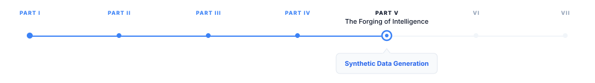

# Synthetic Data Generation

> **The canonical question for this chapter:**
> *Real human-written data is finite, expensive to collect, and increasingly
> subject to legal constraints. How do you use models to generate training data
> for other models and how do you prevent the process from collapsing into
> noise?*

---

::: {.callout-note appearance="minimal"}
**Where are we?**

{#fig-progress width="80%"}

Previous Chapter focused on the collection of real-world data. This chapter in 
the other hand explores a rapidly growing counterpart: data generated by models 
themselves. Synthetic data has become increasingly important for training advanced 
models, fine-tuning specialized systems, and developing instruction-following datasets 
that influence model behavior. Effectively using synthetic data requires understanding 
both its potential benefits and its limitations, including the ways it can introduce 
new challenges and failure modes.

:::

---

## Why synthetic data exists

Training data has always been a bottleneck. Collecting high-quality human-written
text at frontier scale is expensive, slow, and increasingly legally complicated.
For specialized capabilities (complex mathematical reasoning, multi-step code
synthesis, structured output generation) the amount of suitable human-written
data is genuinely small relative to what models need.

Synthetic data offers a way around this: use a capable model to generate
training examples for itself or for a smaller model. The generator model provides
signal that would otherwise require expensive human annotation or simply does not
exist in sufficient volume in human-written text.

Data augmentation has been used in computer vision for decades. What changed with 
large language models is the quality and breadth of the augmentation: a capable LLM 
can generate synthetic examples indistinguishable from human-written text across a 
wide range of domains and tasks.

The result is a significant shift in how instruction-following, reasoning, and
alignment training data is produced. Where pre-2020 fine-tuning datasets were
predominantly human-annotated, many post-2023 datasets are predominantly
synthetic.

---

## Self-Instruct: the foundational approach

Self-Instruct (Wang et al., 2022) established the basic pattern for synthetic
instruction data generation. The insight: a model that can follow instructions
can also generate new instruction-following examples.

### The pipeline

```
1. Seed set: a small hand-written collection of instruction-response pairs
   (175 examples in the original paper)

2. For each generation step:
   a. Sample a few examples from the seed/pool as demonstrations
   b. Prompt the model to generate a new instruction unlike the demonstrated ones
   c. Prompt the model to generate an input if the task requires one
   d. Prompt the model to generate the corresponding output
   e. Apply quality filters
   f. Add passing examples to the pool; repeat

3. Use the accumulated pool as fine-tuning data
```

The key quality filters are similarity filtering (discard if ROUGE-L overlap
with any existing instruction exceeds 0.7), length filtering (discard very short
instructions or responses), and keyword filtering (discard examples where the
model refused or produced degenerate output).

Self-Instruct was used to create the Alpaca dataset (52K examples) that enabled
the first wave of open-source instruction-tuned models. Later work improved
quality primarily by using stronger generator models: GPT-4 instead of GPT-3.

---

## Teacher-student pipelines

A more principled approach: use a large, capable teacher model to generate
training data for a smaller student model. The student learns from the teacher's
outputs rather than from human annotation.

```python
def generate_teacher_student_data(
    teacher_model,
    prompts: list[str],
    system_prompt: str = "You are a helpful assistant.",
    temperature: float = 0.7,
) -> list[dict]:
    training_examples = []
    for prompt in prompts:
        response = teacher_model.complete_chat(
            messages=[
                {"role": "system", "content": system_prompt},
                {"role": "user",   "content": prompt},
            ],
            temperature=temperature,
        )
        training_examples.append({
            "messages": [
                {"role": "system",    "content": system_prompt},
                {"role": "user",      "content": prompt},
                {"role": "assistant", "content": response},
            ]
        })
    return training_examples
```

### The Phi models: synthetic data at scale

Microsoft's Phi model family demonstrated that synthetic data from a strong
teacher can produce remarkably capable small models. Phi-1 (2023) was trained
primarily on GPT-4-generated textbook-quality Python exercises Despite having 
1.3B parameters, it achieved performance comparable to models five times larger 
on coding benchmarks.

The finding: a small model trained on high-quality synthetic data can
substantially outperform the same model trained on a much larger corpus of real
but noisier data. Quality of training signal, controlled through synthetic
generation, can substitute for volume. This challenged the prevailing assumption
that more data is always better.

---

## Rejection sampling for verifiable tasks

For tasks with verifiable answers (mathematics, code, structured output)
rejection sampling is one of the most effective synthetic data techniques.
Generate many candidate responses; keep only those that pass verification.

```python
def rejection_sample(
    problem: str,
    generator_model,
    verifier_fn,        # returns True if the response is correct
    n_candidates: int = 16,
    temperature: float = 0.8,
) -> list[str]:
    accepted = []
    for _ in range(n_candidates):
        response = generator_model.complete(problem, temperature=temperature)
        if verifier_fn(problem, response):
            accepted.append(response)
    return accepted
```

For mathematics, the verifier is an exact answer checker. For code, it is the
test suite. For structured output (JSON, SQL), it is a schema validator. Without
an automatic verifier, rejection sampling reduces to unverified generation with
high compute cost and uncertain quality, the verifier is what makes the technique 
work.

Rejection sampling also produces multiple correct reasoning paths for the same
problem, which is valuable: models trained on diverse correct approaches
generalize better than models trained on a single canonical solution.

---

## Generating reasoning traces

Training reasoning models requires large volumes of step-by-step solutions. Human 
experts cannot produce these at scale. Synthetic generation combined with outcome 
verification is the practical solution.

### Process reward model data

Training process reward models requires step-level correctness annotations.
Generating traces at scale and using outcome correctness as a weak per-trace
label is the standard approach:

```python
def generate_reasoning_traces(
    problems: list[str],
    generator_model,
    n_traces_per_problem: int = 8,
) -> list[dict]:
    dataset = []
    for problem in problems:
        traces = []
        for _ in range(n_traces_per_problem):
            trace = generator_model.complete(
                f"Solve step by step, showing all work:\n{problem}",
                temperature=0.8,
            )
            is_correct = check_answer(
                extract_final_answer(trace),
                get_ground_truth(problem),
            )
            traces.append({"trace": trace, "correct": is_correct})
        dataset.append({"problem": problem, "traces": traces})
    return dataset
```

The per-step supervision signal for PRM training still requires some human
annotation of individual steps  but identifying which complete traces are
correct can be done automatically, reducing annotation cost by orders of
magnitude.

---

## Constitutional AI and RLAIF

Constitutional AI (Bai et al., 2022) uses a model to generate its own
supervision signal for alignment, eliminating the need for human preference
labels in many training steps.

### SL-CAI: supervised learning from AI feedback

Generate potentially problematic responses, then have the model revise them
according to a set of principles (the "constitution"):

```python
CONSTITUTION = [
    "Rewrite to be more helpful while being harmless.",
    "Identify ways the response is harmful or unethical, then rewrite.",
    "Consider whether the response could be misused, and revise accordingly.",
]

def constitutional_revision(prompt: str, model, n_rounds: int = 2) -> str:
    current = model.complete(prompt)
    for _ in range(n_rounds):
        principle = random.choice(CONSTITUTION)
        current = model.complete(
            f"Human: {prompt}\nAssistant: {current}\n\n"
            f"Principle: {principle}\nRevised response:"
        )
    return current
```

### RLAIF: AI preference labels

Use the model to generate preference labels instead of human raters:

```python
def ai_preference_label(
    prompt: str,
    response_a: str,
    response_b: str,
    principle: str,
    judge_model,
) -> str:
    judgment = judge_model.complete(
        f"Principle: {principle}\n\n"
        f"Response A: {response_a}\n\n"
        f"Response B: {response_b}\n\n"
        f"Which response better follows the principle? Answer A or B only:"
    ).strip().upper()
    return "A" if judgment.startswith("A") else "B"
```

RLAIF produces preference datasets at a fraction of the cost of human
annotation. The quality tradeoff: AI judges have their own biases they
tend to prefer longer, more verbose responses and responses that match their
own generation style. Calibration against human judgments is important before
relying on RLAIF at scale.

---

## Synthetic conversation data

Multi-turn conversation data is expensive to collect from humans but important
for deployed conversational assistants. Synthetic generation covers the gap.

### Persona-diverse generation

A single generator model produces conversations in a limited range of styles.
Explicit persona specification diversifies the training distribution:

```python
USER_PERSONAS = [
    "a software engineer debugging production issues",
    "a student learning the topic for the first time",
    "an expert seeking nuanced clarification",
    "a non-native English speaker asking basic questions",
    "a skeptical user who questions the assistant's claims",
    "a user in a hurry who wants concise answers",
]

def generate_diverse_conversations(
    topics: list[str],
    model,
    n_per_topic: int = 6,
) -> list[list[dict]]:
    all_conversations = []
    for topic in topics:
        for persona in random.sample(USER_PERSONAS, n_per_topic):
            conversation = simulate_conversation(topic, persona, model)
            all_conversations.append(conversation)
    return all_conversations
```

Diversity in user persona, question style, and conversation length prevents the
model from learning a narrow conversational pattern and produces better
instruction-following across user types.

---

## Data contamination and quality collapse

Synthetic data introduces failure modes that real data collection does not.

### Model collapse

When synthetic data is used to train a model, and the outputs of that model
are used as training data for the next version, iterative degradation can occur.
Each generation amplifies the biases and errors of the previous one. The
distribution of outputs narrows progressively, the model becomes less diverse
and more prone to producing stereotyped, low-variance responses.

This is called model collapse (Shumailov et al., 2023). It is a genuine risk
for pipelines that rely heavily on self-generated data without injecting fresh
human-written signal.


### Synthetic data contamination

Synthetic data generated from publicly available models may share biases or
specific phrasings with those models' training data. If the teacher model was
trained on evaluation benchmark data, synthetic data generated by that teacher
may leak evaluation signal into the student's training, inflating benchmark
performance without improving real capability.

Contamination detection for synthetic data requires checking not just whether
the synthetic examples match evaluation questions verbatim, but whether the
synthetic examples produce responses that closely match evaluation answers.

### Hallucinated facts in synthetic data

It is a known fact that generator models hallucinate. Synthetic training data 
therefore contains hallucinated facts and training on them teaches the student 
model to reproduce those hallucinations with confidence.

For general instruction-following, this is manageable: the hallucinated facts
are diluted by the volume of correct content. For specialized domain training
(medical, legal, scientific), it is dangerous: the model learns domain-specific
confident errors.

---

## What synthetic data is good at (and what it is not)

### What it does well

**Instruction diversity.** Synthetic generation can produce instruction-following
examples covering a wide range of formats, styles, and task types far more
efficiently than human annotation.

**Scaling reasoning data.** For verifiable tasks, rejection sampling produces
high-quality reasoning traces at scale that human experts could not produce in
comparable volume.

**Domain coverage.** Specialized domains with little existing training data
(low-resource languages, niche technical fields) can be bootstrapped with
targeted synthetic generation.

**Behavior shaping.** Constitutional AI and RLAIF can produce alignment training
data at a fraction of the cost of human preference annotation.

### What it does poorly

**Novel knowledge.** A model cannot generate facts it does not already know.
Synthetic data recombines and reformats existing knowledge; it does not add
new knowledge to the training distribution.

**Detecting its own blind spots.** The model generating synthetic data does not
know what it does not know. It will generate confident synthetic data in the
domain of its blind spots, teaching the student model the same blind spots with
additional confidence.

**Replacing human judgment for nuanced quality.** Human evaluators catch
subtleties in tone, cultural appropriateness, and pragmatic correctness that
AI generators and judges frequently miss. For tasks where these nuances matter,
synthetic data is a complement to human annotation, not a replacement.

---

## Key takeaways

- Synthetic data generation uses capable models to produce training examples
  that would otherwise require expensive human annotation or simply do not
  exist in sufficient volume in human-written text
- Self-Instruct established the basic pattern: seed a small hand-written
  dataset, prompt the model to generate new instruction-response pairs, filter
  for quality and diversity, repeat
- Teacher-student pipelines use a large teacher model to generate training
  data for a smaller student; the Phi models demonstrated that high-quality
  synthetic data can substitute for much larger volumes of noisier real data
- Rejection sampling is the most effective technique for verifiable tasks:
  generate many candidates, keep those that pass an automatic verifier; the
  verifier is what makes it work
- Constitutional AI and RLAIF use the model as its own alignment teacher,
  generating preference labels and revisions at a fraction of human annotation
  cost, with known biases that require calibration
- Model collapse -- iterative quality degradation when synthetic data is used
  to train the next-generation model -- is a real risk; always mix with real
  human-written data and monitor diversity
- Synthetic data cannot add novel knowledge or detect its own blind spots;
  it recombines existing knowledge and will confidently reproduce the
  generator model's errors in the training distribution of the student
- Always mix synthetic with real data; use the strongest available teacher;
  verify aggressively for high-stakes domains; document provenance

---

## Further reading

- Wang et al. (2022). *Self-Instruct: Aligning Language Models with
  Self-Generated Instructions.* -- The foundational paper for synthetic
  instruction data generation.
- Gunasekar et al. (2023). *Textbooks Are All You Need.* -- The Phi-1 paper;
  demonstrates that textbook-quality synthetic data can produce remarkably
  capable small models.
- Bai et al. (2022). *Constitutional AI: Harmlessness from AI Feedback.* --
  CAI and RLAIF; using a model as its own alignment teacher.
- Lightman et al. (2023). *Let's Verify Step by Step.* -- Process reward
  models trained on step-level human annotations; establishes why step-level
  supervision matters for reasoning.
- Shumailov et al. (2023). *The Curse of Recursion: Training on Generated
  Data Makes Models Forget.* -- Model collapse from iterative synthetic training.
- Taori et al. (2023). *Alpaca: A Strong, Replicable Instruction-Following
  Model.* -- Self-Instruct applied with GPT-3; the first widely-reproduced
  open instruction-tuned model.

---
