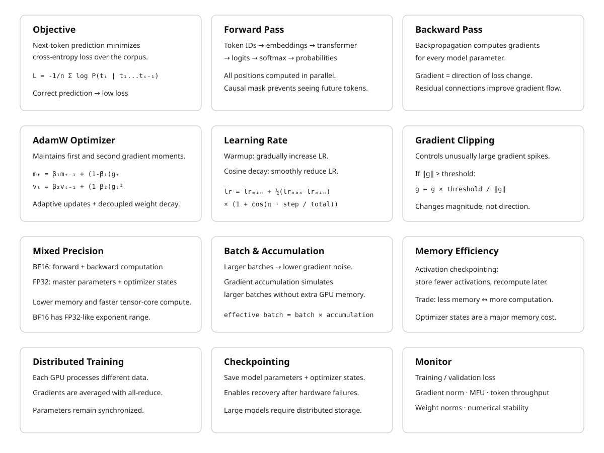

# The Training Loop {#sec-training-loop}

> **The canonical question for this chapter:**
> *Given a transformer architecture and a corpus of text, how does the model
> actually learn, what happens in a single training step, and how do millions
> of steps produce a capable model?*

---

::: {.callout-note appearance="minimal"}
**Where are we?**

{#fig-progress width="80%"}

Previous chapter covered training objectives, what the model is trying to minimize.
This chapter covers the mechanism: how one training step actually works, from
sampling a batch to updating 175 billion parameters. The training loop is
conceptually simple. The devil is entirely in the details of doing it stably
and efficiently at scale.
:::

---

## What learning means for a language model

Before the first training step, the model's parameters are random. Every weight
in every attention matrix, every FFN weight, every embedding, initialized from
a small random distribution. The model produces nonsense. Given "The capital of
France is", it assigns roughly equal probability to every token in the vocabulary.

After training, those same parameters encode enough structure about language
and the world that the model assigns high probability to "Paris" in that context.
Learning is the process of adjusting parameters until they do this, not just
for one example, but for trillions of them, simultaneously and without
memorizing any individual one.

The training loop is the mechanism that does this adjustment. Show the model
text, measure how wrong it is, compute how to be less wrong, update the
parameters. Repeat hundreds of millions of times. The devil is entirely in
the details.

---

## The objective: cross-entropy loss

The training objective for a language model is next-token prediction,
formalized as minimizing cross-entropy loss.

For a sequence of tokens [t_1, t_2, ..., t_n], the model predicts each token
given all previous tokens. The loss for a single sequence is:

$$
L = -1/n * sum_i log P(t_i | t_1, ..., t_{i-1})
$$

Where $P(t_i | t_1, ..., t_{i-1})$ is the probability the model assigns to the
correct next token at position i.

If the model assigns probability 1.0 to the correct token: log(1.0) = 0, no
loss. If it assigns probability 0.01: log(0.01) ≈ -4.6, high loss. The
objective is to maximize the probability assigned to correct tokens across
all positions in the training corpus.

This objective is applied to every position in every sequence simultaneously.
For a sequence of 4,096 tokens, the model makes 4,096 predictions in a single
forward pass. The causal mask enforces that position i only attends to
positions 0 through i-1, the model cannot cheat by looking at what it is
trying to predict. This is why training is computationally efficient: one 
forward pass on a sequence of length n produces n training signal examples 
simultaneously.


---

## The forward pass

The forward pass is the computation from input tokens to output probabilities.

```
Input:  [t_1, t_2, t_3, ..., t_n]     <- token IDs
Output: [P_1, P_2, P_3, ..., P_n]     <- probability distributions over vocab
```

For each position i, P_i is the model's probability distribution over the
vocabulary for what token comes next. The actual next token t_{i+1} is the
label. The loss is computed by comparing P_i to a one-hot distribution over
the correct token.

During the forward pass, the model:

1. Looks up token embeddings for all input tokens
2. Adds positional encodings (or applies RoPE inside attention)
3. Passes through all transformer blocks sequentially
4. Projects the final hidden states to vocabulary logits via the output
   embedding matrix (weight-tied with the input embedding table)
5. Computes softmax to get probabilities
6. Computes cross-entropy loss against the shifted target sequence

The forward pass is fully parallelized across the sequence dimension, all
positions are computed simultaneously, with the causal mask enforcing the
autoregressive constraint. This is the architectural property that made
transformers faster to train than recurrent networks.

---

## The backward pass: backpropagation

After the forward pass produces a loss value, the backward pass computes the
gradient of that loss with respect to every parameter in the model.

The gradient tells you: if I increase this parameter by a tiny amount, does
the loss go up or down, and by how much? A negative gradient means increasing
the parameter reduces loss, move it up. A positive gradient means increasing
the parameter increases loss, move it down.

Backpropagation applies the chain rule of calculus recursively from the output
layer back to the input embeddings. For a model with 175 billion parameters,
this computation visits every parameter and produces a gradient for each one.

The backward pass is approximately 2x as expensive as the forward pass in
compute. It also requires storing the activations computed during the forward
pass, intermediate values that are needed to compute gradients during the
backward pass. For a large model with a large batch, storing all activations
requires significant GPU memory. This is one of the central constraints of
training large models and the motivation for activation checkpointing.

### Gradient flow through the residual stream

One key insight about why transformers train well at depth: residual
connections provide a direct gradient highway from the loss back to the early
layers.

Without residuals, the gradient must pass through every nonlinearity in every
layer before reaching layer 1. Deep chains of multiplications cause gradients
to either vanish or explode.

With residuals:

```
x_L = x_0 + F_1(x_0) + F_2(x_1) + ... + F_L(x_{L-1})

dL/dx_0 = dL/dx_L * (1 + sum of partial derivatives through each sublayer)
```

The identity path (the "1" in the derivative) ensures gradients reach early
layers reliably, even in 96-layer or 126-layer networks. This is why very deep
transformers are trainable while very deep plain networks of the same depth
are not.

---

## The optimizer
Once gradients are computed, parameters are updated to reduce the loss. Vanilla 
gradient descent moves each parameter in the direction of the negative gradient, 
which is conceptually correct but practically unusable for large model training.

### Adam: adaptive moment estimation

Adam maintains two running statistics per parameter:

$$
\begin{aligned}
m_t &= \beta_1 m_{t-1} + (1 - \beta_1) g_t \\
v_t &= \beta_2 v_{t-1} + (1 - \beta_2) g_t^2 \\
\hat{m}_t &= \frac{m_t}{1 - \beta_1^t} \\
\hat{v}_t &= \frac{v_t}{1 - \beta_2^t} \\
\theta_t &= \theta_{t-1}
- \alpha \frac{\hat{m}_t}{\sqrt{\hat{v}_t} + \varepsilon}
\end{aligned}
$$

where:

- $m_t$: first moment (moving average of gradients)
- $v_t$: second moment (moving average of squared gradients)
- $\hat{m}_t$: bias-corrected first moment
- $\hat{v}_t$: bias-corrected second moment
- $\alpha$: learning rate

Standard hyperparameters: beta_1 = 0.9, beta_2 = 0.95 or 0.999, epsilon = 1e-8.

The key insight: each parameter gets its own effective learning rate, adapted
based on the history of its gradients. Parameters that receive large, consistent
gradients get smaller effective learning rates, they are already moving fast.
Parameters that receive small or noisy gradients get larger effective learning
rates, they need more help.

This makes training much more robust to the heterogeneous gradient magnitudes
across different parts of a transformer, attention weights, embedding
gradients, and FFN weights behave very differently, and Adam handles all of
them without manual per-layer tuning.

### Decoupled weight decay: AdamW

L2 regularization is commonly introduced by adding a penalty on the squared
magnitude of the model parameters to the training loss:

$$
L_{\text{total}}(\theta)
=
L(\theta)
+
\frac{\lambda}{2}\|\theta\|_2^2
$$

Taking the gradient gives:

$$
\nabla_\theta L_{\text{total}}
=
\nabla_\theta L
+
\lambda\theta
$$

Thus, the L2 penalty adds $\lambda\theta$ to the gradient before the Adam
update. Because Adam applies parameter-wise adaptive scaling to the gradient,
the regularization term is also affected by this scaling.

AdamW decouples weight decay from the gradient update. Instead of adding the
regularization term to the gradient, it directly shrinks the parameters
separately from the adaptive gradient step:

$$
\theta_t
=
(1-\alpha\lambda)\theta_{t-1}
-
\alpha
\frac{\hat{m}_t}
{\sqrt{\hat{v}_t}+\varepsilon}
$$

Where $\lambda$ is the weight decay coefficient, typically set to $0.1$ in
many transformer training setups. This encourages parameters to remain small,
which acts as a form of regularization and can improve generalization. Because
AdamW applies this weight decay directly to the parameters, there is typically
no need to add a separate L2 regularization penalty to the loss for the same
purpose.

### Memory cost of the optimizer

Adam maintains two additional values per parameter (m and v). For a 175B
parameter model in float32:

```
Parameters:       175B * 4 bytes = 700 GB
Adam m states:    175B * 4 bytes = 700 GB
Adam v states:    175B * 4 bytes = 700 GB
Total:                            2.1 TB
```

This is why optimizer state is one of the dominant memory costs in large model
training, and why techniques like 8-bit Adam (quantizing optimizer states to
INT8) and ZeRO (sharding optimizer state across GPUs)
exist. Without these techniques, training a 70B model requires more memory for
optimizer state than for the model itself.

---

## The learning rate schedule

The learning rate is not constant across training. A carefully designed schedule
is critical for stable and effective training.

### Warmup

Training starts with a very small learning rate and increases linearly to the
target rate over the first few thousand steps.

Without warmup, the large random gradients at initialization cause the Adam
moment estimates (m and v) to be poorly calibrated, leading to unstable early
training or divergence. The warmup period gives the optimizer time to
accumulate accurate moment estimates before taking large steps.

A typical warmup: 2,000 steps from lr = 0 to lr = 3e-4.

### Cosine decay

After warmup, the learning rate follows a cosine decay schedule:

```
lr(step) = lr_min + 0.5 * (lr_max - lr_min) * (1 + cos(pi * step / total_steps))
```

The learning rate decreases smoothly from the peak to a small final value
(typically lr_max / 10). The cosine shape is empirically better than linear
decay: it maintains a higher learning rate during most of training, allowing
the model to escape local optima, then decays rapidly at the end to converge
to a good solution.

### Why the schedule matters as much as the learning rate

The peak learning rate controls the step size. The schedule controls how that
step size changes over training. A training run with the wrong schedule (too
fast decay, or no warmup) can produce a significantly worse model than the
same training run with the correct schedule, even with identical architecture
and data.

---

## Gradient clipping

Large gradient spikes occur naturally during training, a particularly
surprising batch produces unusually large gradients that could cause a large
parameter update and destabilize training. Gradient clipping prevents this.

```python
# Clip gradient norm to max_norm
total_norm = sqrt(sum(p.grad.norm()**2 for p in model.parameters()))
clip_coef  = max_norm / max(total_norm, max_norm)

for p in model.parameters():
    p.grad *= clip_coef
```

If the global gradient norm (the L2 norm across all parameters) exceeds a
threshold (typically 1.0), all gradients are scaled down proportionally so
the global norm equals the threshold.

Clipping does not change the direction of the update, only its magnitude.
It prevents a single bad batch from destabilizing training without distorting
the direction of learning. Monitoring the gradient norm (and the frequency of
clipping) is one of the primary diagnostic signals during training: frequent
clipping or a consistently elevated norm indicates the learning rate is too high.

---

## Mixed precision training

Frontier model training uses BF16 rather than FP32 for the forward and backward
passes, halving memory requirements for activations and parameters at the cost
of some numerical precision.

```
Full precision (FP32):
  Forward pass:       FP32 activations
  Backward pass:      FP32 gradients
  Optimizer step:     FP32 parameter update

Mixed precision (BF16 compute, FP32 master):
  Forward pass:       BF16 activations (2x faster on tensor cores)
  Backward pass:      BF16 gradients
  Gradient cast:      BF16 -> FP32
  Optimizer step:     FP32 parameter update (numerical accuracy preserved)
  Parameter cast:     FP32 -> BF16 for next step
```

BF16 was chosen over FP16 because it has the same exponent range as FP32
(8 bits), preventing overflow on the large gradient values common in deep
network training. FP16's limited range (max ≈ 65,504) caused frequent overflow
in practice.

The float32 master copy is necessary because BF16 has insufficient precision
to accumulate small gradient updates correctly over many steps. BF16 represents
values with only 7 mantissa bits (≈ 2 decimal digits of precision); the
optimizer states and parameters need more precision than this to make the tiny
updates that characterize late-stage training.

---

## Batch size and gradient accumulation

The batch size determines how many training examples are processed before each
parameter update. Larger batches produce more accurate gradient estimates
(averaging over more examples reduces noise) but require more memory.

### Gradient accumulation

When the target batch size exceeds what fits in GPU memory, gradient
accumulation accumulates gradients over multiple forward-backward passes before
taking an optimizer step:

```python
optimizer.zero_grad()

for i, (inputs, targets) in enumerate(dataloader):
    outputs = model(inputs)
    loss    = criterion(outputs, targets) / accumulation_steps
    loss.backward()                          # accumulate gradients

    if (i + 1) % accumulation_steps == 0:
        optimizer.step()                     # update parameters
        optimizer.zero_grad()                # clear accumulated gradients
```

4 accumulation steps with batch size 256 is mathematically equivalent to one
step with batch size 1,024, but uses 4x less memory. The tradeoff is that
4 forward-backward passes take longer than 1.

### The batch size/learning rate relationship

Increasing batch size without adjusting the learning rate undertrains the
model, fewer parameter updates per epoch. Linear scaling rule: when batch
size is multiplied by k, multiply the learning rate by k. This preserves the
ratio of gradient signal to noise across different batch sizes.

---

## Activation checkpointing

During the backward pass, the model needs the activations computed during the
forward pass to compute gradients. Storing all activations for a large model
and large batch requires enormous memory.

Activation checkpointing trades compute for memory: instead of storing all
activations, store only a subset (checkpoints). During the backward pass,
recompute activations between checkpoints from the stored ones.

```python
from torch.utils.checkpoint import checkpoint

def forward_with_checkpointing(self, x):
    for layer in self.layers:
        x = checkpoint(layer, x)  # recompute activations during backward
    return x
```

The cost is additional computation because some forward operations must be 
recomputed during the backward pass. The exact overhead depends on the 
checkpointing strategy and model architecture and it is standard in all 
frontier model training.

---

## Checkpointing and fault tolerance

Training a frontier model takes weeks to months on thousands of GPUs. Hardware
failures are not exceptions, they are statistical certainties at this scale.
A GPU cluster of 10,000 nodes where each node has a mean time between failures
of one year will experience approximately 27 failures per day.

Model checkpoints (snapshots of parameters, optimizer states, and training
metadata) are saved to distributed storage at regular intervals (typically
every few hundred steps). If a failure occurs, training restarts from the
last checkpoint, losing only the steps since then.

The tradeoff is I/O overhead. Checkpointing a 175B model with optimizer states
is terabytes of data per checkpoint. Asynchronous checkpointing (saving in the
background while training continues) reduces this overhead significantly.

---

## The full training step, assembled

A complete single training step:

```
1.  Sample a batch of sequences from the training corpus

2.  Forward pass (in BF16):
    - Token embedding lookup
    - Add positional encodings / apply RoPE
    - Pass through N transformer blocks (attention + FFN + residuals + layernorm)
    - Project to vocabulary logits
    - Compute cross-entropy loss against shifted target sequence

3.  Backward pass:
    - Compute gradients via backpropagation (in BF16)
    - Cast gradients to float32

4.  Gradient clipping:
    - Compute global gradient norm
    - Rescale all gradients if norm > threshold

5.  All-reduce (distributed training):
    - Average gradients across all data-parallel ranks

6.  Optimizer step (AdamW, in float32):
    - Update first and second moment estimates
    - Apply weight decay
    - Update float32 master parameters

7.  Cast updated parameters back to BF16 for next step

8.  Update learning rate schedule

9.  Log metrics (loss, gradient norm, learning rate, throughput)

10. Save checkpoint if at checkpoint interval

11. Repeat
```

---

## What to monitor during training

A training run is not something you start and leave. Active monitoring is
required.

**Training loss.** The primary signal and should decrease steadily and smoothly.
Spikes indicate bad batches or numerical instability. A plateau may indicate
the learning rate is too small or the model is at capacity for its size. Loss
divergence (increasing without recovering) requires immediate intervention:
reduce the learning rate, restore an earlier checkpoint, and investigate the
bad batch that triggered the spike.

**Validation loss.** Loss on a held-out set not seen during training. Divergence
between training and validation loss indicates overfitting. For large models
on large corpora, the model rarely sees the same sequence twice, so overfitting
is uncommon, but benchmark contamination can cause deceptively low validation
loss.

**Gradient norm.** Should be stable and well below the clipping threshold.
Frequent clipping or consistently elevated norms indicate the learning rate
is too high. Sudden spikes that persist indicate a corrupted batch or
numerical issue.

**MFU (Model FLOPs Utilization).** The fraction of peak theoretical GPU compute
actually used. Well-optimized distributed training achieves 40–60% MFU.
Lower values indicate communication bottlenecks, pipeline bubbles, or data
loading delays.

**Token throughput.** Tokens processed per second across the cluster. The
primary efficiency metric for benchmarking training setups.

**Weight norms.** If weight norms grow continuously, weight decay is
insufficient or there is a regularization issue.

---

## The Chinchilla finding: compute-optimal training

How do you decide how large a model to train and on how many tokens?

This was largely heuristic until Hoffmann et al. (2022). For a fixed compute
budget C (measured in FLOPs), the optimal allocation trains a model of N
parameters on D = 20N tokens:

```
Optimal model size:      N* proportional to C^0.5
Optimal training tokens: D* proportional to C^0.5
```

A 10B parameter model optimally requires approximately 200B tokens. A 70B model
requires approximately 1.4T tokens. Previous models (GPT-3, Gopher) were
significantly undertrained, too many parameters, too few tokens for their
compute budget.

The practical implication shifted after Chinchilla: inference cost is paid
many times while training cost is paid once. Training a smaller model for
longer produces a model cheaper to run at inference time with comparable
quality. LLaMA 2 and LLaMA 3 train on far more tokens than Chinchilla-optimal
for exactly this reason.


---

## Key takeaways

- The training objective is cross-entropy loss on next-token prediction; one
  forward pass on a sequence of length n produces n training examples
  simultaneously — this is why transformer training is computationally efficient
- Backpropagation computes gradients for every parameter; residual connections
  ensure gradients reach early layers without vanishing, enabling 96-layer+
  networks to train reliably
- AdamW maintains per-parameter adaptive learning rates via first and second
  moment estimates; its memory cost is 2x the parameter count, making optimizer
  state the dominant memory consumer in large model training
- The learning rate schedule — warmup then cosine decay — is as important as
  the peak learning rate itself; wrong schedules produce significantly worse
  models even with identical architecture and data
- Gradient clipping prevents loss spikes from destabilizing training by scaling
  down large gradient norms; monitoring norm and clipping frequency is a
  primary training health signal
- Mixed precision training uses BF16 for compute (2x faster on tensor cores)
  and float32 for optimizer states (numerical accuracy preserved); BF16 is
  preferred over FP16 because it has the same exponent range as FP32
- Activation checkpointing trades ~30% compute for O(sqrt(n)) rather than
  O(n) activation memory, enabling training of models that would otherwise
  not fit in GPU memory
- The Chinchilla finding — optimal training requires roughly 20 tokens per
  parameter — reshaped compute budget allocation; in practice, models are
  overtrained relative to Chinchilla-optimal because inference cost is paid
  many more times than training cost

{#fig-progress width="90%"}

---

## Further reading

- Kingma & Ba (2015). *Adam: A Method for Stochastic Optimization.* — The
  original Adam paper.
- Loshchilov & Hutter (2019). *Decoupled Weight Decay Regularization.* — The
  AdamW paper.
- Hoffmann et al. (2022). *Training Compute-Optimal Large Language Models.* —
  The Chinchilla paper; required reading for anyone thinking about training
  compute allocation.
- Rajbhandari et al. (2020). *ZeRO: Memory Optimizations Toward Training
  Trillion Parameter Models.* — DeepSpeed ZeRO; the standard approach to
  optimizer state sharding.
- Chen et al. (2016). *Training Deep Nets with Sublinear Memory Cost.* —
  Activation checkpointing.
- Karpathy, A. (2022). *nanoGPT.* — A clean, minimal GPT training
  implementation in ~300 lines of PyTorch; the best way to understand the
  training loop concretely before the distributed complexity.

---
