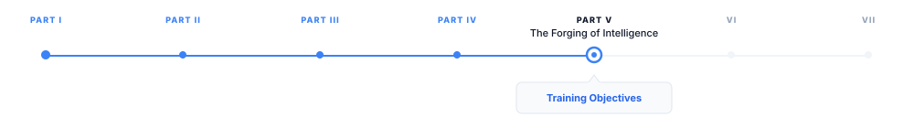
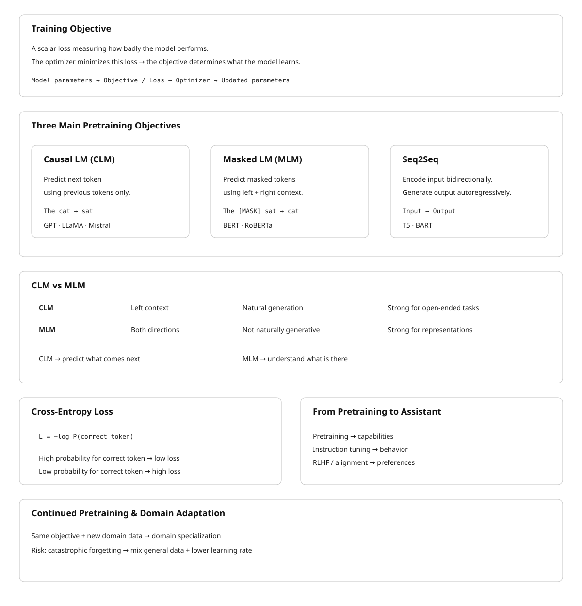

# Training Objectives

> **The canonical question for this chapter:**
> *What exactly is the model optimizing during training, and why does
> predicting the next token produce a system that can reason, translate,
> summarize, and write code?*

---

::: {.callout-note appearance="minimal"}
**Where are we?**

{#fig-progress width="80%"}

Previous chapter established how the vocabulary is constructed before model 
training begins. This chapter specifies the loss function the model minimizes 
during training the mathematical statement of what the model is trying to learn. 
:::

---

## What a Training Objective Is

A training objective is a scalar-valued function of the model's parameters and
the training data that measures how badly the model is currently doing. During
training, the optimizer adjusts model parameters to reduce this scalar. The
training objective is the only signal the model ever receives about what
"correct" behavior looks like. Everything the model learns (language, facts,
reasoning patterns, stylistic tendencies) is a consequence of what the
objective rewards and what it ignores.

This makes the choice of objective the most consequential design decision in
building a language model, with the possible exception of architecture. The
transformer architecture describes the computational graph. The
training objective describes what the graph should compute. Getting the
architecture wrong costs you efficiency. Getting the objective wrong costs
you the model.

Modern large language models use one of two primary pretraining objectives:
**causal language modeling** (autoregressive next-token prediction) and
**masked language modeling** (bidirectional prediction of masked tokens). A
third objective (**sequence-to-sequence modeling**) combines elements of
both. Each objective induces a different kind of model with different
strengths, different inference-time behavior, and different fine-tuning
characteristics.

---

## Causal Language Modeling

### The Objective

Causal language modeling (CLM) is the pretraining objective used by GPT-2,
GPT-3, GPT-4, LLaMA, Mistral, Falcon, and essentially every large model
used for text generation. The setup is as follows.

Given a sequence of tokens $x_1, x_2, \ldots, x_T$, the model is trained to
predict each token given all preceding tokens. The loss for a single sequence
is the mean negative log-likelihood of the correct next token at each position:

$$
\mathcal{L}_{\text{CLM}} = -\frac{1}{T} \sum_{t=1}^{T} \log P_\theta(x_t \mid x_1, x_2, \ldots, x_{t-1})
$$

where $P_\theta$ is the model's predicted probability distribution over the
vocabulary, parameterized by weights $\theta$. At each position $t$, the model
receives the sequence $x_1, \ldots, x_{t-1}$ and must assign a probability to
every token in the vocabulary. The loss penalizes the model in proportion to
how surprised it is by the actual next token $x_t$.

Summing across positions and sequences, the total training loss is a measure
of the model's average surprise (its perplexity) over the training corpus.
Minimizing this loss is equivalent to maximizing the likelihood of the training
data under the model.

### Why Causal?

The word "causal" refers to the constraint that prediction at position $t$ may
only condition on positions $1$ through $t-1$, never on positions $t+1$ and
beyond. This constraint is enforced by the causal attention mask in the
transformer: the upper triangle of the attention matrix is set to $-\infty$
before the softmax, preventing any token from attending to future tokens.

The causal constraint serves two purposes. First, it makes training efficient:
a single forward pass through a sequence of $T$ tokens produces $T$ prediction
targets simultaneously (one at each position) giving $T$ gradient signals per
sequence. Without causal masking, computing the prediction at each position
would require a separate forward pass, since the model could otherwise "see"
the answer it is trying to predict.

Second, and more importantly, the causal constraint makes the trained model
useful for generation. At inference time, the model generates text by sampling
one token at a time, left to right, conditioning each new token on everything
that came before. The training objective and the inference procedure are
exactly aligned: the model was trained to do precisely the thing it is asked
to do at inference time. This alignment is not trivial, it is one reason CLM
became dominant over alternatives.

### The Prediction Task at Each Position

At each position in a training sequence, the model produces a probability
distribution over the entire vocabulary (typically 32,000 to 128,000 tokens).
The loss at that position is the negative log-probability assigned to the
correct token.

Consider a training sequence: "The cat sat on the mat." After tokenization
this might be ["The", "▁cat", "▁sat", "▁on", "▁the", "▁mat", "."]. At
position 3 (predicting "▁sat"), the model sees ["The", "▁cat"] and must
assign a probability to every vocabulary token. If it assigns probability 0.8
to "▁sat", the loss at this position is $-\log(0.8) \approx 0.22$ nats. If
it assigns probability 0.01, the loss is $-\log(0.01) \approx 4.61$ nats.

Across billions of such positions, the model learns to assign high probability
to contextually likely continuations. Initially, when parameters are random,
the loss is approximately $\log(\text{vocab\_size})$: about 10.4 nats for a
32,000-token vocabulary, 11.8 nats for 128,000 tokens. A well-trained LLaMA 2
7B achieves roughly 1.8–2.2 nats on held-out English text, depending on domain.
This corresponds to a perplexity of approximately $e^{2.0} \approx 7.4$: the
model is, on average, about as surprised as if it were choosing uniformly among
7 equally likely options.

### Data Formatting

CLM requires no annotation. The loss signal is derived entirely from the
structure of the text itself: every token is simultaneously a context token
(for predicting the next token) and a prediction target (for the preceding
context). This is the property that makes CLM scalable to internet-scale
datasets, no human labeling, no task specification, just raw text.

In practice, training sequences are formed by concatenating documents and
splitting into fixed-length chunks (typically matching the model's context
window). A special end-of-document token (`<|endoftext|>`, `</s>`) is inserted
between documents so the model learns that one document ending is not a
continuation of the next.

Cross-document attention is typically masked: the model is not trained to
predict the first token of a document from the last token of an unrelated
preceding document, since this would introduce spurious statistical
dependencies. Some implementations simply ensure that each training sequence
starts at a document boundary.

---

## Why Next-Token Prediction Produces Capable Models

The capability of GPT-class models far exceeds what the training objective
appears to require. Predicting the next word in a document should, naively,
produce a sophisticated autocomplete system. It has instead produced systems
capable of multi-step reasoning, code generation, translation into unseen
languages, and generating plausible scientific hypotheses. This gap between
the apparent simplicity of the objective and the observed capability of trained
models is the central puzzle in understanding modern LLMs.

### The World Model Argument

The most compelling explanation is that accurate next-token prediction
*requires* a world model. Consider what a model must represent to correctly
predict the next token in a diverse corpus at low loss.

A sequence of text about a chess game requires the model to track the board
state (which pieces are where) to predict legal moves and plausible
continuations. A sequence of Python code requires the model to track variable
bindings, scoping rules, and the semantics of already-defined functions to
predict syntactically and semantically valid continuations. A medical discharge
summary requires the model to represent the patient's condition, the treatments
administered, and their interactions to predict what a clinician would plausibly
write next.

No single special case requires a world model. But achieving low loss across
millions of documents spanning chess, code, medicine, history, mathematics,
literature, and conversation requires that the model build internal
representations that encode, for each domain, the causal structure that
determines what comes next. The model that minimizes next-token prediction
loss over a sufficiently diverse corpus is, in this view, a system that has
compressed a large fraction of human structured knowledge into its parameters.

### In-Context Learning as Evidence

The emergence of in-context learning (the ability to perform new tasks from
a few demonstrations in the prompt, without any weight update) provides
strong evidence for the world model interpretation. A model that had merely
memorized statistical co-occurrences could not, in principle, solve arithmetic
problems formatted as few-shot examples that it had never seen in training.
The fact that it does suggests that the model has learned something about the
structure of task descriptions and the general strategy of pattern completion
from examples, not just the specific patterns it was exposed to.

---

## Masked Language Modeling

### The Objective

Masked language modeling (MLM) is the pretraining objective introduced by BERT
(Devlin et al., 2019). Where CLM predicts each token from its left context
only, MLM predicts masked tokens from both left and right context
simultaneously. The model is bidirectional.

The procedure: given a sequence of tokens, randomly replace approximately 15%
of tokens with a `[MASK]` token. The model processes the entire masked sequence
and must predict the original identity of each masked token. The loss is the
mean negative log-likelihood over masked positions only:

$$
\mathcal{L}_{\text{MLM}} = -\frac{1}{\lvert \mathcal{M} \rvert} \sum_{t \in \mathcal{M}} \log P_\theta(x_t \mid \tilde{x}_1, \ldots, \tilde{x}_T)
$$

where $\mathcal{M}$ is the set of masked positions and $\tilde{x}$ is the
masked sequence.

BERT's specific masking scheme adds noise to the 15% mask rate:
- 80% of selected tokens are replaced with `[MASK]`
- 10% are replaced with a random token
- 10% are left unchanged

This prevents the model from learning to simply ignore all `[MASK]` tokens and
forces it to maintain a useful representation of every token, since any token
might be the one it is asked to predict.

### The Bidirectional Advantage

MLM's key property is that the model can attend to the full context in both
directions when making each prediction. This is architecturally different from
CLM: MLM transformers have no causal mask. The attention operation at each
position can incorporate information from all other positions.

Bidirectional context improves representation quality for tasks that require
understanding of a complete input. Named entity recognition, for example,
requires understanding that "Apple" in "Apple released its quarterly earnings
today" is a company, not a fruit, a judgment that often depends on words that
appear *after* "Apple" in the sentence. A causal model must make this judgment
with only left context; a bidirectional model has access to both.

For sentence classification, question answering over a fixed document, and
token labeling tasks, MLM-pretrained models (BERT, RoBERTa, DeBERTa) held state
of the art for several years after BERT's release in 2018.

### The Generation Problem

The cost of bidirectionality is that MLM models cannot straightforwardly
generate text. The causal constraint that enables autoregressive generation is
absent. To generate a token at position $t$, a CLM model simply conditions on
positions $1$ through $t-1$. An MLM model, trained to condition on all
positions simultaneously, has no natural procedure for sequential generation:
it would need to mask future positions during generation, but it was never
trained with that masking pattern.

Attempts to use MLM models for generation exist (masked diffusion language
models, iterative refinement) but remain less capable than autoregressive CLM
models at open-ended generation tasks. The practical consequence: MLM models
are fine-tuned for fixed-output tasks (classification, span extraction, sequence
labeling) while CLM models handle generation.

### Fine-Tuning With a [CLS] Token

BERT adds a `[CLS]` token at the beginning of every input. After pretraining,
the embedding of this token at the final layer captures a pooled representation
of the entire sequence, because it has attended to all other tokens. For
classification tasks, fine-tuning adds a linear layer on top of the `[CLS]`
embedding and trains it (along with some or all of the transformer weights)
on labeled examples.

This two-stage procedure )pretrain with MLM, fine-tune with task-specific head)
became the dominant paradigm for NLP from 2018 to 2020. GPT-3's demonstration
of in-context learning without fine-tuning shifted the field, but BERT-style
fine-tuning remains standard for latency-sensitive classification tasks where
a smaller model with a dedicated head outperforms a large generative model
asked to produce labels as text.

---

## Sequence-to-Sequence Objectives

T5 (Raffel et al., 2020) and BART (Lewis et al., 2020) use encoder-decoder
architectures trained with sequence-to-sequence objectives. The encoder
processes the input with full bidirectional attention (like BERT). The decoder
generates the output autoregressively, attending to both the encoder's output
and the previously generated tokens (like GPT).

T5 frames every NLP task as text-to-text: translation, summarization,
classification, and question answering all become "given this text input,
produce this text output." The pretraining objective is a span corruption task:
random contiguous spans of input tokens are masked, and the decoder is trained
to reconstruct them. This is MLM generalized to spans rather than individual
tokens.

BART uses a more aggressive corruption scheme for pretraining: sentence
permutation, token deletion, text infilling, and document rotation, all
combined. The decoder is trained to reconstruct the original document from
the corrupted input. This makes BART particularly strong for generation tasks
that involve transforming one piece of text into another (translation,
summarization, dialogue).

Encoder-decoder models are well-suited to tasks with a natural input-output
structure. Their limitation is computational: running both an encoder and a
decoder requires more memory than a decoder-only CLM model of equivalent
parameter count, and the two-component architecture is more complex to serve.
The field has largely converged on decoder-only CLM models for general-purpose
use, with encoder-decoder architectures retained for specialized translation
and summarization applications.

---

## The Cross-Entropy Loss in Practice

All three objectives (CLM, MLM, and seq2seq) minimize some form of
cross-entropy loss. Cross-entropy between the model's predicted distribution
$P_\theta$ and the true distribution (a one-hot vector at the correct token)
is:

$$
H(y, P_\theta) = -\sum_{v \in V} y_v \log P_\theta(v) = -\log P_\theta(x_t)
$$

since $y_v = 1$ only for the correct token and $0$ elsewhere. This reduces to
the negative log-probability of the correct token, which is the quantity being
minimized at each prediction position.

### Label Smoothing

Hard one-hot targets can lead to overconfident models, the model pushes
probability mass toward 1.0 for the correct token and toward 0.0 for all
others, which degrades calibration and can impair generalization. Label
smoothing (Szegedy et al., 2016) replaces the one-hot target with a softened
version:

$$
y_v^{\text{smooth}} = \begin{cases} 1 - \epsilon & \text{if } v = x_t \\ \epsilon / (|V| - 1) & \text{otherwise} \end{cases}
$$

With $\epsilon = 0.1$ (a common value), the correct token receives target
probability 0.9 rather than 1.0, and all other tokens receive a small positive
target probability. This prevents the model from becoming arbitrarily confident
and improves calibration of the predicted probability distributions.

Label smoothing is used in most large model training runs. T5 uses $\epsilon =
0.1$. The original transformer paper used $\epsilon = 0.1$ for machine
translation. GPT-style models have used both smoothed and unsmoothed objectives;
the LLaMA technical reports do not specify but performance suggests standard
cross-entropy without smoothing.

---

## From Pretraining to Instruction Following

The pretraining objectives described above train models on raw text. The result
is a base model: a powerful next-token predictor that continues arbitrary text
in a statistically plausible way. A base model given the prompt "Translate this
sentence to French:" will often produce a continuation that looks like more
examples of translation prompts (because that is the kind of text that follows
such a prompt in a training corpus) rather than actually translating the
sentence.

Transforming a base model into an assistant that follows instructions requires
additional training on instruction-formatted data. This is covered in Chapter REFF
(alignment and RLHF), but the connection to the pretraining objective is worth
noting here. The pretraining objective gives the model the underlying capability
(language understanding, factual knowledge, reasoning patterns) while
instruction tuning teaches the model to *apply* those capabilities in response
to user requests. The capabilities cannot be fine-tuned in; they must be
pretrained. The behavior of applying them in response to instructions can be
fine-tuned efficiently once the capabilities exist.

The practical implication: scaling pretraining data and compute
improves the base capability ceiling. Instruction tuning effectiveness is bounded
by what is already in the base model. A model that cannot solve a reasoning
problem as a base model will not be able to solve it after instruction tuning,
because instruction tuning does not add capability, it redirects it.

---

## Continued Pretraining and Domain Adaptation

A base model can be continued-pretrained on a domain-specific corpus to improve
its performance on that domain's tasks. The objective is identical to original
pretraining (CLM over raw text) but the data distribution shifts toward the
target domain.

For example, a general-purpose model like LLaMA 2 can be continued-pretrained
on a corpus of medical literature, clinical notes, and biomedical databases.
The resulting model (analogous to BioMedLM or Med-PaLM in spirit) achieves
substantially lower loss on medical text and scores higher on medical question-
answering benchmarks, without architecture changes. The pretraining objective
is unchanged; only the data changes.

The practical considerations for continued pretraining:

**Catastrophic forgetting.** Continued pretraining on a narrow domain tends to
degrade performance on out-of-domain tasks. The optimizer, minimizing the
domain-specific loss, adjusts weights in ways that reduce their utility for
general text. Mitigation strategies include mixing domain data with general
data at some ratio (typically 10–30% general data), using lower learning rates
than original pretraining, and using replay buffers that interleave examples
from the original training distribution.

**Learning rate schedule.** Continued pretraining typically restarts the
learning rate from a small value (rather than the near-zero value the schedule
had reached at the end of original pretraining) and uses a cosine decay to a
near-zero endpoint. The warmup phase is often shortened or eliminated, since
the model is not initializing from random weights.

**Data quality matters more, not less.** At the domain-specialization stage,
the corpus is smaller and the model has more capacity than the data requires.
Noisy data (OCR errors in scanned documents, truncated records, formatting
artifacts) exerts more influence per token than it would in the original
pretraining corpus of trillions of tokens.

---

## Connecting the Objective to What the Model Learns

The training objective does not specify what representations the model should
build internally, it only specifies the scalar loss to minimize. The
representations that emerge depend on what is useful for minimizing that loss.

For CLM, a complete characterization of what emerges from minimizing
$\mathcal{L}_{\text{CLM}}$ does not exist. Empirically, the following have
been observed to emerge as loss decreases on a sufficiently large corpus:

**Syntactic structure.** Probing classifiers can extract parse trees and
grammatical roles from the intermediate representations of well-trained
models, even though no syntactic annotation was present in training data.
Predicting the next token reliably across varied sentence structures requires
tracking syntactic dependencies.

**Factual associations.** The feedforward layers of transformer models store
factual associations of the form "subject — relation — object" in a
key-value structure. Models can complete "The capital of France is ___" not
because the exact string appears in training data but because the factual
association is encoded in weights. Meng et al. (2022) demonstrated that
specific factual associations can be localized to specific layers and edited.

**Reasoning patterns.** Models trained on sufficient data develop the ability
to complete multi-step reasoning chains in context, particularly when such
chains appear frequently in the training corpus (mathematics textbooks,
competitive programming editorials, legal reasoning documents). Whether this
constitutes reasoning in a principled sense or sophisticated pattern completion
is an open question, the empirical fact of the capability is sufficient here.

**Stylistic and discourse structure.** Document-level structure (introductions
that motivate, arguments that proceed from premise to conclusion, narratives
that resolve introduced conflicts) emerges from training on documents that
exhibit these structures. Predicting each token correctly in a well-structured
document requires modeling the discourse-level plan of the document.

All of these emerge from the same objective, none of them were specified. The
training objective is the entire specification of the model's learning target,
and the diversity of what emerges from it is the empirical basis for the world
model interpretation above.

---

## Key Takeaways

- Causal language modeling (CLM) trains the model to predict each token from
  all preceding tokens; masked language modeling (MLM) trains it to predict
  masked tokens from full bidirectional context.
- CLM loss at position $t$ is the negative log-probability of the correct
  token: $-\log P_\theta(x_t \mid x_1, \ldots, x_{t-1})$; the total training
  loss is the mean over all positions and all training sequences.
- The causal attention mask enforces the left-to-right constraint during
  training and makes CLM training efficient: a single forward pass over a
  sequence of length $T$ produces $T$ prediction targets simultaneously.
- A randomly initialized model predicts approximately $\log(\text{vocab\_size})$
  nats of loss; a well-trained LLaMA 2 7B achieves roughly 1.8–2.2 nats on
  English held-out text, corresponding to a perplexity of about 7.
- Accurate next-token prediction over a sufficiently diverse corpus requires
  building internal representations that track causal structure across domains
  — the world model argument for why CLM produces capable models.
- MLM models (BERT, RoBERTa, DeBERTa) are stronger for classification and
  span extraction tasks; CLM models dominate generation; neither architecture
  advantage is absolute, but their inference procedures differ fundamentally.
- Encoder-decoder models (T5, BART) pair a bidirectional encoder with a causal
  decoder; the combination is strong for structured input-output transformation
  tasks but more expensive to serve than decoder-only models.
- Label smoothing replaces one-hot targets with soft targets (typically $\epsilon
  = 0.1$) to prevent overconfidence and improve probability calibration.
- Pretraining builds capability; instruction tuning redirects it. A capability
  that is absent from the base model cannot be fine-tuned in — it must be
  pretrained.
- Continued pretraining on domain-specific data can substantially improve
  domain performance while risking catastrophic forgetting of general
  capabilities; mixing in general data at 10–30% mitigates this.
- Syntactic structure, factual associations, reasoning patterns, and discourse
  coherence all emerge from CLM training without explicit specification — they
  are what the model learns because learning them reduces loss.

{#fig-progress width="90%"}

---

## Further Reading

- Devlin, J., Chang, M.-W., Lee, K., & Toutanova, K. (2019). *BERT: Pre-training
  of Deep Bidirectional Transformers for Language Understanding.* NAACL. —
  Introduces MLM and the [CLS]/[SEP]/[MASK] special token framework; the
  comparison between CLM and MLM in the appendix is the clearest early treatment
  of the bidirectionality tradeoff.

- Radford, A., Wu, J., Child, R., Luan, D., Amodei, D., & Sutskever, I. (2019).
  *Language Models are Unsupervised Multitask Learners.* OpenAI. — The GPT-2
  paper; the central argument that next-token prediction at scale produces
  multitask learners is stated here, with zero-shot evaluation across eight tasks
  as evidence.

- Raffel, C., et al. (2020). *Exploring the Limits of Transfer Learning with a
  Unified Text-to-Text Transformer.* JMLR. — Introduces T5 and the text-to-text
  framing; the systematic comparison of pretraining objectives (span corruption,
  deshuffling, prefix LM) across 24 tasks is a rigorous treatment of objective
  choice.

- Lewis, M., et al. (2020). *BART: Denoising Sequence-to-Sequence Pre-training
  for Natural Language Generation, Translation, and Comprehension.* ACL. —
  Introduces BART's multi-corruption pretraining objective; the ablation of
  individual corruption strategies is the key empirical contribution.

- Brown, T., et al. (2020). *Language Models are Few-Shot Learners.* NeurIPS. —
  GPT-3; the in-context learning results are the clearest empirical demonstration
  that CLM pretraining produces general-purpose learners; the few-shot vs.
  zero-shot vs. fine-tuning comparisons motivate the world model interpretation.

- Szegedy, C., Vanhoucke, V., Ioffe, S., Shlens, J., & Wojna, Z. (2016).
  *Rethinking the Inception Architecture for Computer Vision.* CVPR. — Introduces
  label smoothing; the motivation and calibration analysis apply directly to
  language model training despite the computer vision context.

- Meng, K., et al. (2022). *Locating and Editing Factual Associations in GPT.*
  NeurIPS. — Demonstrates that factual knowledge is localized to specific
  feedforward layers in transformer models; the causal tracing methodology is
  the key technical contribution.

- Gururangan, S., et al. (2020). *Don't Stop Pretraining: Adapt Language Models
  to Domains and Tasks.* ACL. — Systematic study of domain-adaptive pretraining
  (continued pretraining on domain text); demonstrates consistent gains across
  biomedical, computer science, news, and reviews domains with analysis of the
  data quantity and quality tradeoffs.

---
