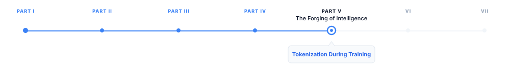
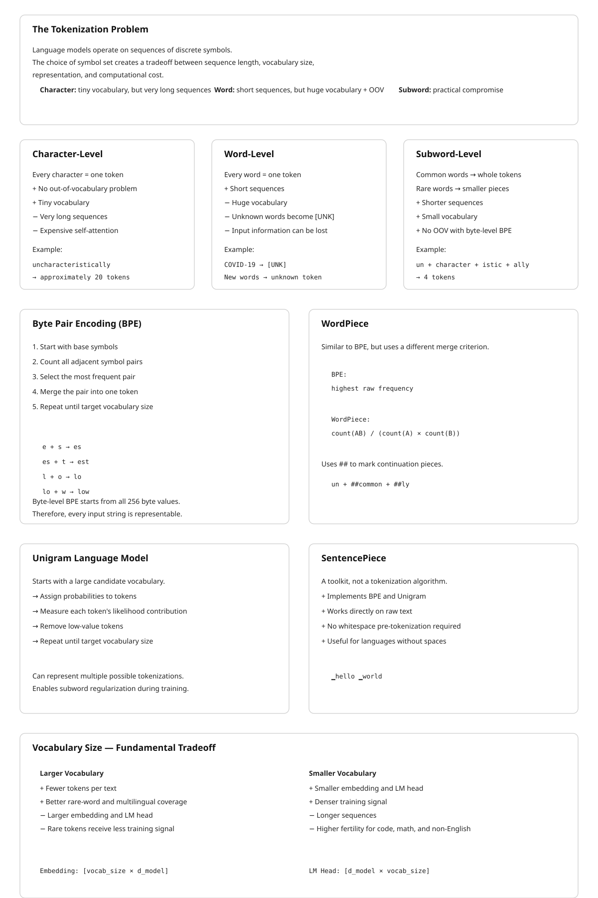

# Tokenization During Training

> **The canonical question for this chapter:**
> *How does a model's vocabulary get built, and why does the choice of subword
> algorithm permanently shape everything the model can represent?*

---

::: {.callout-note appearance="minimal"}
**Where are we?**
{#fig-progress width="80%"}


The chapter on tokenization during inference explained how a trained tokenizer 
operates at inference time by applying chat templates, counting tokens, and managing 
context budgets. This chapter shifts upstream to examine how that tokenizer was created 
in the first place. Before model training begins, a separate tokenizer training process 
constructs the vocabulary file that every downstream component ultimately depends on.

:::

---

## The Problem That Tokenization Solves

A language model is a function over sequences of discrete symbols. The choice
of symbol set is not obvious. Three options present themselves immediately, each
with a serious flaw.

**Character-level tokenization** treats every Unicode code point as a token.
The vocabulary is tiny (roughly 100,000 characters in Unicode, though practical
vocabularies are far smaller) and no out-of-vocabulary problem exists: any
string is representable. The flaw is sequence length. The word "uncharacteristically"
requires 20 tokens. A 2,048-token context window, measured in characters,
holds roughly a paragraph. Self-attention cost scales quadratically with sequence
length, so character-level models pay a steep computational price for what is,
in practice, trivial structure: spelling.

**Word-level tokenization** goes to the other extreme. The model treats each
whitespace-delimited word as a single token. This compresses sequences efficiently
and aligns well with human intuition about linguistic units yet on the other hand the flaws are
fundamental. First, vocabulary size: English alone has hundreds of thousands of
distinct word forms, and that is before proper nouns, neologisms, and
domain-specific terminology. A vocabulary large enough to be useful is also large
enough to make the embedding table and output projection layer expensive. Second,
and more seriously, any word not seen during training is unknown. A word-level
model trained on English Wikipedia has never seen "COVID-19" or "zoombombing" or
any company name coined after its training cutoff (2019 for this example). It cannot 
represent them; it can only produce a special `[UNK]` token, at which point the model 
has lost the input information entirely.

**Subword tokenization** resolves both problems by refusing to commit to either
extreme. Common words appear as single tokens. Rare words are split into
meaningful pieces (prefixes, suffixes, stems) that the model has seen
in other contexts. The word "uncharacteristically" might become ["un",
"character", "istic", "ally"], four tokens, each of which carries recoverable
meaning. An unseen technical term like "CRISPR" might become ["C", "R", "IS",
"PR"] which is not meaningful decomposition, but at least the characters are present
and the model can condition on them.

The choice of subword algorithm, and the vocabulary size it produces, is made
once per model family. GPT-4 uses a vocabulary of roughly 100,000 tokens. 
LLaMA 3 uses 128,256 tokens. BERT uses 30,522 WordPiece tokens.
These numbers are fixed before model training begins and cannot be changed
without retraining the model from scratch. Every downstream decision like embedding
table dimensions, output projection matrix size, how many tokens a document
occupies, what the model can represent at all is downstream of this choice.

---

## Byte Pair Encoding

Byte Pair Encoding (BPE) was introduced as a data compression algorithm in 1994
and adapted for neural machine translation by Sennrich et al. in 2016. It
remains the dominant tokenization algorithm for large language models. GPT-2,
GPT-3, GPT-4, LLaMA, Mistral, Falcon, and most other major models use BPE or
a variant of it.

### The Algorithm

BPE training is an iterative merge procedure applied to a large text corpus.
The algorithm:

1. **Initialize the vocabulary** with the base symbol set. For text BPE, the
   base symbols are Unicode characters. For byte-level BPE (described below),
   the base symbols are the 256 byte values.

2. **Represent the corpus** as a sequence of base symbols. Typically the corpus
   is pre-tokenized into words by whitespace and punctuation, and each word is
   represented as a sequence of characters followed by a special end-of-word
   marker. GPT-2 uses `Ġ` (a space prefix) to distinguish word-initial tokens
   from word-internal ones; this matters because "ing" at the start of a word
   differs semantically from "ing" as a suffix.

3. **Count all adjacent symbol pairs** across the corpus.

4. **Merge the most frequent pair.** If ("e", "r") appears 47,000 times and
   no other pair appears more often, add "er" to the vocabulary and replace
   every occurrence of ("e", "r") in the corpus with the new token "er".

5. **Repeat** until the target vocabulary size is reached.

Each merge adds exactly one token to the vocabulary. A target vocabulary of
50,000 tokens (GPT-2's size) requires 50,000 minus the number of base symbols
merges.

The result is a vocabulary in which the most frequent substrings in the training
corpus are represented as single tokens. Common English words or morphemes appear 
whole while character sequences that the corpus rarely produces are represented by 
their constituent base symbols.

### Byte-Level BPE

Standard BPE with Unicode characters still has a representation problem:
Unicode has over a million code points, and any character not in the base
vocabulary produces an error. GPT-2 addressed this with a conceptually simple
fix: use all 256 byte values as the base vocabulary rather than Unicode
characters. Any string, in any language or encoding, can be represented as a
sequence of bytes. The BPE merge procedure then operates over bytes.

This eliminates the out-of-vocabulary problem completely. A byte-level BPE
tokenizer never encounters an input it cannot represent. The practical tradeoff
is that languages not well-represented in the training corpus get inefficient
tokenization: their common words are not merged into single tokens, so they
occupy more tokens per word than English. A 2024 study found that GPT-4's
tokenizer encodes Amharic text using roughly 4–5× more tokens per character
than English text, making API costs and context window utilization significantly
worse for low-resource languages.

### Learning the Vocabulary: A Worked Example

Consider a tiny corpus: "low lower newest widest". After whitespace splitting
and adding end-of-word markers, the initial representation is:

```
l o w </w>         : 5 occurrences
l o w e r </w>     : 2 occurrences
n e w e s t </w>   : 6 occurrences
w i d e s t </w>   : 3 occurrences
```

Counting adjacent pairs across all occurrences:

| Pair | Count |
|------|-------|
| (e, s) | 9 |
| (s, t) | 9 |
| (e, w) | 6 |
| (l, o) | 7 |
| ... | ... |

The pair (e, s) and (s, t) are tied at 9. The algorithm picks one (say, (e, s))
and merges:

```
l o w </w>         : 5
l o w e r </w>     : 2
n e w es t </w>    : 6
w i d es t </w>    : 3
```

New vocabulary: {l, o, w, e, r, n, s, t, i, d, </w>, **es**}. Next iteration,
(es, t) appears 9 times and is the top pair:

```
n e w est </w>     : 6
w i d est </w>     : 3
```

Vocabulary adds **est**. After a few more merges, "low" might become a single
token. After thousands of merges on a real corpus, common English words are
single tokens and common morphemes are single tokens, while rare strings remain
as byte sequences.

---

## WordPiece

WordPiece, developed at Google and used in BERT and its derivatives, is
conceptually similar to BPE but differs in the merge criterion. Where BPE
selects the pair with the highest raw frequency, WordPiece selects the pair
that maximizes the likelihood of the training corpus under the language model
induced by the current vocabulary.

Formally, WordPiece scores each candidate merge (A, B) → AB as:

```
score(A, B) = count(AB) / (count(A) × count(B))
```

This is the pointwise mutual information of A and B. A merge is favored not
just because AB is frequent, but because the co-occurrence of A and B is
surprising given their individual frequencies. The pair ("un", "##common")
would be favored over ("e", "##r") even if the latter is more frequent,
because the combination "uncommon" is much more predictable from its parts
than "er" is from "e" and "r".

WordPiece uses a `##` prefix convention to mark tokens that continue a word
rather than beginning one. The token `##ing` is the continuation "ing", while
`ing` is the word-initial "ing". This makes it easy to recover word boundaries
from a token sequence.

The practical behavior of BPE and WordPiece is similar for large vocabularies
on large corpora. BERT's 30,522-token WordPiece vocabulary and GPT-2's 50,257-
token BPE vocabulary both segment English text into roughly 1.3 tokens per word.
The engineering differences matter more for implementation: WordPiece
vocabularies are trained in a top-down fashion with a fixed vocabulary size
target, while BPE proceeds bottom-up.

---

## Unigram Language Model Tokenization

The Unigram Language Model algorithm, introduced by Kudo (2018) and used in
SentencePiece (which underlies T5, mT5, ALBERT, and XLNet), approaches the
problem differently. Rather than building a vocabulary through iterative
merging, Unigram starts with a large candidate vocabulary and iteratively
prunes it.

The procedure:

1. **Initialize** with a large vocabulary (typically 10–100× the target size)
   containing all substrings that appear with sufficient frequency in the corpus.

2. **Train a unigram language model** over the current vocabulary: assign each
   token a probability proportional to its frequency.

3. **For each token**, compute how much the corpus likelihood would decrease if
   that token were removed from the vocabulary. Tokens whose removal causes
   little likelihood decrease are candidates for pruning.

4. **Remove the bottom p%** of tokens (typically 10–20%) ranked by their
   likelihood contribution.

5. **Repeat** until the target vocabulary size is reached.

The Unigram model defines the probability of a tokenization as the product of
the probabilities of its constituent tokens, summed over all possible
tokenizations using dynamic programming. At inference time, the tokenizer finds
the most probable tokenization of each input string.

The key advantage of the Unigram model is that it naturally handles
tokenization ambiguity and can assign probabilities to multiple tokenizations
of the same string. This enables subword regularization: during training,
instead of always using the single most probable tokenization, the model is
presented with multiple different tokenizations of the same input, sampled
according to their probabilities. This acts as a form of data augmentation
and has been shown to improve robustness, particularly for morphologically
rich languages.

---

## SentencePiece

SentencePiece is not a tokenization algorithm but a toolkit, developed by
Kudo and Richardson at Google, that implements both BPE and Unigram in a
language-agnostic framework. Its key design decision: it tokenizes raw text
directly, without requiring a pre-tokenization step that splits on whitespace.

Languages like Chinese, Japanese, and Thai have no whitespace between words.
Applying a whitespace-splitting pre-tokenizer to Chinese text produces a
sequence of individual characters, which is not a useful prior for BPE merging.
SentencePiece treats the input as a sequence of Unicode characters and learns
its own whitespace handling. The space character receives its own representation:
typically `▁` (U+2581, a lower one-eighth block), which appears as a prefix
on word-initial tokens.

LLaMA 1 and LLaMA 2 use a SentencePiece BPE tokenizer with a vocabulary of
32,000 tokens. LLaMA 3 switched to a tiktoken-based BPE tokenizer with
128,256 tokens, a 4× vocabulary expansion motivated partly by better
multilingual coverage and partly by reduced token fertility (tokens per word)
for code.

---

## Vocabulary Size: The Fundamental Tradeoff

Vocabulary size is a hyperparameter with pervasive consequences. The embedding
table has shape [vocab_size, d_model] and the output projection (llm_head) has
shape [d_model, vocab_size]. For a model with d_model = 4,096 (LLaMA 2 7B),
each additional 1,000 vocabulary tokens adds 4,096,000 parameters to the
embedding table and another 4,096,000 to the output projection, roughly 8M
parameters, stored in float16, occupying 16 MB.

| Model | Vocabulary Size | d_model | Embedding + LM Head |
|-------|----------------|---------|---------------------|
| GPT-2 | 50,257 | 768 | 77M params |
| BERT-base | 30,522 | 768 | 47M params |
| LLaMA 2 7B | 32,000 | 4,096 | 262M params |
| LLaMA 3 8B | 128,256 | 4,096 | 1,051M params |
| GPT-4 (estimated) | ~100,000 | — | — |
| T5-base | 32,128 | 768 | 49M params |

For LLaMA 3 8B, the embedding and lm_head parameters represent roughly 13% of
the total 8B parameter count which is not negligible. Vocabulary size is
essentially a direct tax on model size.

The tradeoffs in both directions:

**Larger vocabulary:**
- Lower sequence length for the same text (higher compression)
- Shorter effective context window in characters
- Better representation of rare words and domain-specific terms
- Better multilingual coverage without fertility explosion
- Larger embedding and lm_head matrices
- Sparser training signal: rare tokens appear less often during training

**Smaller vocabulary:**
- Longer sequences for the same text
- More tokens consumed per concept, reducing effective context
- Higher fertility for code, math, and non-English text
- Smaller, cheaper embedding and lm_head layers
- Denser training signal: each token is seen more often

The sweet spot has shifted upward over time. GPT-2 (2019) used 50,257 tokens.
The field has since converged on the 100k–150k range for general-purpose
models. The main driver is multilingual coverage: a 32,000-token vocabulary
trained on English-dominated text tokenizes many other languages at 3–5×
English fertility, which is a meaningful usability degradation.

---

## Special Tokens

Every tokenizer reserves a set of token IDs for special purposes that are not
learned by the BPE or Unigram procedure. These special tokens are added after
vocabulary training and assigned IDs, typically at the ends of the ID range
to avoid collision with learned tokens.

Common special tokens and their functions:

| Token | Common forms | Purpose |
|-------|-------------|---------|
| Beginning of sequence | `<s>`, `<\|begin_of_text\|>` | Marks the start of a context |
| End of sequence | `</s>`, `<\|eot_id\|>`, `<\|endoftext\|>` | Signals generation completion |
| Padding | `<pad>`, `[PAD]` | Fills sequences to uniform length in batches |
| Unknown | `[UNK]` | Represents out-of-vocabulary tokens (absent in byte-level BPE) |
| Mask | `[MASK]` | Used in masked language model training (BERT-style) |
| Separator | `[SEP]` | Separates segments in BERT-style dual-input tasks |
| Classification | `[CLS]` | BERT's pooling token; pooled for classification tasks |
| Role markers | `<\|user\|>`, `<\|assistant\|>`, `<\|system\|>` | Chat template structure |
| Tool call tokens | `<tool_call>`, `<\|python_tag\|>` | Structured tool use in instruction-tuned models |

The design of special tokens matters for fine-tuning stability. If a special
token like `<\|assistant\|>` appears in natural text (someone writing about the
token itself), the model may behave unpredictably. In practice, the angle-bracket
or pipe-bracket formats were chosen specifically because they are rare in natural
text. LLaMA 3 uses a more elaborate special token scheme with 256 reserved
positions (`<\|reserved_special_token_0\|>` through `<\|reserved_special_token_250\|>`)
to allow future special token additions without changing the vocabulary size.

---

## Tokenizer Training Data and Its Consequences

The tokenizer vocabulary reflects the distribution of the corpus used to
train it. This is not a detail; it is a design choice with first-order
effects on model behavior.

**Code.** A model trained primarily on natural text will have a tokenizer
with poor code fertility. Python keywords might be single tokens, but
multi-character operators like `!=`, `<=`, and `+=` might split. Indentation
whitespace (significant in Python) gets tokenized as a sequence of space
tokens, consuming context budget for what is purely structural information.
Code-specialized models (CodeLlama, Starcoder, DeepSeek-Coder) typically
add code-specific merges to their tokenizer or use a tokenizer retrained
on a code-heavy corpus. The Starcoder tokenizer allocates specific tokens
for common indentation patterns (two spaces, four spaces, eight spaces) as
single tokens.

**Mathematics.** Mathematical notation is hostile to standard tokenizers.
Expressions like `\frac{d}{dx}` or `\mathbb{R}^{n \times n}` fragment into
many tokens, each individually meaningless. The number "3.14159265" might
become ["3", ".", "1", "4", "1", "5", "9", "2", "6", "5"], ten tokens for
ten digits. Models like Minerva (trained on arXiv and math textbooks) benefit
from tokenizers that treat common LaTeX constructs as single units.

**Numbers.** How numbers tokenize has non-obvious arithmetic consequences.
If "123" is a single token but "124" splits as ["12", "4"], the model's ability
to generalize numerical relationships is compromised. The model must learn
that the token "123" is numerically close to "12" + "4",  
 a fact that is not
implicit in the token IDs. Some tokenization schemes (notably those used for
models specialized in arithmetic) tokenize digits individually to ensure that
positional arithmetic generalizes correctly.

**Non-English languages.** As noted above, a tokenizer trained primarily on
English text imposes high token fertility on other languages. This is an
active area of remediation: mT5, XLM-RoBERTa, and BLOOM trained their
tokenizers on multilingual corpora with careful sampling to equalize fertility
across languages. BLOOM's tokenizer was trained on a 341 billion token corpus
balanced across 46 languages plus code.

---

## The Relationship Between Tokenizer and Model Training

The tokenizer training run is separate from and prior to the model training
run. It proceeds as follows:

1. **Collect a corpus** representative of the model's intended data distribution.
   For GPT-2, this was WebText (40GB of web text). For LLaMA 3, it was a
   15.6 trillion token multilingual corpus. The tokenizer training corpus
   need not be identical to the model training corpus but should have the
   same distributional properties.

2. **Run the tokenization algorithm** (BPE, WordPiece, or Unigram) to target
   vocabulary size. This is computationally cheap relative to model training,
   a vocabulary of 100,000 tokens can be constructed from a multi-billion-token
   corpus in a few hours on a single machine.

3. **Save the vocabulary file** (a JSON or SentencePiece `.model` file
   mapping token strings to integer IDs) and the merge rules (for BPE, an
   ordered list of all merges performed).

4. **Use this tokenizer** to convert all training data into token ID sequences
   before model training begins. The model training loop never sees raw text,
   only integer sequences.

This separation has an important implication: the tokenizer is frozen for the
lifetime of the model. If the model is later fine-tuned on a domain with
different vocabulary characteristics (medical text, legal text, a new programming
language), the tokenizer cannot be updated without rebuilding the embedding
table from scratch. This is one reason why large vocabulary sizes and
multilingual tokenizer training have become standard practice: they reduce
the probability that a downstream use case encounters catastrophic fertility
problems.

The interaction between tokenization and the training objective is subtle.
Next-token prediction trains the model to predict the next token ID given all 
preceding token IDs. The model learns statistics over tokens, not characters or 
words. If "unfortunately" is a single token, the model learns a rich representation 
for it. If "unfortunately" splits as ["un", "fort", "unately"], the model must learn 
the composition across three prediction steps. Neither is obviously worse (the model 
can learn either way) but the representations that emerge are different.

---

## Tokenizer Pathologies and Failure Modes

**Reversal asymmetry.** Tokenizers frequently produce different tokens for a
word depending on whether it appears at the start of a sentence versus in the
middle. BPE with space-prefix encoding (GPT-2 style) distinguishes "▁hello"
(word-initial) from "hello" (word-internal). This is correct behavior
(case-insensitive models with naive tokenizers would conflate them) but it
means that token IDs are not invariant to position within a sentence.

**Capitalization sensitivity.** "Hello", "hello", and "HELLO" frequently map
to different tokens. A model that has not seen a word capitalized a particular
way during training may not generalize well to that capitalization. This is
particularly problematic for all-caps text (error messages, legal text) and
for proper nouns that appear in inconsistent capitalizations.

**Number fragmentation.** As noted above, numbers tokenize inconsistently.
"100" is often a single token; "101" may be ["10", "1"]; "1001" may be ["100",
"1"]. This makes arithmetic notoriously difficult for tokenizer-dependent
models and is one motivation for the shift toward digit-level tokenization in
math-specialized models.

**Whitespace sensitivity.** Many tokenizers distinguish "dog" from " dog"
(with a leading space). A prompt that inadvertently adds or removes a leading
space (easy to do when concatenating strings in code) changes the token
sequence, which changes the model's input, which can change the output. 

**The "SolidGoldMagikarp" class of pathologies.** During GPT-2 and GPT-3 era
research, Rumbelow and Watkins (2023) discovered that certain tokens in OpenAI's
tokenizer produced highly anomalous model behavior when prompted directly.
The token "SolidGoldMagikarp" (a Reddit username that appeared frequently
enough in the training corpus to earn its own token) caused unexpected outputs
when the model was asked to repeat it. The underlying cause: the token was
present in the tokenizer vocabulary (earned through high frequency in the
BPE training corpus) but essentially absent from the model's training data,
perhaps filtered out by the data pipeline. The model had never learned a
representation for this token ID, so querying it produced garbage outputs.
This pathology reveals that the tokenizer training corpus and the model training
corpus need to be in close distributional agreement.

---

## Tokenizer Compatibility and Model Identity

The tokenizer is part of a model's identity in a strict technical sense. Two
models with different tokenizers cannot share weights, cannot be compared
token-for-token on benchmarks without normalization, and cannot be used
interchangeably in serving infrastructure without a tokenizer swap. This has
practical consequences:

**Benchmark comparability.** Perplexity, which measures how surprised a model
is by a held-out test set, is not comparable across models with different
tokenizers. A model with a large vocabulary that tokenizes the test set into
fewer tokens may report lower perplexity simply because it has fewer prediction
steps, not because its predictions are better. Correct comparison requires
normalizing by bits-per-character or bits-per-byte rather than bits-per-token.


**Context window comparison.** A "32,768-token context window" means different
things for different models. GPT-3.5 (~100k vocab) fits more
characters per context slot than LLaMA 2 (SentencePiece, 32k vocab). Quoting
context window sizes in tokens without specifying the tokenizer is imprecise.

**Transfer and adapter training.** Parameter-efficient fine-tuning methods
like LoRA add adapters to an existing model's weights without modifying the
embedding table. If the fine-tuning data contains vocabulary not well-represented
in the original tokenizer, the adapters cannot fix the underlying fertility
problem, they can only learn compensating patterns within the existing token
space.

---

## The tiktoken Implementation

OpenAI's tiktoken library is the implementation most practitioners encounter
directly. It implements byte-level BPE and is the tokenizer for GPT-2, GPT-3,
GPT-3.5, GPT-4, and the text-embedding-ada-002 and subsequent embedding models.
LLaMA 3 adopted tiktoken's format (though with a different vocabulary) to
enable compatibility with existing tooling.

tiktoken's vocabulary files ship as a serialized mapping from base64-encoded
byte sequences to integer IDs. The merge rules ship as an ordered list of
pairs, one merge per line. The tokenization procedure at inference time applies
merges in training order, the merge that was learned first (and therefore
covers the most frequent pair in the training corpus) is applied first.

A benchmark figure: tiktoken encodes approximately 5 million tokens per second
on a modern CPU in Python (with Rust internals via a Python binding). This
speed matters at scale: a training corpus of 15 trillion tokens requires 15
trillion tokenization operations before the first gradient step.

---

## Key Takeaways

- Subword tokenization solves the vocabulary coverage problem by decomposing
  rare words into known subword units while representing common words as single
  tokens.
- BPE iteratively merges the most frequent adjacent symbol pair in a corpus;
  WordPiece uses pointwise mutual information instead of raw frequency; Unigram
  starts large and prunes.
- Byte-level BPE eliminates the out-of-vocabulary problem entirely by using
  the 256 byte values as the base vocabulary — any input string is representable.
- The embedding table and lm_head together have shape proportional to
  [vocab_size × d_model]; at d_model = 4,096, every 1,000 additional vocabulary
  tokens adds approximately 16 MB of parameters in float16.
- LLaMA 3's shift from 32,000 to 128,256 tokens added roughly 1 billion
  parameters in embedding and lm_head layers — about 13% of the model's size.
- The tokenizer training run is separate from model training and uses only the
  frequency statistics of the corpus, not gradient descent.
- Tokenizer vocabulary reflects its training corpus: a tokenizer trained on
  English text imposes 3–5× higher token fertility on many non-English languages.
- Number tokenization is inconsistent by design, which contributes to LLM
  arithmetic difficulties; digit-level tokenization is used in some math-
  specialized models as a remedy.
- Perplexity is not comparable across models with different tokenizers; normalization
  must be done per byte or per character, not per token.
- The "SolidGoldMagikarp" class of pathology arises when a token appears in the
  tokenizer vocabulary but not in the model training data, producing undefined
  model behavior.
- Special tokens (BOS, EOS, role markers, tool call tokens) are not learned by
  the subword algorithm; they are added to the vocabulary after BPE training and
  must be handled explicitly in data formatting pipelines.

{#fig-progress width="90%"}

---

## Further Reading

- Sennrich, R., Haddow, B., & Birch, A. (2016). *Neural Machine Translation of
  Rare Words with Subword Units.* ACL. — The paper that adapted BPE for NLP;
  the core argument about morphological decomposition is still the clearest
  statement of why subword tokenization works.

- Kudo, T. (2018). *Subword Regularization: Improving Neural Network Translation
  Models with Multiple Subword Candidates.* ACL. — Introduces the Unigram
  language model tokenizer and the subword regularization training technique;
  the theoretical treatment of tokenization ambiguity is the key contribution.

- Kudo, T., & Richardson, J. (2018). *SentencePiece: A simple and language-
  independent subword tokenizer and detokenizer for Neural Text Processing.*
  EMNLP. — The SentencePiece toolkit paper; explains the language-agnostic
  design and the ▁ whitespace convention.

- Devlin, J., Chang, M.-W., Lee, K., & Toutanova, K. (2019). *BERT:
  Pre-training of Deep Bidirectional Transformers for Language Understanding.*
  NAACL. — Introduces WordPiece in the context of masked language modeling;
  the original description of the [CLS], [SEP], and [MASK] special tokens.

- Rust, P., Pfeiffer, J., Vulić, I., Ruder, S., & Gurevych, I. (2021). *How
  Good Is Your Tokenizer? On the Monolingual Performance of Multilingual
  Language Models.* ACL. — Systematic analysis of token fertility across
  languages and its effect on downstream task performance; the fertility tables
  are essential reading for anyone building multilingual systems.

- Rumbelow, J., & Watkins, M. (2023). *SolidGoldMagikarp (plus, prompt
  generation).* Alignment Forum. — The blog post documenting anomalous token
  behavior; the clearest empirical demonstration that tokenizer and model
  training corpora must match.

- Touvron, H., et al. (2023). *LLaMA 2: Open Foundation and Fine-Tuned Chat
  Models.* — Section 2 describes the SentencePiece tokenizer design decisions
  for LLaMA 2; useful contrast with LLaMA 3's subsequent shift to tiktoken.

---
