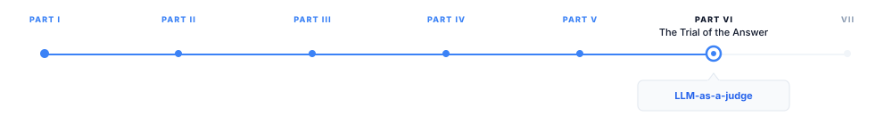

# LLM-as-a-Judge

> **The canonical question for this chapter:**
> *When you use a language model to evaluate another language model, what
> are you actually measuring and what systemic biases make that measurement
> unreliable in ways that are hard to detect?*

---

::: {.callout-note appearance="minimal"}
**Where are we?**

{#fig-progress width="80%"}


Every previous chapter in this part has covered a measurement instrument with 
specific strengths and failure modes. LLM-as-a-judge is the most powerful automated 
evaluation method available and the one that most closely mimics human judgment at 
scale. It is also the one whose failure modes are most subtle, most consequential, 
and least visible without deliberate testing.
:::

---

## The Evaluation Gap That LLM-as-a-Judge Fills

Human evaluation is the ground truth but is slow, expensive, and does not
scale to continuous development cycles. Automated metrics (perplexity,
BLEU, ROUGE, BERTScore) are fast but fail on the dimensions that matter
most for modern language model outputs: open-ended instruction following,
multi-turn coherence, nuanced helpfulness, style appropriateness.

The gap between what humans can assess and what automated metrics can measure
has widened as model capabilities improved. In 2019, a model that produced
grammatically correct text was doing well and BLEU could detect that. In 2025,
frontier models produce fluent, grammatically correct, topically relevant,
well-structured text routinely, and the quality differences between models
lie in subtler dimensions: accuracy of nuanced factual claims, appropriate
epistemic hedging, quality of reasoning chains, helpfulness of explanations
for a specific audience level. None of these dimensions are accessible to
n-gram or embedding metrics.

LLM-as-a-Judge fills this gap by using a capable language model to evaluate 
generated outputs on exactly the dimensions that human evaluators care about. 
The judge reads the prompt and the response (or multiple responses) and produces 
a quality score or a preference judgment, with the same contextual understanding 
and background knowledge that a human evaluator would apply.Although powerful, it 
is also inherently circular in ways that require careful management

---

## Architectures for LLM-as-a-Judge

LLM-as-a-Judge is not a single method but a family of prompting architectures
for eliciting quality judgments from a language model.

### Pointwise Scoring

The simplest architecture: present the judge with a prompt and a single
response, and ask it to rate the response on a specified scale.

```
[System]
You are an expert evaluator of AI assistant responses. Rate the
following response on a scale of 1-10 for helpfulness, where:
1 = completely unhelpful or harmful
5 = partially helpful, significant room for improvement
10 = maximally helpful, addresses the user's need completely

Provide your rating as a single integer followed by a one-sentence
justification.

[User]
Query: {query}
Response: {response}

Rating:
```

Pointwise scoring is simple to implement and produces an absolute quality
score rather than a relative ranking. Its limitation: without a reference
point, the judge's rating scale is uncalibrated. Different judges interpret
"7 out of 10" differently; the same judge may shift its calibration across
evaluation sessions; and the distribution of scores across a test set
may not reflect the distribution of actual quality differences.

### Pairwise Comparison

The judge is presented with two responses to the same prompt and asked
which is better, mirroring the pairwise human evaluation methodology.

```
[System]
You are an expert evaluator of AI assistant responses. Given a user
query and two responses (A and B), determine which response is better.
Consider helpfulness, accuracy, and clarity.

Output only one of: "A", "B", or "Tie"

[User]
Query: {query}
Response A: {response_a}
Response B: {response_b}

Which response is better?
```

Pairwise comparison is more reliable than pointwise scoring for the same
reason it is more reliable in human evaluation: it eliminates scale
calibration and asks a simpler, more anchored question. The judge is
not asked to construct an absolute quality scale, it is asked to choose
between two specific options.

Pairwise comparison is used in MT-Bench, AlpacaEval, and most production
model evaluation pipelines. Its limitation: $O(N^2)$ comparisons are
required to fully rank $N$ models, which becomes expensive at scale.
The Elo rating system (used in Chatbot Arena) and the Bradley-Terry
model convert pairwise comparisons to rankings with far fewer than
$N^2$ comparisons, at the cost of some statistical uncertainty.

### Reference-Guided Scoring

A hybrid: the judge is provided with a reference answer and asked to
evaluate the response relative to it.

```
[System]
You are an expert evaluator. Given a query, a reference answer, and
a model response, score the model response from 1–10 based on how
well it captures the key information in the reference answer, with
full credit for accurate paraphrase and partial credit for partial
coverage.

[User]
Query: {query}
Reference: {reference}
Response: {response}

Score:
```

Reference-guided scoring combines the contextual understanding of LLM-as-a-Judge
with the anchoring of a reference answer, reducing the calibration problem.
Its limitation: the reference ceiling effect from @sec-reference-dependence applies,
a response better than the reference cannot receive full credit, and the
judge must navigate the awkward situation of a response that deviates from
the reference while being factually superior to it.

### Chain-of-Thought Evaluation

Rather than asking the judge for a score directly, instruct it to reason
through the evaluation before producing a score:

```
[System]
Evaluate the following response step by step. First identify what
the query is asking. Then assess whether the response addresses each
component of the query. Note any factual errors, missing information,
or unnecessary content. Finally, provide an overall score from 1–10.

[User]
Query: {query}
Response: {response}
```

Chain-of-thought evaluation improves score reliability by forcing the
judge to articulate its reasoning before committing to a score, similar
to how chain-of-thought prompting improves reasoning accuracy in other
tasks. The reasoning trace also provides a diagnostic: if
the judge's stated reasoning is inconsistent with its score, that is
a signal of judge unreliability on that example.


---

## Systematic Biases in LLM Judges

The power of LLM-as-a-Judge comes with systematic biases that are well-
documented and must be explicitly mitigated. These biases are not random
noise, they are consistent, directional distortions that can change the
apparent ranking between models.

### Position Bias

When presented with two responses in a pairwise comparison, LLM judges
exhibit a preference for the first response, independent of its quality.
This mirrors the position bias observed in human evaluation
but is often stronger and more consistent.


**Mitigation**: present each pair in both orders (A then B, and B then A)
and use the judge's decision only when both orderings agree. Conflicting
judgments (preferred A when A was first, preferred B when B was first)
are treated as ties. This halves the number of usable judgments but
eliminates position bias.

### Verbosity Bias

LLM judges consistently prefer longer responses, independent of whether
the additional length adds value. A response that is twice as long as
an equally good response typically receives higher scores, because length
is a surface cue that the judge associates with thoroughness.


**Mitigation**: length-controlled evaluation adjusts win rates to account
for the length difference between responses. Alternatively,
explicitly instruct the judge to penalize unnecessary length, or truncate
responses to equal lengths before comparison.

### Self-Enhancement Bias

LLM judges from the same model family as the evaluated model tend to
prefer that model's responses. A GPT-4 judge evaluating GPT-4 versus
Claude responses exhibits a systematic preference for GPT-4 responses
beyond what human judges would assign. The same pattern holds for
Claude-as-judge: Claude prefers Claude-generated responses.

This bias arises because models are trained on their own outputs and
on data that reflects their own generation style and value system. When
the judge evaluates a response, it assigns higher scores to responses
that resemble how it would generate the same content, stylistic familiarity
masquerades as quality.


**Mitigation**: use a judge from a different model family than the model
being evaluated. Cross-family evaluation reduces self-enhancement bias
to near-zero. When only one judge is available, report the judge's family
prominently so readers can account for potential bias. Using multiple
judges from different families and averaging or taking the majority
is the most robust approach.

### Sycophancy Toward Confident Responses

LLM judges, like the aligned models described in @sec-sycophancy, exhibit
sycophancy: they give higher scores to responses that express high
confidence, even when the confident response is wrong and a hedged
but correct response would be more appropriate.

A response that says "The answer is definitively X" receives higher
scores from LLM judges than a response that says "I believe the answer
is X, though there is some uncertainty about this", even when both
responses are equally accurate and the hedging in the second is appropriate
given genuine uncertainty. The judge conflates expressed confidence with
answer quality.

**Mitigation**: include explicit calibration instructions in the judge
prompt ("Prefer appropriately hedged responses over overconfident ones
when genuine uncertainty exists") and include examples of appropriately
calibrated responses in few-shot demonstrations.

### Inconsistency Across Similar Queries

LLM judges show inconsistency that human judges do not: the same judge
presented with the same pair of responses on different occasions may
produce different judgments. This inconsistency is not random noise but 
is correlated with query complexity: simple, objective queries produce 
more consistent judgments than subjective, nuanced ones. For complex 
evaluation tasks, this inconsistency bounds the reliability of any single 
pairwise judgment and requires multiple evaluations per pair to obtain 
stable estimates.

**Mitigation**: run multiple evaluations per pair and report the majority
judgment with confidence intervals. For queries where agreement across
multiple evaluations is low, flag these for human review rather than
relying on the automated judgment.

---


## Specialized Judge Models

Rather than using general-purpose models like GPT-5 as judges, several
purpose-built judge models have been developed that are fine-tuned
specifically for evaluation tasks.

### PandaLM

PandaLM [@wang2024pandalm] is a 7B-parameter LLaMA-based model fine-tuned
on a large synthetic dataset of pairwise comparisons with GPT-3.5-generated
judgments. It achieves comparable pairwise judgment quality to GPT-3.5
at substantially lower cost, enabling cheaper high-throughput evaluation.
PandaLM's limitation: it is trained to replicate GPT-3.5's judgments,
not human judgments directly, inheriting GPT-3.5's biases.

### Prometheus

Prometheus [@kim2024prometheus] is a fine-tuned Llama 2 model trained on
feedback data from GPT-4 with explicit scoring rubrics. Unlike general
judge models, Prometheus accepts a custom rubric for each evaluation,
the judge can be told to assess creativity, factual accuracy, code
correctness, or any other specified dimension. This makes Prometheus
adaptable to domain-specific evaluation needs without retraining.


---

## When LLM-as-a-Judge Agrees and Disagrees with Humans

The key empirical question for LLM-as-a-Judge is: how well do its judgments
correlate with human judgments? The answer is nuanced and task-dependent.

### High Agreement Domains

LLM judges agree well with humans (Pearson correlation 0.8–0.9) on:

- **Factual question answering**: both humans and LLM judges can verify
  factual claims and agree on which responses are more accurate
- **Code correctness**: both can assess whether code solves the stated problem
- **Instruction following**: whether explicit formatting and content
  constraints were followed is largely objective
- **Clear quality differences**: when one response is substantially better
  than another, both humans and LLM judges agree

### Low Agreement Domains

LLM judges agree poorly with humans (Pearson correlation 0.4–0.6) on:

- **Creative writing quality**: aesthetic judgments are highly subjective
  and LLM judges exhibit stronger preferences for specific styles than
  humans show consensus on
- **Cultural and contextual appropriateness**: responses appropriate for
  one cultural context may be inappropriate for another; LLM judges
  apply a single cultural lens
- **Nuanced safety assessments**: borderline cases where a response is
  potentially harmful in some contexts but not others produce high
  inter-human disagreement and high LLM-human disagreement
- **Long-form coherence**: evaluating whether a 10,000-word essay is
  coherent requires reading comprehension that strains the judge's
  effective attention, particularly when the judge itself has a limited
  context window

### The Human-in-the-Loop Necessity

These low-agreement domains are not marginal, they include some of the
most important quality dimensions for consumer-facing language model
products. LLM-as-a-Judge should not be used as the sole evaluation method
for creative, culturally sensitive, or safety-critical outputs. Human
evaluation remains necessary for these dimensions, with
LLM-as-a-Judge handling the high-agreement dimensions at scale.


---

## Key Takeaways

- LLM-as-a-Judge fills the gap between slow human evaluation and
  inadequate automated metrics by using a capable model to assess
  the dimensions of quality that n-gram and embedding metrics cannot
  reach: helpfulness, reasoning quality, nuanced accuracy, multi-turn
  coherence.
- Three evaluation architectures exist: pointwise scoring (absolute
  quality rating), pairwise comparison (which of two responses is better),
  and reference-guided scoring (how well does the response match a reference);
  pairwise comparison is most reliable for the same reasons it is more
  reliable in human evaluation.
- Position bias inflates the first response's win rate by approximately
  7 percentage points; mitigation requires presenting each pair in both
  orders and discarding inconsistent judgments.
- Verbosity bias inflates longer responses by 10–15 percentage points
  in raw win rates; length-controlled win rates (LC AlpacaEval) remove
  most of this bias and substantially improve correlation with human
  Chatbot Arena rankings.
- Self-enhancement bias inflates the same-family model's win rate by
  5–15 percentage points; mitigation requires using a judge from a
  different model family than the evaluated model.
- GPT-4 agrees with human expert evaluators approximately 81% of the
  time on MT-Bench; GPT-3.5 agrees approximately 66%; agreement is
  highest on factual and instruction-following tasks and lowest on
  creative and safety-sensitive tasks.
- LLM judges are inconsistent at a rate of approximately 15–20% —
  reversing their preference when the same pair is presented twice;
  multiple evaluations per pair with majority voting reduces this noise.
- MT-Bench uses 80 multi-turn questions evaluated by GPT-4 with chain-
  of-thought reasoning; AlpacaEval 2.0 uses 805 instruction-following
  prompts with length-controlled win rates against a GPT-3.5-class reference.
- Purpose-built judge models (Prometheus, Atla Selene) reduce bias and
  cost relative to GPT-4-as-judge; they are increasingly the practical
  choice for high-volume continuous evaluation.
- LLM-as-a-Judge should complement, not replace, human evaluation for
  creative, culturally sensitive, and safety-critical outputs where
  LLM-human agreement falls below approximately 75%.

---

## Further Reading

- Zheng, L., Chiang, W.-L., Sheng, Y., Zhuang, S., Wu, Z., Zhuang, Y.,
  Lin, Z., Li, Z., Li, D., Xing, E., Zhang, H., Gonzalez, J. E., &
  Stoica, I. (2023). *Judging LLM-as-a-Judge with MT-Bench and Chatbot
  Arena.* NeurIPS. — The foundational LLM-as-a-Judge paper; introduces
  MT-Bench, documents position bias and verbosity bias, and measures
  GPT-4 agreement with human evaluators; the chain-of-thought evaluation
  improvement is the key methodological contribution.

- Dubois, Y., Galambosi, B., Liang, P., & Hashimoto, T. B. (2024).
  *Length-Controlled AlpacaEval: A Simple Way to Debias Automatic
  Evaluators.* arXiv. — Introduces LC win rates and documents the severity
  of verbosity bias in AlpacaEval; the regression analysis of length's
  effect on win rate and the correlation improvement with Chatbot Arena
  are the key contributions.

- Panickssery, A., Bowman, S. R., & Feng, S. (2024). *LLM Evaluators
  Recognize and Favor Their Own Generations.* arXiv. — Systematic
  measurement of self-enhancement bias across model families; the
  cross-family comparison methodology and the finding that same-family
  judges inflate win rates by 5–15 points are the key contributions.

- Kim, S., Shin, S., Cho, S., Lee, J., Kim, Y., Oh, B., Kim, S., & Park, 
  J. (2023). *Prometheus: Inducing Fine-grained Evaluation Capability in 
  Language Models.* ICLR. — Introduces Prometheus and the rubric-conditioned
  evaluation approach; the comparison to GPT-4 as judge on various rubrics
  demonstrates that specialized judge models can approach GPT-4 quality
  at lower cost.

- Wang, Y., Yu, Z., Zeng, Z., Yang, L., Wang, C., Chen, H., Jiang, C.,
  Wang, R., Xie, J., Xie, Q., Liu, Z., Liu, J., & Lin, Y. (2023).
  *PandaLM: An Automatic Evaluation Benchmark for Assessing and Comparing
  Large Language Models.* arXiv. — Introduces PandaLM and the synthetic
  judgment training approach; the cost comparison to GPT-4 evaluation and
  the agreement analysis are the key practical contributions.

- Zeng, Z., et al. (2023). *Evaluating Large Language Models at Evaluating
  Instruction Following.* arXiv. — Systematic analysis of LLM judge
  inconsistency; the 15–20% inconsistency rate finding and the correlation
  with query complexity are the key contributions; the methodology for
  measuring inconsistency via repeated evaluation is directly applicable.

- Shen, T., Jin, R., Huang, Y., Liu, C., Dong, W., Guo, Z., Wu, X.,
  Liu, Y., & Xiong, D. (2023). *Large Language Model Alignment: A Survey.*
  arXiv. — Broader context for LLM-as-a-Judge within the alignment pipeline;
  the RLAIF section connects LLM evaluation to the training signal discussion
  in Chapter 36.

- Ye, S., Kulshreshtha, S., Gao, S., Arous, I., & Faltings, B. (2024).
  *Justice or Prejudice? Quantifying Biases in LLM-as-a-Judge.* arXiv.
  — Comprehensive bias audit of LLM judges across position, verbosity,
  style, and self-enhancement dimensions; the mitigation effectiveness
  analysis for each bias is the key practical contribution.

---
