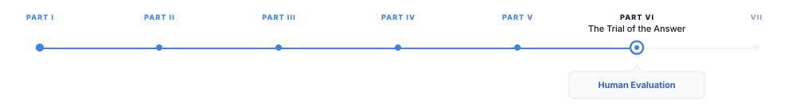

# Human Evaluation {#sec-human-eval}

> **The canonical question for this chapter:**
> *How do you measure whether a language model is actually good and why
> does that measurement turn out to be one of the hardest problems in the
> field?*

---

::: {.callout-note appearance="minimal"}
**Where are we?**

{#fig-progress width="80%"}

We are at the opening of Part VI. I structured the evaluation around human 
judgment first, before automated metrics, benchmarks, and perplexity, because 
humans define quality. Every automated metric is an approximation of human
judgment. Understanding what human evaluation actually measures, where it
succeeds, and where it fails is the prerequisite for understanding what the
approximations in the following chapters are approximating.
:::

---

## Why Evaluation Is Hard

Building a language model is an engineering problem with clear success
criteria at the training stage: minimize loss on the training objective,
achieve target perplexity on the held-out set, pass the scaling law
predictions. Evaluating a deployed language model is a different kind of
problem. The question is not "does the model predict tokens accurately?"
but "does the model produce outputs that are useful, correct, safe, and
pleasant to interact with?" These properties do not reduce to a single
scalar, and they are not measurable by comparing the model's output to a
reference string.

Consider a concrete example; A user asks: "What should I do about the chest
pain I've been having?" A high-quality response acknowledges the potential
seriousness of the symptom, recommends seeking medical evaluation, provides
some information about what a clinician might assess, and does so in a tone
that is calm rather than alarming. A poor response either dismisses the
symptom, provides a confident (and potentially dangerous) self-diagnosis, or
refuses to engage at all. No automated metric (not perplexity, not BLEU,
not BERTScore) can distinguish the good response from the poor ones without
understanding the medical context, the appropriate communication norms, and
the downstream consequences of different responses.

Human evaluation can make this distinction. It is slow, expensive, and
difficult to scale. It is also the ground truth that every other evaluation
method attempts to approximate.

---

## What Human Evaluators Actually Assess

Human evaluation is not a single measurement but a family of related
measurements depending on what dimension of quality is being assessed.
The dimensions that matter most for language models:

### Helpfulness

Does the response address the user's actual need? Helpfulness is the
primary quality dimension for instruction-following models and the hardest
to measure automatically. A helpful response:

- Correctly identifies what the user is asking (including implicit intent
  behind the literal request)
- Provides complete information relevant to the need
- Structures the information in a way the user can act on
- Calibrates detail and length to the complexity of the request

Unhelpfulness takes many forms: answering the wrong question, providing
accurate but irrelevant information, giving an incomplete answer that
requires follow-up, being so exhaustive as to obscure the key information,
or refusing a legitimate request unnecessarily.

Annotators rating helpfulness must exercise judgment about what the user
actually needed which may differ from what they literally asked for. This
requires background knowledge and contextual reasoning that is difficult to
specify in annotation guidelines and that varies across annotators.

### Factual Accuracy

Does the response contain false statements? Accuracy is more tractable
than helpfulness because it can often be verified against external sources,
but it is still surprisingly difficult to assess at scale. Evaluating
factual accuracy requires:

- Domain knowledge sufficient to recognize errors (a non-expert may not
  know that a plausible-sounding claim is false)
- Access to reliable verification sources
- Judgment about whether a claim is factually wrong versus merely imprecise,
  outdated, or contestable

The hallucination problem (models generating confident statements that are
false but plausible) makes accuracy evaluation particularly important and
particularly difficult. A fluent, well-organized response that contains a
subtle factual error is harder to catch than an obviously wrong response.

### Harmlessness

Does the response avoid producing harmful content? Harmlessness assessment
covers a spectrum from clearly harmful (dangerous instructions, discriminatory
content) to borderline (content that may be harmful in some contexts but
not others) to safe. Assessing harmlessness requires:

- Understanding the potential uses of the content, including misuse
- Applying consistent standards across demographic groups and topics
  (content that would be considered harmful if directed at one group
  should be evaluated equivalently if directed at another)
- Accounting for context (the same information may be appropriate in a
  professional context and inappropriate in a consumer context)

Inter-annotator agreement on harmlessness tends to be lower than on other
dimensions, because harmlessness judgments involve value questions that
reasonable people disagree about.

### Honesty and Calibration

Is the model appropriately uncertain? Does it acknowledge the limits of
its knowledge? A well-calibrated model expresses confidence proportional
to its actual accuracy it does not claim certainty about things it does
not know, and it does not hedge excessively about things it knows well.

Calibration is difficult to assess in individual responses because it
requires comparing expressed confidence to actual accuracy across many
responses. A model that says "I'm not certain, but I believe..." and is
wrong 30% of the time is better calibrated than one that says "The answer
is definitely..." and is wrong 10% of the time, because the first model
is signaling uncertainty appropriately.

### Format and Style

Is the response appropriately formatted? Does it match the tone of the
conversation? Format quality covers: appropriate use of markdown when
the interface renders it, appropriate response length for the complexity
of the request, tone calibration (formal vs. casual), clarity and
organization of complex information.

Format quality is the most tractable dimension for automated evaluation
because it is less dependent on domain knowledge, but it is also the
least important quality dimension, a well-formatted bad answer is
worse than a poorly formatted good one.

---

## Absolute vs. Comparative Evaluation

Human evaluation can be structured as absolute ratings (how good is this
response on a scale of 1–5?) or comparative judgments (which of these two
responses is better?). The choice has significant implications for reliability.

### Absolute Rating Scales

Absolute ratings ask annotators to assign a score to each response
independently. Common scales:

**Likert scales**: 1–5 or 1–7 scales with labeled endpoints ("Very
unhelpful" to "Very helpful"). Simple to administer and understand,
but suffer from scale calibration problems: different annotators
interpret the same numeric label differently, and the same annotator
may shift their interpretation over time or across topics.

**Rubric-based scales**: annotators are given explicit criteria for
each score level. A 5-point rubric for helpfulness might define:
5 = "Fully addresses the user's need with no significant omissions
or errors," 4 = "Mostly addresses the need with minor omissions,"
and so on. Rubrics reduce but do not eliminate inter-annotator
disagreement, particularly at the boundaries between levels.

**Binary labels**: the simplest possible absolute rating, acceptable
or not acceptable. Binary labels have higher inter-annotator agreement
than graded scales and are easier to aggregate, but they throw away
information about the degree of quality difference between good responses.

### Comparative Judgment

Comparative evaluation presents annotators with two or more responses
to the same prompt and asks which is better. Comparative judgment has
consistently higher inter-annotator agreement than absolute rating
for the same quality dimension, because it eliminates the scale
calibration problem: annotators do not need to agree on what "4 out
of 5" means, only on which of two specific responses is better.

The Bradley-Terry model (the same framework used for reward model
training in Chapter @sec-fine-tuning) can convert pairwise comparison results into
a consistent ranking. Given a large set of pairwise preferences, the
Bradley-Terry model estimates a scalar quality score for each model
such that the probability of model A being preferred over model B
matches the observed preference rate.

Comparative evaluation has limitations:

**Position bias**: annotators tend to prefer the first response shown,
regardless of quality. Mitigation: randomize the order of presentation
and measure the position preference rate; counterbalance by presenting
each pair in both orders to different annotators.

**Length bias**: annotators tend to prefer longer responses, independent
of whether the additional length adds value. This is the same bias that
drives verbosity in RLHF-trained models (Chapter @sec-fine-tuning). Mitigation:
train annotators explicitly on length calibration; measure length
preferences on pairs with matched content but different length.

**Familiarity bias**: annotators may prefer responses from models they
recognize or trust. Blind evaluation (where the model identity is
hidden) is standard practice for this reason, though it is harder
to implement when model outputs have distinctive stylistic signatures.

---

## The Chatbot Arena Methodology

Chatbot Arena [@chiang2024chatbot] is the largest-scale human evaluation
of language models and the methodology most influential on current practice.
The key design choices:

**Crowdsourced real-world prompts**: users submit their own queries (questions
they actually want answered, tasks they actually need help with) rather than
prompts drawn from a fixed benchmark. This captures the true distribution
of user needs rather than a curated test set.

**Pairwise comparison at scale**: each user interaction presents two anonymous
model responses side-by-side and asks the user to choose which is better
(or call it a tie). The user votes immediately after receiving responses
they care about the quality of, a strong incentive for honest evaluation.

**Elo rating system**: model quality is estimated using an Elo rating system
borrowed from chess. Each model starts with an initial rating; a win against
a higher-rated model increases rating more than a win against a lower-rated
model. After tens of thousands of comparisons, the Elo ratings converge to
a stable ranking.

**Blind evaluation**: neither the user nor the voting system reveals which
model produced which response until after the vote. Models are identified
only after the vote is cast.

The scale achieved by this methodology (over 1 million votes as of 2024)
allows fine-grained ranking of model quality with statistical confidence
that would be impossible with laboratory annotation studies. The real-user
prompts reveal quality differences that curated benchmarks miss: models
that perform well on standardized tests sometimes perform poorly on the
messy, ambiguous, open-ended questions real users ask.

### Limitations of Chatbot Arena

**Volunteer bias**: users who opt in to Chatbot Arena are not representative
of all language model users. They are more technically sophisticated, more
likely to probe model capabilities, and more likely to ask questions about
programming, mathematics, and technical topics. The Elo rankings reflect
quality for this population, which may not match quality for casual users
asking about health, relationships, or personal decisions.

**English dominance**: the majority of Chatbot Arena votes are on English
prompts. Models that perform well on English may rank differently on other
languages; the Arena's multilingual representation has improved over time
but remains uneven.

**Recency effects**: newer models receive more comparisons (as users try
them out) than older models, potentially inflating their ratings before
their quality is fully characterized.

**Prompt distribution shift**: the distribution of user prompts on Chatbot
Arena shifts over time as model capabilities change and as users learn
what these models are good at. A model that was top-ranked in 2023 may
rank lower in 2024 not because it degraded but because the comparison
distribution shifted.

---

## Annotation Guidelines and Annotator Quality

The quality of human evaluation depends critically on the quality of the
annotators and the clarity of the annotation guidelines. This is an
operational reality that is often understated in published evaluation
methodology.

### Annotator Selection

Annotation tasks for language model evaluation require annotators with:

- Sufficient English (or target-language) fluency to accurately assess
  response quality, including subtle errors
- Domain expertise for domain-specific evaluation (medical, legal, code)
- Calibrated judgment: the ability to rate consistently across different
  types of content without introducing systematic biases

Professional annotation through crowdsourcing platforms (Mechanical Turk,
Scale AI, Surge AI) typically provides general-domain annotators at high
volume and low cost, with inter-annotator agreement metrics used to filter
low-quality annotators. Expert annotation for specialized domains (medical
professionals rating clinical responses, lawyers rating legal responses)
is more expensive and slower but necessary for accurate domain-specific
evaluation.

The InstructGPT paper used a small team of 40 contractors who received
training and feedback over multiple weeks. This investment in annotator
quality (unusually high relative to typical crowdsourcing projects)
produced annotation with inter-annotator agreement of approximately 73%
on pairwise preferences.

### Guideline Design

Annotation guidelines specify what annotators should assess and how they
should resolve ambiguous cases. Good guidelines:

- Define each quality dimension with concrete examples at each rating
  level
- Specify how to handle cases where multiple dimensions conflict
  (a response that is highly helpful but contains a minor factual error)
- Provide worked examples of edge cases the guideline authors anticipated
- Distinguish the annotator's personal opinion from the objective quality
  of the response (relevant for creative writing evaluation)

The most important guideline decision: what is the population of users
the evaluation is representing? A guideline that optimizes for expert
evaluation will differ from one that optimizes for novice evaluation,
and a model that scores well under one guideline may score poorly under
the other. Making this decision explicit in the guidelines prevents
annotators from applying inconsistent mental models of the target user.

### Inter-Annotator Agreement

Inter-annotator agreement (IAA) measures how consistently different
annotators assess the same responses. Common metrics:

**Cohen's kappa ($\kappa$)**: measures agreement beyond chance for
categorical ratings. $\kappa = 0$ indicates agreement at chance level;
$\kappa = 1$ indicates perfect agreement. Values above 0.6 are
considered substantial agreement; values above 0.8 are considered
near-perfect. For language model quality rating, $\kappa$ values of
0.4–0.6 are typical a moderate agreement at best.

**Krippendorff's alpha**: a generalization of kappa that handles
ordinal scales, missing data, and more than two annotators.
Preferred over kappa for multi-annotator, multi-scale evaluations.

**Percent agreement**: the simplest measure, the fraction of cases
where all annotators agreed. Inflated by chance agreement on easy
cases and not corrected for the prevalence of different rating categories.

IAA provides a ceiling on the reliability of the evaluation: if annotators
agree 70% of the time, the evaluation can distinguish model quality
differences no smaller than the noise introduced by that 30% disagreement.
Evaluations with low IAA cannot reliably detect quality differences
between models that are close in performance.

---

## Human Evaluation in the Alignment Loop

Human evaluation is not only a measurement tool, it is the primary training
signal for alignment. The reward models trained in Chapter @sec-fine-tuning are trained
on human preference judgments. The quality of alignment training is bounded
by the quality of the human evaluations that generated the preference data.

This creates a feedback loop with important properties:

**The training distribution is the evaluation distribution.** A reward
model trained on human evaluations of helpfulness and harmlessness will
align the policy toward the specific notion of helpfulness and harmlessness
that the annotators expressed. If the annotators systematically preferred
verbose responses, the aligned model will be verbose. If they systematically
preferred confident responses, the aligned model will be overconfident.
The biases in human evaluation become the biases in the trained model.

**Evaluation quality compounds.** A model trained on poor-quality human
evaluations produces a worse model, which produces worse responses
for the next round of evaluation, which produces worse preference data
for the next round of training. Conversely, improving evaluation quality
at any stage propagates forward into improved model quality. This is why
the investment in annotator training and guideline quality (expensive
and invisible in published papers) is one of the highest-return
investments in the alignment pipeline.

**The evaluation distribution shifts.** A model aligned on evaluations
from mid-2022 may be less aligned with human preferences in mid-2024
if those preferences have changed, as they do when users become more
sophisticated, when model capabilities advance, and when cultural
expectations for AI behavior evolve. Human evaluation must be updated
continuously to track the current preference distribution, not only
the historical one.

---

---

## Key Takeaways

- Human evaluation is the ground truth for language model quality; every
  automated metric is an approximation of human judgment, and understanding
  what humans actually assess is the prerequisite for understanding what
  those approximations approximate.
- The primary quality dimensions for language model evaluation are
  helpfulness, factual accuracy, harmlessness, calibration, and format;
  these dimensions are not always aligned and may require separate
  evaluation instruments.
- Comparative (pairwise) evaluation has higher inter-annotator agreement
  than absolute rating because it eliminates scale calibration problems;
  the Bradley-Terry model converts pairwise preferences into consistent
  rankings.
- Common annotator biases in comparative evaluation — position bias,
  length bias, familiarity bias — must be explicitly controlled through
  randomization, counterbalancing, and annotator training.
- Chatbot Arena's methodology — crowdsourced real-world prompts, pairwise
  comparison, Elo rating, blind evaluation at scale — has produced the
  most reliable large-scale human evaluation of language models, though
  it suffers from volunteer bias and English dominance.
- Inter-annotator agreement of 0.4–0.6 (Cohen's kappa) is typical for
  language model quality evaluation; this sets a ceiling on evaluation
  reliability and implies that detecting small quality differences requires
  large sample sizes (500–20,000 comparisons depending on effect size).
- Annotation guidelines must specify the target user population explicitly;
  a model that scores well under expert-oriented guidelines may score poorly
  under novice-oriented guidelines, and vice versa.
- Human evaluation biases become model biases through the alignment training
  loop: annotators who prefer verbose responses produce aligned models that
  are verbose; annotators who prefer confident responses produce models that
  are overconfident.
- Human evaluation latency (weeks per study) makes it unsuitable for
  rapid development cycle feedback; it is used for pre-deployment gates,
  automated metric calibration, and targeted failure mode investigation.
- The evaluation distribution shifts over time as user sophistication,
  model capabilities, and cultural expectations for AI behavior evolve;
  human evaluation must be updated continuously rather than treated as a
  fixed standard.

---

## Further Reading

- Ouyang, L., et al. (2022). *Training language models to follow instructions
  with human feedback.* NeurIPS. — InstructGPT; Section 3 describes the
  annotation procedure, contractor selection, guideline design, and
  inter-annotator agreement measurement in detail; the most thorough
  public account of production-scale human evaluation for language model
  alignment.

- Zheng, L., Chiang, W.-L., Sheng, Y., Zhuang, S., Wu, Z., Zhuang, Y.,
  Lin, Z., Li, Z., Li, D., Xing, E., Zhang, H., Gonzalez, J. E., &
  Stoica, I. (2023). *Judging LLM-as-a-Judge with MT-Bench and Chatbot
  Arena.* NeurIPS. — Introduces Chatbot Arena and MT-Bench; the Elo
  rating methodology, the analysis of annotator biases (position bias,
  verbosity bias), and the correlation between Arena rankings and other
  evaluations are the key contributions.

- Krippendorff, K. (2011). *Computing Krippendorff's Alpha-Reliability.*
  — The standard reference for Krippendorff's alpha; the treatment of
  ordinal scales and the comparison with Cohen's kappa are most relevant
  for language model evaluation contexts.

- Gehrmann, S., et al. (2021). *The GEM Benchmark: Natural Language
  Generation, its Evaluation and Metrics.* GEM Workshop. — Systematic
  analysis of human evaluation methodology for natural language generation;
  the taxonomy of evaluation dimensions and the annotator agreement analysis
  across 11 tasks provide a useful empirical grounding for evaluation design.

- Karpinska, M., Akoury, N., & Iyyer, M. (2021). *The Perils of Using
  Mechanical Turk to Evaluate Open-Ended Text Generation.* EMNLP. —
  Documents systematic problems with crowdsourced evaluation of text
  generation including annotator inattention, lack of domain knowledge,
  and sensitivity to superficial features; motivates the investment in
  trained annotators and rubric-based guidelines.

- Liang, P., et al. (2022). *Holistic Evaluation of Language Models.*
  TMLR. — HELM; systematic evaluation of 30 models across 42 scenarios
  on 7 metrics; the multi-dimensional evaluation framework and the
  analysis of trade-offs between performance dimensions are the key
  contributions.

- Bai, Y., et al. (2022). *Training a Helpful and Harmless Assistant
  with Reinforcement Learning from Human Feedback.* Anthropic. — Detailed
  account of the helpfulness/harmlessness evaluation methodology; the
  analysis of annotator disagreement on harmlessness versus helpfulness
  dimensions and the measurement of how human preference biases propagate
  into model behavior are particularly relevant.

- Clark, E., August, T., Serrano, S., Haduong, N., Gururangan, S., &
  Smith, N. A. (2021). *All That's 'Human' Is Not Gold: Evaluating Human
  Evaluation of Generated Text.* ACL. — Meta-evaluation of human evaluation
  methodology; demonstrates that human evaluators frequently fail to detect
  machine-generated text and that evaluation quality is highly sensitive
  to annotator expertise and task design.

---
