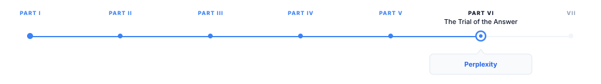

# Perplexity

> **The canonical question for this chapter:**
> *What does perplexity actually measure, when is it a useful proxy for
> model quality, and when does it mislead you completely?*

---

::: {.callout-note appearance="minimal"}
**Where are we?**

{#fig-progress width="80%"}

This chapter covers perplexity which is the oldest and most theoretically 
grounded language model metric, directly derived from the training objective 
itself. It is also the metric most frequently misused, misinterpreted, and 
miscompared across models.
:::

---

## From Loss to Perplexity

Perplexity is not a separate measurement from training loss. It is a
transformation of the same quantity (cross-entropy loss) into a more
interpretable unit. Understanding perplexity begins with understanding
what the training loss measures and why the exponential transformation
is applied.

Recall from @sec-training-objective that the causal language modeling loss for a
sequence of $T$ tokens is the mean negative log-probability of each
token given its preceding context:

$$
\mathcal{L} = -\frac{1}{T} \sum_{t=1}^{T} \log_2 P_\theta(x_t \mid x_1, \ldots, x_{t-1})
$$

This quantity is measured in bits when the logarithm is base 2, and in
nats when the logarithm is the natural logarithm. It represents the average
number of bits (or nats) of surprise the model experiences per token:
the lower the loss, the more accurately the model predicts the next token,
the less surprised it is by the actual sequence.

Perplexity is the exponentiation of this average loss:

$$
\text{PPL} = 2^{\mathcal{L}} = 2^{-\frac{1}{T} \sum_{t=1}^{T} \log_2 P_\theta(x_t \mid x_1, \ldots, x_{t-1})}
$$

or equivalently in natural logarithm form:

$$
\text{PPL} = \exp\left(-\frac{1}{T} \sum_{t=1}^{T} \log P_\theta(x_t \mid x_1, \ldots, x_{t-1})\right)
$$

The two formulations are equivalent up to the choice of logarithm base,
but they produce different numerical values. A loss of 2.0 nats corresponds
to perplexity $e^{2.0} \approx 7.39$; a loss of 2.0 bits corresponds to
perplexity $2^{2.0} = 4.0$. Published perplexity values must specify which
base is used, though the natural logarithm is more common in modern work.

---

## The Branching Factor Interpretation

The appeal of the perplexity transformation is the branching factor
interpretation: perplexity approximates the effective vocabulary size
the model is choosing from at each step. A perplexity of 10 means the
model is, on average, as uncertain as if it were choosing uniformly
among 10 equally likely options.

More precisely: if a model assigns equal probability $1/K$ to each of
$K$ candidates at every position and zero probability to all others, its
perplexity is exactly $K$. Real models do not assign equal probabilities,
but the perplexity captures the effective branching factor of the
probability distribution:

$$
\text{PPL} = \exp(H) = \exp\left(-\sum_x P(x) \log P(x)\right)
$$

where $H$ is the entropy of the distribution. High entropy (many plausible
continuations, uncertainty spread across many tokens) produces high
perplexity. Low entropy (one or a few plausible continuations, most
probability mass on one token) produces low perplexity.

A concrete example. Consider the prompt "The sky is". The word "blue"
is highly probable; "clear", "dark", "grey", "overcast" are moderately
probable; tens of thousands of other tokens have negligible probability.
If the model assigns probability 0.7 to "blue" and distributes the
remaining 0.3 across a handful of alternatives, the effective branching
factor at this position is low, perhaps 2 or 3. Now consider the prompt
"She opened the". Thousands of nouns are plausible completions: "door",
"window", "letter", "box", "file", "book" all have substantial probability,
and the distribution is relatively flat. The effective branching factor at
this position is high, perhaps 30 or 40. Averaged across a diverse corpus,
a well-trained LLM achieves perplexity in the range of 5-15 on typical
English text, meaning it is, on average, choosing from an effective
vocabulary of 5-15 equally likely options.

---

## Perplexity as a Model Quality Metric

Perplexity is a direct measure of how well a model has learned the
statistical structure of its evaluation corpus. Lower perplexity means
the model's probability distributions are better calibrated to the
actual distribution of the text, the model is less surprised by what
it reads, because it has learned to assign higher probability to likely
continuations.

This makes perplexity a clean proxy for one specific dimension of model
quality: distributional accuracy over the evaluation domain. In domains
where this dimension is the primary concern like language modeling research,
comparing model architectures, or measuring the effect of training data
changes on the same architecture, perplexity is informative and reliable.

### Perplexity Tracks Architecture and Training Improvements

Within a fixed model family and evaluation corpus, perplexity reliably
reflects architectural and training improvements. Switching from post-LN
to pre-LN normalization, from fixed positional embeddings to RoPE,
from vanilla attention to GQA, or from a standard FFN to SwiGLU; all
of these produce measurable perplexity reductions that predict improved
downstream performance. The correlation between perplexity reduction
and downstream task improvement within a model family is strong enough
that perplexity is used as the primary signal for ablation studies during
model development.

### Perplexity and Scaling Laws

Since perplexity is a monotone transformation of loss, all scaling law
relationships hold equivalently in perplexity space. The Chinchilla
parametric loss model:

$$
L(N, D) = E + \frac{A}{N^\alpha} + \frac{B}{D^\beta}
$$

predicts perplexity as $\text{PPL}(N, D) = e^{L(N, D)}$. The irreducible
entropy $E \approx 1.69$ nats corresponds to a perplexity floor of
$e^{1.69} \approx 5.4$, the perplexity a perfect model would achieve
on the Chinchilla evaluation corpus, representing the inherent
unpredictability of natural language.

The relationship between scaling and perplexity is nonlinear due to
the exponential transformation: a constant reduction in loss produces
a proportionally larger reduction in perplexity at low perplexity
values than at high ones. Moving from loss 3.0 to 2.5 reduces
perplexity from $e^3 = 20.1$ to $e^{2.5} = 12.2$, a reduction of
7.9. Moving from loss 2.0 to 1.5 reduces perplexity from $e^2 = 7.4$
to $e^{1.5} = 4.5$, a reduction of only 2.9, despite the same 0.5 nat
loss reduction. This nonlinearity is why perplexity improvements at the
frontier are harder to achieve and harder to interpret than the raw
numbers suggest.

---

## When Perplexity Fails as a Metric

Perplexity's theoretical cleanliness is undercut by three practical
failure modes that make it unreliable for the comparisons most commonly
attempted in practice.

### Failure 1: Tokenizer Dependence

Perplexity is not comparable across models with different tokenizers.
This is the most important limitation and the most frequently violated
assumption in published comparisons.

To see why, consider two models evaluating the same English text. Model A
uses a 32,000-token vocabulary (LLaMA 2 style) and the text tokenizes
into 1,000 tokens. Model B uses a 100,000-token vocabulary (GPT-4 style)
and the same text tokenizes into 750 tokens, fewer tokens because the
larger vocabulary has single-token representations for more common words
and subwords.

Model A's perplexity is computed over 1,000 prediction steps. Model B's
perplexity is computed over 750 prediction steps. Model B's individual
prediction steps are harder on average (predicting a whole word at once
is harder than predicting a subword) but it has fewer of them. The
resulting perplexity numbers are not on the same scale and cannot be
directly compared.

The correct unit for cross-tokenizer comparison is bits per byte (BPB)
or bits per character (BPC): the average number of bits the model uses
to encode each byte or character of the evaluation text, regardless of
how the text was tokenized. Converting to BPB:

$$
\text{BPB} = \frac{\mathcal{L}_{\text{bits}} \cdot T_{\text{tokens}}}{B_{\text{bytes}}}
$$

where $\mathcal{L}_{\text{bits}}$ is loss in bits per token, $T_{\text{tokens}}$
is the number of tokens in the evaluation text, and $B_{\text{bytes}}$ is
the number of bytes in the evaluation text. BPB normalizes out the tokenizer
compression ratio, making comparison valid across model families.

A well-trained modern language model achieves approximately 0.9-1.1 BPB
on standard English text. The range across architectures and training
scales is narrow, BPB is a more compressed metric than perplexity and
shows less variance across model families than raw perplexity numbers
suggest.

### Failure 2: Domain Mismatch

Perplexity is a property of the model evaluated on a specific corpus.
A model trained primarily on web text will have low perplexity on web
text and high perplexity on clinical notes, legal contracts, or
19th-century literature, not because the model is incapable of
processing these domains, but because it has not learned their specific
statistical regularities. Comparing the perplexity of a general web-trained
model to the perplexity of a domain-specific model on a domain-specific
test set confounds model quality with domain specialization.

This failure mode is common in practice. A model finetuned on medical
text achieves lower perplexity on medical test sets than a general model
of equal or greater general capability. The perplexity comparison suggests
the fine-tuned model is better; the actual comparison is domain-adapted
model versus general model on a domain-specific test, which tells you
about domain adaptation, not overall quality.

The mitigation: perplexity comparisons are valid only when both models
are evaluated on the same corpus and that corpus matches the domain of
intended use. A general capability comparison requires a diverse evaluation
corpus covering multiple domains; a domain-specific comparison requires
a corpus from that domain.

### Failure 3: Length and Context Effects

Perplexity is sensitive to the context length at which it is measured.
A model evaluated with 2,048 tokens of context achieves lower perplexity
than the same model evaluated with 512 tokens of context, because more
context provides more information for predicting each subsequent token.
Perplexity measured with different context lengths is not comparable.

This matters for comparing models with different context window sizes.
A model with a 128,000-token context window may achieve lower perplexity
on long documents than a model with a 4,096-token context window, not
because of any intrinsic quality difference, but because it can condition
on more preceding context. Controlling for context length is necessary
for valid perplexity comparison.

The stride evaluation procedure addresses this by evaluating perplexity
with a sliding window: evaluate each position with exactly $c$ tokens
of preceding context (not the full preceding sequence), keeping the
context length constant. This eliminates the context length effect
but introduces edge effects at the beginning of documents where less
than $c$ tokens are available.

---

## Perplexity and Downstream Task Performance

A persistent question in language model evaluation: does lower perplexity
predict better downstream task performance? The answer is nuanced and
depends heavily on the comparison being made.

### Within a Model Family

Within a model family like same architecture, same tokenizer, same training
data distribution, varying only in scale or training duration, perplexity
is a reliable predictor of downstream task performance. Models with lower
perplexity on the pretraining distribution consistently score higher on
knowledge benchmarks, reasoning tasks, and instruction following. This
is the basis for using perplexity as the primary metric in ablation
studies and scaling law measurements.

### Across Model Families

Across model families, the correlation between perplexity and downstream
task performance is weaker and sometimes inverted. A model fine-tuned on
instruction data achieves higher perplexity on raw web text (because the
distribution shift from raw text to instruction data is reflected in
higher loss on the original distribution) while performing substantially
better on instruction-following benchmarks. The fine-tuned model is
better at the thing you want it to do and worse on the metric you might
use to evaluate it.

Similarly, models trained with different objectives (CLM versus MLM,
or a model with additional auxiliary losses) may have different perplexity
values while achieving similar downstream performance. The relationship
between perplexity and task performance is mediated by the training
objective: perplexity measures how well the model has learned the
training objective's distribution, not directly how well it performs
any downstream task.

### The Calibration Connection

Low perplexity is associated with good calibration in a specific sense:
a well-calibrated model should be more uncertain (higher entropy, higher
local perplexity) on hard examples and less uncertain (lower entropy,
lower local perplexity) on easy examples. A model that achieves low
average perplexity by being uniformly wrong on hard examples while being
correct on easy ones is better calibrated than one that achieves the same
average by being randomly wrong across the whole distribution.

Perplexity does not directly measure calibration in the ECE sense (whether
expressed probability matches empirical accuracy). A model can have low
perplexity while being systematically miscalibrated, expressing 90%
confidence on questions it answers correctly only 60% of the time.
Calibration requires comparing predicted probabilities to observed
accuracy, which perplexity alone cannot do.

---

## Practical Uses of Perplexity

Despite its limitations for cross-model comparison, perplexity is
genuinely useful in several practical contexts.

### Development-Time Ablation Studies

During model development, perplexity on a held-out validation set is
the primary signal for comparing architectural variants, training
hyperparameters, and data mixture choices. Within a single development
run (same architecture, same tokenizer, same data pipeline) perplexity
comparisons are valid and fast. A 1% perplexity reduction from a
normalization change is informative even if it does not translate directly
to a benchmark improvement, because within-family perplexity reliably
predicts downstream performance.

### Detecting Training Instability

Training loss curves (equivalently, perplexity curves) are the primary
instrument for detecting training instability. Loss spikes (sudden
increases in training loss followed by partial recovery) indicate
numerical instability, data pipeline errors, or gradient explosion.
A loss that fails to decrease over many steps indicates learning rate
problems, data issues, or architectural errors. Monitoring perplexity
continuously during training and setting automated alerts on anomalous
loss behavior is standard practice in large-scale training runs.

### Evaluating Domain Adaptation

Domain-specific perplexity measures how well a model has internalized
a target domain's statistical structure. After continued pretraining on
medical text, evaluating perplexity on a held-out medical corpus tracks
whether domain adaptation is proceeding correctly. This is a valid
within-distribution comparison: the same corpus, the same tokenizer,
model parameters changing.

### Text Quality Filtering

Perplexity from a reference language model can be used as a text quality
filter for training data. Low-perplexity text is text the reference model
finds predictable and well-structured, typical of fluent, coherent
writing. High-perplexity text may indicate: garbled OCR output, code
or markup mixed with prose, non-English text evaluated by an English
model, or genuinely unusual content. Filtering out high-perplexity text
removes document types that may degrade training quality.

---

## Perplexity in Production

Beyond development and evaluation, perplexity surfaces in production
systems in two ways:

### Detecting Distribution Shift

If the model's perplexity on incoming user queries increases over time,
this is a signal that the query distribution has shifted away from the
training distribution. Production monitoring of average query perplexity,
computed efficiently using the model's own log-probability outputs,
which are already calculated during inference, provides an early warning
system for distribution shift without requiring human evaluation.

### Logprobs for Downstream Applications

The log-probabilities that underlie perplexity are exposed through
model APIs and enable several production applications:

**Ranking candidates**: given multiple candidate completions, rank them
by the model's log-probability to select the most likely according to
the model's learned distribution. Used in constrained generation,
reranking pipelines, and structured output generation.

**Anomaly detection**: flag inputs that receive unusually high perplexity
(the model finds them very surprising), which may indicate adversarial
inputs, distribution-shifted queries, or content that the model cannot
handle reliably.

**Confidence estimation**: the entropy of the model's token-level
distribution at the final position provides a rough confidence estimate
for the response, high entropy suggests the model is uncertain, low
entropy suggests confidence. This is an imperfect calibration signal
but a zero-cost one.

---

## Key Takeaways

- Perplexity is the exponentiation of cross-entropy loss: $\text{PPL} =
  e^{\mathcal{L}}$; it is the same information as loss, transformed
  into a branching-factor interpretation where PPL represents the
  effective number of equally likely choices the model faces at each step.
- A perfect model's perplexity floor is approximately $e^{1.69} \approx
  5.4$ on the Chinchilla evaluation corpus, representing the irreducible
  entropy of natural language.
- Perplexity is not comparable across models with different tokenizers;
  a model with a larger vocabulary tokenizes the same text into fewer
  tokens with harder predictions per token, producing incomparable numbers;
  bits per byte (BPB) is the correct cross-tokenizer comparison unit.
- Well-trained modern language models achieve approximately 0.9–1.1 BPB
  on standard English text, a much narrower range than raw perplexity
  numbers suggest.
- Domain mismatch invalidates perplexity comparisons: a domain-adapted
  model achieves lower perplexity on domain text than a general model
  of equal or greater general capability, because perplexity measures
  fit to the evaluation distribution, not general quality.
- Context length affects perplexity: models evaluated with more preceding
  context achieve lower perplexity; comparisons are only valid when
  context length is held constant.
- Within a model family, perplexity reliably predicts downstream task
  performance and is the primary signal for ablation studies; across model
  families (different tokenizers, objectives, or fine-tuning), the
  correlation weakens and can invert.
- Perplexity-based text filtering — discarding high-perplexity documents
  from web crawls — was used in CCNet, LLaMA, and other training pipelines
  to improve training data quality.
- Production uses of perplexity: detecting distribution shift in query
  traffic, ranking candidate completions, anomaly detection on unusual
  inputs, and zero-cost confidence estimation via token distribution entropy.
- The correct interpretation of a published perplexity number is
  "cross-entropy loss exponentiated, measured on this specific corpus
  with this specific tokenizer at this specific context length" — not
  "how good the model is" in any general sense.

---

## Further Reading

- Wenzek, G., Lachaux, M.-A., Conneau, A., Chaudhary, V., Guzmán, F.,
  Joulin, A., & Grave, E. (2020). *CCNet: Extracting High Quality
  Monolingual Datasets from Web Crawl Data.* LREC. — Introduces
  perplexity-based filtering for web crawl data; the filtering pipeline
  and the quality analysis before and after filtering are the key
  contributions; used as the basis for LLaMA training data preparation.

- Hoffmann, J., et al. (2022). *Training Compute-Optimal Large Language
  Models.* NeurIPS. — Chinchilla; the parametric loss model
  $L(N,D) = E + A/N^\alpha + B/D^\beta$ and the irreducible entropy
  $E \approx 1.69$ nats are introduced here; the BPB analysis in the
  appendix is the clearest published treatment of cross-tokenizer
  perplexity normalization.

- Press, O., Smith, N. A., & Lewis, M. (2022). *Train Short, Test Long:
  Attention with Linear Biases Enables Input Length Extrapolation.* ICLR.
  — The stride evaluation procedure for measuring perplexity at fixed
  context length is described and used here; the analysis of how context
  length affects perplexity is the most precise published treatment of
  the length confound.

- Guo, C., Pleiss, G., Sun, Y., & Weinberger, K. Q. (2017). *On
  Calibration of Modern Neural Networks.* ICML. — Introduces Expected
  Calibration Error (ECE) and documents the miscalibration of modern
  deep networks; though focused on classification, the methodology
  applies directly to language model probability calibration and
  motivates the distinction between low perplexity and good calibration.

- Holtzman, A., Buys, J., Du, L., Forbes, M., & Choi, Y. (2020).
  *The Curious Case of Neural Text Degeneration.* ICLR. — Analyzes
  the relationship between token-level probability distributions and
  generation quality; the connection between entropy of the distribution
  (perplexity at a position) and the quality of sampled text motivates
  the local perplexity interpretation.

- Mielke, S. J., Szlam, A., Dinan, E., & Boureau, Y.-L. (2022).
  *Reducing Conversational Agents' Overconfidence Through Epistemic
  Nudging.* TACL. — Examines the relationship between model confidence
  (expressed probabilities) and accuracy in conversational settings;
  the overconfidence analysis and mitigation strategies connect
  perplexity-adjacent calibration to practical deployment concerns.

---
