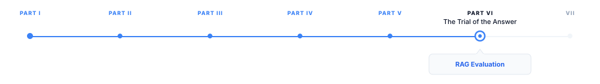

# RAG Evaluation

> **The canonical question for this chapter:**
> *How do you evaluate a retrieval-augmented generation system and why
> does evaluating the whole pipeline tell you less than evaluating each
> component separately?*

---

::: {.callout-note appearance="minimal"}
**Where are we?**

{#fig-progress width="80%"}

RAG systems require evaluating two distinct failure modes: context faithfulness 
and retrieval faithfulness. This chapter covers RAG evaluation in full, including 
the retrieval component, the generation component, and the end-to-end system, 
as well as the diagnostic value of measuring each separately rather than only 
the final output.

:::

---

## The RAG Evaluation Problem

A RAG system consists of at least two components: a retrieval system that
finds relevant documents given a query, and a generation system that
produces a response given the query and the retrieved documents. End-to-end
evaluation measures the quality of the final response which is what
users care about but it conflates the quality of retrieval with the
quality of generation. A bad final answer could result from bad retrieval
(the right documents were not found), bad generation (the right documents
were found but the model ignored or misrepresented them), or both.

This conflation makes end-to-end evaluation alone a poor diagnostic tool.
If final answer quality is low, you do not know whether to improve retrieval
or generation. If final answer quality is high, you do not know whether
retrieval is the bottleneck preventing further improvement or whether both
components are near their ceiling. Component-level evaluation provides the
attribution that end-to-end evaluation cannot.

The evaluation challenge is compounded by the absence of standard benchmarks
designed specifically for RAG. Most existing QA benchmarks (Natural Questions,
TriviaQA, HotpotQA) were designed for non-retrieval QA systems and must be
adapted for RAG evaluation. The adaptation involves deciding what constitutes
the knowledge base (which documents the retrieval system can access), what
counts as a correct retrieval, and how to evaluate the generated answer
given that it was produced from retrieved context.

---

## Retrieval Evaluation

Retrieval evaluation measures whether the system finds documents that are
relevant to the query and would support a correct answer. The standard
retrieval metrics borrow from information retrieval (IR) research and require
relevance judgments, labels indicating which documents in the corpus are
relevant to each query.

### Precision and Recall at k

The most fundamental retrieval metrics are precision and recall computed
over the top-$k$ retrieved documents:

**Precision@k**: the fraction of the top-$k$ retrieved documents that are
relevant:

$$
\text{Precision}@k = \frac{|\{d \in \text{top-}k\} \cap \text{relevant}|}{k}
$$

**Recall@k**: the fraction of all relevant documents in the corpus that
appear in the top-$k$ results:

$$
\text{Recall}@k = \frac{|\{d \in \text{top-}k\} \cap \text{relevant}|}{|\text{relevant}|}
$$

For RAG evaluation, $k$ is typically set to the number of documents
the RAG system retrieves per query (commonly 3–10). Precision@k measures
how clean the retrieved context is or the fraction of retrieved documents
that are actually useful. Recall@k measures coverage or whether the
relevant documents were found at all.

The tension between precision and recall is fundamental: retrieving more
documents increases recall (more chances to include the relevant one) but
decreases precision (more irrelevant documents in the context). The optimal
$k$ for a RAG system is the value that maximizes final answer quality,
which depends on the generator's ability to select relevant information
from a noisy context.

### Mean Average Precision (MAP)

MAP summarizes retrieval quality across all queries by computing, for each
query, the average precision at each rank position where a relevant document
is retrieved:

$$
\text{AP} = \frac{1}{|\text{relevant}|} \sum_{k=1}^{K} \text{Precision}@k \cdot \mathbb{1}[\text{rank-}k \text{ doc is relevant}]
$$

$$
\text{MAP} = \frac{1}{|Q|} \sum_{q \in Q} \text{AP}(q)
$$

MAP rewards retrieval systems that rank relevant documents highly, placing
the most relevant documents at rank 1 and 2 rather than rank 8 and 9.
For RAG, ranking matters: the generator's attention tends to focus on
documents presented earlier in the context (the lost-in-the-middle effect), 
so placing the most relevant document first improves generation quality even 
if all documents are technically retrieved.

### NDCG: Normalized Discounted Cumulative Gain

NDCG extends MAP to graded relevance, situations where documents are not
simply relevant or not, but have different degrees of relevance. For RAG
evaluation with multiple relevant documents of varying quality, NDCG is
more informative than MAP:

$$
\text{DCG}@k = \sum_{i=1}^{k} \frac{2^{r_i} - 1}{\log_2(i+1)}
$$

$$
\text{NDCG}@k = \frac{\text{DCG}@k}{\text{IDCG}@k}
$$

where $r_i$ is the relevance grade of the document at rank $i$ (e.g.,
0 = not relevant, 1 = partially relevant, 2 = highly relevant) and IDCG
is the ideal DCG achieved by the perfect ranking. The logarithmic discount
in the denominator penalizes relevant documents appearing at lower ranks,
and the normalization makes scores comparable across queries with different
numbers of relevant documents.

### MRR: Mean Reciprocal Rank

For queries with a single most-relevant document (the document containing
the answer), MRR measures how highly that document is ranked:

$$
\text{MRR} = \frac{1}{|Q|} \sum_{q \in Q} \frac{1}{\text{rank of first relevant doc for } q}
$$

MRR is simple, fast to compute, and appropriate when success means finding
at least one relevant document. It is less informative when multiple relevant
documents must all be retrieved for a correct answer.

### Obtaining Relevance Judgments

All retrieval metrics require relevance judgments, ground truth labels
indicating which documents are relevant to each query. These are expensive
to obtain and are the primary bottleneck in building retrieval evaluation
datasets. Approaches:

**Manual annotation**: human annotators read each (query, document) pair
and label relevance. Gold standard but expensive; typically covers only a
small subset of the retrieval corpus.

**Pooling**: retrieve the top-$k$ documents from multiple retrieval systems,
pool all retrieved documents, and have humans annotate the pool. Any document
not retrieved by any system is assumed non-relevant (a simplifying approximation
that can introduce bias against systems that retrieve documents outside the pool).

**Answer-derived relevance**: for QA tasks, a document is labeled relevant if
it contains the answer string. Cheap to compute but imperfect: a document
may contain the answer string without being useful for answering the question,
and a document may be genuinely relevant without containing the exact answer string.

**LLM-generated relevance**: use a language model to assess whether a document
is relevant to a query. Scalable but inherits LLM evaluation biases; correlation
with human judgments varies by task domain.

---

## Generation Evaluation Given Retrieved Context

Given that certain documents have been retrieved, generation evaluation
measures whether the model correctly uses those documents to produce a
good answer. This evaluation can be conducted in two modes:

**With ground-truth retrieved documents**: provide the evaluation system
with the actually relevant documents (not the ones the retrieval system
found) and evaluate generation quality in isolation. This isolates the
generator's ability from the retriever's quality.

**With retrieved documents**: provide the documents the retrieval system
actually found, which may include irrelevant or partially relevant documents.
This evaluates the generator's robustness to retrieval noise, its ability
to identify and use relevant information from a mixed context.

The difference between these two modes reveals whether performance gaps
are attributable to retrieval or generation: if performance with ground-truth
documents is high but performance with retrieved documents is low, the
retrieval system is the bottleneck. If performance is low in both modes,
the generator is the problem.

### Context Faithfulness

Context faithfulness measures whether the generated response is supported
by the retrieved documents, using the NLI and QA-based methodsIn the RAG 
context, faithfulness has a specific operational meaning: a faithful response 
cites only information from the retrieved context, without introducing information 
from the model's parametric memory that is not supported by the retrieved 
documents.

Operationally, context faithfulness is evaluated by checking each claim
in the generated response against the retrieved documents (not against
Wikipedia or other external sources). A claim is faithful if it is
entailed by at least one retrieved document; unfaithful if it contradicts
or is not supported by any retrieved document.

RAGAS faithfulness [@es2024ragas] implements this as:

1. Extract atomic claims from the generated response using an LLM
2. For each atomic claim, check whether it is entailed by the retrieved
   context using an NLI model or LLM judge
3. Compute faithfulness as the fraction of claims that are entailed

A well-functioning RAG system should achieve faithfulness scores above
0.8; scores below 0.6 indicate the generator is substantially hallucinating
beyond the retrieved context.

### Answer Relevance

Answer relevance measures whether the generated response actually addresses
the query which is a necessary condition for quality but not sufficient. A
response that faithfully reproduces the retrieved context but does not
answer the question is not useful; a response that answers the question
but ignores the context may be accurate but unfaithful.

RAGAS answer relevance computes this by reversing the generation direction:
given the generated response, prompt an LLM to generate several questions
that the response would answer, then measure the semantic similarity between
the generated questions and the original query. A highly relevant response
should produce questions similar to the original query; an off-topic response
should produce questions dissimilar to it.

$$
\text{Answer Relevance} = \frac{1}{n} \sum_{i=1}^{n} \text{cos\_sim}(q_i, q)
$$

where $q_i$ are LLM-generated questions from the response and $q$ is
the original query. This metric is clever but sensitive to the LLM's
question generation quality and to the semantic similarity model's
representation of the query space.

---

## End-to-End Answer Quality

End-to-end evaluation measures final answer quality, the dimension users
care about most directly. For QA tasks with short, verifiable answers,
standard QA metrics apply. For open-ended generation, LLM-as-judge
evaluation provides the most reliable automated signal.

### Exact Match and F1 for Extractive QA

For questions with short factual answers (entity names, numbers, dates),
exact match and token-level F1 provide clean signals:

**Exact match (EM)**: 1 if the predicted answer exactly matches the gold
answer after normalization (lowercase, strip punctuation, remove articles),
0 otherwise. Simple and unambiguous for well-defined QA tasks.

**Token F1**: the F1 score between the tokens in the predicted answer
and the tokens in the gold answer. Gives partial credit for responses
that contain the correct answer alongside additional words.

For Natural Questions and TriviaQA, state-of-the-art RAG systems achieve
EM of 55–65% and F1 of 65–75%, compared to non-retrieval models at
EM 40–50% and F1 50–60%. The 15-point improvement from retrieval on
these benchmarks is the clearest demonstration of RAG's core value.

### ROUGE and BERTScore for Long-Form Answers

For questions requiring multi-sentence answers (ELI5, ASQA, QAMPARI),
short answer metrics are insufficient. ROUGE-L and BERTScore are commonly
used, with the same limitations described in previous chapters: they measure
similarity to reference answers, not factual accuracy, and are sensitive
to paraphrase choices.

### Citation Accuracy

A key evaluation requirement for RAG systems is **citation accuracy**: whether 
citations in a generated response accurately support the claims they are attached 
to. For example, if a RAG system generates, "The experiment was conducted in Paris 
[1]," citation [1] should provide evidence that directly supports this claim.

Two useful metrics are **citation precision** and **citation recall**. Citation precision 
measures the proportion of generated citations that actually support their associated 
claims, while citation recall measures the proportion of claims that warrant citations 
that are accompanied by an appropriate citation. 

---

## RAGAS: A Comprehensive RAG Evaluation Framework

RAGAS provides a unified framework for RAG evaluation
that measures four components without requiring human-labeled ground truth
for the retrieval judgments:

**Faithfulness**: does the response follow from the retrieved context?
(Computed as described above: atomic fact extraction + NLI verification
against retrieved documents.)

**Answer relevance**: does the response address the query?
(Computed as described above: reverse question generation + semantic similarity.)

**Context precision**: are the retrieved documents actually relevant to
the query and useful for answering it?

$$
\text{Context Precision}@k = \frac{\sum_{k=1}^{K} \text{Precision}@k \cdot \mathbb{1}[\text{rank-}k \text{ doc is relevant}]}{\text{total relevant docs retrieved}}
$$

Evaluated by prompting an LLM to judge whether each retrieved document
is relevant to the query, avoiding the need for human relevance judgments.

**Context recall**: does the retrieved context contain all the information
needed to answer the query? Evaluated by checking whether each sentence
in the ground-truth answer can be attributed to at least one retrieved
document.

$$
\text{Context Recall} = \frac{\text{\# ground-truth sentences attributable to context}}{\text{\# total ground-truth sentences}}
$$

The four RAGAS metrics together diagnose the failure mode: low faithfulness
indicates a generation problem; low answer relevance indicates the response
is off-topic; low context precision indicates irrelevant documents are being
retrieved; low context recall indicates relevant documents are being missed.

### RAGAS Limitations

RAGAS uses LLMs internally to evaluate each metric for atomic fact
extraction, relevance judgments, and attribution checking. This introduces
LLM evaluation biases, cost, and latency into the evaluation pipeline.
The context precision judgment in particular is sensitive to the LLM
judge's understanding of what constitutes relevance for a given query.

RAGAS also requires a ground-truth answer for context recall evaluation,
limiting its use to tasks where reference answers exist. For purely
open-ended generation with no reference answer, context recall is
undefined and RAGAS reverts to measuring faithfulness and answer relevance
only.

---

## Multi-Hop and Agentic RAG Evaluation

Standard RAG evaluation typically assumes a single retrieval step: documents 
are retrieved and then used to generate a response. In contrast, multi-step RAG 
systems perform multiple retrieval operations, with each step informed by the 
results of previous steps. Evaluating such systems therefore requires assessing 
retrieval quality at each stage, rather than focusing solely on the final answer.

### HotpotQA and Multi-Hop Evaluation

HotpotQA [@yang2018hotpotqa] requires reasoning over two Wikipedia passages
to answer a question. Evaluation includes both answer accuracy (EM and F1
on the final answer) and supporting facts accuracy (EM and F1 on the set
of sentences the system identifies as supporting evidence). The supporting
facts metric evaluates whether the system identified the right reasoning
chain, not just whether the final answer is correct, a system that arrives
at the correct answer through incorrect intermediate steps is less reliable
than one that correctly traces the reasoning chain.

### Step-Level Faithfulness in Multi-Hop

For multi-hop RAG, faithfulness must be evaluated at each step:
- Does the first retrieval find documents relevant to the first sub-question?
- Does the model correctly extract the intermediate answer from those documents?
- Does the second retrieval use the intermediate answer to find the right
  documents for the final question?
- Does the final generation correctly synthesize both retrieved contexts?

Errors can compound across steps: a correct first retrieval combined with
an incorrect intermediate extraction leads to an incorrect second retrieval,
which leads to an incorrect final answer. The error attribution requires
step-level evaluation to identify which step in the chain failed.

---

## Constructing RAG Evaluation Datasets

A persistent challenge in RAG evaluation is the absence of evaluation
datasets specifically designed for retrieval-augmented settings. Most
existing QA benchmarks provide only (question, answer) pairs without
specifying the retrieval corpus or relevance judgments.

### Synthetic Evaluation Dataset Generation

RAGAS and similar frameworks support automatic generation of evaluation
datasets from a document corpus:

1. **Document selection**: sample documents from the target corpus
2. **Question generation**: prompt an LLM to generate questions that can
   be answered using the selected documents
3. **Answer generation**: prompt the LLM to generate reference answers
   using the documents
4. **Negative document selection**: include non-relevant documents that
   share topical similarity with the relevant ones (hard negatives for
   the retrieval system)

The resulting dataset includes (question, relevant documents, reference
answer, irrelevant documents) tuples that can evaluate both retrieval
and generation. The limitation: LLM-generated questions and answers may
not capture the full distribution of real user queries, and the generated
evaluation set may be biased toward questions the LLM finds easy to pose.

### Domain-Specific Evaluation Sets

For RAG systems deployed in specialized domains (medical, legal, financial),
evaluation datasets should be constructed from domain-specific document
corpora with domain expert annotation of relevance and answer correctness.
Generic QA benchmarks built from Wikipedia are particularly inadequate
for specialized domains, both because the knowledge base differs and
because the query distribution differs substantially.

A medical RAG system should be evaluated on clinical questions answered
from medical literature, not on general knowledge questions answered from
Wikipedia, even though the latter is more easily available. The evaluation
should reflect deployment conditions as closely as possible.

---

## Key Takeaways

- RAG evaluation requires measuring both retrieval quality and generation
  quality separately, because conflating them in end-to-end evaluation
  prevents attribution of failures to the component responsible.
- Precision@k measures retrieval cleanliness (fraction of retrieved documents
  that are relevant); recall@k measures retrieval coverage (fraction of
  relevant documents that are retrieved); the optimal k depends on the
  generator's robustness to irrelevant context.
- NDCG rewards ranking relevant documents highly; MAP summarizes precision
  at each rank where a relevant document appears; MRR is appropriate for
  single-answer queries where finding any relevant document counts as success.
- Retrieval evaluation requires relevance judgments — labels indicating
  which documents are relevant to each query — which are expensive to obtain;
  answer-derived relevance (does the document contain the answer string?) is
  the cheapest approximation but is imprecise.
- Context faithfulness measures whether the generated response is supported
  by the retrieved documents using atomic fact extraction and NLI verification;
  scores below 0.6 indicate substantial hallucination beyond retrieved context.
- Answer relevance measures whether the response addresses the query by reverse
  question generation: generate questions the response would answer and measure
  similarity to the original query.
- RAGAS provides four metrics — faithfulness, answer relevance, context
  precision, context recall — that together diagnose whether failures are
  in retrieval or generation; all four use LLMs internally, introducing
  evaluation biases and cost.
- Citation accuracy in RAG systems is surprisingly low: state-of-the-art
  systems achieve citation precision of 60–75%, meaning 25–40% of citations
  are incorrect or unsupported.
- Multi-hop RAG evaluation requires step-level quality measurement; errors
  compound across retrieval steps and end-to-end evaluation cannot identify
  which step in the chain failed.
- Generic QA benchmarks built on Wikipedia are inadequate for evaluating
  domain-specific RAG systems; domain-specific evaluation sets with expert
  annotation are required for meaningful measurement of specialized deployments.

---

## Further Reading

- Es, S., James, J., Espinosa-Anke, L., & Schockaert, S. (2023).
  *RAGAS: Automated Evaluation of Retrieval Augmented Generation.* arXiv.
  — Introduces the RAGAS framework and its four component metrics; the
  reference-free context precision and answer relevance formulations are
  the key contributions for practitioners who cannot obtain human relevance
  judgments.

- Yang, Z., Qi, P., Zhang, S., Bengio, Y., Cohen, W., Salakhutdinov, R.,
  & Manning, C. D. (2018). *HotpotQA: A Dataset for Diverse, Explainable
  Multi-hop Question Answering.* EMNLP. — Introduces HotpotQA and the
  supporting facts evaluation metric; the multi-hop structure and the
  distractor passages make it the standard benchmark for evaluating
  multi-hop reasoning in RAG systems.

- Stelmakh, I., Luan, Y., Dhingra, B., & Chang, M.-W. (2022). *ASQA:
  Factoid Questions Meet Long-Form Answers.* EMNLP. — Introduces ASQA
  and the combined EM and ROUGE-L evaluation for long-form multi-hop
  answers; the annotation procedure for identifying which facts in a
  long answer correspond to which sub-questions is the key methodological
  contribution.

- Gao, T., Yen, H., Yu, J., & Chen, D. (2023). *Enabling Large Language
  Models to Generate Text with Citations.* EMNLP. — Evaluates citation
  accuracy in RAG systems across multiple tasks; the citation precision
  and recall metrics and the finding that state-of-the-art systems achieve
  only 60–75% citation precision are the key contributions.

- Karpukhin, V., Oğuz, B., Min, S., Lewis, P., Wu, L., Edunov, S.,
  Chen, D., & Yih, W. (2020). *Dense Passage Retrieval for Open-Domain
  Question Answering.* EMNLP. — The DPR paper; the retrieval evaluation
  methodology on NQ and TriviaQA, including the answer-derived relevance
  labeling procedure, establishes the standard RAG retrieval evaluation
  protocol used in subsequent work.

- Kwiatkowski, T., Palomaki, J., Redfield, O., Collins, M., Parikh, A.,
  Alberti, C., Epstein, D., Polosukhin, I., Devlin, J., Lee, K., Toutanova,
  K., Jones, L., Kelber, M., Chang, M.-W., Dai, A., Uszkoreit, J.,
  Le, Q., & Petrov, S. (2019). *Natural Questions: A Benchmark for Question
  Answering Research.* TACL. — Introduces Natural Questions and the
  distinction between short and long answer evaluation; the annotation
  procedure and the analysis of answer diversity are relevant for
  understanding RAG benchmark design.

- Saad-Falcon, J., Khattab, O., Potts, C., & Zaharia, M. (2023).
  *ARES: An Automated Evaluation Framework for Retrieval-Augmented
  Generation Systems.* arXiv. — Introduces ARES, a framework that trains
  lightweight classifiers for RAG evaluation using synthetic data and
  a small number of human preference labels; the classifier-based approach
  reduces reliance on LLM-as-judge for component metrics.

- Min, S., Lyu, X., Holtzman, A., Artetxe, M., Lewis, M., Hajishirzi, H.,
  & Zettlemoyer, L. (2023). *FActScoring: Fine-Grained Atomic Evaluation
  of Factual Precision in Long Form Text Generation.* EMNLP. — the atomic
  decomposition approach and Wikipedia-based verification pipeline apply
  directly to measuring factual accuracy of RAG-generated long-form answers.

---
