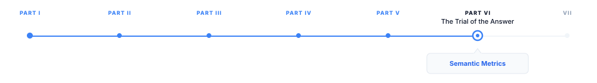

# Semantic Metrics

> **The canonical question for this chapter:**
> *How do embedding-based metrics improve on n-gram overlap — and what
> new failure modes do they introduce when a neural model is used to
> evaluate another neural model?*

---

::: {.callout-note appearance="minimal"}
**Where are we?**

{#fig-progress width="80%"}

This chapter covers the natural response to the limitations of n-gram 
metrics: use a neural model to compare meaning in embedding space rather 
than comparing token strings. BERTScore and BLEURT are two of the most 
widely adopted embedding-based metrics, and they each carry the strengths 
and failure modes of the neural models that underpin them.
:::

---

## The Embedding-Based Evaluation Idea

The fundamental insight motivating embedding-based metrics: if a neural
language model has learned to represent meaning, then texts with similar
meanings will have similar representations. Instead of asking "do these
two texts share the same words?", ask "do these two texts have similar
representations in embedding space?"

This approach inherits everything the embedding model has learned about
semantic equivalence. If the embedding model knows that "automobile"
and "car" mean the same thing which it does, because they appear in
similar contexts in the training data then a hypothesis using "automobile"
where the reference uses "car" will receive credit. If the model knows that
"The dog bit the man" and "The man bit the dog" have different meanings
which it does, because word order encodes meaning in its training data
then a hypothesis with reversed argument structure will receive less credit
than one with correct structure.

This is a fundamental advance over n-gram metrics for the synonymy problem.
It is not a solution to all evaluation problems, embedding-based metrics
inherit the biases and limitations of their underlying embedding models,
introduce new failure modes from model artifacts, and remain reference-based
(requiring gold standard outputs). But for the specific failure of n-gram
metrics on paraphrase and synonym, they are substantially better.

---

## BERTScore

BERTScore [@zhang2019bertscore] is the most widely used embedding-based
automatic evaluation metric. It computes similarity between hypothesis
and reference by comparing contextual token embeddings from a pretrained
BERT-family model.

### The Computation

Given a hypothesis $\hat{y} = \langle \hat{y}_1, \ldots, \hat{y}_m \rangle$
and a reference $y = \langle y_1, \ldots, y_n \rangle$, BERTScore:

1. **Encodes both texts** through a pretrained BERT-family encoder to obtain
   contextual token embeddings $\langle \mathbf{h}_1, \ldots, \mathbf{h}_m \rangle$
   for the hypothesis and $\langle \mathbf{e}_1, \ldots, \mathbf{e}_n \rangle$
   for the reference.

2. **Computes pairwise cosine similarity** between every hypothesis token
   embedding and every reference token embedding, producing an $m \times n$
   similarity matrix.

3. **Greedily matches** each hypothesis token to the most similar reference
   token (for precision) and each reference token to the most similar
   hypothesis token (for recall):

$$
P_{\text{BERT}} = \frac{1}{|\hat{y}|} \sum_{\hat{y}_i \in \hat{y}} \max_{y_j \in y} \mathbf{h}_i^\top \mathbf{e}_j
$$

$$
R_{\text{BERT}} = \frac{1}{|y|} \sum_{y_j \in y} \max_{\hat{y}_i \in \hat{y}} \mathbf{h}_i^\top \mathbf{e}_j
$$

4. **Combines precision and recall** into an F1 score:

$$
F_{\text{BERT}} = 2 \cdot \frac{P_{\text{BERT}} \cdot R_{\text{BERT}}}{P_{\text{BERT}} + R_{\text{BERT}}}
$$

The maximum cosine similarity in the greedy matching step means each
hypothesis token is matched to the single reference token it is most
similar to, and vice versa. This soft alignment (unlike BLEU's hard
n-gram matching) gives partial credit for partial semantic similarity.

### Importance Weighting

BERTScore optionally applies IDF (inverse document frequency) weighting
to downweight common tokens that contribute little discriminative information.
A word like "the" or "a" appears in nearly every document and is not
informative about meaning; matching "the" in hypothesis and reference should
provide less credit than matching "photosynthesis" or "concatenate".

With IDF weighting:

$$
P_{\text{BERT}}^{\text{idf}} = \frac{\sum_{\hat{y}_i \in \hat{y}} \text{idf}(\hat{y}_i) \cdot \max_{y_j \in y} \mathbf{h}_i^\top \mathbf{e}_j}{\sum_{\hat{y}_i \in \hat{y}} \text{idf}(\hat{y}_i)}
$$

IDF weighting consistently improves BERTScore's correlation with human
judgments on most tasks. The IDF values are computed from the evaluation
corpus or a large reference corpus and are specific to the evaluation domain.

### Which BERT Model to Use

BERTScore's quality depends on the quality and domain relevance of the
underlying encoder. The authors evaluated multiple encoders and found that
larger, more capable models generally produce better correlation with human
judgments. Recommended encoders:

| Task | Recommended encoder | Notes |
|------|--------|------------------|
| General English | DeBERTa-xlarge-mnli | Highest human correlation in original paper |
| Machine translation | bert-base-multilingual | Covers 104 languages |
| Code evaluation | CodeBERT | Domain-matched encoder |
| Scientific text | SciBERT | Domain-matched encoder |

The choice of encoder is a calibration decision: use the most capable
encoder matched to the evaluation domain. Using a general English encoder
to evaluate code or medical text will produce lower-quality scores because
the encoder's representations of domain-specific vocabulary are weaker.

### Rescaling BERTScore

Raw BERTScore values are typically in the range 0.85–1.00, making small
differences in score hard to interpret. BERTScore supports rescaling by
computing a baseline score for the specific encoder (the score a random
sentence from the reference corpus would achieve) and normalizing:

$$
\hat{F}_{\text{BERT}} = \frac{F_{\text{BERT}} - b}{1 - b}
$$

where $b$ is the baseline. Rescaled scores typically range from 0 to 1
with 0 representing a random sentence and 1 representing a perfect match.
This makes the metric more interpretable and comparable across encoders.

### What BERTScore Captures That BLEU Misses

The improvement over BLEU is most pronounced for:

**Paraphrase**: "The vehicle departed from the station" vs. "The car left 
the station": **BLEU is low** due to limited n-gram overlap, while **BERTScore 
is high** because contextual embeddings capture the semantic similarity between 
"vehicle" and "car" or "departed" and "left".

**Morphological variants**: "running" vs. "run": **BLEU** gives no credit at 
the bigram level, while **BERTScore** gives high similarity because their 
contextual embeddings are similar.

**Word order within clauses**: "John loves Mary" vs. "Mary loves John": **BLEU** 
gives little credit because the word order changes all bigrams, while **BERTScore** 
may also penalize the reversal because contextual embeddings reflect each name’s 
different grammatical role.

---

## BLEURT: Bilingual Evaluation Understudy with Representations from Transformers

BLEURT [@sellam2020bleurt] takes a different approach to embedding-based
evaluation. Rather than computing similarity from a pretrained model's
representations directly, BLEURT fine-tunes a BERT-family model specifically
to predict human quality ratings. It learns what human evaluators consider
a good translation or summary, rather than approximating semantic similarity
through the general representations a model develops for language modeling.

### The Training Procedure

BLEURT's training is two-stage:

**Stage 1: Synthetic task-specific pre-training.** Starting from a general 
BERT checkpoint, the original MLM head is removed and replaced with a task-specific 
quality prediction head. The BERT encoder is then further trained on a large 
set of synthetically generated quality-assessment examples. These examples 
are created by taking reference sentences and applying controlled perturbations, 
such as word deletion, random or antonym substitution, synonym substitution, 
negation insertion, and sentence reordering. Each perturbation is assigned a 
quality score according to its type and severity, for example, synonym substitutions 
receive high scores, while antonym substitutions and negation insertions receive 
low scores.

This task-specific training adapts the pretrained BERT representations to 
recognize quality-relevant linguistic changes before exposure to human judgments. 
The resulting quality-aware BERT model is then used as the initialization for 
the subsequent fine-tuning stage on human-rated translation data.

**Stage 2: Fine-tuning on human ratings.** The pre-trained model is fine-tuned
on the WMT (Workshop on Machine Translation) human ratings dataset: for each
(source, reference, hypothesis) triple, human evaluators provided direct
assessment scores measuring translation adequacy. BLEURT is fine-tuned to
predict these scores directly, making it a regression model from
(reference, hypothesis) pairs to predicted human quality scores.

The resulting model is not computing similarity in some general semantic
space, it is predicting what a human evaluator would say about the quality
of this specific hypothesis given this specific reference. This is closer
to the ground truth the metric is ultimately trying to approximate.

### BLEURT vs. BERTScore: The Key Difference

BERTScore uses a model that was not trained to evaluate text quality
it was trained to predict masked tokens or next sentences. Its representations
capture semantic similarity, which correlates with quality but is not the
same thing. BERTScore computes a symmetric similarity measure in embedding
space.

BLEURT uses a model that was explicitly trained to predict human quality
ratings. It is asymmetric: it takes a (reference, hypothesis) pair and
outputs a scalar quality score, trained to match human scores. It knows
about the specific ways that hypotheses can be worse than references
in ways that human evaluators care about.

The practical consequence: BLEURT generally shows higher correlation with
human judgments than BERTScore on translation and summarization tasks
where human rating data was available for training. However, BLEURT's
fine-tuning on WMT human ratings makes it specific to that evaluation
context, it was calibrated on machine translation quality ratings and
may not generalize well to other tasks (instruction following, creative
writing, code generation) where human quality definitions differ.

---

## Shared Limitations of Embedding-Based Metrics

BERTScore and BLEURT substantially outperform n-gram metrics on the tasks
they were designed for. They do not solve the evaluation problem and they
introduce new failure modes that practitioners must understand.

### Encoder Bias

Both metrics inherit the biases of their underlying encoder. If the encoder
represents two semantically distinct texts as similar (because they share
surface form or appear in similar contexts in training data), the metric
will assign high scores to qualitatively different outputs. Conversely, if
the encoder represents semantically similar texts as dissimilar (because they
use vocabulary from different domains), the metric will penalize good
paraphrases.

For BERTScore specifically: the metric is only as good as the encoder's
representations. A hypothesis that happens to use vocabulary well-represented
in the encoder's training distribution will score higher than one using
less-represented vocabulary, independent of actual quality differences.
Domain-specific technical terms are frequently underrepresented in general
BERT encoders.

### Sensitivity to Factual Content

BERTScore and BLEURT improve over BLEU on paraphrase detection but are
still not reliable detectors of factual errors. The embedding of "The Eiffel
Tower is in London" is semantically similar to "The Eiffel Tower is in Paris"
both discuss the Eiffel Tower and a European capital, and the factual
distinction (London vs. Paris) may not be strongly represented in the
cosine similarity between their embeddings.

BERTScore is better than BLEU at detecting adequacy errors (missing information) 
but not substantially better at detecting factual errors. BLEURT shows some 
improvement on factual error detection through its fine-tuning on human ratings, 
since human evaluators do penalize factual errors, but its sensitivity is not 
high enough to use as a dedicated factual accuracy metric.

### Reference Dependence {#sec-reference-dependence}

Both metrics remain reference-based. A hypothesis that is better than the
reference (more complete, more accurate, better organized) will receive
a lower score than the reference itself. This is a fundamental limitation
of reference-based evaluation: the metric can only evaluate quality relative
to the reference, not absolute quality.

For tasks where the reference is a human-written gold standard that represents
the ceiling of quality, this is acceptable. For tasks where models now
routinely exceed human performance (some code generation tasks, some
translation pairs) the reference ceiling becomes a binding constraint that
makes the metric misleading.

### Computational Cost

BERTScore requires encoding both hypothesis and reference with a BERT-family
model and computing an $m \times n$ pairwise similarity matrix. For typical
sentence lengths of 20–100 tokens, this is fast. For long documents (thousands 
of tokens), the quadratic cost of the pairwise similarity matrix becomes expensive. 
BERTScore in practice is evaluated at the sentence or paragraph level, not over full
document pairs.

BLEURT is similarly fast at evaluation time (a single encoder forward pass
with classification head). The training cost was high (multi-stage fine-tuning
on large datasets) but is a one-time cost paid by the metric developers, not
by practitioners using the metric.

---

## Key Takeaways

- BERTScore replaces n-gram string matching with contextual embedding similarity,
  computing greedy precision and recall over token-level BERT embeddings and
  combining them into an F1 score.
- The greedy matching in BERTScore gives partial credit for partial semantic
  similarity — "automobile" matching "car" receives high credit rather than
  zero — addressing the core failure of n-gram metrics on synonymy.
- IDF weighting downweights common tokens (function words) and upweights
  rare tokens in BERTScore, consistently improving correlation with human
  judgments; it should be used by default.
- BLEURT fine-tunes a BERT-family model on synthetic perturbation data and
  then on WMT human quality ratings, making it a learned predictor of human
  judgments rather than a general semantic similarity measure.
- BLEURT generally shows higher correlation with human judgments than BERTScore
  on machine translation, but its WMT calibration limits generalization to
  other task types.
  standard.
- Embedding-based metrics inherit encoder biases: domain-specific technical
  vocabulary underrepresented in the encoder's training data receives weaker
  similarity scores regardless of actual semantic equivalence.
- Factual errors remain difficult for embedding-based metrics to detect:
  "The Eiffel Tower is in London" and "The Eiffel Tower is in Paris" are
  semantically similar in embedding space despite the factual distinction.
- Segment-level reliability is low for all automated metrics (Kendall's $\tau$
  of 0.13–0.41); automated metrics are more reliable for system-level ranking
  than for evaluating individual outputs.
- Using embedding-based metrics as training optimization targets introduces
  Goodhart's Law dynamics; they are evaluation tools, not loss functions.

---

## Further Reading

- Zhang, T., Kishore, V., Wu, F., Weinberger, K. Q., & Artzi, Y. (2020).
  *BERTScore: Evaluating Text Generation with BERT.* ICLR. — The founding
  BERTScore paper; the greedy matching procedure, IDF weighting, and
  human correlation analysis across 363 MT systems are the key contributions;
  the comparison to BLEU on paraphrase tasks is the clearest demonstration
  of the synonymy improvement.

- Sellam, T., Das, D., & Parikh, A. P. (2020). *BLEURT: Learning Robust
  Metrics for Text Generation.* ACL. — Introduces BLEURT and the two-stage
  training procedure; the synthetic pre-training on linguistic perturbations
  is the key methodological contribution; the correlation analysis on WMT
  and summarization tasks establishes the improvement over BERTScore and BLEU.

- Pu, S., Gao, S., & Daumé III, H. (2021). *Learning Compact Metrics for
  MT.* EMNLP. — Introduces BLEURT-20 with larger backbone and more training
  data; the efficiency-quality tradeoff analysis across checkpoint sizes
  is the key contribution for practitioners choosing between BLEURT variants.

- Rei, R., Stewart, C., Farinha, A. C., & Lavie, A. (2020). *COMET: A
  Neural Framework for MT Evaluation.* EMNLP. — Introduces COMET and
  the source-aware evaluation approach; the segment-level correlation
  improvements over BLEURT are the key contribution; the analysis of when
  source information helps is particularly informative.

- Freitag, M., et al. (2022). *Results of the WMT22 Metrics Shared Task:
  Stop Using BLEU — Neural Metrics Are Better and More Robust.* WMT. —
  The most comprehensive meta-evaluation of MT metrics including BERTScore,
  BLEURT, COMET, and many others; the segment-level and system-level
  correlation tables are the key empirical contribution; the title states
  the conclusion clearly.

- Kaster, D., Röttger, P., & Kiela, D. (2021). *Global Explainability of
  BERT-Based Evaluation Metrics by Disentangling along Linguistic Factors.*
  EMNLP. — Analyzes what linguistic phenomena BERTScore is sensitive to;
  the finding that BERTScore captures adequacy better than fluency, and
  lexical similarity better than structural similarity, is the key
  contribution for understanding metric limitations.

- Zhao, W., Peyrard, M., Liu, F., Gao, Y., Meyer, C. M., & Eger, S.
  (2019). *MoverScore: Text Generation Evaluating with Contextualized
  Embeddings and Earth Mover's Distance.* EMNLP. — Introduces MoverScore,
  an alternative to BERTScore that uses Earth Mover's Distance for soft
  alignment rather than greedy matching; the comparison to BERTScore on
  translation and summarization tasks shows complementary strengths.

---
