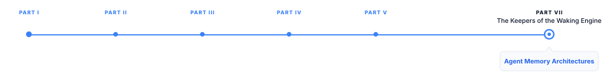

# Agent Memory Architectures

> **The canonical question for this chapter:**
> *What does it mean for an agent to "remember" something across steps,
> sessions, and tasks and why does naively stuffing everything into the
> context window fail as memory at any meaningful scale?*

---

::: {.callout-note appearance="minimal"}
**Where are we?**

{#fig-progress width="80%"}

This chapter covers what an agent carries forward from one step, task, or 
session to the next. Memory is what separates an agent that repeats the same 
mistakes indefinitely from one that improves, personalizes, and accumulates 
useful context over time.
:::

---

## Why the Context Window Is Not Memory

It is tempting to treat the context window as the agent's memory: everything
the model has seen in the conversation is, in some sense, available to it.
This framing breaks down quickly at scale, for reasons already established
in earlier chapters but worth restating precisely in the agent context.

The context window is bounded,  an agent performing a long research
task accumulates tool calls, observations, and reasoning traces that can
exceed even a 200,000-token context window within a single session. Once the
window is full, either the session must end, or older content must be evicted —
and evicted content is, functionally, forgotten.

The context window is also expensive to use fully. Every token in the context
is attended to at every generation step, and prefill cost scales
with context length. An agent that never prunes its context pays quadratic
attention cost and linear KV cache memory cost for information that may no
longer be relevant to the current step. The lost-in-the-middle problem
means that even information technically present in a very long context is not 
reliably used by the model, a fact buried at token 50,000 of a 100,000-token context 
may be effectively invisible to generation at token 100,000.

Most fundamentally, the context window is session-scoped. When a conversation
ends, the context is discarded (unless explicitly persisted). An agent that
should remember a user's preferences across sessions, or that should apply
lessons learned from a failed task the previous week, cannot rely on the
context window at all, that information no longer exists once the session
terminates.

Agent memory architectures exist to address these three limitations: bounded
capacity, cost of full utilization, and session-scoping. They provide
mechanisms for selecting what to keep, where to store it, and how to retrieve
it back into the context window when it becomes relevant again.

---

## A Taxonomy of Memory Types

Cognitive science distinguishes several types of human memory, and this
taxonomy (imperfect but useful) has been widely adopted for describing
agent memory systems.

### Working Memory

Working memory is the information actively being used for the current
reasoning step: the current task description, the most recent few
observations, the active plan. In an LLM agent, working memory maps
directly onto the context window's most recent and most relevant content,
this is the information the model is actively attending to and reasoning
over right now.

Working memory is inherently limited by the context window and is not
persisted beyond the current reasoning episode. It is the fastest to
access (it is already in context, requiring no retrieval step) and the
most expensive to grow (every token added to working memory adds to
generation cost).

### Episodic Memory

Episodic memory stores records of specific past events: what happened
in a previous conversation, what actions were taken in a previous task
attempt, what the outcome was. Episodic memory is inherently sequential
and time-stamped, a record of "this specific thing happened at this
specific time."

For an agent, episodic memory might store: "In the session on March 3rd,
the user asked about refund policies and expressed frustration about
a previous unresolved issue" or "In task attempt #4, the agent tried
searching for 'competitor pricing' and found no results; a more specific
search on 'Competitor X pricing page' succeeded."

Episodic memories are retrieved when they are relevant to the current
context, typically via semantic search over a stored history.

### Semantic Memory

Semantic memory stores generalized facts and knowledge, disconnected
from the specific episode in which they were learned. Where episodic
memory says "the user mentioned they work at Company X on March 3rd,"
semantic memory says simply "the user works at Company X", a fact
extracted and generalized from the episode, stored independently of
when or how it was learned.

Semantic memory is more compact than episodic memory (many episodes can
be compressed into a smaller set of facts) and more directly useful for
personalization and consistency, an agent that knows a fact does not
need to re-derive it from historical transcripts every time it becomes
relevant.

The consolidation from episodic to semantic memory (extracting durable
facts from specific events) is itself a nontrivial process, covered
below.

### Procedural Memory

Procedural memory stores how to do things: successful strategies, learned
patterns for handling specific task types, corrections to previous mistakes.
Where semantic memory is declarative ("the user works at Company X"),
procedural memory is prescriptive ("when searching for pricing information,
try the vendor's own website before third-party aggregators, since
aggregator data is often outdated").

Procedural memory is the least explored of the four memory types in current
agent systems but is arguably the most valuable for improving agent
performance over time, an agent that accumulates procedural knowledge
about which strategies work and which do not becomes more effective at
its task class without requiring any change to the underlying model weights.

---

## Implementation Patterns for Agent Memory

Each memory type above requires different storage and retrieval mechanisms.
This section covers the concrete implementation patterns used in production
agent systems.

### Context Window as Working Memory (No Persistence)

The simplest memory implementation: no memory system beyond the context
window itself. All state is implicit in the conversation history, and
nothing survives beyond the current session. This is appropriate for
single-session, single-task agents where cross-session continuity is
not required, a coding assistant helping with one bounded task, for
example.

The limitation, as discussed above, is that this approach does not scale
to long sessions or persist anything across sessions. It is the default
starting point, not a durable architecture for agents expected to operate
over extended periods or across many interactions with the same user.

### Vector Store as Episodic Memory

The most common episodic memory implementation stores conversation
summaries or event records as embeddings in a vector database, retrieved 
via semantic similarity search when the current context suggests they might 
be relevant.

The pipeline:
1. **Write path**: at the end of a session (or periodically during a long
   session), summarize what happened into one or more memory records.
   Each record is embedded and stored with metadata (timestamp, session
   ID, participants, topic tags).
2. **Read path**: at the start of a new session or when a memory-relevant
   moment is detected during a session, embed the current query or context
   and retrieve the top-$k$ most similar stored memories.
3. **Injection**: retrieved memories are formatted and injected into the
   context, typically in a dedicated section of the system prompt or as
   a preamble to the current conversation.

This is architecturally identical to RAG applied to the agent's own history 
rather than to external documents. The same considerations apply: chunking 
strategy for what constitutes one memory record, embedding model quality, 
retrieval precision and recall, and the risk of retrieving irrelevant or outdated 
memories that degrade rather than improve the current response.

### Structured Fact Stores as Semantic Memory

Semantic memory is often implemented as a structured store (a key-value
store, a small relational database, or a knowledge graph) rather than
a vector store, because facts are more naturally represented as discrete,
queryable records than as embedded text chunks.

A simple implementation: a per-user table of extracted facts, each with
a confidence score and a source episode reference:

```
user_id | fact                                | confidence | source_episode | last_updated
--------|-------------------------------------|------------|-----------------|-------------
u_123   | works_at: "Acme Corp"                | 0.95       | ep_4471         | 2025-03-03
u_123   | prefers_communication: "concise"     | 0.80       | ep_4502, ep_4471| 2025-03-10
u_123   | timezone: "America/Chicago"          | 0.90       | ep_4489         | 2025-03-05
```

Structured fact stores support precise queries ("what is this user's
timezone?") that a vector similarity search over episodic summaries
would answer less reliably, semantic similarity between "what timezone
does the user prefer" and a paragraph-length episode summary mentioning
the timezone in passing is a noisier signal than a direct key lookup.

The extraction step (converting raw conversation into structured facts)
is typically performed by prompting an LLM to extract facts from an episode
in a structured format, then merging new facts with existing ones (updating
confidence, resolving conflicts, deduplicating).

### Memory Consolidation and Forgetting

An agent memory system that only accumulates memories without ever removing
or compressing them faces the same scaling problem as the context window,
one level removed: the memory store grows unboundedly, retrieval becomes
noisier as the corpus grows (more candidate memories compete for the same
top-$k$ slots), and storage and retrieval cost increase.

**Consolidation** merges related memories into more compact representations,
several episodic memories about a user's project become a single semantic
fact about the project's status. This mirrors the reflection mechanism
above but is triggered by memory volume rather than time.

**Forgetting** removes memories that are no longer useful: information
that has become outdated (a user's stated preference that was later
explicitly changed), information about a completed and closed task
that has no bearing on future interactions, or low-confidence facts
that were never corroborated by subsequent episodes.

Forgetting policies parallel cache eviction policies: recency-based
(remove the oldest memories first), frequency-based (remove memories that
are rarely retrieved), and relevance-decay-based (reduce a memory's retrieval
priority over time unless it is reinforced by being retrieved and used).
Unlike KV cache eviction, agent memory forgetting has user-facing consequences
(a forgotten preference or fact produces a visible regression in personalization
quality) so forgetting policies should be conservative and, where possible,
allow explicit user control ("forget what I told you about X").

---

## Memory in Multi-Agent Systems

Memory design in multi-agent systems must decide what is shared across agents and 
what is private to each.

### Shared vs. Private Memory

**Shared memory**: all agents in the system can read (and sometimes write)
a common memory store. This ensures consistency (if one agent learns a
fact, all agents can use it) but risks context pollution, where each
agent's retrieval includes memories irrelevant to its specific role,
degrading the precision benefits of role specialization.

**Private memory**: each agent maintains its own memory, scoped to its
role. A research agent's memory contains facts about research findings;
a writing agent's memory contains facts about stylistic preferences and
past drafts. This preserves the context isolation benefits of multi-agent
decomposition but risks inconsistency, the research agent may learn
something relevant to the writing agent's task that never propagates.

**Hybrid**: a shared semantic memory store (facts that are broadly relevant
regardless of role) combined with private episodic memory per agent
(role-specific history). This is the most common production pattern:
facts about the user or task are shared, while each agent's specific
history of actions and observations remains private to avoid polluting
other agents' context.

### Memory as Coordination Mechanism

In orchestrator-worker architectures, the orchestrator's memory of what 
has been assigned to which worker and what results have been returned functions 
as the coordination state for the entire system. This orchestrator memory must 
be more reliable than any individual agent's personal memory, because errors in 
coordination memory (forgetting that a subtask was already assigned, misremembering 
a worker's result) directly cause the emergent miscoordination failures.

---

## Evaluating Memory System Quality

Standard agent evaluation does not directly measure memory quality. A 
dedicated evaluation approach is needed to answer: is the memory system 
helping, and where does it fail?

### Retrieval Quality for Memory

Memory retrieval can be evaluated with the same precision, recall, and
ranking metrics used for RAG retrieval: given a query that
should surface a specific stored memory, does the retrieval system find
it, and does it rank appropriately relative to less relevant memories?

The distinguishing challenge for memory retrieval relative to document
retrieval: the "corpus" is the agent's own accumulated history, which
grows continuously and is heavily skewed toward recent, potentially
repetitive content. A user who has mentioned their job title in ten
different conversations produces ten similar memory records; retrieval
should surface the most current and relevant one, not an arbitrary
selection or all ten redundantly.

### Long-Term Consistency

A memory system should produce consistent agent behavior over time: if
a user stated a preference in session 1, session 20 (weeks later) should
still reflect that preference unless it was explicitly updated. Evaluating
long-term consistency requires longitudinal test scenarios: construct
a sequence of sessions with specific facts introduced early, and verify
those facts are correctly used many sessions later, including when
intervening sessions contain irrelevant or superficially similar content
that could cause retrieval confusion.

### Memory-Induced Errors

Memory systems can introduce failure modes that would not exist without
memory. A stale fact (a preference that was later changed but the update
was not correctly consolidated) can cause the agent to confidently act
on outdated information. A memory retrieved out of context (a fact that
was true in one context but is being incorrectly applied in an unrelated
context) can produce responses that seem confidently wrong to the user
in a way that erodes trust more than an agent with no memory at all would.

Dedicated evaluation should specifically probe for these failure modes:
inject a fact, then later update it, and verify the agent uses the updated
version; introduce facts in one context and verify they are not incorrectly
applied in an unrelated context.

---

## Cost and Latency Considerations

Memory systems add cost and latency to every agent interaction, and this
overhead must be weighed against the personalization and continuity benefits.

**Write path cost**: summarizing episodes, extracting facts, and generating
reflections all require additional LLM inference calls beyond the agent's
core task-completion generation. A system that summarizes every session
and extracts facts after every session pays this cost on every interaction,
regardless of whether the session produced anything memory-worthy.

**Read path latency**: retrieving relevant memories before generating a
response adds a retrieval step (embedding the query, searching the vector
store or fact store, formatting results) to the critical path of every
response. For latency-sensitive applications, this retrieval must be fast
or run in parallel with other setup steps.

**Storage cost**: at scale, storing episodic and semantic memory for
millions of users accumulates significant storage cost, particularly for
vector embeddings, which are dense and do not compress well. Aggressive
consolidation and forgetting policies (described above) directly reduce
this cost, providing another motivation for treating forgetting as a
first-class design concern rather than an afterthought.

The decision to build a memory system at all should follow the same
justification discipline as the decision to build a multi-agent system:
memory adds cost and complexity, and should be adopted
when the personalization or continuity benefit is validated to matter
for the specific product, not by default because persistent memory
sounds valuable.

---

## Key Takeaways

- The context window is not memory: it is bounded, expensive to fill,
  and session-scoped, while memory systems must support unbounded history,
  efficient selective retrieval, and persistence across sessions.
- The four memory types — working (current context), episodic (specific
  past events), semantic (generalized facts), and procedural (learned
  strategies) — require different storage and retrieval mechanisms and
  serve different purposes in agent behavior.
- Vector stores implement episodic memory via the same RAG machinery
  , applied to an agent's own conversation history
  rather than external documents.
- Structured fact stores implement semantic memory more precisely than
  vector similarity search for queries with a clear, discrete answer
  (a user's timezone, job title, or stated preference).
- Reflection consolidates multiple episodic memories into higher-level
  semantic insights, performed periodically rather than at every query,
  functioning as a cached synthesis that improves future retrieval relevance.
- Forgetting is a necessary design component, not an afterthought: memory
  stores that only accumulate degrade retrieval precision and increase
  cost; forgetting policies should be conservative and support explicit
  user control given the user-facing consequences of incorrect forgetting.
- Multi-agent memory design requires deciding what is shared (broadly
  relevant facts) versus private (role-specific episodic history) per agent;
  orchestrator coordination memory must be more reliable than any individual
  agent's personal memory to avoid emergent miscoordination.
- Memory retrieval quality should be evaluated with the same precision,
  recall, and ranking metrics used for RAG retrieval, with the added
  challenge of a continuously growing, recency-skewed, often-repetitive corpus.
- Memory-specific failure modes — stale facts, out-of-context application
  of correct facts — can erode user trust more than having no memory at
  all, requiring dedicated longitudinal evaluation beyond standard task
  success metrics.
- Memory systems add write-path cost (summarization, extraction), read-path
  latency (retrieval before generation), and storage cost at scale; the
  decision to build persistent memory should be justified by validated
  product benefit, not adopted by default.

---

## Further Reading

- Park, J. S., O'Brien, J., Cai, C. J., Morris, M. R., Liang, P., &
  Bernstein, M. S. (2023). *Generative Agents: Interactive Simulacra of
  Human Behavior.* UIST. — Introduces the memory stream, retrieval scoring
  (recency, importance, relevance), and reflection mechanisms; the most
  influential agent memory architecture in current practice and the
  primary source for the reflection pattern described in this chapter.

- Packer, C., Fang, V., Patil, S. G., Lin, K., Wooders, S., & Gonzalez,
  J. E. (2023). *MemGPT: Towards LLMs as Operating Systems.* arXiv. —
  Frames agent memory management as an operating system memory hierarchy
  problem, with the context window as fast working memory and external
  storage as a paged virtual memory system; the self-directed memory
  management (the model deciding what to page in and out) is the key
  architectural contribution.

- Zhong, W., Guo, L., Gao, Q., Ye, H., & Wang, Y. (2023). *MemoryBank:
  Enhancing Large Language Models with Long-Term Memory.* arXiv. —
  Introduces a memory system with Ebbinghaus forgetting curve-inspired
  decay, providing a principled mathematical basis for the forgetting
  policies discussed in this chapter.

- Maharana, A., Lee, D.-H., Tulyakov, S., Bansal, M., Barbieri, F., &
  Fang, Y. (2024). *Evaluating Very Long-Term Conversational Memory of
  LLM Agents.* ACL. — Introduces LoCoMo, the standard benchmark for
  long-conversation memory evaluation; the finding that memory system
  performance degrades substantially over long time horizons is the
  key empirical contribution.

- Zhang, Z., Bo, X., Ma, C., Li, R., Chen, X., Dai, Q., Zhu, J., Dong,
  Z., & Wen, J.-R. (2024). *A Survey on the Memory Mechanism of Large
  Language Model based Agents.* arXiv. — Comprehensive survey of memory
  architectures organized by the cognitive-science-inspired taxonomy
  (working, episodic, semantic, procedural) used in this chapter; the
  comparison table across production and research systems is a useful
  reference for architecture selection.

- Wang, G., Xie, Y., Jiang, Y., Mandlekar, A., Xiao, C., Zhu, Y., Fan,
  L., & Anandkumar, A. (2023). *Voyager: An Open-Ended Embodied Agent
  with Large Language Models.* arXiv. — Demonstrates a skill library
  as a form of procedural memory: successful action sequences are
  stored, indexed, and retrieved for reuse in future similar situations,
  directly relevant to the procedural memory type discussed in this chapter.

- Modarressi, A., Imani, A., Fayyaz, M., & Schütze, H. (2023). *RET-LLM:
  Towards a General Read-Write Memory for Large Language Models.* arXiv.
  — Proposes a structured, explicitly editable memory module with
  read and write operations exposed as tools the model can invoke directly,
  an alternative to the implicit retrieval-based memory architectures
  covered in most of this chapter.

---
