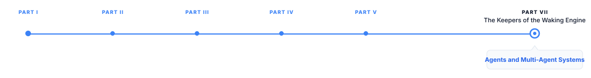

# Agents and Multi-Agent Systems

> **The canonical question for this chapter:**
> *What turns a language model with tools into an agent and why does
> adding more agents to a system often make it less reliable rather than
> more capable?*

---

::: {.callout-note appearance="minimal"}
**Where are we?**

{#fig-progress width="80%"}

This chapter covers what happens when tool use is embedded in a loop, when 
the model plans, acts, observes, and re-plans across many steps toward a goal, 
and when multiple such loops are composed together. This is where language 
model systems become agents.
:::

---

## What Makes a System an Agent

A single tool call is not agentic. A model that receives a question, calls
one tool, and generates a response is executing a fixed three-step pipeline which 
is useful, but not qualitatively different from a well-designed RAG system.
Agency emerges from a specific architectural pattern: the model's output
at each step determines what happens next, and this determination continues
across multiple steps until the model itself decides the task is complete.

The defining property of an agent is that control flow is not fixed by
the system designer but is determined dynamically by the model at runtime.
A traditional program has a fixed sequence of operations: retrieve, then
generate. An agent has a loop: observe the current state, decide on an
action, take the action, observe the new state, decide on the next action,
repeat until a termination condition is met. The number of iterations,
which tools are called, in what order, and when to stop are all decided
by the model during execution, not fixed in advance by the developer.

This distinction matters because it changes the failure mode landscape
entirely. A fixed pipeline fails in ways that are enumerable at design
time, the retrieval step returns nothing, the generation step produces
a bad response. An agent can fail in ways that only manifest at runtime:
it can loop indefinitely, pursue a subgoal that diverges from the original
task, accumulate errors across many steps, or terminate prematurely
believing a partial solution is complete. Understanding and mitigating
these dynamic failure modes is the central engineering challenge of
agent system design.

---

## The ReAct Pattern: Reasoning and Acting

ReAct [@yao2022react] is the foundational prompting pattern for agentic
behavior in language models. It interleaves explicit reasoning with tool
use, producing a trace that alternates between three components:

**Thought**: the model reasons about the current state and decides what
to do next, expressed as natural language.

**Action**: the model specifies a tool call to execute, based on the
preceding thought.

**Observation**: the tool's result is returned and appended to the context.

This cycle repeats until the model produces a final answer instead of
another action:

```
Thought: The user wants to know the population of the capital of France.
I need to first find the capital of France, then find its population.

Action: search("capital of France")

Observation: Paris is the capital of France.

Thought: Now I need to find the population of Paris.

Action: search("population of Paris")

Observation: The population of Paris is approximately 2.1 million
(city proper) as of 2023.

Thought: I now have the information needed to answer the question.

Final Answer: The capital of France is Paris, which has a population
of approximately 2.1 million people.
```

### Why Explicit Reasoning Improves Tool Use

The Thought step is not decorative. ReAct substantially outperforms both 
pure reasoning (chain-of-thought without tools) and pure acting (tool 
calls without explicit reasoning) on multi-step tasks. The mechanism 
parallels the working-memory argument for chain-of-thought: the Thought 
tokens serve as an explicit plan that conditions subsequent action selection, 
reducing the probability of an action that does not follow logically from the 
current state.

Pure acting without reasoning is prone to a specific failure: the model
selects a plausible-looking next action based on surface pattern matching
to the immediate context, without considering whether that action serves
the overall goal. Explicit reasoning forces the model to articulate the
connection between the current state and the chosen action, which is both
a planning aid and, importantly, a debugging aid, a human reviewing the
trace can identify exactly where the model's reasoning went wrong.

### ReAct Failure Modes

ReAct traces reveal specific failure patterns that are otherwise invisible
in a system that only shows final outputs:

**Reasoning-action mismatch**: the Thought correctly identifies what should
happen next, but the generated Action does not match the model reasons
correctly and then executes incorrectly, typically due to tool call
formatting errors or the model losing track of the plan between the reasoning 
and action tokens.

**Observation misreading**: the model's subsequent Thought misinterprets
the Observation, leading the trace astray from an otherwise correct
trajectory.


**Repetitive looping**: the model generates the same or a very similar
action repeatedly, typically because the observation did not resolve the
uncertainty that motivated the action, and the model has no mechanism to
recognize this and try a different approach.

**Premature termination**: the model produces a Final Answer before
gathering sufficient information, typically because it has partial
information that resembles a complete answer closely enough to satisfy
its own internal check.

---

## Planning Architectures

ReAct interleaves planning and execution at each step, the model decides
one action at a time without an explicit overall plan. For complex, multi-step
tasks, more structured planning architectures improve reliability by
separating the planning phase from the execution phase.

### Plan-and-Execute

Plan-and-execute architectures generate a complete plan before beginning
execution:

1. **Planning phase**: given the task, generate a sequence of subtasks
   required to complete it
2. **Execution phase**: execute each subtask in order, using tools as needed
3. **Replanning (optional)**: if a subtask fails or produces unexpected
   results, regenerate the remaining plan based on the new information

```
Task: "Research the top 3 competitors to Company X and summarize their
pricing strategies."

Plan:
1. Search for "Company X competitors"
2. For each competitor identified, search for their pricing page
3. Extract pricing information from each competitor's page
4. Synthesize a comparison summary

[Execute step 1] → competitors: [A, B, C]
[Execute step 2 for A] → pricing page found
[Execute step 2 for B] → pricing page found
[Execute step 2 for C] → pricing page not found, alternative search needed
[Replan step 2 for C] → search "Company C pricing" instead
[Execute step 3] → extract pricing from all three
[Execute step 4] → generate summary
```

Plan-and-execute reduces the reasoning burden at each step and the model
does not need to reconsider the overall strategy at every action, only
whether the current subtask is progressing as expected. This produces
more coherent long-horizon behavior than pure ReAct, which can drift
from the original goal across many interleaved reasoning-action cycles.

The tradeoff: plans made before execution begins may not anticipate
information discovered during execution. The replanning step addresses
this but adds complexity meaning that the system must detect when replanning 
is needed (a subtask failure, an unexpected observation) and correctly
incorporate the new information into a revised plan without discarding
progress already made.

### Tree of Thoughts and Deliberate Search

For tasks where a single linear plan is insufficient (problems requiring
exploration of multiple candidate approaches) Tree of Thoughts [@yao2023tree]
structures the reasoning process as a search over a tree of partial solutions.

At each node, the model generates multiple candidate next steps (branches),
evaluates each candidate's promise (using the model itself as an evaluator,
or an external verifier), and expands the most promising branches while
pruning unpromising ones. 

Tree of Thoughts is substantially more expensive than plan-and-execute or
ReAct, generating and evaluating multiple candidates at each step multiplies
the compute cost by the branching factor. It is appropriate for tasks with:
- High stakes where getting the plan right matters more than speed
- Genuine ambiguity about the best approach, where different strategies
  might succeed or fail unpredictably
- Available verification (can candidate plans be scored reliably?)

For most production agent systems, the cost of tree search is not justified;
plan-and-execute with replanning captures most of the reliability benefit
at a fraction of the compute cost.

### Hierarchical Planning

For very complex tasks, hierarchical planning decomposes the problem into
nested levels of abstraction: a high-level plan of major phases, each phase
decomposed into a mid-level plan of subtasks, each subtask decomposed into
low-level tool calls.

```
High-level: [Research phase] → [Analysis phase] → [Report generation phase]

Research phase (mid-level):
  [Identify sources] → [Gather data from each source] → [Verify data quality]

Gather data from each source (low-level):
  [search tool call] → [fetch tool call] → [extract tool call]
```

Hierarchical planning mirrors how humans decompose complex projects and
allows different levels of the hierarchy to be handled by different model
capabilities — a smaller, faster model might handle low-level tool call
generation while a larger model handles high-level strategic planning.
This connects to the model routing and cascade patterns covered in
Chapter 53.

---

## Termination and Loop Control

An agent that does not know when to stop is not useful regardless of how
well it reasons and acts. Termination logic is an underappreciated but
critical component of agent system design.

### Explicit Stopping Criteria

The most reliable termination approach: define explicit, checkable stopping
criteria before the agent begins execution. For a research task: "stop
when you have gathered pricing information for all three competitors."
For a coding task: "stop when all tests pass." For an open-ended task:
"stop when you believe the response fully addresses the user's request,
or after 10 tool calls, whichever comes first."

Explicit criteria are more reliable than relying on the model's own judgment
about task completion, because the model's judgment is subject to the same
biases described in @sec-LLM-as-a-Judge including a tendency toward
premature confidence.

### Maximum Step Limits

Every production agent system must impose a hard maximum on the number of
steps (tool calls, reasoning cycles) before forced termination. Without
this limit, a looping agent can consume unbounded compute and cost.

Typical limits range from 5–10 steps for simple tasks to 20–50 steps for
complex research or coding tasks. The limit should be generous enough to
allow legitimate multi-step tasks to complete but tight enough to bound
the worst-case cost of a failure.

When the step limit is reached without task completion, the agent should
produce a partial result with an explicit statement that the task was
not fully completed, rather than either fabricating a complete-looking
answer or failing silently.

### Loop Detection

Beyond a hard step limit, detecting repetitive behavior before it consumes
the full step budget improves both cost and user experience. Loop detection
compares recent actions for similarity:

- **Exact repetition**: the same tool call with the same arguments was
  made in the last $k$ steps
- **Semantic repetition**: a tool call semantically very similar to a
  recent one (same tool, similar arguments) was made recently, without
  meaningful progress between them

When a loop is detected, the system can: inject an explicit prompt asking
the model to try a different approach, escalate to a different (typically
more capable) model, or terminate with a partial result and an explanation
that the agent was unable to make progress.

### Human-in-the-Loop Checkpoints

For high-stakes or long-running tasks, periodic human checkpoints interrupt
the agent's execution to request confirmation or guidance before continuing.
This is distinct from the confirm-before-execute pattern for individual
irreversible tool calls from @sec-confirm-execute, checkpoint-based human-in-the-loop
applies at the level of overall task progress, not individual actions.

A checkpoint might present: "I've completed research on competitors A and B
but am having difficulty finding pricing information for competitor C.
Should I continue searching, use an estimate, or report this as unavailable?"
This pattern trades autonomy for reliability, appropriate when task failure
is costly and human oversight time is available.

---

## Multi-Agent Systems

A multi-agent system decomposes a task across multiple agent instances,
each with a distinct role, that communicate to accomplish a shared goal.
The motivation for multi-agent decomposition mirrors the motivation for
modular software design: specialization, parallelism, and separation of
concerns.

### Why Decompose Into Multiple Agents

**Specialization**: different subtasks benefit from different system
prompts, tool access, or even different underlying models. A "researcher"
agent with web search access and a "writer" agent with no tool access
but strong prose generation can each be optimized for their specific role,
rather than requiring a single agent to excel at both research and writing
simultaneously.

**Context window management**: a single agent handling a complex, long-running
task accumulates a large context window of tool calls, observations, and
reasoning traces. Decomposing into multiple agents, each with a bounded
context relevant to its subtask, prevents any single agent's context from
growing unmanageably large.

**Parallelism**: independent subtasks can be assigned to separate agent
instances running concurrently, reducing overall task latency in the same
way that parallel tool calls reduce latency for independent tool invocations.

**Verification and adversarial checking**: a separate "critic" agent can
review the output of a "worker" agent, catching errors that the worker
would not catch reviewing its own output, the same self-verification
limitation that motivates process reward models applies to
agent output review.

### Common Multi-Agent Architectures

**Orchestrator-worker**: a central orchestrator agent decomposes the task,
assigns subtasks to worker agents, collects their results, and synthesizes
a final response. The orchestrator maintains the overall plan; workers
execute bounded subtasks without visibility into the full task context.

```
Orchestrator: "Research competitor pricing" is decomposed into:
  Worker 1: "Find and summarize Competitor A's pricing"
  Worker 2: "Find and summarize Competitor B's pricing"
  Worker 3: "Find and summarize Competitor C's pricing"

[Workers execute in parallel]

Orchestrator: Synthesizes the three summaries into a comparison report.
```

This is the most common production multi-agent pattern because it maps
naturally onto parallelizable subtasks and keeps each worker's context
bounded and focused.

**Debate and adversarial verification**: two or more agents argue different
positions or independently attempt the same task, with a judge (another
agent or a human) evaluating the results. In practice, debate architectures 
are used for higher-reliability verification: two agents independently solve 
a problem, and disagreement between them flags the case for additional scrutiny.

**Pipeline**: agents are arranged in a fixed sequence, each processing
the output of the previous one. A research agent produces raw findings,
which a fact-checking agent verifies, which an editing agent refines
for clarity, which a formatting agent structures for final presentation.
Pipeline architectures are simpler to reason about than orchestrator-worker
patterns because control flow is fixed, but they cannot adapt to unexpected
intermediate results as flexibly.


### Communication Protocols

Multi-agent systems require a communication protocol: how do agents
exchange information? The two dominant approaches:

**Shared context**: all agents read from and write to a shared conversation
or document. Simple to implement but does not bound any individual agent's
context growth, and all agents see all information regardless of relevance,
reintroducing the context management problem multi-agent decomposition
was meant to solve.

**Structured message passing**: agents communicate through explicit
messages with defined schemas, similar to tool call schemas but between
agents rather than between an agent and a tool. The orchestrator-worker
pattern typically uses structured message passing: the orchestrator sends
a task specification, the worker returns a structured result.

Structured message passing is generally preferred in production systems
because it bounds each agent's context to only the information relevant
to its role, and because structured schemas make the system's behavior
more predictable and easier to debug.

---

## Failure Modes Specific to Multi-Agent Systems

Multi-agent systems introduce failure modes beyond those of single-agent
systems, arising from the interaction between agents.

### Error Propagation and Amplification

An error in one agent's output becomes an input to downstream agents,
which may compound rather than correct it. If a research agent misidentifies
a competitor's pricing (a factual error), a downstream summarization agent
faithfully summarizes the wrong information, the summarization agent
performed its task correctly, but the overall system produced a wrong
result because it inherited an upstream error.

This is structurally identical to the cascading errors problem in sequential
tool calls, but at the agent level rather than the tool level.
The mitigation is similar: verification steps between agents, where a
downstream agent (or a dedicated verification agent) checks the upstream
agent's output before proceeding, rather than blindly trusting it.

### Coordination Overhead

Communication between agents consumes tokens, latency, and cost. A
multi-agent system with 5 agents each producing 1,000 tokens of intermediate
output before the final synthesis has consumed 5,000 tokens of coordination
overhead beyond what a single well-designed agent might require. For tasks
that do not genuinely benefit from decomposition where a single agent
with sufficient context could handle the task directly, multi-agent
architectures add cost and latency without corresponding quality improvement.

The decision to decompose into multiple agents should be justified by
one of the specific benefits described above (specialization, context
management, parallelism, verification), not applied by default to any
task that seems complex.

### Emergent Miscoordination

Agents that were each individually well-behaved can produce poor collective
behavior when composed. A classic pattern: an orchestrator assigns
overlapping or redundant subtasks to workers because it did not correctly
partition the task; workers duplicate effort without either being aware
of the redundancy. Or: a worker's output format does not match what the
orchestrator expects, and the orchestrator's synthesis step silently
misinterprets or discards useful information.

These failures are difficult to anticipate from testing individual agents
in isolation, they emerge only from the composed system's behavior, which
is why end-to-end evaluation of the full multi-agent pipeline is necessary 
in addition to component-level evaluation of each agent.

### Cost Multiplication

Each agent in a multi-agent system incurs its own model inference cost.
A task handled by a single agent making 5 tool calls costs roughly 5×
the base inference cost. The same task handled by an orchestrator plus
3 workers, each making their own reasoning passes, can cost 4–8× the
base inference cost even before accounting for the tool calls each worker
makes and the multi-agent decomposition itself is not free.

Production multi-agent systems must weigh this cost multiplication against
the reliability and quality benefits. For tasks where a single well-designed
agent achieves acceptable quality, the additional cost of multi-agent
decomposition is not justified. For tasks where quality genuinely improves
from specialization or verification, the cost may be worthwhile, but this
should be validated empirically rather than assumed.

---

## Key Takeaways

- Agency emerges when control flow is determined dynamically by the model
  at runtime rather than fixed by the system designer; this shifts the
  failure mode landscape from enumerable design-time failures to dynamic
  runtime failures like looping, goal drift, and error accumulation.
- ReAct interleaves explicit reasoning (Thought) with tool use (Action)
  and result incorporation (Observation); the explicit reasoning step
  improves reliability by forcing the model to articulate why an action
  serves the current goal before taking it.
- Plan-and-execute architectures separate planning from execution, producing
  more coherent long-horizon behavior than step-by-step ReAct at the cost
  of requiring replanning logic when execution diverges from the plan.
- Tree of Thoughts and hierarchical planning address more complex tasks
  requiring exploration or nested decomposition, at substantially higher
  compute cost than linear planning approaches.
- Every production agent requires explicit termination logic: stopping
  criteria, maximum step limits, and loop detection; relying on the model's
  own judgment of task completion inherits the premature-confidence bias
  documented in Chapter 47.
- Multi-agent decomposition is justified by four specific benefits —
  specialization, context window management, parallelism, and independent
  verification — and should not be adopted by default for tasks that seem
  complex without one of these benefits being present.
- The orchestrator-worker pattern is the dominant production multi-agent
  architecture, mapping naturally onto parallelizable subtasks with bounded
  context per worker; pipeline architectures are simpler but cannot adapt
  to unexpected intermediate results.
- Structured message passing between agents (defined schemas, similar to
  tool call schemas) is generally preferred over shared context, because
  it bounds each agent's context and makes system behavior more predictable.
- Error propagation across agents compounds rather than self-corrects: a
  downstream agent that faithfully processes an upstream agent's incorrect
  output produces a wrong result despite each individual agent behaving
  correctly in isolation.
- Multi-agent systems multiply inference cost — a 3-worker orchestrator
  pattern can cost 4–8× a single agent's base cost — and this multiplication
  must be justified by measured quality or reliability improvement, not assumed.

---

## Further Reading

- Yao, S., Zhao, J., Yu, D., Du, N., Shafran, I., Narasimhan, K., &
  Cao, Y. (2023). *ReAct: Synergizing Reasoning and Acting in Language
  Models.* ICLR. — The foundational agentic prompting paper; the
  thought-action-observation loop and its comparison to reasoning-only
  and acting-only baselines are the key contributions; the failure mode
  analysis in the appendix is directly useful for debugging agent traces.

- Yao, S., Yu, D., Zhao, J., Shafran, I., Griffiths, T. L., Cao, Y., &
  Narasimhan, K. (2023). *Tree of Thoughts: Deliberate Problem Solving
  with Large Language Models.* NeurIPS. — Introduces tree-structured
  search over reasoning and planning steps; the comparison of search
  strategies (BFS, DFS) and the cost-quality tradeoff analysis are the
  key contributions for deciding when tree search is worth the expense.

- Wang, L., Ma, C., Feng, X., Zhang, Z., Yang, H., Zhang, J., Chen, Z.,
  Tang, J., Chen, X., Lin, Y., Zhao, W. X., Wei, Z., & Wen, J.-R. (2024).
  *A Survey on Large Language Model based Autonomous Agents.* Frontiers
  of Computer Science. — Comprehensive survey covering planning, memory,
  and action components of agent architectures; Section 4 on multi-agent
  systems provides a taxonomy of coordination patterns.

- Wu, Q., Bansal, G., Zhang, J., Wu, Y., Li, B., Zhu, E., Jiang, L.,
  Zhang, X., Zhang, S., Liu, J., Awadallah, A. H., White, R. W., Burger,
  D., & Wang, C. (2023). *AutoGen: Enabling Next-Gen LLM Applications
  via Multi-Agent Conversation.* arXiv. — Introduces the AutoGen framework
  for multi-agent conversation; the conversable agent abstraction and
  the group chat coordination pattern are widely adopted in production
  multi-agent tooling.

- Irving, G., Christiano, P., & Amodei, D. (2018). *AI Safety via Debate.*
  arXiv. — Proposes adversarial debate between agents as a mechanism for
  scalable oversight; the theoretical framing motivates the debate and
  adversarial verification multi-agent pattern described in this chapter.

- Park, J. S., O'Brien, J., Cai, C. J., Morris, M. R., Liang, P., &
  Bernstein, M. S. (2023). *Generative Agents: Interactive Simulacra of
  Human Behavior.* UIST. — Demonstrates a large-scale multi-agent
  simulation with memory, planning, and reflection.

- Xi, Z., Chen, W., Guo, X., et al. (2023). *The Rise and Potential of
  Large Language Model Based Agents: A Survey.* arXiv. — Broad survey of
  agent capabilities including planning, tool use, and multi-agent
  coordination; the failure mode taxonomy in Section 5 is a useful
  complement to the failure modes discussed in this chapter.

- Zhuge, M., Wang, W., Kirsch, L., Faccio, F., Khizbullin, D., & Schmidhuber,
  J. (2024). *Language Agents as Optimizable Graphs.* arXiv. — Formalizes
  multi-agent systems as computational graphs and proposes automatic
  optimization of agent topology; the graph-based framing is useful for
  reasoning systematically about coordination overhead and architecture
  selection.

---